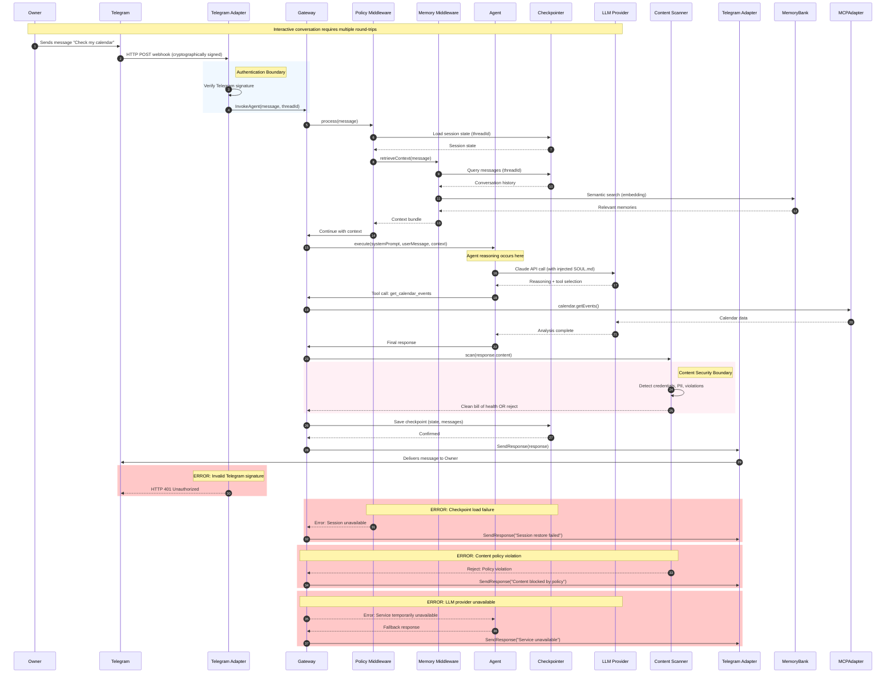
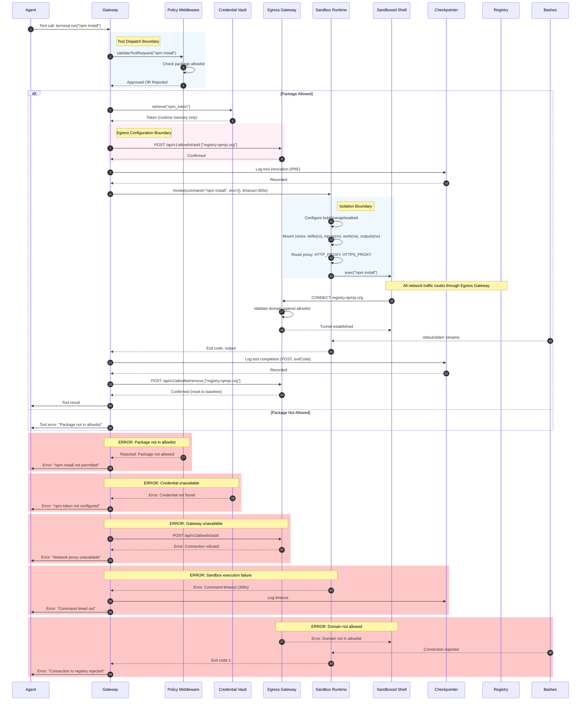
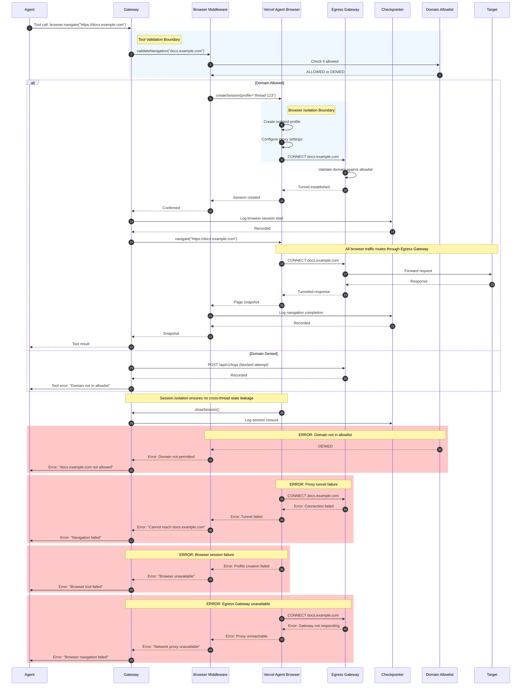

# Architecture.md: Logical System Blueprint for RealClaw

> **Implementation Reference:** This document describes architectural decisions. Concrete technology versions and specifications are documented in [TechSpec.md](TechSpec.md). All technology selections referenced herein are specified in TechSpec v1.6.0.

## 1. Architectural Strategy

### Problem Context: What We're Responding To

RealClaw is architected as a direct response to the failures of "OpenClaw" (née Clawdbot → Moltbot), a prior agent implementation that demonstrated the fundamental unsafety of dominant agent architectures. Every design decision in this document traces to a specific failure mode observed in OpenClaw:

- **Probabilistic Safety Failure:** OpenClaw relied on `AGENTS.md` directives—system prompt rules telling the LLM "don't do dangerous things." A single prompt injection through any connected messaging channel yielded full shell access. RealClaw enforces safety at the sandbox and tool level, not the prompt level, using Anthropic's Sandbox Runtime for deterministic isolation.

- **Localhost Trust / No Auth by Default:** OpenClaw auto-trusted connections from `127.0.0.1`. Behind any reverse proxy, all external traffic appeared local. Shodan found 1,800+ exposed instances. RealClaw binds to `127.0.0.1` or Tailscale only, with no implicit trust model. Telegram webhooks require cryptographic signature verification.

- **Flat Credential Storage:** API keys, OAuth tokens, and bot tokens stored in plaintext on the local filesystem, fully accessible to the agent. RealClaw stores credentials in OS-level vaults (Keychain, secret-service) and never exposes them to the sandbox context.

- **Unaudited Memory Writes:** OpenClaw's Markdown-based memory was readable and writable by the agent with no gating. A prompt injection could silently rewrite the agent's long-term memory. RealClaw removes the agent from the memory write path entirely—memory extraction and consolidation are handled by middleware, not agent-initiated tool calls.

- **Uncontrolled Egress:** The agent could compose and send messages to any connected channel without content validation, rate limiting, or approval gates. RealClaw gates all outbound delivery through a single auditable egress chokepoint with structured JSON errors and comprehensive request logging.

- **No Supply Chain Integrity:** 300+ contributors, a skills/plugin ecosystem pulling arbitrary code, no hermetic builds, no hash verification. RealClaw pins and hashes everything via Nix and analyzes skill scripts before execution.

- **No Network Isolation:** The agent inherited the host's full network access. RealClaw defaults to offline and whitelists explicitly via egress proxy. The Anthropic Sandbox Runtime ensures all network traffic routes through the proxy.

- **Custom Security Infrastructure:** Building custom sandboxing implementations led to gaps and inconsistencies. RealClaw leverages Anthropic's production-tested Sandbox Runtime for consistent cross-platform isolation.

### Scope Definition: What This Project Builds

RealClaw is a **personal AI agent runtime** with the following bounded capabilities. Items outside these boundaries require explicit architectural extension.

**Primary Capabilities:**
- **Conversational Interaction:** Bidirectional messaging via Telegram (primary) and MCP-connected services (secondary)
- **Terminal Execution:** Sandboxed command execution with on-demand package provisioning via Nix and Anthropic Sandbox Runtime
- **File Operations:** Read/write access within scoped filesystem zones
- **Web Automation:** Browser automation via Vercel Agent Browser for form filling, navigation, and data extraction
- **Skill System:** Extensible capability bundles following AgentSkills.io format with LLM pre-analysis and Owner approval
- **Scheduled Tasks:** Cron-based task execution with full agent capabilities
- **Persistent Memory:** Three-tier recall system (checkpointer, message log, semantic memory) backed by SQLite
- **Observability:** Comprehensive logging, distributed tracing, and metrics for operational visibility
- **Owner Interfaces:** Command-line interface for development and debugging; web-based interface for monitoring and configuration

**Integration Boundaries:**
- **In Scope:** Telegram, MCP servers (Slack, Discord, email, calendar, custom services), OpenTelemetry-compatible observability backends, CLI and Web UI for Owner interaction
- **Out of Scope:** Direct WhatsApp integration (requires MCP bridge), native mobile notifications, voice interfaces, multi-user web access

**Security Boundaries:**
- **Deterministic Enforcement:** All safety constraints are enforced architecturally, not probabilistically
- **Zero Trust:** No implicit trust for any input, network connection, or file access
- **Isolated Execution:** Agent operates inside sandbox; credentials never enter sandbox context

### Architectural Entities

Four architectural entities appear throughout this document, each with distinct technology stacks, lifecycles, and trust boundaries. See TechSpec.md Section 1 for specific version bindings.

**Project** — The framework itself, authored and maintained by the RealClaw team. The Project defines platform skills, default policies, security constraints, and the "Constitution" (`SOUL.md`, `SAFETY.md`). The Project is the authority on _how_ the system works.

**Owner** — The person who installs and runs an instance. The Owner provisions credentials, configures integrations, uploads personal skills, and interacts with the Agent. In a single-tenant system, the Owner is the only human in the loop.

**Agent** — The LLM-driven runtime operating inside the sandbox. A managed sub-system, not a peer.

**Gateway** — The orchestration layer that mediates all communication between the Owner, external integrations, and the Agent. The Gateway injects identity, enforces policies, manages state, and handles credential isolation. It is the only component aware of platform specifics. (formerly "Orchestrator"—see Ubiquitous Language in PRD.md)

**Egress Gateway** — The network boundary component implementing HTTP CONNECT proxy with domain allowlisting. Implemented as a separate Go or Rust binary with independent lifecycle, managed by Nix as a system service. Enforces strict allowlist-only network policy for all sandbox egress.

**Platform Adapter** — The cross-platform abstraction layer handling OS-specific behaviors for sandbox invocation and credential retrieval. Implemented with runtime detection within the Gateway binary, abstracting differences between Linux (bubblewrap, secret-service) and macOS (Seatbelt, Keychain).

The Owner trusts the Project (by choosing to install it). The Project trusts the Owner (by giving them full configuration authority). Neither trusts the Agent (which operates under deterministic constraints). The Gateway does not trust the Egress Gateway—communication follows strict RPC patterns with no implicit trust.

### Core Philosophies

These philosophical commitments shape every architectural decision. Deviations require explicit justification and ADR documentation.

1.  **Trust the Sandbox, Not the Model:** Safety is enforced by the sandbox and tool-level validation, not by the System Prompt.

2.  **Immutability by Default:** The Agent's identity (`SOUL.md`) and core configuration are injected at runtime and cannot be modified by the Agent.

3.  **Ephemeral Tooling:** Packages are available on-demand via Nix and require no pre-installation or system modification.

4.  **Capability-Based Security:** Blacklists fail. We use strict whitelisting for network egress and file access.

5.  **Supply Chain Integrity:** System packages resolve from nixpkgs. Language-specific Skill dependencies are converted at ingestion time from standard lockfiles into Nix derivations. Native package managers are never invoked at runtime.

6.  **Gated Egress:** Network access from sandboxed processes passes through an egress proxy with domain allowlisting. Direct internet access is blocked. The proxy enforces structured policies and logs all access for security auditing.

7.  **Minimal Tool Surface:** Every tool invocation is attack surface. The Agent prefers answering from knowledge when possible and only invokes tools when the task requires execution, file access, or capabilities beyond training data.

8.  **Middleware-Managed Memory:** The Agent does not manage its own long-term memory. Memory extraction, consolidation, retrieval, and injection are handled by Gateway middleware—invisible to the Agent and immune to prompt injection.

9.  **Single-Tenant by Design:** The system serves one Owner per instance. This is not a limitation to be overcome later—it is a deliberate architectural decision that eliminates multi-tenancy complexity.

10. **Everything is Middleware:** Agent capabilities—scheduling, web search, sub-agent orchestration, memory, skills, MCP integration, observability—are implemented as composable LangChain middleware. No privileged internal mechanisms exist that custom middleware cannot replicate.

11. **Build on Proven Foundations:** Where the ecosystem provides battle-tested solutions for security-critical infrastructure (sandboxing, observability, protocol implementations), we integrate them rather than reinventing. Custom implementation is reserved for gateway-specific concerns.

12. **Nix-Native, Nix-Invisible:** The system leverages Nix for reproducibility, package management, and cross-platform configuration. However, Nix internals are never exposed to the Agent—packages simply become available when requested, with no awareness of the underlying mechanism.

13. **Tool-Level Isolation:** Different tools enforce security boundaries appropriate to their function. File operations use path validation; command execution uses the Anthropic Sandbox Runtime; browser automation uses isolated browser profiles with proxy enforcement.

14. **Identity Injection:** The Agent's core identity (`SOUL.md`) is never materialized as a file within the sandbox. It is injected directly into the system prompt by the Gateway. This prevents exfiltration of the "Constitution" via file copy operations.

15. **Durable State Persistence:** Agent state survives Gateway restarts via LangGraph SqliteCheckpointer with WAL mode. Session continuity is an architectural guarantee, not an in-memory optimization.

16. **Observable by Default:** All Agent operations are logged, traced, and metered. The Owner has complete visibility into Agent behavior for debugging, audit, and optimization purposes.

17. **Credential Isolation:** Credentials are stored in OS-level vaults (Keychain on macOS, secret-service on Linux) and never exposed to the Agent or written to persistent storage beyond runtime memory.

### The Pattern: Layered Modular Monolith with Strict Boundary Enforcement

RealClaw adopts a **Layered Modular Monolith** architecture that enforces strict boundaries between concern domains while maintaining deployment simplicity appropriate for single-tenant operation. This pattern was selected over microservices or serverless alternatives for three compelling reasons rooted in the PRD's non-functional constraints.

**First**, the single-tenant deployment model eliminates the operational complexity that justifies microservices decomposition. The system serves exactly one Owner per instance with no user isolation requirements, meaning the throughput and scaling concerns that drive microservice adoption are irrelevant. A modular monolith provides the same separation of concerns without the distributed systems overhead of inter-service communication, distributed transactions, and independent deployment pipelines.

**Second**, the deterministic security requirement demands auditable data flow paths that are trivially traced in a monolith but become opaque across service boundaries. When the PRD mandates that "all credentials must be stored in OS-level vaults with no exceptions," the implementation verification is straightforward in a single process boundary. Distributed architectures introduce ambiguity about credential exposure during cross-service communication, requiring security theater that defeats the purpose.

**Third**, the cross-platform requirement (Linux and macOS) creates enough environmental variance without adding service distribution complexity. The architecture delegates platform abstraction to well-defined boundaries—the Platform Adapter and the Anthropic Sandbox Runtime—rather than distributing concerns across independently deployable services that must each handle platform differences.

> **Technology Bindings:** The Gateway runtime uses Bun 1.3.8 with TypeScript 5.9.3. See [TechSpec.md Section 1.1](TechSpec.md#11-core-runtime-and-language) for version specifications and [TechSpec.md Section 1.2](TechSpec.md#12-agent-orchestration-framework) for LangChain/LangGraph versions.

### Justification: Why This Pattern Fits the PRD Constraints

The PRD explicitly rejects the "probabilistic safety" model prevalent in agent frameworks, demanding instead "architectural enforcement" that makes rule violations "physically impossible regardless of how the agent is prompted." This requirement maps directly to the Layered Modular Monolith's strength in providing clear, enforceable boundaries. The Gateway sits at the center of all data flows, acting as the mandatory intermediary through which every Agent action must pass. This creates a chokepoint where security policies can be enforced without relying on the Agent's compliance.

The availability requirement of "session continuity across Gateway restarts" is achieved through the Checkpointer's SQLite persistence with WAL mode, a pattern that requires shared filesystem access available in monolithic deployments but problematic across service boundaries. The checkpoint schema maintains conversation state and tool call sequences with rollback capability, enabling the Gateway to restore exact session state after any interruption.

The performance constraint of "sandbox invocation within 100ms" further favors monolithic deployment. Tool calls must traverse the Gateway-Sandbox RPC interface regardless of architecture, but adding service-to-service latency between Gateway components would violate the latency budget. The monolithic pattern keeps all Gateway components in the same process, eliminating network round-trips from the critical path.

> **See Also:** [TechSpec.md Section 2](TechSpec.md#2-architecture-decision-records) for ADRs documenting these architectural decisions with full context and alternatives analysis.

---

## 2. System Containers (C4 Level 2)

The following containers constitute the deployable units of the RealClaw system. Each container has explicit responsibilities, well-defined boundaries, and documented communication protocols. Containers are organized by their architectural layer, with clear indication of which layer owns each component.

### Layer -1: Platform Manager

**Platform Manager**: Nix Flakes with NixOS and Nix Darwin modules — Generates platform-appropriate service definitions from unified configuration, manages atomic updates through generation switching, establishes credential boundaries between build-time and runtime, and orchestrates service lifecycle across Linux (systemd) and macOS (launchd). This layer operates below all application code, ensuring reproducibility and consistent deployment across platforms.

### Layer 0: The Host

**Credential Vault**: Platform-specific abstraction layer — Provides unified interface to OS-level credential storage, exposing `store(service, secret)`, `retrieve(service)`, and `rotate(service)` methods. On macOS, this layer integrates with Keychain Services API; on Linux, it interfaces with secret-service API (GNOME Keyring, KWallet, or pass). Credentials never leave runtime memory; the vault abstraction prevents any code path from writing secrets to filesystem, logs, or network connections.

**Egress Gateway**: Go binary implementing HTTP CONNECT proxy with domain allowlisting — Operates as independent system service bound to localhost only. Enforces strict allowlist-only network policy for all sandbox egress, logs every connection attempt with complete context (timestamp, destination, disposition, bytes transferred), and returns structured JSON errors for denied requests. Communicates with Gateway via HTTP over Unix domain socket.

### Layer 1: The Sandbox

**Sandbox Runtime**: Anthropic Sandbox Runtime (`@anthropic-ai/sandbox-runtime`) — Provides filesystem isolation through OS-native mechanisms (bubblewrap on Linux, sandbox-exec on macOS) and network isolation that routes all traffic through Egress Gateway. The Agent operates inside this boundary with no awareness of its existence. Sandbox configuration is platform-agnostic; the runtime handles translation to optimal native mechanisms.

> **Platform Implementation:** On Linux, uses bubblewrap with seccomp filters. On macOS, uses sandbox-exec (Seatbelt) profiles. See [TechSpec.md Section 1.3](TechSpec.md#13-protocol-and-integration-libraries) for runtime version and [Section 7.3](TechSpec.md#73-sandboxing-guarantees) for platform-specific guarantees.

### Layer 3: The Gateway

**Gateway**: Bun/TypeScript runtime managing LangChain/LangGraph execution — Central orchestration component owning session management, tool dispatch, prompt injection, and policy enforcement. Uses LangChain.js v1 `createAgent()` API as canonical entry point and LangGraph for stateful workflow management. Runs as Nix-managed service with independent lifecycle from Egress Gateway.

> **Version Reference:** LangChain.js 1.2.19 (core) / 1.2.17 (bindings), LangGraph.js 1.1.2. See [TechSpec.md Section 1.2](TechSpec.md#12-agent-orchestration-framework) for complete stack specification.

**Telegram Adapter**: grammY integration for Telegram Bot API — Primary interaction channel receiving Owner messages via webhook (cryptographically verified) and delivering Agent responses.

> **Technology Version:** grammY 1.39.3 with Telegram Bot API 9.3 support. See [TechSpec.md Section 1.3](TechSpec.md#13-protocol-and-integration-libraries).

**MCP Adapter**: `@langchain/mcp-adapters` integration — Provides access to Model Context Protocol servers for Slack, Discord, email, calendar, and custom services.

> **Version:** @langchain/mcp-adapters 1.1.2. See [TechSpec.md Section 1.2](TechSpec.md#12-agent-orchestration-framework).

**Checkpointer**: SQLite with WAL mode and LangGraph integration — Persists agent state across Gateway restarts using `SqliteCheckpointer`. Maintains checkpoint tables for conversation state and writes tables for metadata.

> **Technology:** SQLite 3.x with Write-Ahead Logging mode. See [TechSpec.md Section 3](TechSpec.md#3-database-schema) for schema specifications.

**Structured Logger**: SQLite-based logging subsystem with automatic rotation — Captures all Agent operations including tool invocations, model calls, and middleware execution.

**OpenTelemetry Handler**: Custom callback implementation for distributed tracing — Intercepts LLM calls, tool invocations, chain executions, and memory operations.

> **Tracing Implementation:** Custom OpenTelemetry callback for LangChain.js. See [TechSpec.md Section 8.1](TechSpec.md#81-observability-integration) for implementation details.

### Middleware Components

**Policy Middleware**: Foundational tier enforcing security boundaries — Validates terminal package requests against allowlist, gates delivery through content scanning, and enforces configured rate limits.

**Cron Middleware**: Detects scheduled task triggers and invokes Agent with scheduled context — Registers with host timer system and ensures at-least-once execution semantics.

**Web Search Middleware**: Provides web search tools through Gateway-mediated HTTP calls, routing requests through Egress Gateway for policy enforcement.

**Browser Middleware**: Provides browser automation tools, managing isolated browser profiles per session and routing traffic through Egress Gateway.

> **Browser Technology:** Vercel Agent Browser 0.9.0 with CDP protocol support. See [TechSpec.md Section 1.3](TechSpec.md#13-protocol-and-integration-libraries).

**Memory Middleware**: Manages three-tier recall system — Retrieves relevant memories before model calls using embedding-based retrieval and consolidates memories after agent completion.

**Skill Loader Middleware**: Injects skill manifests into Agent context based on task — Reads skill folders and loads SKILL.md content.

**Human-in-the-Loop Middleware**: Interrupts on configured operations for Owner approval via Telegram inline keyboards.

**Summarization Middleware**: Compresses older messages when context exceeds token thresholds to prevent context overflow.

> **Middleware Implementation:** See [TechSpec.md Section 5.5](TechSpec.md#55-middleware-composition-order) for composition order and [TechSpec.md Section 5.6](TechSpec.md#56-callback-execution-order) for callback execution order.

---

## 3. Container Diagram (Mermaid C4Container)

```mermaid
C4Container
  title Container Diagram for RealClaw Runtime

  Person_Ext(Owner, "Owner", "Single human provisioning, configuring, and operating the instance")

  System_Boundary(realclaw_runtime, "RealClaw Runtime") {
    Container(gateway, "Gateway", "Bun/TypeScript", "Central orchestration: agent loop, tool dispatch, policy enforcement")
    ContainerDb(checkpointer, "Checkpointer", "SQLite + LangGraph", "State persistence: conversation, checkpoints, writes")
    ContainerDb(structured_log, "Structured Logger", "SQLite", "Audit trail: operations, errors, durations")
    Container(egress_gateway, "Egress Gateway", "Go Binary", "HTTP CONNECT proxy with domain allowlisting")
    Container(sandbox, "Sandbox Runtime", "Anthropic Sandbox Runtime", "Process isolation via bubblewrap/seatbelt")
    Container(credential_vault, "Credential Vault", "Platform Abstraction", "OS-level vaults: Keychain/secret-service")
    ContainerDb(memory_bank, "Memory Bank", "SQLite", "Semantic memories with embeddings")
    
    Container(telegram_adapter, "Telegram Adapter", "grammY", "Primary channel: webhook handling, response delivery")
    Container(mcp_adapter, "MCP Adapter", "@langchain/mcp-adapters", "Secondary channels: Slack, Discord, email, calendar")
  }

  System_Boundary(middleware_stack, "Middleware Stack") {
    Container(policy_mw, "Policy Middleware", "LangChain", "Security: package validation, content scanning, rate limits")
    Container(cron_mw, "Cron Middleware", "LangChain", "Scheduled task triggers")
    Container(web_mw, "Web Search Middleware", "LangChain", "Web search and fetch tools")
    Container(browser_mw, "Browser Middleware", "LangChain", "Browser automation with isolation")
    Container(memory_mw, "Memory Middleware", "LangChain", "Three-tier recall management")
    Container(skill_mw, "Skill Loader Middleware", "LangChain", "Skill manifest injection")
    Container(hitl_mw, "Human-in-the-Loop Middleware", "LangChain", "Owner approval interrupts")
    Container(summarize_mw, "Summarization Middleware", "LangChain", "Context compression")
  }

  System_Ext(telegram, "Telegram", "Primary interaction channel")
  System_Ext(mcp_servers, "MCP Servers", "Model Context Protocol services")
  System_Ext(llm_provider, "LLM Provider", "External language model")
  System_Ext(exa_api, "Exa API", "Web search service")
  System_Ext(otel_backend, "Observability Backend", "OTLP/LangSmith collector")

  Rel(Owner, CLI, "Configures, debugs, automates via")
  Rel(Owner, Web_UI, "Interacts, monitors via")
  Rel(Owner, Telegram, "Interacts via")

  Rel(Telegram, telegram_adapter, "Sends updates to (webhook)")
  Rel(telegram_adapter, gateway, "Routes messages to")

  Rel(gateway, policy_mw, "Chains through")
  Rel(policy_mw, cron_mw, "Middleware chain")
  Rel(cron_mw, web_mw, "Middleware chain")
  Rel(web_mw, browser_mw, "Middleware chain")
  Rel(browser_mw, memory_mw, "Middleware chain")
  Rel(memory_mw, skill_mw, "Middleware chain")
  Rel(skill_mw, hitl_mw, "Middleware chain")
  Rel(hitl_mw, summarize_mw, "Middleware chain")
  Rel(summarize_mw, gateway, "Completes middleware chain")

  Rel(gateway, checkpointer, "Persists state to")
  Rel(gateway, structured_log, "Emits audit records to")
  Rel(gateway, credential_vault, "Retrieves credentials from")
  Rel(gateway, egress_gateway, "Manages allowlist via RPC")
  Rel(gateway, sandbox, "Invokes command execution via")
  Rel(gateway, memory_bank, "Stores/retrieves memories via")

  Rel(sandbox, egress_gateway, "Routes all traffic through")
  Rel(sandbox, llm_provider, "Calls for intelligence")
  Rel(sandbox, exa_api, "Searches web via")

  Rel(gateway, mcp_adapter, "Connects to MCP servers")
  Rel(mcp_adapter, mcp_servers, "Integrates with external services")

  Rel(gateway, otel_backend, "Exports traces to")
```

---

## 4. Critical Execution Flows

### Flow 1: Interactive Conversation via Telegram



**Flow Analysis**: This sequence reveals several architectural commitments. The Policy Middleware sits at the entry point, meaning every conversation passes through security validation before Agent invocation. The Memory Middleware operates invisibly to the Agent—the Agent receives consolidated context but has no awareness of memory operations. The Content Scanner sits in the response path, ensuring no credential leak or policy violation reaches the Owner. Each checkpoint write blocks until confirmed, ensuring session continuity is not compromised by write failures.

> **Error Handling:** All external dependencies (LLM, MCP, Checkpointer) implement retry with exponential backoff and circuit breaker patterns. See [TechSpec.md Section 4.1](TechSpec.md#41-gateway-http-api) for error response schemas.

### Flow 2: Terminal Command Execution in Sandbox



**Flow Analysis**: This flow exposes the defense-in-depth strategy. The package allowlist is checked before any resource allocation. The credential is retrieved from the vault and exists only in runtime memory—never written to environment variables. The Egress Gateway allowlist is explicitly modified to add the npm registry, used for the command duration, then removed. The Sandbox applies filesystem zones that prevent the command from accessing anything outside `/sandbox/work/`. Every action is logged before and after execution, enabling complete audit trails.

> **Cross-Platform Implementation:** Linux uses bubblewrap with `--bind` mounts. macOS uses sandbox-exec (Seatbelt) profiles. See [TechSpec.md Section 7.3](TechSpec.md#73-sandboxing-guarantees) for platform-specific isolation details.

### Flow 3: Browser Automation with Network Enforcement



**Flow Analysis**: Browser automation presents unique risks because web content can contain malicious JavaScript attempting network connections, filesystem access, or credential theft. The architecture mitigates these risks through multiple layers. The domain allowlist is checked before navigation begins. The Agent Browser runs in an isolated profile per session, preventing state leakage between conversations. All browser traffic routes through the Egress Gateway, ensuring the same allowlist rules apply to browser-initiated connections as to command-line tools. Each navigation is logged for security audit.

> **Browser Technology:** Vercel Agent Browser 0.9.0 with CDP protocol. See [TechSpec.md Section 1.3](TechSpec.md#13-protocol-and-integration-libraries) for version and [TechSpec.md Section 4.1](TechSpec.md#41-gateway-http-api) for browser tool API specifications.

---

## 5. Cross-Cutting Concerns

### 5.1 Authentication and Authorization

The RealClaw architecture implements a layered authentication and authorization model that reflects the single-tenant deployment context while maintaining strict security boundaries. Authentication establishes identity at system boundaries; authorization enforces capability boundaries at every layer.

**Telegram Webhook Authentication**: The Telegram Adapter receives updates via webhooks and cryptographically verifies each request using Telegram's secret token mechanism. Requests without valid signatures are rejected before any processing occurs. This prevents spoofing attacks where malicious actors attempt to inject messages into the conversation.

**Owner Authentication for CLI and Web UI**: Both interfaces require Owner authentication before granting access. The CLI uses token-based authentication where the Owner generates a token during initial setup and stores it in their shell environment. The Web UI uses session-based authentication with configurable token expiration.

**Agent Authorization Model**: The Agent operates under a capability-based authorization system where capabilities are granted by middleware rather than inherited from the Owner's identity. When the Agent attempts to invoke a tool, the Policy Middleware validates the request against configured policies. This separation means the Agent's effective permissions are a subset of the Owner's permissions, never a superset.

**Credential Access Authorization**: Credentials stored in the vault are accessed by the Gateway only when required for external service calls. The Agent has no direct credential access—any tool requiring credentials must be dispatched through the Gateway, which retrieves the credential from the vault, injects it into the appropriate context, and ensures the credential is never exposed to the Agent.

**Egress Gateway Authorization**: The Gateway communicates with the Egress Gateway over a Unix domain socket with restricted permissions (typically `gateway:gateway` ownership with `0600` permissions). The socket accepts only local connections from processes with appropriate credentials. Additionally, the Gateway's management API requires authenticated requests using an internal token.

> **Credential Technology:** macOS uses Keychain Services API, Linux uses secret-service API (GNOME Keyring, KWallet, or pass). See [TechSpec.md Section 1.5](TechSpec.md#15-infrastructure-and-build) for Egress Gateway implementation and [TechSpec.md Section 7.2](TechSpec.md#72-credential-handling) for credential handling details.

### 5.2 Observability

The observability strategy in RealClaw addresses three distinct needs: operational visibility for system health monitoring, debugging support for troubleshooting Agent behavior, and security auditing for compliance and incident response.

**Structured Logging Architecture**: The Structured Logger captures all Agent operations with a canonical schema designed for queryability and retention management. Each log entry contains: timestamp in ISO8601 format with millisecond precision, requestId as a UUID that traces related operations, operationType from an enumerated set (tool_call, model_invoke, agent_turn, middleware_enter, middleware_exit), targetResource identifying the tool name or model identifier, arguments containing sanitized input (credentials and PII replaced with `[REDACTED]`), result containing output or error, durationMs for timing, and correlationId for tracing operations across middleware boundaries.

**Distributed Tracing Implementation**: The custom OpenTelemetry callback handler creates traces that follow operations from initial request through complete response delivery. Each trace consists of spans representing discrete operations: HTTP request handling, middleware processing, model invocations, tool calls, and response composition. The handler supports multiple export backends: OTLP collectors for enterprise environments, LangSmith for development debugging, and SQLite retention for audit purposes.

**Health and Metrics Endpoints**: The Gateway exposes standardized endpoints for operational monitoring. The `/health` endpoint returns HTTP 200 indicating the process is running. The `/ready` endpoint performs dependency checks (SQLite connectivity, MCP server availability, Egress Gateway responsiveness) and returns 200 only when all dependencies are healthy. The `/metrics` endpoint serves Prometheus-compatible metrics including HTTP request counts, tool invocation counts, and proxy dispositions.

> **Logging Schema:** See [TechSpec.md Section 3.4](TechSpec.md#34-audit-log-database-auditdb) for audit log schema and [TechSpec.md Section 3.5](TechSpec.md#35-proxy-access-log-database-proxydb) for proxy access log schema.

### 5.3 Error Handling and Degradation

The architecture implements a comprehensive error handling strategy that ensures system safety under failure conditions while providing clear feedback.

**Graceful Degradation Patterns**: When external dependencies fail, the system degrades gracefully rather than catastrophically. If the LLM provider is unavailable, the Agent returns an error indicating the service is temporarily unavailable without crashing or corrupting state. If an MCP server fails, the system marks that integration as unavailable while continuing to serve other channels.

**Retry Policies with Exponential Backoff**: Transient failures in external services trigger automatic retries with exponential backoff. The retry policy applies to LLM API calls (up to 3 retries with 1s/2s/4s delays), MCP server connections (up to 2 retries with 500ms/1s delays), and Egress Gateway operations (up to 2 retries with 100ms/200ms delays).

**Circuit Breaker Integration**: The architecture implements circuit breakers for external services to prevent cascade failures during extended outages. When a service fails repeatedly (5 failures in a 60-second window), the circuit opens and subsequent requests fail immediately with a service-unavailable error.

> **Error Response Schema:** See [TechSpec.md Section 4.1](TechSpec.md#41-gateway-http-api) for standardized error response formats.

---

## 6. Risks and Technical Debt

### High-Priority Risks

**Sandbox Runtime Maturity**: The Anthropic Sandbox Runtime (`@anthropic-ai/sandbox-runtime`) is currently version 0.0.35 and labeled "Beta Research Preview." While the project is actively maintained, the `0.x.y` versioning indicates potential breaking changes before 1.0.0. RealClaw pins to specific versions and monitors changelogs, but the dependency on an evolving runtime creates upgrade risk. A breaking change in the sandbox API could require significant Gateway adaptation.

**Egress Gateway Single Point of Failure**: The Egress Gateway is a mandatory chokepoint for all sandbox network traffic. If the Gateway crashes or becomes unresponsive, no sandboxed operation requiring network access can proceed. The current architecture does not include Gateway redundancy appropriate for high-availability requirements.

**Credential Vault Dependency**: The CredentialVault abstraction assumes OS-level vault availability. On Linux systems without a running secret-service daemon, credential retrieval will fail. The architecture does not currently include a fallback credential storage mechanism for environments without vault support.

### Medium-Priority Risks

**SQLite Concurrency Boundaries**: While the Checkpointer uses WAL mode for concurrent access, SQLite's single-writer model means heavy write loads (frequent checkpointing during rapid tool invocations) can create write starvation. The architecture does not currently implement write batching or prioritization.

**MCP Adapter State Management**: The MCP adapter maintains persistent connections to MCP servers. If an MCP server crashes, the adapter may hold stale connection state until connection timeout. The architecture does not implement proactive health checking of MCP connections.

**Cross-Platform Substrate Differences**: The architecture claims "identical Agent capability semantics" across Linux and macOS, but the underlying mechanisms differ significantly (bubblewrap bind mounts vs. Seatbelt profiles). Edge cases around symlink handling and violation detection differ between platforms.

> **Platform-Specific Implementation Details:**
> - **Linux:** Uses bubblewrap with `--bind` mounts for filesystem zones. Seccomp filters restrict syscalls. Network isolation via network namespace with proxy routing.
> - **macOS:** Uses sandbox-exec (Seatbelt) profiles for filesystem and process restrictions. No network namespace support; proxy enforcement via environment variables only. Violation detection via sandbox violation log taps.
> See [TechSpec.md Section 7.3](TechSpec.md#73-sandboxing-guarantees) for detailed platform-specific guarantees and [TechSpec.md Section 7.1](TechSpec.md#71-threat-model) for threat model per platform.

### Technical Debt

**Manual Middleware Configuration**: The middleware stack is currently configured through code with explicit ordering. Adding new middleware requires code changes rather than configuration updates.

**Single-File Configuration Schema**: The unified configuration file is a single YAML document without schema validation. Configuration errors are discovered at runtime rather than at load time.

**Limited Integration Testing**: The current test coverage focuses on unit tests for individual components. Integration tests covering end-to-end flows are sparse, risking undetected component interaction failures.

**Documentation-Implementation Drift**: Without automated verification that implementation matches architecture, the document becomes a historical record rather than a specification.

---

## Appendix: Architectural Decision Log

| Decision | Rationale | Implications |
|----------|-----------|--------------|
| Modular Monolith over Microservices | Single-tenant deployment eliminates distributed systems benefits; monolithic deployment simplifies credential enforcement and tracing | No horizontal scaling capability; component boundaries must be maintained through discipline |
| Bun Runtime for Gateway | High performance, Node.js compatibility (~95% API coverage), mature ecosystem for TypeScript development | Smaller ecosystem than Node.js; some packages may require compatibility work |
| Go for Egress Gateway | Strong stdlib for networking and HTTP proxy implementation; simple deployment model; battle-tested reliability | Requires Go toolchain in build environment; separate language from Gateway |
| SQLite for All Persistence | WAL mode provides durability and concurrency; single backend simplifies backup and recovery | Write-heavy workloads may require optimization; not appropriate for high-throughput scenarios |
| Egress Gateway as Separate Process | Separate trust boundary enables defense-in-depth; independent lifecycle prevents cascade failures | Adds latency to all network operations; requires process supervision |
| Unix Domain Socket for RPC | Provides authentication through filesystem permissions; avoids network exposure | Communication limited to same host; socket file must be protected |
| Callback-Based Observability | Minimal overhead on critical path; composable handlers | No automatic correlation—correlation IDs must be explicitly passed |
| CLI First, Web UI Before Public | CLI enables rapid development iteration; Web UI required for production polish and Owner experience | Dual interface maintenance; Web UI technology selection pending |

> **ADR References:** See [TechSpec.md Section 2](TechSpec.md#2-architecture-decision-records) for full ADR documentation with context, alternatives considered, and consequences analysis.
>
> **Owner Decision Pending (Implementation Phase):**
> - CLI framework technology selection
> - Web UI framework technology selection  
> - LLM Provider selection (Anthropic, OpenAI, etc.)
>
> These implementation decisions are deferred to the third agent (Tech Lead) per role boundaries defined in AGENTS.md.