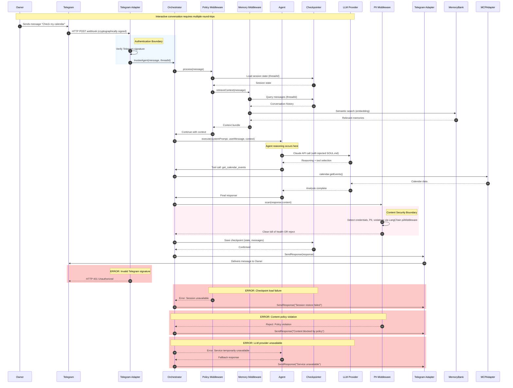
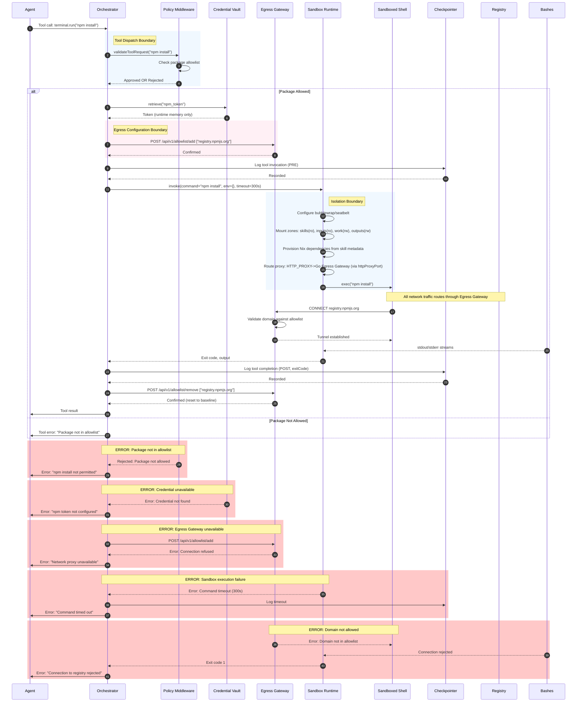
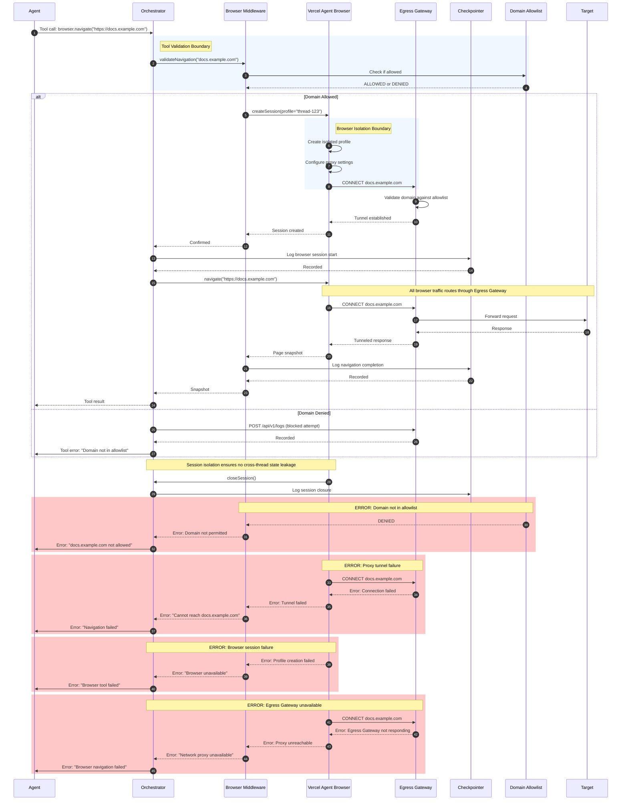

# Architecture.md: Logical System Blueprint for OpenKraken

## 1. Architectural Strategy

### Problem Context: What We're Responding To

OpenKraken is architected as a direct response to the failures of "OpenClaw" (née Clawdbot → Moltbot), a prior agent implementation that demonstrated the fundamental unsafety of dominant agent architectures. Every design decision in this document traces to a specific failure mode observed in OpenClaw:

- **Probabilistic Safety Failure:** OpenClaw relied on `AGENTS.md` directives—system prompt rules telling the LLM "don't do dangerous things." A single prompt injection through any connected messaging channel yielded full shell access. OpenKraken enforces safety at the sandbox and tool level, not the prompt level, using Anthropic's Sandbox Runtime for deterministic isolation.

- **Localhost Trust / No Auth by Default:** OpenClaw auto-trusted connections from `127.0.0.1`. Behind any reverse proxy, all external traffic appeared local. Shodan found 1,800+ exposed instances. OpenKraken binds to `127.0.0.1` or Tailscale only, with no implicit trust model. Telegram webhooks require cryptographic signature verification.

- **Flat Credential Storage:** API keys, OAuth tokens, and bot tokens stored in plaintext on the local filesystem, fully accessible to the agent. OpenKraken stores credentials in OS-level vaults (Keychain, secret-service) and never exposes them to the sandbox context.

- **Unaudited Memory Writes:** OpenClaw's Markdown-based memory was readable and writable by the agent with no gating. A prompt injection could silently rewrite the agent's long-term memory. OpenKraken removes the agent from the memory write path entirely—memory extraction and consolidation are handled by middleware, not agent-initiated tool calls.

- **Uncontrolled Egress:** The agent could compose and send messages to any connected channel without content validation, rate limiting, or approval gates. OpenKraken gates all outbound delivery through a single auditable egress chokepoint with structured JSON errors and comprehensive request logging.

- **No Supply Chain Integrity:** 300+ contributors, a skills/plugin ecosystem pulling arbitrary code, no hermetic builds, no hash verification. OpenKraken pins and hashes everything via Nix and analyzes skill scripts before execution.

- **No Network Isolation:** The agent inherited the host's full network access. OpenKraken defaults to offline and whitelists explicitly via egress proxy. The Anthropic Sandbox Runtime ensures all network traffic routes through the proxy.

- **Custom Security Infrastructure:** Building custom sandboxing implementations led to gaps and inconsistencies. OpenKraken leverages Anthropic's production-tested Sandbox Runtime for consistent cross-platform isolation.

### Scope Definition: What This Project Builds

OpenKraken is a **personal AI agent runtime** with the following bounded capabilities. Items outside these boundaries require explicit architectural extension.

**Primary Capabilities:**
- **Conversational Interaction:** Bidirectional messaging via Telegram (primary) and MCP-connected services (secondary)
- **Terminal Execution:** Sandboxed command execution with on-demand package provisioning via Nix and Anthropic Sandbox Runtime
- **File Operations:** Read/write access within scoped filesystem zones
- **Web Automation:** Browser automation via Vercel Agent Browser for form filling, navigation, and data extraction
- **Skill System:** Extensible capability bundles following AgentSkills.io format with LLM pre-analysis and Owner approval
- **Scheduled Tasks:** Cron-based task execution with full agent capabilities
- **Persistent Memory:** Three-tier recall system (checkpointer, message log, semantic memory) backed by SQLite
- **Observability:** Comprehensive logging, distributed tracing, and metrics for operational visibility
- **Owner Interfaces:** Command-line interface for development and debugging; web-based interface for monitoring and configuration

**Integration Boundaries:**
- **In Scope:** Telegram, MCP servers (Slack, Discord, email, calendar, custom services), OpenTelemetry-compatible observability backends, CLI and Web UI for Owner interaction
- **Out of Scope:** Direct WhatsApp integration (requires MCP bridge), native mobile notifications, voice interfaces, multi-user web access

**Security Boundaries:**
- **Deterministic Enforcement:** All safety constraints are enforced architecturally, not probabilistically
- **Zero Trust:** No implicit trust for any input, network connection, or file access
- **Isolated Execution:** Agent operates inside sandbox; credentials never enter sandbox context

### Architectural Entities

Four architectural entities appear throughout this document, each with distinct technology stacks, lifecycles, and trust boundaries.

**Project** — The framework itself, authored and maintained by the OpenKraken team. The Project defines platform skills, default policies, security constraints, and the "Constitution" (`SOUL.md`, `SAFETY.md`). The Project is the authority on _how_ the system works.

**Owner** — The person who installs and runs an instance. The Owner provisions credentials, configures integrations, uploads personal skills, and interacts with the Agent. In a single-tenant system, the Owner is the only human in the loop.

**Agent** — The LLM-driven runtime operating inside the sandbox. A managed sub-system, not a peer.

**Orchestrator** — The orchestration layer that mediates all communication between the Owner, external integrations, and the Agent. The Orchestrator injects identity, enforces policies, manages state, and handles credential isolation. It is the only component aware of platform specifics. Implemented as a JavaScript runtime (renamed from "Gateway" in v0.13.0 for clarity—see CHANGELOG.md).

**Egress Gateway** — The network boundary component implementing HTTP CONNECT proxy with domain allowlisting. Implemented as a separate binary with independent lifecycle, managed as a system service. Enforces strict allowlist-only network policy for all sandbox egress.

**Platform Adapter** — The cross-platform abstraction layer handling OS-specific behaviors for sandbox invocation and credential retrieval. Implemented with runtime detection within the Orchestrator binary, abstracting platform differences behind a unified interface.

The Owner trusts the Project (by choosing to install it). The Project trusts the Owner (by giving them full configuration authority). Neither trusts the Agent (which operates under deterministic constraints). The Orchestrator does not trust the Egress Gateway—communication follows strict RPC patterns with no implicit trust.

### Core Philosophies

These philosophical commitments shape every architectural decision. Deviations require explicit justification and ADR documentation.

1.  **Trust the Sandbox, Not the Model:** Safety is enforced by the sandbox and tool-level validation, not by the System Prompt.

2.  **Immutability by Default:** The Agent's identity (`SOUL.md`) and core configuration are injected at runtime and cannot be modified by the Agent.

3.  **Ephemeral Tooling:** Packages are available on-demand via Nix and require no pre-installation or system modification.

4.  **Capability-Based Security:** Blacklists fail. We use strict whitelisting for network egress and file access.

5.  **Supply Chain Integrity:** System packages resolve from nixpkgs. Language-specific Skill dependencies are converted at ingestion time from standard lockfiles into Nix derivations. Native package managers are never invoked at runtime. Skills declare dependencies via `metadata.x-openkraken.dependencies` for Nix provisioning. The integrated Vercel skills CLI (bundled via Nix) enables access to the curated ecosystem while applying OpenKraken's security pipeline.

6.  **Gated Egress:** Network access from sandboxed processes passes through an egress proxy with domain allowlisting. Direct internet access is blocked. The proxy enforces structured policies and logs all access for security auditing.

7.  **Minimal Tool Surface:** Every tool invocation is attack surface. The Agent prefers answering from knowledge when possible and only invokes tools when the task requires execution, file access, or capabilities beyond training data.

8.  **Middleware-Managed Memory:** The Agent does not manage its own long-term memory. Memory extraction, consolidation, retrieval, and injection are handled by Orchestrator middleware—invisible to the Agent and immune to prompt injection.

9.  **Single-Tenant by Design:** The system serves one Owner per instance. This is not a limitation to be overcome later—it is a deliberate architectural decision that eliminates multi-tenancy complexity.

10. **Everything is Middleware:** Agent capabilities—scheduling, web search, sub-agent orchestration, memory, skills, MCP integration, observability—are implemented as composable LangChain middleware. No privileged internal mechanisms exist that custom middleware cannot replicate.

11. **Build on Proven Foundations:** Where the ecosystem provides battle-tested solutions for security-critical infrastructure (sandboxing, observability, protocol implementations), we integrate them rather than reinventing. Custom implementation is reserved for Orchestrator-specific concerns.

12. **Nix-Native, Nix-Invisible:** The system leverages Nix for reproducibility, package management, and cross-platform configuration. However, Nix internals are never exposed to the Agent—packages simply become available when requested, with no awareness of the underlying mechanism.

13. **Tool-Level Isolation:** Different tools enforce security boundaries appropriate to their function. File operations use path validation; command execution uses the Anthropic Sandbox Runtime; browser automation uses isolated browser profiles with proxy enforcement.

14. **Identity Injection:** The Agent's core identity (`SOUL.md`) is never materialized as a file within the sandbox. It is injected directly into the system prompt by the Orchestrator. This prevents exfiltration of the "Constitution" via file copy operations.

15. **Durable State Persistence:** Agent state survives Orchestrator restarts via LangGraph SqliteCheckpointer with WAL mode. Session continuity is an architectural guarantee, not an in-memory optimization.

16. **Observable by Default:** All Agent operations are logged, traced, and metered. The Owner has complete visibility into Agent behavior for debugging, audit, and optimization purposes.

17. **Credential Isolation:** Credentials are stored in OS-level vaults (Keychain on macOS, secret-service on Linux) and never exposed to the Agent or written to persistent storage beyond runtime memory.

18. **Day-Bounded Sessions:** A session, thread, and day are synonymous in OpenKraken. Each calendar day (YYYY-MM-DD) constitutes a single session with a single thread ID matching the date. At day boundary (midnight, Owner's configured timezone), the Orchestrator begins a new session. The Sandbox work and outputs zones are cleared at session boundaries. Previous sessions remain accessible in the Checkpointer for memory retrieval and audit purposes, but the Agent begins each day with a clean working environment.

### Open Responses Compliance and Competitive Positioning

OpenKraken implements the **Open Responses API** as its primary interface contract, positioning it as an Open Responses Provider in the emerging ecosystem. This strategic decision provides several advantages:

- **Ecosystem Compatibility:** Any Open Responses-compatible client can consume OpenKraken, including HuggingFace Inference Providers and NVIDIA-backed integrations
- **Client-Agnostic Positioning:** Unlike proprietary agent frameworks, OpenKraken's API contract is standardized and portable
- **Future-Proofing:** The Open Responses specification is backed by major AI providers and community contributors, reducing API fragmentation risk
- **Extension Mechanism:** OpenKraken-specific features are exposed through the spec's extension prefix (`openkraken:*`) while maintaining base compliance

The implementation follows the Open Responses specification with semantic streaming events, typed item models, and structured error responses.

### The Pattern: Layered Modular Monolith with Strict Boundary Enforcement

OpenKraken adopts a **Layered Modular Monolith** architecture that enforces strict boundaries between concern domains while maintaining deployment simplicity appropriate for single-tenant operation. This pattern was selected over microservices or serverless alternatives for three compelling reasons rooted in the PRD's non-functional constraints.

**First**, the single-tenant deployment model eliminates the operational complexity that justifies microservices decomposition. The system serves exactly one Owner per instance with no user isolation requirements, meaning the throughput and scaling concerns that drive microservice adoption are irrelevant. A modular monolith provides the same separation of concerns without the distributed systems overhead of inter-service communication, distributed transactions, and independent deployment pipelines.

**Second**, the deterministic security requirement demands auditable data flow paths that are trivially traced in a monolith but become opaque across service boundaries. When the PRD mandates that "all credentials must be stored in OS-level vaults with no exceptions," the implementation verification is straightforward in a single process boundary. Distributed architectures introduce ambiguity about credential exposure during cross-service communication, requiring security theater that defeats the purpose.

**Third**, the cross-platform requirement (Linux and macOS) creates enough environmental variance without adding service distribution complexity. The architecture delegates platform abstraction to well-defined boundaries—the Platform Adapter and the Anthropic Sandbox Runtime—rather than distributing concerns across independently deployable services that must each handle platform differences.

> **Technology Bindings:** The Orchestrator runtime uses a JavaScript runtime with TypeScript for agent orchestration.

### Justification: Why This Pattern Fits the PRD Constraints

The PRD explicitly rejects the "probabilistic safety" model prevalent in agent frameworks, demanding instead "architectural enforcement" that makes rule violations "physically impossible regardless of how the agent is prompted." This requirement maps directly to the Layered Modular Monolith's strength in providing clear, enforceable boundaries. The Orchestrator sits at the center of all data flows, acting as the mandatory intermediary through which every Agent action must pass. This creates a chokepoint where security policies can be enforced without relying on the Agent's compliance.

The availability requirement of "session continuity across Orchestrator restarts" is achieved through the Checkpointer's SQLite persistence with WAL mode, a pattern that requires shared filesystem access available in monolithic deployments but problematic across service boundaries. The checkpoint schema maintains conversation state and tool call sequences with rollback capability, enabling the Orchestrator to restore exact session state after any interruption.

The performance constraint of "sandbox invocation within 100ms" further favors monolithic deployment. Tool calls must traverse the Orchestrator-Sandbox RPC interface regardless of architecture, but adding service-to-service latency between Orchestrator components would violate the latency budget. The monolithic pattern keeps all Orchestrator components in the same process, eliminating network round-trips from the critical path.

These architectural decisions are documented with full context and alternatives analysis in the ADR section.

---

## 2. System Containers (C4 Level 2)

The following containers constitute the deployable units of the OpenKraken system. Each container has explicit responsibilities, well-defined boundaries, and documented communication protocols. Containers are organized by their architectural layer, with clear indication of which layer owns each component.

### Terminology Reference

| Term | Definition | Implementation |
|------|------------|----------------|
| **Orchestrator** | Central orchestration layer managing Agent, adapters, and middleware | JavaScript runtime |
| **Egress Gateway** | Network proxy with domain allowlisting | Compiled binary (separate process) |
| **Sandbox** | Process isolation for Agent execution | Sandboxing runtime |
| **Middleware** | Extensions for capabilities and policies | Agent orchestration framework |
| **Checkpointer** | State persistence for session continuity | Relational database with custom adapter |

### Layer -1: Platform Manager

**Platform Manager**: Infrastructure-as-code tooling — Generates platform-appropriate service definitions from unified configuration, manages atomic updates through generation switching, establishes credential boundaries between build-time and runtime, and orchestrates service lifecycle across platforms. This layer operates below all application code, ensuring reproducibility and consistent deployment across platforms.

### Layer 0: The Host

**Credential Vault**: Platform-specific abstraction layer — Provides unified interface to OS-level credential storage, exposing `store(service, secret)`, `retrieve(service)`, and `rotate(service)` methods. The abstraction integrates with platform-native credential storage mechanisms. Credentials never leave runtime memory; the vault abstraction prevents any code path from writing secrets to filesystem, logs, or network connections.

**Egress Gateway**: Binary implementing HTTP CONNECT proxy with domain allowlisting — Operates in a chained architecture with the Sandbox Runtime. The Sandbox Runtime's built-in proxy routes all traffic to the Egress Gateway. This provides defense-in-depth: the Sandbox handles platform-specific network isolation while the proxy provides audit logging to the structured database, dynamic allowlist management API, and structured error responses. The Sandbox enforces that ALL traffic must route through the proxy chain, while the Gateway enforces the actual domain allowlist and logs every connection attempt with complete context.

### Layer 1: The Sandbox

**Sandbox Runtime**: Sandbox Runtime — Provides filesystem isolation through OS-native mechanisms and network isolation that routes all traffic through Egress Gateway. The Agent operates inside this boundary with no awareness of its existence. Sandbox configuration is platform-agnostic; the runtime handles translation to optimal native mechanisms.

### Layer 2: Middleware Stack

**Middleware Components**: LangChain middleware extensions that intercept, modify, or respond to Agent operations. The middleware stack is organized into three tiers: Policy (foundational security enforcement), Capabilities (tool and context injection), and Operational (cross-cutting concerns like summarization and human-in-the-loop). Middleware executes in defined order, with later middleware operating on outputs of earlier middleware.

**Policy Middleware**: Foundational tier enforcing security boundaries — Validates terminal package requests against allowlist, gates delivery through PII scanning, and enforces configured rate limits.

**Cron Middleware**: Detects scheduled task triggers and invokes Agent with scheduled context — Registers with host timer system and ensures at-least-once execution semantics.

**Web Search Middleware**: Provides web search tools through Orchestrator-mediated HTTP calls, routing requests through Egress Gateway for policy enforcement.

**Browser Middleware**: Provides browser automation tools, managing isolated browser profiles per session and routing traffic through Egress Gateway.

**Memory Middleware**: Manages three-tier recall system — Retrieves relevant memories before model calls using embedding-based retrieval and consolidates memories after agent completion. The Memory Middleware is a plug-and-play component developed independently by the Owner. The Orchestrator provides the middleware interface contract and SQLite storage schema; the consolidation algorithm, decay strategy, and retrieval heuristics are encapsulated within the middleware implementation and are not defined by this architecture.

**Skill Loader Middleware**: Exposes skill manifests to the Agent via system prompt. The Agent discovers available skills from the manifest and activates them autonomously based on task relevance. Manages skill lifecycle including version tracking, auto-updates within approved bounds, and provenance metadata storage.

**Sub-Agent Middleware**: Enables task delegation through `createSubAgentMiddleware()` pattern — Spawns subordinate agent loops for complex task decomposition. Sub-agents inherit the parent agent's sandbox boundaries, egress allowlist, and policy constraints. Delegation is limited to one level: sub-agents cannot spawn further sub-agents. This constraint prevents unbounded resource consumption and simplifies audit tracing.

**Human-in-the-Loop Middleware**: Interrupts on configured operations for Owner approval via Telegram inline keyboards. When an approval is pending, the agent's execution state is persisted in the Checkpointer and the agent loop suspends. There is no timeout — the Checkpointer maintains the suspended state indefinitely until the Owner approves or rejects the operation. LangGraph's checkpoint mechanism preserves complete execution state across Orchestrator restarts.

**Summarization Middleware**: Compresses older messages when context exceeds token thresholds to prevent context overflow.

**Middleware Implementation:** Middleware composition order and callback execution patterns are defined in the architecture.

### Layer 3: The Orchestrator

**Orchestrator**: JavaScript runtime managing agent execution — Central orchestration component owning session management, tool dispatch, prompt injection, and policy enforcement. Uses agent orchestration framework APIs for stateful workflow management. Runs as system-managed service with independent lifecycle from Egress Gateway.

**Telegram Adapter**: Telegram Bot API integration — Primary interaction channel receiving Owner messages via webhook (cryptographically verified) and delivering Agent responses.

**MCP Adapter**: Model Context Protocol integration — Provides access to MCP servers for Slack, Discord, email, calendar, and custom services.

**Checkpointer**: Custom database checkpointer — Persists agent state across Orchestrator restarts. Maintains checkpoint tables for conversation state and writes tables for metadata. Implementation uses relational database with Write-Ahead Logging mode.

**Structured Logger**: SQLite-based logging subsystem with automatic rotation — Captures all Agent operations including tool invocations, model calls, and middleware execution.

**OpenTelemetry Handler**: Langfuse v4 (OpenTelemetry) callback handler — Intercepts LLM calls, tool invocations, chain executions, and memory operations. Implementation follows observability patterns defined in the architecture.

### Middleware Components

**Policy Middleware**: Foundational tier enforcing security boundaries — Validates terminal package requests against allowlist, gates delivery through content scanning, and enforces configured rate limits.

**Cron Middleware**: Detects scheduled task triggers and invokes Agent with scheduled context — Registers with host timer system and ensures at-least-once execution semantics.

**Web Search Middleware**: Provides web search tools through Orchestrator-mediated HTTP calls, routing requests through Egress Gateway for policy enforcement.

**Browser Middleware**: Provides browser automation tools, managing isolated browser profiles per session and routing traffic through Egress Gateway.

**Memory Middleware**: Manages three-tier recall system — Retrieves relevant memories before model calls using embedding-based retrieval and consolidates memories after agent completion. The Memory Middleware is a plug-and-play component developed independently by the Owner. The Orchestrator provides the middleware interface contract and storage schema; the consolidation algorithm, decay strategy, and retrieval heuristics are encapsulated within the middleware implementation and are not defined by this architecture.

**Skill Loader Middleware**: Injects skill manifests into Agent context based on task — Reads skill folders and loads SKILL.md content.

**Human-in-the-Loop Middleware**: Interrupts on configured operations for Owner approval via Telegram inline keyboards. When an approval is pending, the agent's execution state is persisted in the Checkpointer and the agent loop suspends. There is no timeout — the Checkpointer maintains the suspended state indefinitely until the Owner approves or rejects the operation. The checkpoint mechanism preserves complete execution state across Orchestrator restarts.

**Summarization Middleware**: Compresses older messages when context exceeds token thresholds to prevent context overflow.

**Middleware Implementation:** Middleware composition order and callback execution patterns are defined in the architecture.

---

## 3. Container Diagram (Mermaid C4Container)

```mermaid
C4Container
  title Container Diagram for OpenKraken Runtime

  Person_Ext(Owner, "Owner", "Single human provisioning, configuring, and operating the instance")

  System_Boundary(openkraken_runtime, "OpenKraken Runtime") {
    Container(orchestrator, "Orchestrator", "JavaScript/TypeScript", "Central orchestration: agent loop, tool dispatch, policy enforcement")
    ContainerDb(checkpointer, "Checkpointer", "Relational Database", "State persistence: conversation, checkpoints, writes")
    ContainerDb(structured_log, "Structured Logger", "Relational Database", "Audit trail: operations, errors, durations")
    Container(egress_gateway, "Egress Gateway", "Compiled Binary", "HTTP CONNECT proxy with domain allowlisting")
    Container(sandbox, "Sandbox Runtime", "Sandboxing Runtime", "Process isolation via OS-native mechanisms")
    Container(credential_vault, "Credential Vault", "Platform Abstraction", "OS-level credential storage")
    ContainerDb(memory_bank, "Memory Bank", "Relational Database + Encryption", "Semantic memories with application-level encryption")
    
    Container(telegram_adapter, "Telegram Adapter", "Bot API Client", "Primary channel: webhook handling, response delivery")
    Container(mcp_adapter, "MCP Adapter", "Protocol Client", "Secondary channels: Slack, Discord, email, calendar")
  }

  System_Boundary(middleware_stack, "Middleware Stack") {
    Container(policy_mw, "Policy Middleware", "Framework Extension", "Security: package validation, content scanning, rate limits")
    Container(cron_mw, "Cron Middleware", "Framework Extension", "Scheduled task triggers")
    Container(web_mw, "Web Search Middleware", "Framework Extension", "Web search and fetch tools")
    Container(browser_mw, "Browser Middleware", "Framework Extension", "Browser automation with isolation")
    Container(memory_mw, "Memory Middleware", "Framework Extension", "Three-tier recall management")
    Container(skill_mw, "Skill Loader Middleware", "Framework Extension", "Skill manifest injection")
    Container(hitl_mw, "Human-in-the-Loop Middleware", "Framework Extension", "Owner approval interrupts")
    Container(summarize_mw, "Summarization Middleware", "Framework Extension", "Context compression")
  }

  System_Ext(telegram, "Telegram", "Primary interaction channel")
  System_Ext(mcp_servers, "MCP Servers", "Model Context Protocol services")
  System_Ext(llm_provider, "LLM Provider", "External language model")
  System_Ext(web_search, "Web Search Service", "External search provider")
  System_Ext(otel_backend, "Observability Backend", "Telemetry collector")

  Rel(Owner, Telegram, "Primary interaction via")
  Rel(Owner, orchestrator, "Configuration and monitoring via CLI and Web UI")

  Rel(Telegram, telegram_adapter, "Sends updates to (webhook)")
  Rel(telegram_adapter, orchestrator, "Routes messages to")

  Rel(orchestrator, policy_mw, "Chains through")
  Rel(policy_mw, cron_mw, "Middleware chain")
  Rel(cron_mw, web_mw, "Middleware chain")
  Rel(web_mw, browser_mw, "Middleware chain")
  Rel(browser_mw, memory_mw, "Middleware chain")
  Rel(memory_mw, skill_mw, "Middleware chain")
  Rel(skill_mw, hitl_mw, "Middleware chain")
  Rel(hitl_mw, summarize_mw, "Middleware chain")
  Rel(summarize_mw, orchestrator, "Completes middleware chain")

  Rel(orchestrator, checkpointer, "Persists state to")
  Rel(orchestrator, structured_log, "Emits audit records to")
  Rel(orchestrator, credential_vault, "Retrieves credentials from")
  Rel(orchestrator, egress_gateway, "Manages allowlist via RPC")
  Rel(orchestrator, sandbox, "Invokes command execution via")
  Rel(orchestrator, memory_bank, "Stores/retrieves memories via")

  Rel(sandbox, egress_gateway, "Routes all traffic through")
  Rel(orchestrator, llm_provider, "Calls for intelligence")
  Rel(orchestrator, web_search, "Searches web via")

  Rel(orchestrator, mcp_adapter, "Connects to MCP servers")
  Rel(mcp_adapter, mcp_servers, "Integrates with external services")

  Rel(orchestrator, otel_backend, "Exports traces to")
```

---

## 4. Critical Execution Flows

### Flow 1: Interactive Conversation via Telegram



**Flow Analysis**: This sequence reveals several architectural commitments. The Policy Middleware sits at the entry point, meaning every conversation passes through security validation before Agent invocation. The Memory Middleware operates invisibly to the Agent—the Agent receives consolidated context but has no awareness of memory operations. The PII Middleware sits in the response path, ensuring no credential leak or policy violation reaches the Owner. Each checkpoint write blocks until confirmed, ensuring session continuity is not compromised by write failures. All external dependencies implement retry with exponential backoff and circuit breaker patterns for resilience.

### Flow 2: Terminal Command Execution in Sandbox



**Flow Analysis**: This flow exposes the defense-in-depth strategy. The package allowlist is checked before any resource allocation. The credential is retrieved from the vault and exists only in runtime memory—never written to environment variables. The Egress Gateway allowlist is explicitly modified to add the npm registry, used for the command duration, then removed. The Sandbox applies filesystem zones that prevent the command from accessing anything outside `/sandbox/work/`. In the chained proxy architecture, the Sandbox Runtime's built-in HTTP/SOCKS5 proxy routes all traffic through the Go Egress Gateway, which enforces the domain allowlist and logs every connection attempt. Every action is logged before and after execution, enabling complete audit trails.

### Flow 3: Browser Automation with Network Enforcement



**Flow Analysis**: Browser automation presents unique risks because web content can contain malicious JavaScript attempting network connections, filesystem access, or credential theft. The architecture mitigates these risks through multiple layers. The domain allowlist is checked before navigation begins. The Agent Browser runs in an isolated profile per session, preventing state leakage between conversations. All browser traffic routes through the Egress Gateway, ensuring the same allowlist rules apply to browser-initiated connections as to command-line tools. Each navigation is logged for security audit.

---

## 5. Cross-Cutting Concerns

### 5.1 Authentication and Authorization

The OpenKraken architecture implements a layered authentication and authorization model that reflects the single-tenant deployment context while maintaining strict security boundaries. Authentication establishes identity at system boundaries; authorization enforces capability boundaries at every layer.

**Telegram Webhook Authentication**: The Telegram Adapter receives updates via webhooks and cryptographically verifies each request using Telegram's secret token mechanism. Requests without valid signatures are rejected before any processing occurs. This prevents spoofing attacks where malicious actors attempt to inject messages into the conversation.

**Owner Authentication for CLI and Web UI**: Both interfaces require Owner authentication before granting access. The CLI uses token-based authentication where the Owner generates a token during initial setup and stores it in their shell environment. The Web UI uses session-based authentication with configurable token expiration.

**Agent Authorization Model**: The Agent operates under a capability-based authorization system where capabilities are granted by middleware rather than inherited from the Owner's identity. When the Agent attempts to invoke a tool, the Policy Middleware validates the request against configured policies. This separation means the Agent's effective permissions are a subset of the Owner's permissions, never a superset.

**Credential Access Authorization**: Credentials stored in the vault are accessed by the Orchestrator only when required for external service calls. The Agent has no direct credential access—any tool requiring credentials must be dispatched through the Orchestrator, which retrieves the credential from the vault, injects it into the appropriate context, and ensures the credential is never exposed to the Agent.

**Egress Gateway Authorization**: The Orchestrator communicates with the Egress Gateway over a Unix domain socket with two complementary authentication layers.

*Layer 1 — Filesystem Permissions (Transport):* The socket is created by the Egress Gateway with restricted ownership and permissions. Only processes running as the service user or group can connect. This is the primary authentication boundary.

*Layer 2 — HMAC-SHA256 Request Signing (Application):* All Orchestrator requests to the Egress Gateway management API include an HMAC-SHA256 signature for defense-in-depth. A shared secret is generated during initialization and stored in the OS-level vault. Both processes read this secret at startup and cache it in memory. Each request includes a timestamp header and signature header. The Egress Gateway validates that the timestamp is within acceptable bounds (preventing replay attacks) and that the signature matches. Requests failing either check receive an authentication error.

This design provides equivalent authentication guarantees to mTLS for same-host IPC without certificate management overhead. The HMAC signing binds authentication to specific request content, ensuring intercepted signatures cannot be reused for different operations.

**Credential Vault Fallback:**

For Linux systems without secret-service (servers, containers, WSL), the CredentialVault uses an encrypted file-based fallback:

1. **Encrypted Storage**: `$OPENKRAKEN_HOME/credentials.enc` (age-encrypted)
2. **Key Derivation**: Master key (from vault or recovery code) decrypts age key
3. **Security**: File permissions 0600, encrypted at rest
4. **Migration**: Automatic detection and fallback when secret-service unavailable

**Fallback Flow:**
```
Primary: secret-service (D-Bus)
    ↓ (unavailable)
Fallback: age-encrypted file
    ↓ (missing)
Error: Credential provisioning required
```

Credential handling follows platform-specific patterns for Linux and macOS.

### 5.2 Observability

The observability strategy in OpenKraken addresses three distinct needs: operational visibility for system health monitoring, debugging support for troubleshooting Agent behavior, and security auditing for compliance and incident response.

**Structured Logging Architecture**: The Structured Logger captures all Agent operations with a canonical schema designed for queryability and retention management. Each log entry contains: timestamp in ISO8601 format with millisecond precision, requestId as a UUID that traces related operations, operationType from an enumerated set (tool_call, model_invoke, agent_turn, middleware_enter, middleware_exit), targetResource identifying the tool name or model identifier, arguments containing sanitized input (credentials and PII replaced with `[REDACTED]`), result containing output or error, durationMs for timing, and correlationId for tracing operations across middleware boundaries.

**Distributed Tracing Implementation**: The custom OpenTelemetry callback handler creates traces that follow operations from initial request through complete response delivery. Each trace consists of spans representing discrete operations: HTTP request handling, middleware processing, model invocations, tool calls, and response composition. The handler supports multiple export backends: OTLP collectors for enterprise environments, LangSmith for development debugging, and SQLite retention for audit purposes.

**Health and Metrics Endpoints**: The Orchestrator exposes standardized endpoints for operational monitoring. The `/health` endpoint returns HTTP 200 indicating the process is running. The `/ready` endpoint performs dependency checks (SQLite connectivity, MCP server availability, Egress Gateway responsiveness) and returns 200 only when all dependencies are healthy. The `/metrics` endpoint serves Prometheus-compatible metrics including HTTP request counts, tool invocation counts, and proxy dispositions.

**Logging Schema:** Audit log and proxy access log schemas are defined in the architecture.

**Operational Alerting**: The Orchestrator includes an Alert Emitter — a system health component that evaluates infrastructure conditions on a configurable interval (default: 60 seconds) and delivers alerts to the Owner through multiple channels. This is a cross-cutting system concern, not an agent lifecycle or middleware component. The Agent has no awareness of the Alert Emitter.

**Multi-Channel Alert Routing:**

Alerts are routed based on severity to appropriate channels:

| Severity | Channel | Delivery | Example |
|----------|---------|----------|---------|
| CRITICAL | Telegram | Immediate | Gateway failure, vault inaccessible |
| ERROR | Telegram | Immediate | Backup failure, database corruption |
| WARN | Email | Hourly digest | High memory usage, approaching limits |
| INFO | Email | Daily digest | Successful backup, skill update |

**Rationale:**
- Telegram: Immediate attention for urgent issues requiring Owner action
- Email: Non-urgent informational summaries to reduce alert fatigue
- Both channels: Prometheus metrics at `/metrics` for Owners with external monitoring

The Alert Emitter evaluates conditions against internal metrics and system state: database size approaching limits (WARN at configurable threshold, default 8GB), database integrity check failures (CRITICAL), Egress Gateway health (ERROR after 3 consecutive failures, INFO on recovery), backup success or failure (configurable), LLM provider error rates (WARN above threshold), credential vault accessibility (CRITICAL), checkpoint storage growth (WARN), scheduled task failures (ERROR), and skill auto-updates (INFO).

To prevent alert fatigue, identical alerts are suppressed for a configurable cooldown period (default: 30 minutes). Recovery alerts reset the suppression window for corresponding failure alerts. INFO-level alerts (backup success, skill updates) are individually configurable by the Owner. All alerts are logged to the audit log regardless of channel delivery status.

This design avoids external monitoring infrastructure (Prometheus + Grafana + PagerDuty) that is disproportionate for a single-tenant personal runtime while ensuring critical issues receive immediate attention. The Owner already has Telegram as a first-class channel; urgent alerting flows through it. Less urgent issues are batched in email digests.

**Alert Configuration:** Alerting is configured through the configuration schema defined in the architecture.

### 5.3 Error Handling and Degradation

The architecture implements a comprehensive error handling strategy that ensures system safety under failure conditions while providing clear feedback.

**Graceful Degradation Patterns**: When external dependencies fail, the system degrades gracefully rather than catastrophically. If the LLM provider is unavailable, the Agent returns an error indicating the service is temporarily unavailable without crashing or corrupting state. If an MCP server fails, the system marks that integration as unavailable while continuing to serve other channels.

**Retry Policies with Exponential Backoff**: Transient failures in external services trigger automatic retries with exponential backoff. The retry policy applies to LLM API calls (up to 3 retries with 1s/2s/4s delays), MCP server connections (up to 2 retries with 500ms/1s delays), and Egress Gateway operations (up to 2 retries with 100ms/200ms delays).

**Circuit Breaker Integration**: The architecture implements circuit breakers for external services to prevent cascade failures during extended outages. When a service fails repeatedly (5 failures in a 60-second window), the circuit opens and subsequent requests fail immediately with a service-unavailable error.

**Skill-Related Degradation:**
- Skill ingestion failure: Skill remains in staging, Owner notified, Agent unaffected
- LLM analysis failure: Fallback to deny-by-default, require manual Owner review
- Dependency resolution failure: Skill marked as "requires dependencies", blocked from activation
- Version drift (approved version vs. latest): Auto-update triggers for approved skills with notification
- Vercel CLI unavailable: Bundled Nix package provides offline fallback for cached sources

**Egress Gateway Failure Recovery:**

The Egress Gateway is a single point of failure for sandbox network access. The architecture includes automatic recovery mechanisms:

1. **Health Monitoring**: Orchestrator polls Gateway health endpoint every 30 seconds
2. **Automatic Restart**: Nix/systemd restart on 3 consecutive failures
3. **Graceful Degradation**: Queue outbound requests during Gateway recovery (max 100 queued)
4. **Owner Alert**: CRITICAL alert via Telegram on Gateway failure, INFO on recovery

**Recovery Flow:**
```
Health Check Failure (1st) → Log Warning
Health Check Failure (2nd) → Log Warning
Health Check Failure (3rd) → CRITICAL Alert → Restart Service
Health Check Success → INFO Alert → Resume Normal Operation
```

Egress Gateway resilience patterns are defined in the architecture.

**Error Response:** Standardized error response formats are defined in the architecture.

---

### 5.4 Skill Ingestion Pipeline

The Skill Ingestion Pipeline manages the lifecycle of skills from external sources through security validation to activation. This pipeline ensures that only approved, analyzed, and provisioned skills become available to the Agent.

**Pipeline Overview:**

The pipeline implements the following stages for all non-system skills:

1. **Source Resolution**: Skills are fetched from configured sources using the integrated Vercel skills CLI (bundled via Nix). Supported sources include GitHub shorthand (`owner/repo`), full GitHub URLs, direct tree paths, and Owner-specified repositories. The CLI resolves sources and retrieves skill metadata.

2. **Structure Validation**: The skill directory is validated against the AgentSkills.io specification. Required `SKILL.md` with valid YAML frontmatter is verified. File structure depth, script permissions, and hidden files are checked deterministically.

3. **LLM Security Analysis**: Skills undergo security analysis using a configurable LLM model (default: Claude Haiku 4.5). Instruction-only skills are analyzed for prompt injection patterns. Executable skills undergo additional static analysis for network calls, credential access, file path traversal, and encoded payloads.

4. **Owner Approval**: Skills require explicit Owner approval unless auto-approve conditions are met. Owner-tier instruction-only skills with low risk may auto-approve (configurable). Community-tier and executable skills always require Owner approval. The full analysis report is presented for decision.

5. **Dependency Resolution**: Skills declaring dependencies via `metadata.x-openkraken.dependencies` trigger Nix provisioning. Nix packages are resolved from nixpkgs and made available in the sandbox. This ensures native package managers are never invoked at runtime.

6. **Activation**: Approved skills are moved to the active skills directory. The Skill Loader Middleware exposes the skill manifest to the Agent via system prompt. The Agent autonomously discovers and activates skills based on task relevance.

**Tiered Trust Model:**

| Tier | Source | Approval Required | Auto-Update | Analysis |
|------|--------|-------------------|-------------|----------|
| **System** | Bundled with project | None | None | Project-audited |
| **Owner** | Uploaded by Owner | Yes (unless instruction-only + low risk) | Approved versions only | Required for executable |
| **Community** | External repositories | Yes | Approved versions only | Required for all |

**Skill Discovery and Activation:**

Skills follow the AgentSkills.io progressive disclosure model:
1. At startup, the Skill Loader Middleware scans skill directories and extracts `name` + `description` from each SKILL.md frontmatter
2. The `<available_skills>` block is injected into the Agent's system prompt using the `skills-ref to-prompt` pattern
3. The Agent autonomously decides when to activate a skill based on task relevance
4. When activated, the Agent loads the full SKILL.md body and executes accordingly
5. If the skill has scripts, the Agent invokes them via `execute_terminal` with sandbox enforcement

**Version Tracking and Auto-Update:**

- Each skill stores its current version from SKILL.md frontmatter
- The pipeline tracks approved version bounds (major.minor.patch)
- When a source skill updates, the pipeline detects the version change
- Auto-update triggers only for already-approved skills within configured bounds
- Owner is notified of auto-updates with version change details
- Manual review is required for new skills or major version changes

**Provenance and Audit:**

All skill operations are logged to the audit table:
- `skill_id`: Unique identifier
- `skill_name`: Human-readable name
- `skill_version`: Current version
- `skill_source`: Source URL/repository
- `skill_tier`: system/owner/community
- `skill_action`: ingest/approve/update/remove
- `analysis_report_id`: Reference to security analysis

**Dependencies via Metadata:**

Skills declare dependencies using the `metadata.x-openkraken.dependencies` field:

```yaml
---
name: video-processor
description: Extract audio and tables from video files
metadata:
  author: example-org
  version: "1.0.0"
  x-openkraken:
    dependencies:
      nix: ["ffmpeg", "imagemagick", "jq"]
---
```

The Nix packages are provisioned before sandbox invocation, ensuring reproducible execution without runtime package installation.

---

## 6. Risks and Technical Debt

### High-Priority Risks

**Sandbox Runtime Maturity**: The Anthropic Sandbox Runtime (`@anthropic-ai/sandbox-runtime`) is currently version 0.0.34 and labeled "Beta Research Preview." While the project is actively maintained, the `0.x.y` versioning indicates potential breaking changes before 1.0.0. OpenKraken pins to specific versions and monitors changelogs, but the dependency on an evolving runtime creates upgrade risk. A breaking change in the sandbox API could require significant Orchestrator adaptation.

**Egress Gateway Single Point of Failure**: The Egress Gateway is a mandatory chokepoint for all sandbox network traffic. If the Gateway crashes or becomes unresponsive, no sandboxed operation requiring network access can proceed. The current architecture does not include Gateway redundancy appropriate for high-availability requirements.

**Credential Vault Dependency**: The CredentialVault abstraction assumes OS-level vault availability. On Linux systems without a running secret-service daemon, credential retrieval will fail. The architecture does not currently include a fallback credential storage mechanism for environments without vault support.

### Medium-Priority Risks

**SQLite Concurrency Boundaries**: While the Checkpointer uses WAL mode for concurrent access, SQLite's single-writer model means heavy write loads (frequent checkpointing during rapid tool invocations) can create write starvation. The architecture does not currently implement write batching or prioritization.

**MCP Adapter State Management**: The MCP adapter maintains persistent connections to MCP servers via `@langchain/mcp-adapters`, which owns connection lifecycle management, reconnection logic, and health checking. If an MCP server crashes, recovery behavior is determined by the LangChain MCP connector implementation. OpenKraken monitors MCP connection status through the Orchestrator's readiness endpoint (`/ready`) and emits alerts via the Alert Emitter when MCP servers become unreachable.

**Cross-Platform Substrate Differences**: The architecture claims "identical Agent capability semantics" across Linux and macOS, but the underlying mechanisms differ significantly (bubblewrap bind mounts vs. Seatbelt profiles). Edge cases around symlink handling and violation detection differ between platforms. Additionally, Apple's sandbox-exec (Seatbelt) mechanism is deprecated and receives minimal maintenance. Future macOS versions may remove or further restrict Seatbelt capabilities. The architecture should monitor alternative isolation mechanisms for macOS (e.g., Docker Desktop's hypervisor framework, nsjail via Homebrew) as potential migration paths.

**Platform-Specific Implementation Details:** Platform-specific isolation details and threat models are defined in the architecture.

### Technical Debt

**Manual Middleware Configuration**: The middleware stack is currently configured through code with explicit ordering. Adding new middleware requires code changes rather than configuration updates.

**Limited Integration Testing**: The current test coverage focuses on unit tests for individual components. Integration tests covering end-to-end flows are sparse, risking undetected component interaction failures.

**Documentation-Implementation Drift**: Without automated verification that implementation matches architecture, the document becomes a historical record rather than a specification.

**Schema Upgrade Path**: Database schema migrations are forward-only. LangGraph checkpoint compatibility is managed through the checkpoint `v` field (currently `v: 4`), which LangGraph uses to handle deserialization across versions. The Orchestrator validates checkpoint version compatibility at startup and refuses to load checkpoints from incompatible future versions. Schema migrations are applied before the Orchestrator accepts requests, ensuring the database is always at the expected version.

---

## Appendix: Architectural Decision Log

| Decision | Rationale | Implications |
|----------|-----------|--------------|
| Modular Monolith over Microservices | Single-tenant deployment eliminates distributed systems benefits; monolithic deployment simplifies credential enforcement and tracing | No horizontal scaling capability; component boundaries must be maintained through discipline |
| JavaScript Runtime for Orchestrator | High performance, strong ecosystem for TypeScript development, modern JavaScript features | Smaller ecosystem than mainstream alternatives; some packages may require compatibility work |
| Systems Language for Egress Gateway | Strong standard library for networking and HTTP proxy implementation; simple deployment model; battle-tested reliability | Requires additional toolchain in build environment; separate language from Orchestrator |
| Relational Database for All Persistence | Write-ahead logging provides durability and concurrency; single backend simplifies backup and recovery | Write-heavy workloads may require optimization; not appropriate for high-throughput scenarios |
| Egress Gateway as Separate Process | Separate trust boundary enables defense-in-depth; independent lifecycle prevents cascade failures | Adds latency to all network operations; requires process supervision |
| Local IPC for RPC | Provides authentication through filesystem permissions; avoids network exposure | Communication limited to same host; socket file must be protected |
| Callback-Based Observability | Minimal overhead on critical path; composable handlers | No automatic correlation—correlation IDs must be explicitly passed |
| CLI First, Web UI Before Public | CLI enables rapid development iteration; Web UI required for production polish and Owner experience | Dual interface maintenance; Web UI technology selection pending |

**ADR Documentation:** Architecture decisions are documented with context, alternatives considered, and consequences analysis in the ADR section.


