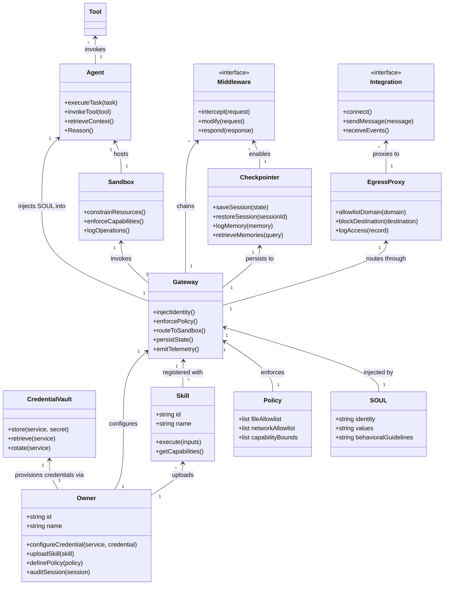

# Product Requirements Document: RealClaw

## 1. Executive Summary

### The Vision

RealClaw represents a paradigm shift in personal AI agent runtimes—a deterministic, security-first platform where the agent operates not as a privileged user with shell access, but as a strictly managed subsystem with bounded, auditable capabilities. In this future state, individuals operate their own AI assistants with complete confidence that architectural enforcement prevents rule violations regardless of how the agent is prompted or what inputs it receives. The agent exists within security boundaries that are physically impossible to escape, credentials never materialize outside protected runtime memory, and every action is observable and reversible. The Owner maintains complete sovereignty over their instance while the agent provides genuine assistance within unbreakable constraints.

### The Problem

Current personal AI agent implementations suffer from fundamental architectural failures that render them unsuitable for security-conscious deployment. The prevailing "probabilistic safety" model trusts the AI to follow rules through clever prompting—a model that fails consistently when agents encounter adversarial inputs, novel bypass techniques, or simply when training data gaps lead to unexpected behavior. Specific failure modes include: credentials stored in plaintext or exposed through environment variables, localhost trust assumptions that expose 1,800+ instances on Shodan, unaudited memory writes that leak sensitive data, uncontrolled network egress enabling data exfiltration, custom security implementations with exploitable gaps, and flat permission models that grant agents excessive access by default. Users who require personal AI assistance must currently choose between capable but insecure implementations and secure implementations that lack genuine agent functionality.

### Success Metrics

RealClaw will be considered successful when the following qualitative conditions are met: the Owner can provision credentials for any integration without those credentials ever appearing in logs, filesystem, or network captures accessible to the agent; the agent cannot access any network destination or file path that the Owner has not explicitly allowed, regardless of how the agent frames its requests; every agent action—including tool invocations, network calls, and file operations—is logged with sufficient detail for complete audit and reproduction; scheduled tasks execute precisely as configured without requiring the Owner to maintain running processes; and the agent demonstrates genuine helpfulness within its security constraints rather than refusing all actions that require external capability. The system must feel to the Owner like a capable assistant that happens to be unbreakable, rather than an unbreakable system that happens to be unhelpful.

**Cross-Platform Consistency Criteria:** The System shall deliver identical capability semantics across Linux and macOS platforms with the following measurable criteria: path allowlist validation must produce identical results regardless of platform filesystem conventions (case sensitivity, path separators, volume mounting); network egress policies must enforce identical domain restrictions across platforms using platform-native sandbox mechanisms; credential vault operations must provide equivalent security properties (Keychain on macOS, secret-service on Linux) with identical API semantics; and CLI commands must produce functionally equivalent behavior across platforms with platform-specific formatting only where semantically required. Cross-platform consistency shall be validated through automated test suites that execute identical capability requests on both platforms and verify equivalent outcomes.

---

## 2. Ubiquitous Language

The following terms constitute the Ubiquitous Language of RealClaw. All documentation, specification, and implementation must use these terms consistently. Synonyms listed under "Do Not Use" are prohibited unless explicitly redefined in a later section of this document.

| Term | Definition | Do Not Use |
|------|------------|------------|
| **Owner** | The single human who provisions, configures, and operates a RealClaw instance. The Owner has full system access and is the only human in the loop. There is no concept of multiple users, administrators, or tenants. | User, Client, Customer, Administrator, Operator |
| **Agent** | The AI-driven runtime subsystem operating inside the sandbox. The Agent is a managed capability provider, not a peer to the Owner. It has no awareness of platform internals, no access to credentials, and no ability to modify its own constraints. | Assistant, Bot, Worker, Subagent, Chatbot |
| **Gateway** | The orchestration layer that mediates all communication between the Owner, external integrations, and the Agent. The Gateway injects identity, enforces policies, manages state, and handles credential isolation. It is the only component aware of platform specifics. | Orchestrator, Controller, Server, API Layer |
| **Sandbox** | The isolation environment where the Agent executes. The Sandbox uses platform-native mechanisms (bubblewrap on Linux, sandbox-exec on macOS) to enforce resource and capability boundaries. The Agent has no awareness of the Sandbox's existence. | Container, VM, Isolation Layer, Jail, Bubblewrap |
| **Credential** | Any secret value that authorizes access to external services, including API keys, OAuth tokens, passwords, and private keys. Credentials must be stored in OS-level vaults and never exposed to the Agent or written to persistent storage beyond runtime memory. | Secret, API Key, Token, Password, Auth Value |
| **Skill** | A packaged capability that extends the Agent's functionality. Skills are authored by the Owner or sourced from trusted repositories and executed within the Sandbox with controlled permissions. | Plugin, Extension, Tool, Module, Addon |
| **Middleware** | A composable extension point in the Gateway that intercepts, modifies, or responds to Agent operations. Memory management, policy enforcement, and observability are implemented as middleware. | Hook, Filter, Interceptor, Handler, Callback |
| **Checkpointer** | The persistent state store that preserves Agent state across Gateway restarts. Checkpointers ensure session continuity and durable execution tracking. | Session Store, State Store, Persistence Layer |
| **Egress Proxy** | The network intermediary that enforces domain allowlisting for Agent-initiated outbound connections. All sandbox network traffic passes through the Egress Proxy, which logs access for security auditing. | Firewall, Proxy, Network Filter, Outbound Gateway |

---

## 3. Actors & Personas

### The Sovereign Owner

The Owner persona represents the entire user base of RealClaw—individuals who value both AI capability and security sovereignty. This persona has invested significant effort in understanding how traditional agent implementations fail and specifically seeks a solution that does not rely on hoping the AI will behave. The Owner is technically sophisticated enough to configure CLI tools, understand credential vault integration, and evaluate security claims, yet prioritizes outcomes over implementation details. The Owner's primary emotional state is cautious confidence: they want to trust their AI assistant but have learned from experience that trust must be architecturally enforced. The Owner values transparency into Agent behavior, deterministic guarantees over probabilistic assurances, and the ability to audit every decision after the fact. The Owner does not expect to manage multiple users, share instances, or deploy to cloud infrastructure—this is explicitly not the product for those use cases.

### The Managed Agent

The Agent is not a persona in the traditional sense but represents the behavioral envelope of the system. The Agent exists to provide genuine assistance within unbreakable constraints. The Agent's "personality" is defined by the SOUL.md document injected at runtime—helpful within boundaries, honest about limitations, and harmless by design. The Agent has no awareness of the sandbox, no concept of credentials, and no memory across sessions except through middleware-managed retrieval. The Agent is not a user of the system but a subsystem within it, optimized for precision and predictability rather than personality expression.

### Value Principles

The Agent's behavior is governed by four foundational values injected through constitutional documents at runtime. These values are not prompts the Agent "should follow" but architectural constraints that shape how the Agent interprets requests and generates responses.

**Helpfulness (Primary):** The Agent shall genuinely assist the Owner within security constraints. Assistance is measured by task completion and useful information provision, not by compliance volume. The Agent may refuse requests that violate configured policies but must explain the refusal and, where possible, suggest alternative approaches within constraints. Success Indicator: The Agent completes at least 80% of non-policy-violating Owner requests within the configured capability scope, with meaningful progress communicated even when full completion requires Owner intervention.

**Honesty (Mandatory):** The Agent shall be truthful in all interactions. When the Agent lacks information or certainty, it shall acknowledge this rather than fabricate responses. The Agent shall not obscure its limitations or the boundaries of its capabilities. Confidence levels shall accurately reflect actual certainty. Success Indicator: Zero confirmed hallucinations in Owner-audited sessions; when uncertain, the Agent explicitly states uncertainty rather than generating plausible-sounding but unverified information.

**Harmlessness (Non-Negotiable):** The Agent shall never facilitate illegal, unethical, or dangerous activities regardless of Owner request framing. Harmlessness is enforced architecturally through policy constraints and capability boundaries, not through prompting alone. The Agent shall refuse requests that would cause harm even if technically capable of execution. Success Indicator: Zero policy violations that result in actual harm; all potentially harmful requests are blocked at the policy enforcement layer with clear explanation of why the request was declined.

**Transparency (Foundational):** The Agent shall be clear about its capabilities and limitations. The Owner shall always understand what the Agent can and cannot do, why specific actions were taken, and what constraints shaped the response. Transparency extends to the observability layer, where all Agent operations are logged for Owner review. Success Indicator: Owner can audit 100% of Agent decisions through observability layer; Agent explanations enable Owners to understand decision rationale without requiring access to internal system prompts or architectural knowledge.

### Constitutional Framework

Agent behavior is defined through constitutional documents injected at runtime, not through static prompts or filesystem materials. The Gateway assembles these documents into the Agent's system prompt, ensuring the Agent has no awareness of its configuration and no ability to modify its own constraints. Identity documents are never materialized as files within the Sandbox, preventing exfiltration of behavioral guidelines through file copy operations. The constitution consists of immutable core identity, environment and harness context, and Owner-configured preferences, forming a hierarchical constraint system where higher-priority documents override lower-priority ones.

**Core Philosophies:** RealClaw operates according to foundational philosophical principles that shape every architectural decision and implementation choice. These principles are documented in the Architecture documentation and include: Trust the Sandbox, Not the Model; Immutability by Default; Capability-Based Security; Supply Chain Integrity; Gated Egress; Middleware-Managed Memory; Single-Tenant by Design; Everything is Middleware; and Build on Proven Foundations. These philosophies represent non-negotiable constraints on implementation and should be referenced when evaluating proposed changes or extensions to the system.

---

## 4. Functional Capabilities

### Epic: Core Agent Runtime (P0)

**CAP-001:** The System shall provide conversational interaction between the Owner and the Agent through both CLI and Web UI interfaces, maintaining conversation context across turns within a session.

**CAP-002:** The System shall execute terminal commands on behalf of the Agent within the Sandbox, with all command invocations logged to the Checkpointer before execution.

**CAP-003:** The System shall perform file operations on behalf of the Agent, including read, write, list, and delete operations, subject to path allowlisting enforced by the Gateway before Sandbox invocation.

**CAP-004:** The System shall provide web automation capabilities including HTTP requests and browser interaction, with all outbound traffic routed through the Egress Proxy for policy enforcement.

**CAP-005:** The System shall maintain conversation state, intermediate reasoning, and execution context in the Checkpointer, ensuring continuity across Gateway restarts.

### Epic: Security Enforcement (P0)

**CAP-010:** The System shall isolate Agent execution within platform-native sandbox mechanisms, preventing the Agent from accessing resources outside its permitted scope regardless of input manipulation.

**CAP-011:** The System shall store all credentials in OS-level vaults (Keychain on macOS, secret-service on Linux), never exposing credentials to the Agent or persisting them beyond runtime memory.

**CAP-012:** The System shall enforce network egress through an allowlisting proxy, blocking all outbound connections to domains not explicitly approved by the Owner.

**CAP-013:** The System shall inject Agent identity (SOUL.md) directly into the system prompt at runtime, never materializing identity documents as files within the Sandbox.

**CAP-014:** The System shall validate all file paths accessed by the Agent against an Owner-defined allowlist before Sandbox invocation, rejecting any path outside permitted zones.

### Epic: Skill System (P0)

**CAP-020:** The System shall allow the Owner to install Skills that extend Agent capabilities, with each Skill executing within its own permission boundaries.

**CAP-021:** The System shall resolve Skill dependencies from locked specifications, converting standard lockfiles into isolated runtime environments during ingestion.

**CAP-022:** The System shall prevent Skills from invoking native package managers at runtime, enforcing supply chain integrity through Nix-based dependency resolution.

**CAP-023:** The System shall execute Skills on-demand without requiring pre-installation or system modification, with packages becoming available transparently when requested.

**CAP-024:** The System shall enforce a Tiered Trust Model for Skills, categorizing Skills as System Skills (pre-approved capabilities), Owner Skills (Owner-uploaded with configurable permissions), or Community Skills (sourced from repositories with strict isolation). Skills in lower trust tiers shall be subject to stricter capability boundaries than those in higher tiers.

### Epic: Memory Management (P0)

**CAP-030:** The System shall extract relevant context from previous sessions for Agent retrieval, with memory consolidation performed by middleware invisible to the Agent.

**CAP-031:** The System shall persist memory data in encrypted form within the Checkpointer, preventing memory exfiltration through filesystem access.

**CAP-032:** The System shall provide the Owner with visibility into stored memories and the ability to purge specific memories, maintaining Owner sovereignty over Agent knowledge.

### Epic: Scheduling (P1)

**CAP-040:** The System shall support time-based task scheduling, executing Agent workflows at Owner-configured intervals without requiring interactive sessions.

**CAP-041:** The System shall trigger scheduled tasks through host system timers, invoking the Agent through the normal execution path with full context injection.

**CAP-042:** The System shall log scheduled task execution results to the Checkpointer, providing complete audit trail for Owner review.

### Epic: Integration Framework (P1)

**CAP-050:** The System shall provide Model Context Protocol (MCP) adapters for the following first-class integrations: Slack for team communication and workflow automation; Discord for community interaction and bot commands; email (IMAP/SMTP) for message retrieval and sending; calendar (iCal/Google Calendar) for scheduling and event management; and Telegram for real-time bidirectional interaction as defined in CAP-052. Additional MCP adapters may be configured by the Owner for services not listed here.

**CAP-051:** The System shall expose CLI and Web UI interfaces for Owner configuration of integrations, with credential provisioning through vault integration.

**CAP-052:** The System shall support Telegram as a first-class integration channel, providing real-time interaction capabilities through the grammY framework with sandbox enforcement.

### Epic: Observability (P1)

**CAP-060:** The System shall emit OpenTelemetry-compatible traces for all Agent operations, including tool invocations, LLM calls, and middleware execution.

**CAP-061:** The System shall provide structured logging of all Agent actions with sufficient detail for complete reproduction and security audit.

**CAP-062:** The System shall expose observability data through multiple backends including SQLite, OTLP collectors, and LangSmith-compatible endpoints.

### Epic: Owner Interfaces (P0)

**CAP-080:** The System shall provide a Command Line Interface (CLI) for Owner interaction, supporting the following capability categories: configuration management (setting and viewing policies, credential provisioning, and integration setup); debugging and diagnostics (session inspection, observability data retrieval, and system health verification); and automation (scriptable interactions for workflow integration and scheduled task management). The CLI shall use token-based authentication where Owners authenticate once to receive time-limited tokens for subsequent operations.

**CAP-081:** The System shall provide a Web User Interface (Web UI) for casual Owner interaction and monitoring, featuring real-time conversation display with full observability integration, configuration panels for policy management and integration setup, and dashboard views for system status, scheduled tasks, and recent activity.

**CAP-082:** The System shall ensure the CLI interface is fully keyboard-navigable and compatible with screen readers for accessibility, with all functionality accessible without requiring mouse interaction and clear focus indicators for navigation state.

**CAP-083:** The System shall ensure the Web UI satisfies WCAG 2.1 AA accessibility compliance requirements including sufficient color contrast ratios, keyboard navigation support, screen reader compatibility for all interactive elements, and focus management for dynamic content updates.

### Epic: Cross-Platform Consistency (P2)

**CAP-070:** The System shall provide identical Agent capability semantics across Linux and macOS platforms, with platform differences abstracted by the Gateway.

**CAP-071:** The System shall normalize all filesystem paths to canonical format before Sandbox configuration, ensuring consistent behavior regardless of platform path conventions.

---

## 5. Non-Functional Constraints

### Security Standards

RealClaw must satisfy the following security constraints without exception: all credentials must be stored in OS-level vaults with no exceptions for development, debugging, or convenience; the Agent must be unable to access any resource—network, filesystem, or memory—outside explicitly configured allowlists regardless of input framing; identity injection must occur at runtime with no file-based identity materialization in the Sandbox; and the system must operate on a Zero Trust model with no implicit trust for any input, including Owner-provided configuration files, system prompts, or conversation content. The system must satisfy GDPR data sovereignty requirements for European Owners and align with SOC 2 principles for auditability and change control, though full SOC 2 certification is not required for this version.

### Availability and Reliability

The Agent must operate with session continuity across Gateway restarts, with no loss of conversation context or pending execution state; scheduled tasks must execute within one minute of configured time under normal system conditions; the Checkpointer must maintain WAL mode for concurrent access resilience; and the system must provide graceful degradation for external integration failures without cascading to Agent unavailability.

### Performance Constraints

Agent response latency must be dominated by LLM inference time, not system overhead; Sandbox invocation must complete within 100ms for standard tool calls; Checkpointer writes must not block Agent execution; and Egress Proxy throughput must match or exceed underlying network capacity.

### Accessibility Compliance

The CLI interface must be navigable via standard keyboard shortcuts and screen reader compatible; the Web UI must satisfy WCAG 2.1 AA contrast and keyboard navigation requirements; and all observability output must be parseable by automated accessibility tools.

---

## 6. Boundary Analysis

### In Scope

RealClaw is scoped to deliver a deterministic, security-first personal AI agent runtime for single-tenant deployment on Linux and macOS. The core value proposition encompasses: architectural safety enforcement that makes rule violations physically impossible regardless of prompt sophistication; credential isolation through OS-level vault integration with zero exposure to the Agent; capability-based security through strict allowlisting for filesystem access and network egress; persistent memory management that preserves context while maintaining Owner control; and complete observability for debugging, audit, and optimization purposes. The system serves one Owner per instance with full system access—no user isolation, no shared hosting, no multi-tenant scenarios are in scope for this version.

### Out of Scope

The following capabilities, while potentially valuable, are explicitly excluded from this version to maintain focus and security posture. Direct WhatsApp integration is out of scope; Owners requiring WhatsApp must use an MCP bridge. Native mobile notifications are out of scope; the system provides browser-based and Telegram notifications only. Voice interfaces are out of scope; the system provides text-based interaction exclusively. Multi-user support is out of scope; the system serves one Owner and cannot be shared across users. Cloud deployment is out of scope; the system targets personal device deployment exclusively.

### Anti-Patterns to Avoid

RealClaw explicitly rejects several patterns common in agent frameworks. The system does not use prompt-based safety that relies on the Agent following instructions correctly. The system does not store credentials in environment variables, configuration files, or any location accessible to the Agent. The system does not trust localhost network connections as inherently safe. The system does not allow the Agent to modify its own constraints, configuration, or identity at runtime. The system does not permit flat permission models that grant excessive access by default. The system does not expose plaintext credentials in logs, network captures, or filesystem. The system does not allow unaudited memory writes that could leak sensitive data. The system does not enable uncontrolled network egress from the Agent. The system does not invoke native package managers at runtime that could compromise supply chain integrity. The system does not materialize Agent identity documents as files within the Sandbox where they could be exfiltrated.

---

## 7. Conceptual Diagrams

### Diagram A: System Context (C4 Level 1)

```mermaid
C4Context
  title System Context Diagram for RealClaw

  Person_Ext(Owner, "Owner", "The single human who provisions, configures, and operates a RealClaw instance")

  System_Boundary(realclaw_boundary, "RealClaw Runtime") {
    System(gateway, "Gateway", "Orchestration layer that injects identity, enforces policies, manages state, and handles credential isolation")
    System(sandbox, "Sandbox", "Isolation environment where the Agent executes with bounded capabilities")
    System(agent, "Agent", "AI-driven managed subsystem with no awareness of platform internals")
    System(middleware, "Middleware", "Composable extensions for memory, policy, and observability")
    System(checkpointer, "Checkpointer", "Persistent state store for session continuity")
    System(vault, "Credential Vault", "OS-level vault integration (Keychain/secret-service)")
    System(egress_proxy, "Egress Proxy", "Network intermediary enforcing domain allowlisting")
  }

  System_Ext(telegram, "Telegram", "First-class integration channel for Owner interaction")
  System_Ext(mcp_servers, "MCP Servers", "Model Context Protocol adapters for Slack, Discord, email, calendar")
  System_Ext(llm_provider, "LLM Provider", "External language model for Agent intelligence")
  System_Ext(otel_backend, "Observability Backend", "OpenTelemetry-compatible backend for tracing and logging")

  Rel(Owner, CLI, "Configures, debugs, automates via")
  Rel(Owner, Web_UI, "Interacts, monitors via")
  Rel(Owner, Telegram, "Interacts via")

  Rel(CLI, gateway, "Sends commands to")
  Rel(Web_UI, gateway, "Sends commands to")
  Rel(Telegram, gateway, "Sends messages to")

  Rel(gateway, vault, "Stores/retrieves credentials via")
  Rel(gateway, egress_proxy, "Routes Agent network traffic through")
  Rel(gateway, sandbox, "Invokes Agent execution in")
  Rel(gateway, checkpointer, "Persists state to")
  Rel(gateway, middleware, "Chains extension points through")

  Rel(sandbox, agent, "Hosts")
  Rel(agent, llm_provider, "Calls for intelligence via")

  Rel(gateway, mcp_servers, "Integrates via MCP adapters")
  Rel(gateway, otel_backend, "Emits telemetry to")
```

### Diagram B: Domain Model (Class Diagram)



---

## Appendix: User Context

The Owner has indicated interest in the following technologies for implementation. These preferences are noted for reference during architectural design but do not appear in the technology-agnostic requirements above.

- **Gateway Runtime:** Bun (not Node.js)
- **Agent Orchestration:** LangChain.js v1 with LangGraph.js
- **Protocol Integration:** Model Context Protocol (MCP) via @langchain/mcp-adapters
- **State Persistence:** SQLite with WAL mode
- **Sandbox Isolation:** Anthropic Sandbox Runtime (bubblewrap on Linux, sandbox-exec on macOS)
- **Observability:** Custom OpenTelemetry implementation with OTLP, LangSmith, and SQLite export options

These technology choices represent the Owner's current preference based on investigation and evaluation. The architecture must remain flexible to accommodate alternative implementations where the Owner determines ecosystem maturity or compatibility warrants change.