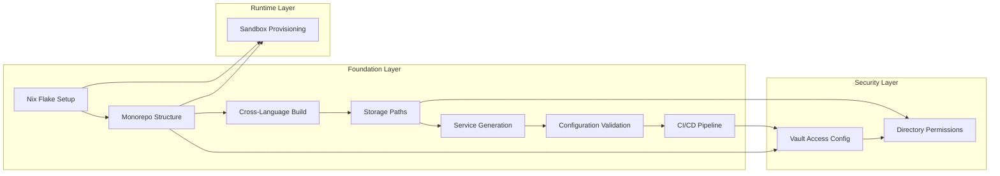
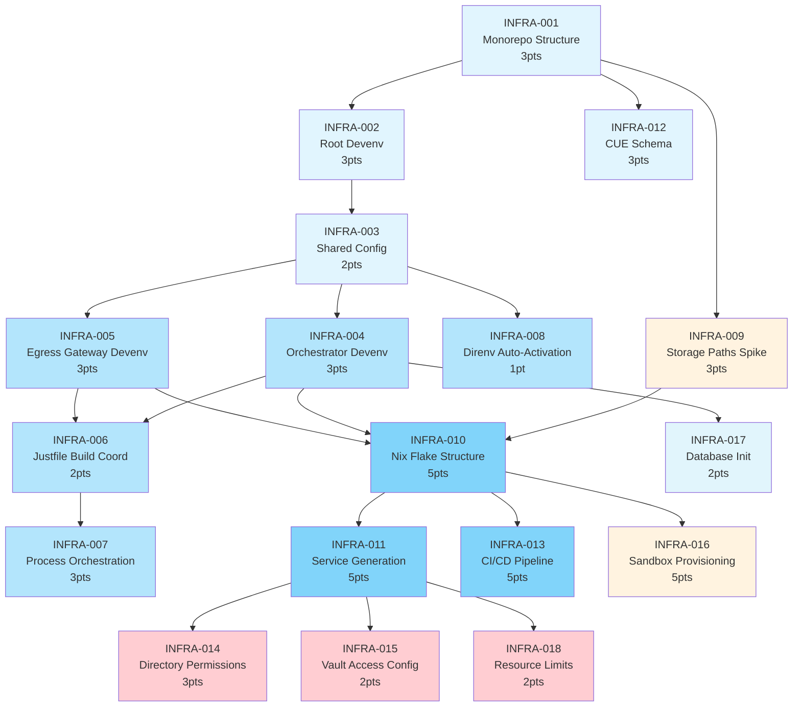

# Infrastructure Execution Plan

**Generated:** 2026-02-08  
**Role:** Technical Project Manager (Task Layer)  
**Scope:** Infrastructure Layer Only (Nix, Devenv, Storage, Service Management, Security)  
**Parent Documents:** TechSpec.md (Sections 5.1, 6, 9), Architecture.md (Layer -1), AGENTS.md

---

## Executive Summary

| Metric | Value |
|--------|-------|
| **Total Estimation** | 42 Story Points |
| **Critical Path** | INFRA-001 → INFRA-002 → INFRA-003 → INFRA-004 → INFRA-010 → INFRA-011 → INFRA-016 |
| **Epics** | 1 (Infrastructure Foundation) |
| **Spikes Required** | 2 (INFRA-009: Platform Storage Paths, INFRA-016: Sandbox Runtime Provisioning) |
| **Security Tickets** | 2 (INFRA-014, INFRA-015) |

---

## Project Phasing Strategy

### Phase 1: Core Infrastructure (MVP)

The following work establishes a functional, secure infrastructure foundation capable of running the OpenKraken Orchestrator and Egress Gateway as system services.

**Required for MVP:**
- Monorepo structure with devenv coordination (INFRA-001 through INFRA-008)
- Cross-language build system (INFRA-006)
- Platform-appropriate storage paths (INFRA-009)
- Nix flake structure and service generation (INFRA-010, INFRA-011)
- Sandbox runtime provisioning (INFRA-016)
- Configuration validation (INFRA-012)
- Directory permissions and security (INFRA-014, INFRA-015)
- CI/CD pipeline (INFRA-013)

**Blocking Dependencies:**
- INFRA-016 must complete before any agent execution testing
- INFRA-015 must complete before credential-dependent features work

### Phase 2: Post-MVP (Deferred)

| ID | Title | Rationale |
|----|-------|----------|
| INFRA-018 | Nix Channel Update Strategy | Maintenance item, defer to stable release |
| INFRA-019 | Garnix CI Integration | Advanced caching, not blocking MVP |
| INFRA-020 | Cross-Platform Testing Matrix | Extensive testing, defer until stable |
| INFRA-021 | SBOM Generation Pipeline | Compliance item, defer to post-MVP |
| INFRA-022 | Update Orchestration (Atomic Switchover) | Deployment refinement, defer |
| INFRA-023 | Container Development Environment | Docker/DevPod, not blocking core |

---

## Build Order (Dependency Graph)



---

## Critical Path Sequence

```
INFRA-001 (Monorepo Structure)
    ↓
INFRA-002 (Root Devenv)
    ↓
INFRA-003 (Shared Config)
    ↓
INFRA-004 (Orchestrator Devenv)
    ↓
INFRA-010 (Nix Flake Structure) ← INFRA-009 (Spike) feeds here
    ↓
INFRA-011 (Service Generation)
    ↓
INFRA-016 (Sandbox Runtime Provisioning) ← BLOCKS AGENT TESTING
```

**Total critical path duration:** ~2-3 days of focused work

---

## Risk Assessment

| Risk | Probability | Impact | Mitigation |
|------|-------------|--------|------------|
| Credential vault access failure | Medium | High | INFRA-015 addresses vault access configuration |
| Sandbox provisioning missing | Medium | High | INFRA-016 explicitly provisions runtime |
| Dev/prod parity issues | Low | High | Acceptance criteria enforce parity validation |
| Unix socket permission issues | Medium | Medium | INFRA-014 enhanced with socket permissions |
| Cross-platform build failures | Low | Medium | INFRA-010 includes cross-compilation checks |
| D-Bus availability on headless Linux | Medium | Medium | INFRA-015 includes secret-service fallback validation |

---

## The Ticket List

---

### INFRA-001: Monorepo Structure Initialization

**Type:** Chore  
**Effort:** 3  
**Dependencies:** None  
**Priority:** Critical (Foundation)

**Description:**  
Establish the root monorepo structure with `packages/`, `apps/`, `services/`, `skills/`, and `storage/` directories as specified in TechSpec Section 5.1. This creates the physical layout that all subsequent infrastructure work depends upon.

**Acceptance Criteria (Gherkin):**
```gherkin
Given an empty repository
When the monorepo structure is initialized
Then the following directory structure exists:
  | Path                        | Purpose                              |
  |-----------------------------|--------------------------------------|
  | /packages/orchestrator/     | Bun/TypeScript Orchestrator          |
  | /packages/egress-gateway/   | Go Egress Gateway binary             |
  | /apps/cli/                  | CLI tools (OpenTUI-based)           |
  | /apps/web-ui/               | SvelteKit Web UI                    |
  | /services/                  | Process orchestration definitions   |
  | /skills/system/             | Bundled system skills               |
  | /skills/owner/              | Owner-uploaded skills (gitignored)  |
  | /storage/                   | Runtime data (gitignored)           |
And the root contains:
  - devenv.yaml (devenv configuration)
  - devenv.nix (Nix dev environment)
  - flake.nix (Nix flake definition)
  - flake.lock (pinned dependencies)
  - .envrc (direnv auto-activation)
  - .gitignore (excludes storage/, skills/owner/)
And /storage/ contains subdirectories: data/, cache/, logs/, sandbox/, backups/
```

---

### INFRA-002: Root Devenv Configuration

**Type:** Chore  
**Effort:** 3  
**Dependencies:** INFRA-001  
**Priority:** Critical (Foundation)

**Description:**  
Configure root `devenv.yaml` and `devenv.nix` with shared packages, git hooks, and environment variables per TechSpec 5.1. This establishes the unified development environment contract.

**Acceptance Criteria (Gherkin):**
```gherkin
Given the monorepo structure exists
When devenv is initialized
Then devenv.yaml contains:
  - inputs.nixpkgs pointing to github:NixOS/nixpkgs/nixos-25.11
  - inputs.devenv pointing to github:cachix/devenv/latest
  - imports: [ /packages/shared/devenv.nix ]
And devenv.nix defines:
  | Category       | Items                                      |
  |----------------|-------------------------------------------|
  | packages       | git, jq, just, parallel, nix-tree       |
  | git-hooks      | nixpkgs-fmt.enable = true                |
  |                | typos.enable = true                      |
  | env variables  | OPENKRAKEN_ENV = "development"           |
  |                | OPENKRAKEN_HOME = "./storage"           |
  | scripts        | build.exec = "just build"               |
  |                | test.exec = "just test"                 |
  |                | lint.exec = "just lint"                 |
And running 'devenv test' passes without errors
And 'devenv info' displays the complete configuration
```

---

### INFRA-003: Shared Configuration Package

**Type:** Chore  
**Effort:** 2  
**Dependencies:** INFRA-002  
**Priority:** Critical (Foundation)

**Description:**  
Create `/packages/shared/devenv.nix` containing common devenv configuration shared across all packages. This ensures consistency and reduces duplication.

**Acceptance Criteria (Gherkin):**
```gherkin
Given the monorepo structure exists
When /packages/shared/devenv.nix is created
Then it exports the following configuration:
  | Category       | Configuration                            |
  |----------------|------------------------------------------|
  | packages       | git, jq, just, parallel, fd, ripgrep   |
  | git-hooks      | nixpkgs-fmt.enable = true               |
  |                | typos.enable = true                     |
  | env            | OPENKRAKEN_ENV = "development"          |
  |                | OPENKRAKEN_HOME = "./storage"          |
  | scripts        | build.exec = "just build"               |
  |                | test.exec = "just test"                |
  |                | lint.exec = "just lint"                |
And other package devenv.nix files can import it with:
  imports = [ ../shared/devenv.nix ]
And changes to shared config reflect in all packages after reload
```

---

### INFRA-004: Orchestrator Devenv Configuration

**Type:** Chore  
**Effort:** 3  
**Dependencies:** INFRA-003  
**Priority:** Critical (Orchestration)

**Description:**  
Configure `/packages/orchestrator/devenv.nix` with Bun runtime, TypeScript, SQLite development database, and development scripts per TechSpec 5.1.

**Acceptance Criteria (Gherkin):**
```gherkin
Given the shared configuration exists
When orchestrator devenv is configured
Then /packages/orchestrator/devenv.nix defines:
  | Category              | Configuration                            |
  |-----------------------|------------------------------------------|
  | imports               | [ ../shared/devenv.nix ]               |
  | languages.javascript  | package = pkgs.bun (version 1.3.8)     |
  | languages.typescript  | enable = true                          |
  | env                   | ORCHESTRATOR_PORT = "3000"             |
  |                       | DATABASE_PATH = "./storage/data/openkraken.db" |
  |                       | SANDBOX_PATH = "./storage/sandbox"     |
  | services              | sqlite.enable = true                   |
  | scripts               | dev.exec = "bun run src/main.ts"       |
  |                       | test.exec = "bun test"                 |
  |                       | migrate.exec = "bun run db:migrate"    |
  |                       | lint.exec = "biome lint src/"          |
  | processes.orchestrator | exec = "bun run src/main.ts"         |
  |                       | cwd = "packages/orchestrator"         |
And './storage/data/' directory is created on devenv enter
And './storage/data/openkraken.db' is initialized with schema
And 'devenv up' starts the orchestrator process on port 3000
```

---

### INFRA-005: Egress Gateway Devenv Configuration

**Type:** Chore  
**Effort:** 3  
**Dependencies:** INFRA-003  
**Priority:** Critical (Orchestration)

**Description:**  
Configure `/packages/egress-gateway/devenv.nix` with Go 1.25 runtime, environment variables, build scripts, and process definition per TechSpec 5.1.

**Acceptance Criteria (Gherkin):**
```gherkin
Given the shared configuration exists
When egress gateway devenv is configured
Then /packages/egress-gateway/devenv.nix defines:
  | Category              | Configuration                            |
  |-----------------------|------------------------------------------|
  | imports               | [ ../shared/devenv.nix ]               |
  | languages.go          | package = pkgs.go_1_25                 |
  |                       | version = "1.25.6"                      |
  | env                   | EGRESS_GATEWAY_PORT = "3001"           |
  |                       | EGRESS_SOCKET_PATH = "/tmp/openkraken-egress.sock" |
  | scripts               | build.exec = "go build -o ../../bin/egress-gateway ./src" |
  |                       | test.exec = "go test ./..."            |
  |                       | run.exec = "go run ./src"              |
  | processes.egress-gateway | exec = "go run ./src"               |
  |                       | cwd = "packages/egress-gateway"        |
And 'cd packages/egress-gateway && go mod tidy' succeeds
And 'cd packages/egress-gateway && go build ./src' produces working binary
And 'devenv up' starts egress-gateway process
```

---

### INFRA-006: Cross-Language Build Coordination (Justfile)

**Type:** Chore  
**Effort:** 2  
**Dependencies:** INFRA-004, INFRA-005  
**Priority:** Critical (Build)

**Description:**  
Create root `Justfile` with tasks for building both TypeScript (Bun) and Go packages, coordinating output paths and ensuring consistent build experience.

**Acceptance Criteria (Gherkin):**
```gherkin
Given both orchestrator and egress-gateway packages are configured
When 'just build' is executed
Then it builds:
  | Command                          | Output                        |
  |----------------------------------|-------------------------------|
  | cd packages/orchestrator &&      | bin/openkraken               |
  | bun build --compile              | (compiled TypeScript)        |
  | --outfile ../../bin/openkraken  |                              |
  | cd packages/egress-gateway &&    | bin/egress-gateway           |
  | go build -o ../../bin/egress-gateway | (Go binary)              |
And both binaries exist in /bin/ directory
And 'just test' runs tests for both packages:
  | Package         | Test Command              |
  |-----------------|--------------------------|
  | orchestrator    | bun test                |
  | egress-gateway  | go test ./...           |
And 'just lint' runs linters for both packages
And 'just clean' removes /bin/ directory contents
```

---

### INFRA-007: Process Orchestration (Services)

**Type:** Chore  
**Effort:** 3  
**Dependencies:** INFRA-004, INFRA-005  
**Priority:** Critical (Orchestration)

**Description:**  
Configure `services/local-development.nix` with process orchestration ensuring egress-gateway starts before orchestrator and proper startup order is maintained.

**Acceptance Criteria (Gherkin):**
```gherkin
Given both orchestrator and egress-gateway processes are defined
When 'devenv up' is executed
Then the following startup sequence occurs:
  | Order | Process           | Port/Socket        | Healthy Signal          |
  |-------|-------------------|--------------------|-------------------------|
  | 1     | egress-gateway   | 3001 (HTTP)        | GET /health returns 200 |
  |       |                   | /tmp/openkraken-   | Socket file exists      |
  |       |                   | egress.sock        |                         |
  | 2     | orchestrator     | 3000 (HTTP)        | GET /health returns 200 |
And both processes run concurrently after startup
And Ctrl+C terminates both gracefully with SIGINT handling
And 'devenv processes' shows both processes as running
And orchestrator can connect to egress-gateway socket
```

---

### INFRA-008: Direnv Auto-Activation

**Type:** Chore  
**Effort:** 1  
**Dependencies:** INFRA-002  
**Priority:** Medium (Developer Experience)

**Description:**  
Create `.envrc` for automatic devenv activation on directory entry, providing seamless developer experience without manual shell activation.

**Acceptance Criteria (Gherkin):**
```gherkin
Given the root .envrc file is created with: use devenv
When 'cd' into the repository
Then devenv auto-activates within 2 seconds
And shell prompt shows '(devenv)' indicator
And environment variables from devenv.nix are available
And 'direnv allow' is required only on first activation
And 'watch_file' monitors: devenv.nix, devenv.yaml, devenv.lock
And modifying a watched file triggers automatic reload
And 'direnv status' shows: "Loaded"
```

---

### INFRA-009: Platform Storage Path Abstraction (SPIKE)

**Type:** Spike  
**Effort:** 3  
**Dependencies:** INFRA-001  
**Priority:** Critical (Foundation)

**Description:**  
Research and implement platform-appropriate storage path resolution for Linux vs macOS as documented in Architecture.md Layer -1. Spike time is allocated for investigation and validation of platform detection patterns.

**Acceptance Criteria (Gherkin):**
```gherkin
Given the platform detection logic is implemented
When Orchestrator starts on Linux (NixOS, generic Linux)
Then OPENKRAKEN_HOME defaults to: /var/lib/openkraken
And OPENKRAKEN_CONFIG defaults to: /etc/openkraken/config.yaml
And /var/log/openkraken/ exists with permissions 750
And /var/cache/openkraken/ exists with permissions 755
And $XDG_CONFIG_HOME, $XDG_DATA_HOME are respected if set
When Orchestrator starts on macOS
Then OPENKRAKEN_HOME defaults to: ~/Library/Application Support/Openkraken
And OPENKRAKEN_CONFIG defaults to: ~/Library/Application Support/Openkraken/config.yaml
And ~/Library/Logs/Openkraken/ exists with permissions 755
And ~/Library/Caches/OpenKraken/ exists with permissions 755
And platform-specific paths use proper tilde expansion
When OPENKRAKEN_HOME is explicitly set
Then it overrides all platform defaults
And subdirectories are created relative to that path
```

**Research Requirements:**
- [ ] Verify Linux standard paths (FHS compliance)
- [ ] Verify macOS Cocoa paths (NSSearchPathDirectory)
- [ ] Test headless Linux (no desktop environment) scenarios
- [ ] Validate D-Bus availability for secret-service on Linux

---

### INFRA-010: Nix Flake Structure

**Type:** Chore  
**Effort:** 5  
**Dependencies:** INFRA-004, INFRA-005, INFRA-009  
**Priority:** Critical (Nix Foundation)

**Description:**  
Create `flake.nix` with cross-platform package definitions, devShells, and NixOS/darwin modules per TechSpec Section 9.1. This enables reproducible builds and deployment.

**Acceptance Criteria (Gherkin):**
```gherkin
Given the flake.nix is created with proper structure
When evaluated on any supported system
Then it exports:
  | Output Attribute            | Contents                                   |
  |-----------------------------|-------------------------------------------|
  | packages.x86_64-linux.      | Built openkraken-orchestrator binary      |
  | openkraken-orchestrator    |                                           |
  | packages.x86_64-linux.      | Built openkraken-gateway binary           |
  | openkraken-gateway         |                                           |
  | packages.aarch64-linux.     | Built for ARM64 Linux                     |
  | packages.*                 | Same for aarch64-darwin (M-series Mac)   |
  | devShells.default          | Development shell with all dependencies  |
  | nixosModules.openkraken    | NixOS module for Linux deployment        |
  | darwinModules.openkraken   | Darwin module for macOS deployment       |
And 'nix build .#packages.x86_64-linux.openkraken-orchestrator' succeeds
And 'nix build .#packages.aarch64-darwin.openkraken-gateway' succeeds (cross-compiled)
And flake.lock is generated with pinned GitHub commits for all inputs
And flake check passes without warnings
And devShell includes: bun, go_1_25, nix, direnv
```

---

### INFRA-011: Service Generation (systemd/launchd)

**Type:** Chore  
**Effort:** 5  
**Dependencies:** INFRA-010  
**Priority:** Critical (Deployment)

**Description:**  
Implement Nix modules for generating systemd (Linux) and launchd (macOS) service configurations from unified specification. This automates service installation and lifecycle management.

**Acceptance Criteria (Gherkin):**
```gherkin
Given the Nix module is configured for Linux (NixOS)
When deployed via nixos-install
Then /etc/systemd/system/openkraken-orchestrator.service exists:
  | Setting              | Value                                   |
  |----------------------|----------------------------------------|
  | Description          | OpenKraken Orchestrator                |
  | User                 | openkraken                             |
  | Group                | openkraken                             |
  | Environment          | OPENKRAKEN_HOME=/var/lib/openkraken   |
  |                      | OPENKRAKEN_CONFIG=/etc/openkraken/    |
  |                      | config.yaml                           |
  | ExecStart            | /nix/store/*-openkraken-orchestrator/ |
  |                      | bin/openkraken                        |
  | Restart              | always                                 |
  | RestartSec           | 10                                     |
  | After                | network.target                         |
  | WantedBy             | multi-user.target                      |
And /etc/systemd/system/openkraken-egress-gateway.service exists with:
  | Setting              | Value                                   |
  |----------------------|----------------------------------------|
  | User                 | openkraken                             |
  | ExecStart            | /nix/store/*-openkraken-gateway/bin/   |
  |                      | egress-gateway                        |
  | Restart              | always                                 |
And both services are enabled: systemctl enable openkraken-*
When deployed on macOS via nix-darwin
Then ~/Library/LaunchAgents/com.openkraken.orchestrator.plist exists:
  | Key                 | Value                                   |
  |---------------------|----------------------------------------|
  | Label              | com.openkraken.orchestrator           |
  | ProgramArguments   | /nix/store/*/bin/openkraken           |
  | EnvironmentVariables | OPENKRAKEN_HOME: "~/Library/Application |
  |                     | Support/Openkraken"                   |
  | RunAtLoad          | true                                   |
  | KeepAlive          | true                                   |
And ~/Library/LaunchAgents/com.openkraken.egress-gateway.plist exists
And both plists have correct permissions: 644
```

---

### INFRA-012: CUE Configuration Schema

**Type:** Chore  
**Effort:** 3  
**Dependencies:** INFRA-001  
**Priority:** Medium (Configuration)

**Description:**  
Create `nix/schema/config.cue` with CUE validation schema for config.yaml as specified in TechSpec Section 6.3. This provides build-time and runtime configuration validation.

**Acceptance Criteria (Gherkin):**
```gherkin
Given the CUE schema is created at nix/schema/config.cue
When 'cue vet -c schema/config.cue config.yaml' is run on a valid config
Then exit code is 0 (validation passes)
When run on an invalid config
Then exit code is non-zero
And output shows clear error messages with:
  | Error Component | Example Output                          |
  |-----------------|----------------------------------------|
  | Field path     | config.yaml:42:15                      |
  | Value conflict | conflicting values "abc" and int       |
  | Type mismatch  | mismatched types string and int        |
  | Required field | missing required field: version        |
And schema validates:
  | Field              | Validation Rule                        |
  |--------------------|---------------------------------------|
  | version            | "1.0" (exact string)                 |
  | orchestrator.port  | int & >=1024 & <=65535               |
  | sandbox.enabled   | bool                                  |
  | egressGateway.     |                                       |
  | allowlist.ttlSeconds | int & >=60                          |
  | storage.backup.   |                                       |
  | retentionDays     | int & >=1 & <=365                    |
And 'nix build .#check' (if defined) runs CUE validation during build
And schema.cue file is well-formed and documented with comments
```

---

### INFRA-013: CI/CD Pipeline (GitHub Actions)

**Type:** Chore  
**Effort:** 5  
**Dependencies:** INFRA-006, INFRA-010  
**Priority:** Medium (Automation)

**Description:**  
Create GitHub Actions workflow for Nix-first CI with Cachix binary caching per TechSpec Section 9.3. This ensures reproducible builds and caching across development and CI.

**Acceptance Criteria (Gherkin):**
```gherkin
Given the GitHub Actions workflow is created at .github/workflows/ci.yml
When a PR is opened to main branch
Then the workflow:
  | Step                    | Action                                  |
  |-------------------------|----------------------------------------|
  | Checkout               | actions/checkout@v4 with fetch-depth: 0|
  | Install Nix            | cachix/install-nix-action@v31         |
  |                        | with: nix_path=nixpkgs=channel:nixos-25.11 |
  |                        | extra_nix_config: experimental-features=nix-command flakes |
  | Cache Nix Store       | actions/cache@v4                      |
  |                        | key: nix-${{ runner.os }}-${{ hashFiles('flake.lock') }} |
  | Setup Cachix          | cachix/cachix-action@v16             |
  |                        | authToken: ${{ secrets.CACHIX_AUTH_TOKEN }} |
  | Build Orchestrator    | nix build .#packages.${{ runner.hostArch }}-linux.openkraken-orchestrator |
  | Build Gateway         | nix build .#packages.${{ runner.hostArch }}-linux.openkraken-gateway |
  | Run Devenv Tests      | devenv test --no-cached              |
  | Generate SBOM         | nix run .#sbom                        |
  | Upload Artifacts     | actions/upload-artifact@v4 with retention-days: 90 |
When pushed to main branch
Then 'nix copy --to cachix://openkraken result' pushes to Cachix
And CI runs on both: ubuntu-latest, macos-latest
And matrix builds include: x86_64-linux, aarch64-darwin
And workflow_dispatch allows manual triggering
```

---

### INFRA-014: Directory Permissions & Security

**Type:** Security  
**Effort:** 3  
**Dependencies:** INFRA-011  
**Priority:** Critical (Security)

**Description:**  
Implement secure directory permission setup for storage, logs, and runtime directories per Security Specification. This ensures data isolation and prevents unauthorized access.

**Acceptance Criteria (Gherkin):**
```gherkin
Given the service installation completes on Linux
When directory permissions are checked
Then /var/lib/openkraken/ has permissions 700 (openkraken:openkraken)
And /var/log/openkraken/ has permissions 750 (openkraken:openkraken)
And /var/cache/openkraken/ has permissions 755 (openkraken:openkraken)
And /etc/openkraken/ has permissions 640 (root:openkraken)
And openkraken.db has permissions 600 (openkraken:openkraken)
And unauthorized users (non-openkraken, non-root) cannot:
  | Action                    | Result                                 |
  |---------------------------|----------------------------------------|
  | Read /var/lib/openkraken/ | Permission denied                      |
  | Read /var/log/openkraken/ | Permission denied                      |
  | Read openkraken.db        | Permission denied                      |
When the egress gateway socket is checked
Then /tmp/openkraken-egress.sock exists with permissions 0660
And orchestrator user is in the openkraken group
And connection from orchestrator to socket succeeds
When service installation completes on macOS
Then ~/Library/Application Support/Openkraken/ has permissions 700
And ~/Library/Logs/Openkraken/ has permissions 755
And ~/Library/Caches/OpenKraken/ has permissions 755
And unauthorized users cannot read credentials or database
And socket file has permissions 0660
```

---

### INFRA-015: Credential Vault Access Configuration

**Type:** Security  
**Effort:** 2  
**Dependencies:** INFRA-011  
**Priority:** Critical (Runtime Security)

**Description:**  
Configure vault access permissions for the service user to enable seamless credential retrieval without manual authentication. This includes D-Bus access for secret-service on Linux and Keychain configuration on macOS.

**Acceptance Criteria (Gherkin):**
```gherkin
Given the service installation completes on Linux
When credential retrieval is attempted
Then secret-service (D-Bus) access is configured for openkraken user
And 'sudo -u openkraken secret-tool lookup openkraken test' succeeds
And /etc/dbus-1/system.d/org.freedesktop.secrets.conf allows openkraken access
And headless Linux servers fall back to age-encrypted credential file
And credentials.enc at $OPENKRAKEN_HOME/credentials.enc has permissions 600
And decryption of credentials.enc succeeds with vault-stored master key
When the secret-service is unavailable
Then the CredentialVault abstraction falls back to age-encrypted file
And WARNING is logged: "secret-service unavailable, using encrypted file fallback"
And all credential retrieval operations succeed using fallback
When service installation completes on macOS
Then Keychain access is configured for the application
And 'openkraken' Keychain item exists with kSecAttrAccessGroup set
And credentials can be retrieved without GUI prompts (item-level access)
And Keychain item has kSecAttrAccessible: whenUnlockedThisDeviceOnly
```

---

### INFRA-016: Sandbox Runtime Provisioning (SPIKE)

**Type:** Spike  
**Effort:** 5  
**Dependencies:** INFRA-010  
**Priority:** Critical (Runtime Dependency)

**Description:**  
Configure Nix to provision Anthropic Sandbox Runtime dependencies including bubblewrap on Linux, seatbelt profiles on macOS, and seccomp configurations. Spike time allocated for cross-platform testing.

**Acceptance Criteria (Gherkin):**
```gherkin
Given Nix provisioning is configured
When building for Linux (x86_64 or aarch64)
Then bubblewrap binary is available in PATH:
  | Command                          | Expected Output                      |
  |----------------------------------|-------------------------------------|
  | bubblewrap --version             | Version 0.8.0+                       |
  | bubblewrap --help                | Shows usage information             |
And seccomp profiles exist at /etc/openkraken/seccomp/:
  | Profile           | Purpose                              |
  |-------------------|-------------------------------------|
  | default.json      | Base syscall restrictions           |
  | browser.json      | Browser automation syscalls         |
  | terminal.json     | Terminal command syscalls           |
And bubblewrap can be invoked without root:
  | Command                    | Result                              |
  |-----------------------------|------------------------------------|
  | bubblewrap --unshare-net    | Creates network namespace          |
  | bubblewrap --bind /tmp /tmp | Creates bind mount                 |
And seccomp profiles are valid JSON:
  | Command               | Result                             |
  |-----------------------|------------------------------------|
  | jq . /etc/openkraken/ | Validates profile syntax           |
  | seccomp-tools dump    | Shows syscall table               |
When building for macOS
Then sandbox-exec profile exists at /etc/openkraken/seccomp/
And seatbelt profile allows:
  | Operation              | Policy                             |
  |------------------------|------------------------------------|
  | file-read              | Restricted to sandbox zones       |
  | file-write             | Restricted to work/output zones    |
  | network-outbound       | Proxy via localhost:1080           |
  | process-fork           | Allowed                            |
  | shell-exec             | Allowed with restrictions          |
And sandbox-exec can invoke the profile:
  | Command                              | Result                           |
  |--------------------------------------|----------------------------------|
  | sandbox-exec -f /etc/openkraken/     | Profile loads without error      |
  | seccomp/profile.sb /bin/ls           | Command executes in sandbox     |
And when Orchestrator invokes sandbox
Then bubblewrap or sandbox-exec command executes successfully
And sandbox zones are mounted correctly:
  | Zone         | Permissions                          |
  |--------------|-------------------------------------|
  | skills/      | Read-only bind mount                |
  | inputs/      | Read-only bind mount               |
  | work/        | Read-write, ephemeral               |
  | outputs/     | Read-write, ephemeral               |
```

---

### INFRA-017: Development Database Initialization

**Type:** Chore  
**Effort:** 2  
**Dependencies:** INFRA-004  
**Priority:** Medium (Developer Experience)

**Description:**  
Ensure the development database is automatically initialized with proper schema and WAL mode when entering the devenv environment.

**Acceptance Criteria (Gherkin):**
```gherkin
Given the orchestrator package is configured
When the development environment starts
Then ./storage/data/ directory is created if missing
And ./storage/data/openkraken.db is created if missing:
  | PRAGMA Setting          | Value                              |
  |-------------------------|-------------------------------------|
  | journal_mode            | WAL                                 |
  | synchronous             | NORMAL                              |
  | busy_timeout            | 5000                                |
And schema migrations are applied in order:
  | Migration               | Purpose                             |
  |-------------------------|-------------------------------------|
  | 001_initial_schema.sql  | Create all base tables             |
  | 002_add_encrypted_      | Add encrypted content columns      |
  | fields.sql              |                                    |
  | 003_add_skills_tables.sql | Add skills pipeline tables        |
And 'bun run db:migrate' applies any pending migrations
And 'bun run db:status' shows current migration version
And 'bun run db:rollback' is not available (forward-only migrations)
```

---

### INFRA-018: Resource Limits (ulimits)

**Type:** Chore  
**Effort:** 2  
**Dependencies:** INFRA-011  
**Priority:** Medium (Stability)

**Description:**  
Configure systemd service files with appropriate resource limits (file descriptors, memory, CPU) to ensure stable operation under load.

**Acceptance Criteria (Gherkin):**
```gherkin
Given the systemd service configuration is deployed
When resource limits are checked
Then orchestrator service has:
  | Setting              | Value                                   |
  |----------------------|----------------------------------------|
  | NoFile               | 8192                                   |
  | MemoryMax            | 2G                                     |
  | MemoryHigh           | 1.5G                                   |
  | CPUQuota             | 80%                                    |
  | TimeoutStartSec      | 60                                     |
  | TimeoutStopSec       | 30                                     |
And egress-gateway service has:
  | Setting              | Value                                   |
  |----------------------|----------------------------------------|
  | NoFile               | 8192                                   |
  | MemoryMax            | 1G                                     |
  | MemoryHigh           | 800M                                   |
  | CPUQuota             | 50%                                    |
When 'systemctl show openkraken-orchestrator' is run
Then all Limit* settings match configuration
And 'cat /proc/$(pgrep openkraken)/limits' shows correct values
When on macOS
Then launchd plist includes:
  | Key                 | Value                                   |
  |---------------------|----------------------------------------|
  | HardResourceLimits  | NumberOfFiles: 8192                   |
  |                     | MemorySize: 2147483648                 |
  | SoftResourceLimits  | NumberOfFiles: 8192                   |
  |                     | MemorySize: 2147483648                 |
```

---

## Infrastructure Dependencies Summary



---

## Verification Checklist

Before considering Infrastructure complete:

### Foundation Verification
- [ ] INFRA-001: All required directories exist with correct structure
- [ ] INFRA-002: devenv.yaml imports shared config, git hooks active
- [ ] INFRA-003: Shared config imported by all packages
- [ ] INFRA-004: Bun builds TypeScript, SQLite available
- [ ] INFRA-005: Go builds egress-gateway binary
- [ ] INFRA-006: just build creates both binaries in /bin/
- [ ] INFRA-007: devenv up starts gateway → orchestrator
- [ ] INFRA-008: direnv allow activates on cd

### Platform Verification
- [ ] INFRA-009: Platform paths resolve correctly (Linux/macOS)
- [ ] INFRA-010: nix build succeeds for all platforms
- [ ] INFRA-011: Service files generated for systemd/launchd
- [ ] INFRA-013: GitHub Actions workflow runs successfully

### Security Verification
- [ ] INFRA-014: Directory permissions are secure (700/750/600)
- [ ] INFRA-015: Credential vault access works without prompts
- [ ] INFRA-016: Sandbox runtime (bubblewrap/seatbelt) provisions correctly
- [ ] INFRA-018: ulimits configured for production stability

### Configuration & Database Verification
- [ ] INFRA-012: CUE schema validates config
- [ ] INFRA-017: Database initializes with proper WAL mode

---

## Ticket Summary by Priority

### Critical (Must Complete Before Agent Testing)
| ID | Title | Points | Dependencies |
|----|-------|--------|--------------|
| INFRA-001 | Monorepo Structure | 3 | None |
| INFRA-002 | Root Devenv | 3 | INFRA-001 |
| INFRA-003 | Shared Config | 2 | INFRA-002 |
| INFRA-004 | Orchestrator Devenv | 3 | INFRA-003 |
| INFRA-010 | Nix Flake Structure | 5 | INFRA-004, INFRA-005, INFRA-009 |
| INFRA-011 | Service Generation | 5 | INFRA-010 |
| INFRA-016 | Sandbox Provisioning | 5 | INFRA-010 |

### High (Required for Production)
| ID | Title | Points | Dependencies |
|----|-------|--------|--------------|
| INFRA-005 | Egress Gateway Devenv | 3 | INFRA-003 |
| INFRA-006 | Cross-Language Build | 2 | INFRA-004, INFRA-005 |
| INFRA-007 | Process Orchestration | 3 | INFRA-004, INFRA-005 |
| INFRA-009 | Storage Paths Spike | 3 | INFRA-001 |
| INFRA-014 | Directory Permissions | 3 | INFRA-011 |
| INFRA-015 | Vault Access Config | 2 | INFRA-011 |

### Medium (Developer Experience & Automation)
| ID | Title | Points | Dependencies |
|----|-------|--------|--------------|
| INFRA-008 | Direnv Auto-Activation | 1 | INFRA-002 |
| INFRA-012 | CUE Schema | 3 | INFRA-001 |
| INFRA-013 | CI/CD Pipeline | 5 | INFRA-006, INFRA-010 |
| INFRA-017 | Database Init | 2 | INFRA-004 |
| INFRA-018 | Resource Limits | 2 | INFRA-011 |

---

## Total Estimation

| Priority | Tickets | Points |
|----------|---------|--------|
| Critical | 7 | 24 |
| High | 6 | 12 |
| Medium | 5 | 6 |
| **Total** | **18** | **42** |

---

## Next Steps

1. **Begin with INFRA-001** to establish monorepo structure
2. **Schedule INFRA-009** (Storage Paths Spike) early in the sprint
3. **Complete INFRA-016** (Sandbox Provisioning) before any agent execution testing
4. **Validate security tickets** (INFRA-014, INFRA-015) before deployment

---

*Generated by Technical Project Manager (Task Layer)*  
*Document Version: 1.0*  
*Date: 2026-02-08*
