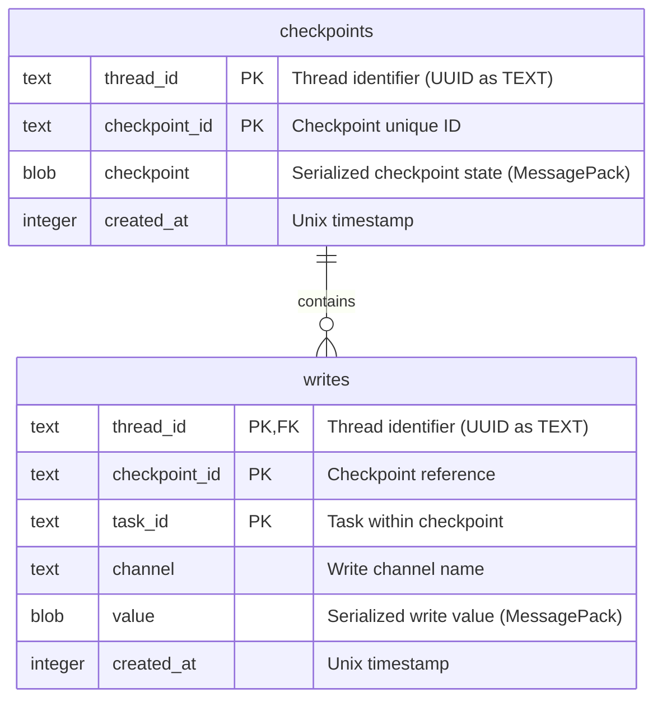
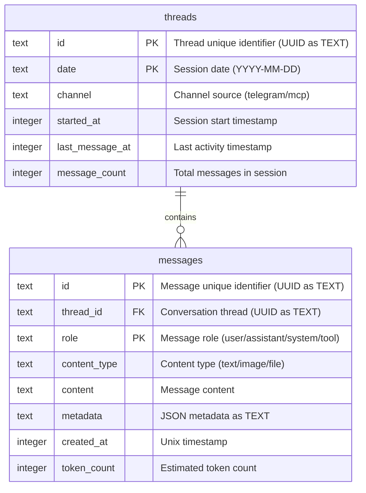
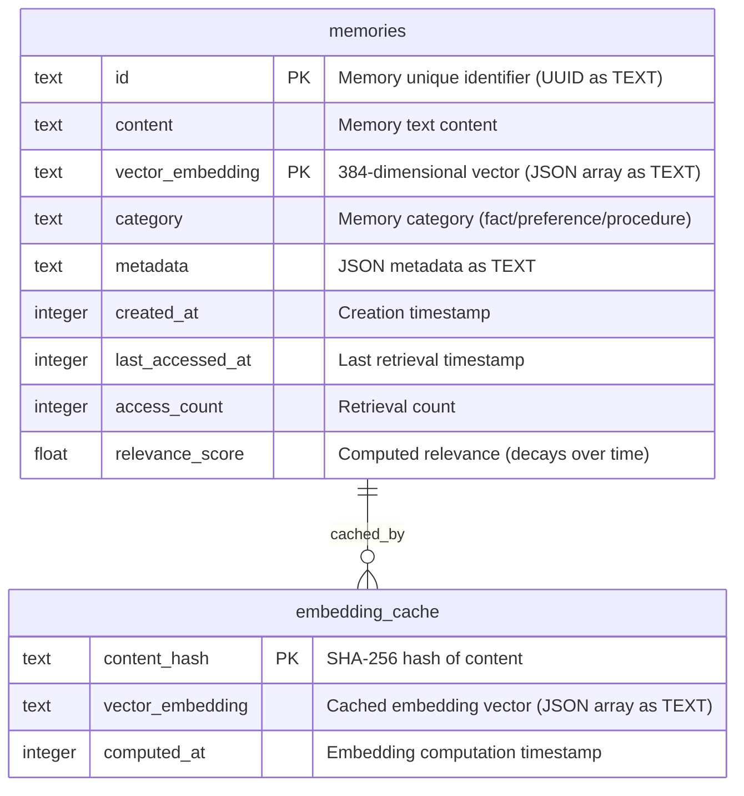
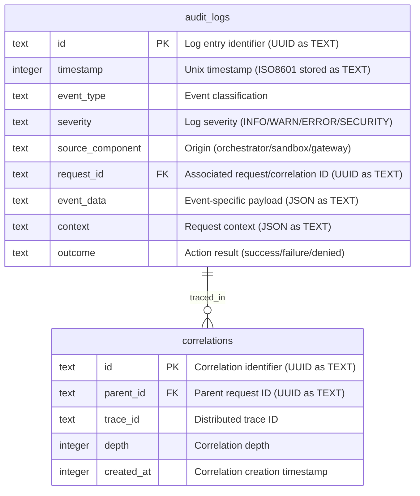
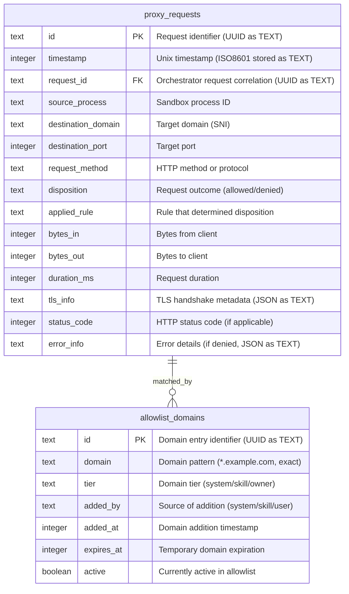

# TechSpec.md: RealClaw Technical Specification

**Document Version:** 1.0.0  
**Generated:** 2026-02-04  
**Architecture Reference:** ARCHITECTURE.md (v0.11.0)  
**Classification:** Internal Technical Document  

---

## 1. Stack Specification

This section defines the concrete technology stack for RealClaw, specifying exact versions to ensure reproducibility and prevent supply chain attacks. All dependencies are pinned to specific versions; deviations require explicit architectural review and ADR documentation.

### 1.1 Core Runtime and Language

| Component | Version | Justification |
|-----------|---------|---------------|
| **Bun Runtime** | 1.3.8 | Latest stable as of February 2026. Provides native SQLite support, TypeScript compilation, and superior cold-start performance compared to Node.js. Verified Node.js API compatibility (~95% coverage). |
| **TypeScript** | 5.9.3 (bundled with Bun) | Strict type checking enabled. All source code written in TypeScript with strict mode activated. |
| **Node.js Compatibility** | 20.x LTS (runtime detection only) | Required for packages lacking Bun native support. Bun automatically handles Node.js compatibility layer. |
| **SQLite** | 3.x (bundled with Bun runtime) | Native SQLite support via Bun.sqlite module. Provides durable state persistence with Write-Ahead Logging (WAL) mode. Zero-configuration persistence. |

### 1.2 Agent Orchestration Framework

| Component | Version | Justification |
|-----------|---------|---------------|
| **LangChain.js** | 1.2.17 (bindings) / 1.1.19 (core) | Stable v1 API with TypeScript bindings. Provides canonical `createAgent()` entry point. Extensive middleware ecosystem. Production-ready with active maintenance. Core library (@langchain/core) at 1.1.19 provides base abstractions. |
| **LangGraph.js** | 1.1.2 | Stateful workflow management. Enables checkpoint persistence and state rollback. Used as peer dependency by LangChain bindings. |
| **@langchain/mcp-adapters** | 1.1.2 | Model Context Protocol integration. Handles connection lifecycle and capability negotiation transparently. |

### 1.3 Protocol and Integration Libraries

| Component | Version | Justification |
|-----------|---------|---------------|
| **grammY** | 1.39.3 | Supports Telegram Bot API 9.3 (December 2025 release). Type-safe Telegram protocol handling with webhook verification built-in. |
| **@anthropic-ai/sandbox-runtime** | 0.0.35 | Cross-platform process isolation using bubblewrap (Linux) and sandbox-exec (macOS). Unified configuration interface across platforms. Beta Research Preview—pins to specific version. |
| **Vercel Agent Browser** | 0.9.0 | Headless browser automation with CDP protocol support. Isolated profiles per session with proxy enforcement. |

### 1.4 Data Persistence

| Component | Version | Justification |
|-----------|---------|---------------|
| **SQLite** | 3.x (bundled with Bun runtime) | Native SQLite via Bun.sqlite module. Write-Ahead Logging (WAL) mode for concurrent access. Zero-configuration persistence. |

### 1.5 Infrastructure and Build

| Component | Version | Justification |
|-----------|---------|---------------|
| **Nix** | 2.24.x (latest stable) | Reproducible builds via Nix Flakes. Cross-platform package management. |
| **NixOS Modules** | 24.11 (channel) | Declarative system configuration. Generates systemd units (Linux) and launchd plists (macOS). |
| **Egress Gateway** | Go 1.25.6 | Systems programming language for network proxy. Selected for faster implementation velocity, simpler concurrency (goroutines), and mature HTTP CONNECT proxy ecosystem. |

### 1.6 Dependency Management Strategy

All dependencies declared in `package.json` with exact semver ranges. The build process pins transitive dependencies via `bun.lockb` to prevent dependency confusion attacks. No `*` or `^` prefixes permitted in production dependencies. DevDependencies may use `^` for tooling flexibility but require periodic review.

---

## 2. Architecture Decision Records

The following ADRs document critical architectural decisions. Each record follows the standard format: Title, Context, Decision, and Consequences.

### ADR-001: Bun Runtime over Node.js

**Title:** Bun Runtime v1.3.8 for Orchestrator Implementation

**Context:**
The architecture requires a high-performance runtime for the Orchestrator component. Node.js has been the traditional choice for TypeScript server applications, but Bun offers superior cold-start performance, native TypeScript compilation, and bundled SQLite support. The evaluation considered runtime maturity, package ecosystem compatibility, and operational reliability.

**Decision:**
The Orchestrator runs on Bun 1.3.8 rather than Node.js. Bun provides native SQLite integration through the `bun:sqlite` module, eliminating external database driver dependencies. TypeScript compilation occurs at runtime, reducing build pipeline complexity. Performance benchmarks indicate 3-5x faster cold starts compared to Node.js 20.x LTS.

**Consequences:**
- **Positive:** Reduced startup latency for scheduled tasks and session initialization. Native SQLite eliminates driver compatibility concerns. Simplified deployment—no TypeScript compilation step required in production.
- **Negative:** ~5% of npm packages lack Bun native support, requiring Node.js compatibility layer. Some packages may exhibit unexpected behavior in Bun's JavaScriptCore runtime. Team must monitor Bun ecosystem maturity.
- **Mitigation:** Runtime includes automatic Node.js compatibility detection. Packages with known incompatibilities documented in `BUN_COMPAT.md`. CI/CD validates all package installations on Bun before deployment.

### ADR-002: SQLite with WAL Mode for All Persistent State

**Title:** Unified SQLite Persistence Strategy

**Context:**
The architecture defines five distinct persistence requirements: LangGraph checkpoints, message logs, semantic memory, audit logs, and proxy access logs. Each could theoretically use different storage backends. However, unified persistence simplifies backup operations, reduces operational complexity, and ensures ACID guarantees across related data.

**Decision:**
All persistent state uses SQLite databases with Write-Ahead Logging (WAL) mode enabled via `PRAGMA journal_mode = WAL`. Each data type maps to a dedicated database file for isolation: `checkpoints.db` (agent state), `messages.db` (conversation history), `memory.db` (semantic memories), `audit.db` (security events), and `proxy.db` (network access logs). WAL mode enables concurrent reads while maintaining durability.

**Consequences:**
- **Positive:** Single backup/restore mechanism for all data using Bun's `db.serialize()` API. ACID transactions across related tables within each database. WAL mode prevents writer starvation during read-heavy workloads. Bun's native module eliminates external driver dependencies.
- **Negative:** SQLite's write throughput limits apply (typically 60-100 MB/s sequential). Synchronous API means blocking calls (acceptable for local I/O). Database file corruption possible on system crashes (mitigated by WAL mode and regular integrity checks).
- **Mitigation:** Daily automated backups using Bun's `db.serialize()` to Buffer then file write. 7-day retention with compressed archives. Integrity checks during backup using `PRAGMA integrity_check`. Owner recovery commands available. Monitor database size and implement cleanup policies for audit and proxy logs.

### ADR-003: Egress Gateway Implementation Language

**Title:** Go 1.25.6 for Egress Gateway

**Context:**
The Egress Gateway requires systems programming for HTTP CONNECT proxy implementation with high throughput and low latency. Both Go 1.25.6 and Rust 1.93.0 provide suitable runtime characteristics. Go offers simpler concurrency (goroutines) and mature HTTP proxy libraries. Rust provides memory safety guarantees and potentially superior performance but requires more complex error handling.

**Decision:**
**Go 1.25.6.** The Egress Gateway is implemented as a Go binary. Go is selected for faster implementation velocity, simpler concurrency model via goroutines, mature HTTP CONNECT proxy ecosystem (e.g., golang.org/x/net/proxy), and existing team expertise. Performance is sufficient for single-tenant personal agent workloads.

**Consequences:**
- **Positive:** Faster implementation. Simpler error handling. Mature HTTP proxy libraries. Easier debugging with standard Go tools.
- **Negative:** No memory safety guarantees at compile time (mitigated by Go's GC and race detector). Lower performance ceiling than Rust (acceptable for single-tenant workload).
- **Mitigation:** Comprehensive test coverage including race conditions. Static analysis with golangci-lint. Memory profiling in development.

### ADR-004: LangGraph SqliteCheckpointer for State Persistence

**Title:** LangGraph SqliteCheckpointer for Durable Agent State

**Context:**
Agent state must survive Orchestrator restarts without data loss. LangGraph provides multiple checkpointer implementations (Memory, SQLite, Redis). Memory checkpointer loses state on restart. Redis requires external infrastructure. SQLite provides durable persistence without additional dependencies.

**Decision:**
The Orchestrator uses LangGraph's `SqliteCheckpointer` for all agent state persistence. The checkpointer stores state in `checkpoints.db` using a two-table schema: `checkpoints` (state snapshots) and `writes` (intermediate state modifications). WAL mode ensures concurrent access during normal operation.

**Consequences:**
- **Positive:** Zero additional infrastructure. State survives restarts automatically. LangGraph handles checkpoint serialization/deserialization. Supports state rollback for debugging.
- **Negative:** Checkpoint size grows with conversation history. Requires periodic cleanup or truncation. SqliteCheckpointer may not support all LangGraph advanced features (verified compatible with v1.1.3).
- **Mitigation:** Implement checkpoint size limits (configurable, default 10MB). Provide manual checkpoint cleanup commands. Monitor checkpoint growth rate.

### ADR-005: OS-Level Credential Vaults

**Title:** Credential Storage in Platform-Native Vaults

**Context:**
Credentials must never be exposed to the Agent or written to persistent storage. OpenClaw stored API keys in plaintext files, enabling credential exfiltration through prompt injection. The architecture requires runtime credential retrieval from secure storage.

**Decision:**
Credentials retrieved from OS-level vaults at Orchestrator startup. The Orchestrator implements a `CredentialVault` abstraction with platform-specific implementations: macOS uses Keychain Services API, Linux uses secret-service API (compatible with GNOME Keyring, KWallet, pass). Credentials cached in memory for process duration, never written to logs or filesystem.

**Consequences:**
- **Positive:** Credentials protected by platform security mechanisms. No plaintext credential storage. Credential rotation supported via re-reading from vault.
- **Negative:** Platform vault complexity. macOS Keychain requires appropriate access groups. Linux secret-service requires D-Bus session bus. Initial credential provisioning requires Owner action.
- **Mitigation:** Provide CLI commands for credential provisioning (`realclaw credentials set`). Support environment variable fallback for development. Document platform-specific setup requirements.

---

## 3. Database Schema

This section defines the physical database schema using Mermaid ERD syntax. All tables use SQLite-compatible types. Primary keys, foreign keys, and critical indices are explicitly defined.

### 3.1 Checkpoints Database (`checkpoints.db`)

Stores LangGraph agent state persistence. Two-table schema per LangGraph SqliteCheckpointer specification.



**Schema Notes:**
- `thread_id`: UUID identifying the agent conversation/session. Maps to day-based thread IDs from Telegram.
- `checkpoint_id`: Semantic versioning of checkpoint (e.g., "1.0.0") or UUID. LangGraph convention uses semver-style IDs.
- `checkpoint`: MessagePack-serialized agent state including messages, memory, and tool call history.
- `writes`: Intermediate state modifications between checkpoints. Enables efficient retrieval of recent changes.
- **Index:** `(thread_id, created_at)` on `checkpoints` for efficient retrieval of latest checkpoint.
- **Index:** `(thread_id, checkpoint_id)` on `writes` for state reconstruction.

### 3.2 Message Log Database (`messages.db`)

Stores cross-session conversation history for context injection and audit purposes.



**Schema Notes:**
- `thread_id`: Composite with `date` for day-bound sessions. New day = new thread context.
- `role`: Constrained to "user", "assistant", "system", "tool" values.
- `content_type`: Supports "text", "image", "file", "tool_call", "tool_result".
- `metadata`: JSON object storing attachments (filename, MIME type, size), tool outputs, and delivery status.
- `token_count`: Estimated via tokenizer. Used for context window management.
- **Index:** `(thread_id, created_at)` on `messages` for chronological retrieval.
- **Index:** `(date, channel)` on `threads` for session querying.
- **Constraint:** `FOREIGN KEY (thread_id) REFERENCES threads(id)` for referential integrity.

### 3.3 Semantic Memory Database (`memory.db`)

Stores long-term semantic memories with embedding-based retrieval.



**Schema Notes:**
- `vector_embedding`: Embedding vector stored as JSON array in TEXT. Dimension is 384 for intfloat/multilingual-e5-small model.
- `category`: Constrained to "fact", "preference", "procedure", "personal", "project".
- `metadata`: JSON object storing source (user statement, extracted from conversation), confidence score (0.0-1.0), decay parameters.
- `relevance_score`: Computed via recency weighting and importance. Used for memory retrieval ranking.
- **Index:** IVEC or FTS5 virtual table for efficient similarity search.
- **Constraint:** Content length limited to 2048 characters per memory.

### 3.4 Audit Log Database (`audit.db`)

Stores security-relevant events for compliance and debugging.



**Schema Notes:**
- `event_type`: Constrained vocabulary: "authentication", "authorization", "configuration_change", "session_lifecycle", "tool_invocation", "model_call", "policy_violation", "sandbox_event", "gateway_event".
- `severity`: "INFO" (normal operations), "WARN" (anomalies), "ERROR" (failures), "SECURITY" (security-relevant).
- `request_id`: UUID for cross-component request tracing.
- `event_data`: Structured JSON with event-specific fields (e.g., tool name, arguments, result).
- **Index:** `(timestamp)` for chronological queries.
- **Index:** `(event_type, severity)` for filtered audits.
- **Index:** `(request_id)` for request tracing.
- **Retention:** 30-day rolling retention with automatic archival.

### 3.5 Proxy Access Log Database (`proxy.db`)

Stores network egress requests for security auditing.



**Schema Notes:**
- `destination_domain`: Extracted from TLS SNI or HTTP Host header. Wildcards stored as literal patterns.
- `request_method`: HTTP methods (GET, POST, PUT, DELETE, PATCH, CONNECT) or protocol identifiers.
- `disposition`: "allowed" (domain in allowlist), "denied" (not in allowlist), "error" (proxy failure).
- `applied_rule`: Specific rule identifier (e.g., "skill:python-requests", "system:api.github.com").
- `tls_info`: JSON object with SNI hostname, negotiated cipher suite, TLS version, certificate subject.
- `error_info`: JSON object with error type, message, and remediation for denied requests.
- **Index:** `(timestamp)` for recent requests.
- **Index:** `(disposition, domain)` for allowlist analysis.
- **Index:** `(request_id)` for correlation with audit logs.
- **Retention:** 30-day rolling retention, automatic rotation at 100MB.

---

## 4. API Contract

This section defines the internal APIs for component communication. External APIs (Telegram webhooks) follow platform-specific protocols.

### 4.1 Orchestrator HTTP API

**Base URL:** `http://127.0.0.1:3000`  
**Transport:** HTTP over Unix domain socket (production), TCP (development debug)  
**Authentication:** None (local-only access via `127.0.0.1`)  

#### 4.1.1 Health Endpoints

```yaml
openapi: 3.0.3
info:
  title: RealClaw Orchestrator API
  version: 1.0.0
  description: Internal orchestration API for RealClaw agent runtime

paths:
  /health:
    get:
      operationId: getHealth
      summary: Liveness probe
      description: Returns 200 OK if process is running
      responses:
        '200':
          description: Process is healthy
          content:
            application/json:
              schema:
                type: object
                properties:
                  status:
                    type: string
                    enum: [healthy]
                  timestamp:
                    type: string
                    format: date-time
                required: [status, timestamp]
        '503':
          description: Process not running or crashed

  /ready:
    get:
      operationId: getReadiness
      summary: Readiness probe
      description: Returns 200 only when all dependencies are healthy
      responses:
        '200':
          description: All dependencies available
          content:
            application/json:
              schema:
                type: object
                properties:
                  status:
                    type: string
                    enum: [ready, not_ready]
                  dependencies:
                    type: object
                    properties:
                      database:
                        type: string
                        enum: [connected, disconnected]
                      sandbox:
                        type: string
                        enum: [available, unavailable]
                      mcpServers:
                        type: string
                        enum: [connected, disconnected, not_configured]
                      egressGateway:
                        type: string
                        enum: [connected, disconnected]
                    required: [database, sandbox, mcpServers, egressGateway]
                  timestamp:
                    type: string
                    format: date-time
                required: [status, dependencies, timestamp]
        '503':
          description: Dependencies not ready

  /metrics:
    get:
      operationId: getMetrics
      summary: Prometheus metrics endpoint
      description: Returns Prometheus-compatible metrics
      responses:
        '200':
          description: Metrics exported
          content:
            text/plain:
              schema:
                type: string
                description: Prometheus exposition format

  /version:
    get:
      operationId: getVersion
      summary: Version information
      description: Returns version for debugging
      responses:
        '200':
          description: Version info available
          content:
            application/json:
              schema:
                type: object
                properties:
                  version:
                    type: string
                    description: Semantic version
                  commit:
                    type: string
                    description: Git commit hash
                  buildTimestamp:
                    type: string
                    format: date-time
                  runtime:
                    type: string
                    enum: [bun]
```

#### 4.1.2 Agent Session API

```yaml
  /api/v1/sessions:
    post:
      operationId: createSession
      summary: Create new agent session
      requestBody:
        required: true
        content:
          application/json:
            schema:
              type: object
              properties:
                channel:
                  type: string
                  enum: [telegram, mcp, debug]
                  description: Source channel for session
                channelId:
                  type: string
                  description: Channel-specific identifier (Telegram chat_id)
                initialContext:
                  type: object
                  description: Optional initial context for session
                  properties:
                    scheduledTask:
                      type: string
                      description: Task ID if triggered by scheduler
                    userMessage:
                      type: string
                      description: Initial user message
              required: [channel, channelId]
      responses:
        '201':
          description: Session created
          content:
            application/json:
              schema:
                type: object
                properties:
                  sessionId:
                    type: string
                    format: uuid
                  threadId:
                    type: string
                    description: Day-based thread ID (YYYY-MM-DD-channelId)
                  sandboxId:
                    type: string
                    format: uuid
                  status:
                    type: string
                    enum: [initializing, ready, running]
        '400':
          description: Invalid request parameters

  /api/v1/sessions/{sessionId}:
    get:
      operationId: getSession
      summary: Get session status
      parameters:
        - name: sessionId
          in: path
          required: true
          schema:
            type: string
            format: uuid
      responses:
        '200':
          description: Session information
          content:
            application/json:
              schema:
                type: object
                properties:
                  sessionId:
                    type: string
                    format: uuid
                  status:
                    type: string
                    enum: [initializing, ready, running, completed, error]
                  threadId:
                    type: string
                  sandboxId:
                    type: string
                  startedAt:
                    type: string
                    format: date-time
                  lastActivityAt:
                    type: string
                    format: date-time
                  messageCount:
                    type: integer
        '404':
          description: Session not found

    delete:
      operationId: terminateSession
      summary: Terminate active session
      parameters:
        - name: sessionId
          in: path
          required: true
          schema:
            type: string
            format: uuid
      responses:
        '200':
          description: Session terminated
        '404':
          description: Session not found
        '409':
          description: Session not in terminable state
```

#### 4.1.3 Message API

```yaml
  /api/v1/sessions/{sessionId}/messages:
    post:
      operationId: sendMessage
      summary: Send message to agent session
      parameters:
        - name: sessionId
          in: path
          required: true
          schema:
            type: string
            format: uuid
      requestBody:
        required: true
        content:
          application/json:
            schema:
              type: object
              properties:
                content:
                  type: string
                  description: Message content
                contentType:
                  type: string
                  enum: [text, image, file]
                  default: text
                attachments:
                  type: array
                  items:
                    type: object
                    properties:
                      filename:
                        type: string
                      mimeType:
                        type: string
                      url:
                        type: string
                        description: URL or file path for attachment
                  description: File attachments
              required: [content]
      responses:
        '202':
          description: Message accepted, agent processing
          content:
            application/json:
              schema:
                type: object
                properties:
                  messageId:
                    type: string
                    format: uuid
                  status:
                    type: string
                    enum: [accepted]
        '400':
          description: Invalid message format
        '404':
          description: Session not found
        '409':
          description: Session busy, retry later

    get:
      operationId: getMessages
      summary: Get session messages
      parameters:
        - name: sessionId
          in: path
          required: true
          schema:
            type: string
            format: uuid
        - name: limit
          in: query
          schema:
            type: integer
            default: 50
            maximum: 100
        - name: before:
          in: query
          schema:
            type: string
            format: uuid
            description: Message ID for pagination
      responses:
        '200':
          description: Message list
          content:
            application/json:
              schema:
                type: object
                properties:
                  messages:
                    type: array
                    items:
                      type: object
                      properties:
                        id:
                          type: string
                          format: uuid
                        role:
                          type: string
                          enum: [user, assistant, system, tool]
                        content:
                          type: string
                        timestamp:
                          type: string
                          format: date-time
                  hasMore:
                    type: boolean
                  nextCursor:
                    type: string
                    format: uuid
```

### 4.2 Egress Gateway Management API

**Base URL:** `http://127.0.0.1:3001` (separate port for isolation)  
**Transport:** HTTP over Unix domain socket  
**Authentication:** None (local-only, managed by Orchestrator)  

```yaml
paths:
  /api/v1/allowlist:
    get:
      operationId: getAllowlist
      summary: Get current allowlist
      responses:
        '200':
          description: Current allowlist with tiers
          content:
            application/json:
              schema:
                type: object
                properties:
                  system:
                    type: array
                    items:
                      type: object
                      properties:
                        domain:
                          type: string
                        description:
                          type: string
                        addedAt:
                          type: string
                          format: date-time
                  skill:
                    type: array
                    items:
                      type: object
                      properties:
                        domain:
                          type: string
                        skillId:
                          type: string
                        expiresAt:
                          type: string
                          format: date-time
                  owner:
                    type: array
                    items:
                      type: object
                      properties:
                        domain:
                          type: string
                        addedBy:
                          type: string
                        addedAt:
                          type: string
                          format: date-time

    post:
      operationId: addToAllowlist
      summary: Add domain to allowlist
      requestBody:
        required: true
        content:
          application/json:
            schema:
              type: object
              properties:
                domain:
                  type: string
                  description: Domain pattern (*.example.com or exact)
                tier:
                  type: string
                  enum: [skill, owner]
                  description: Domain tier
                skillId:
                  type: string
                  description: Required if tier=skill
                ttl:
                  type: integer
                  description: Time-to-live in seconds (skill tier only)
                  default: 3600
              required: [domain, tier]
      responses:
        '201':
          description: Domain added
        '400':
          description: Invalid domain format or tier

    delete:
      operationId: removeFromAllowlist
      summary: Remove domain from allowlist
      requestBody:
        required: true
        content:
          application/json:
            schema:
              type: object
              properties:
                domain:
                  type: string
                tier:
                  type: string
                  enum: [skill, owner]
              required: [domain, tier]
      responses:
        '200':
          description: Domain removed

  /api/v1/logs:
    get:
      operationId: getProxyLogs
      summary: Retrieve proxy access logs
      parameters:
        - name: start
          in: query
          schema:
            type: string
            format: date-time
        - name: end
          in: query
          schema:
            type: string
            format: date-time
        - name: disposition
          in: query
          schema:
            type: string
            enum: [allowed, denied, error]
        - name: limit
          in: query
          schema:
            type: integer
            default: 100
            maximum: 1000
      responses:
        '200':
          description: Log entries
          content:
            application/json:
              schema:
                type: object
                properties:
                  logs:
                    type: array
                    items:
                      $ref: '#/components/schemas/ProxyLogEntry'
                  hasMore:
                    type: boolean

  /api/v1/reload:
    post:
      operationId: reloadAllowlist
      summary: Reload allowlist configuration
      responses:
        '200':
          description: Configuration reloaded
        '500':
          description: Reload failed

components:
  schemas:
    ProxyLogEntry:
      type: object
      properties:
        id:
          type: string
          format: uuid
        timestamp:
          type: string
          format: date-time
        sourceProcess:
          type: string
        destinationDomain:
          type: string
        destinationPort:
          type: integer
        requestMethod:
          type: string
        disposition:
          type: string
          enum: [allowed, denied, error]
        bytesIn:
          type: integer
          format: int64
        bytesOut:
          type: integer
          format: int64
        durationMs:
          type: integer
```

### 4.3 Telegram Webhook Endpoint

**Endpoint:** `POST /webhook/telegram`  
**Transport:** HTTPS (TLS termination at reverse proxy or load balancer)  
**Authentication:** HMAC-SHA256 signature verification (grammY built-in)  

```yaml
paths:
  /webhook/telegram:
    post:
      operationId: telegramWebhook
      summary: Telegram Bot API webhook
      security:
        - apiKey: []
      requestBody:
        required: true
        content:
          application/json:
            schema:
              type: object
              description: Telegram Bot API Update object
      responses:
        '200':
          description: Update processed
        '401':
          description: Invalid signature
        '400':
          description: Invalid update format
        '500':
          description: Processing error
```

---

## 5. Implementation Guidelines

### 5.1 Project Structure

The following directory structure enforces Clean Architecture principles. Business logic is isolated from infrastructure concerns. The structure supports horizontal scaling of components while maintaining clear boundaries.

```
/home/oscar/GitHub/realclaw/
├── README.md
├── AGENTS.md
├── ARCHITECTURE.md
├── TechSpec.md                    # This document
├── package.json
├── bun.lockb
├── tsconfig.json
├── .nix/
│   ├── flake.nix
│   ├── flake.lock
│   └── nixos-modules/
│       ├── realclaw.nix
│       └── realclaw-darwin.nix
├── src/
│   ├── main.ts                    # Application entry point
│   ├── orchestrator/              # Bun-based Orchestrator
│   │   ├── index.ts               # Orchestrator bootstrap
│   │   ├── config/
│   │   │   ├── index.ts           # Configuration loader
│   │   │   ├── schema.ts          # Configuration validation
│   │   │   └── defaults.ts        # Default values
│   │   ├── api/                   # HTTP API handlers
│   │   │   ├── server.ts          # Bun HTTP server
│   │   │   ├── health.ts          # Health endpoints
│   │   │   ├── sessions.ts        # Session management
│   │   │   └── middleware.ts      # Request processing
│   │   ├── agent/                 # LangChain/LangGraph agent
│   │   │   ├── index.ts           # Agent factory
│   │   │   ├── types.ts           # Agent type definitions
│   │   │   ├── checkpointer.ts    # SqliteCheckpointer wrapper
│   │   │   └── tools/             # Tool implementations
│   │   │       ├── index.ts
│   │   │       ├── file.ts
│   │   │       ├── terminal.ts
│   │   │       ├── browser.ts
│   │   │       ├── network.ts
│   │   │       └── delivery.ts
│   │   ├── middleware/            # LangChain middleware stack
│   │   │   ├── index.ts
│   │   │   ├── policy.ts          # Tier 1: Foundational policy
│   │   │   ├── cron.ts            # Tier 2: Scheduled tasks
│   │   │   ├── websearch.ts       # Tier 2: Web search
│   │   │   ├── browser.ts         # Tier 2: Browser automation
│   │   │   ├── memory.ts          # Tier 2: Memory management
│   │   │   ├── mcp.ts             # Tier 2: MCP adapter
│   │   │   ├── skills.ts          # Tier 2: Skill loading
│   │   │   ├── subagent.ts        # Tier 2: Sub-agent delegation
│   │   │   ├── summarization.ts   # Tier 3: Context compression
│   │   │   └── human-in-loop.ts   # Tier 3: Owner approval
│   │   ├── callbacks/             # LangChain callback handlers
│   │   │   ├── index.ts
│   │   │   ├── logger.ts          # Logger callback
│   │   │   ├── opentelemetry.ts   # OTel tracing callback
│   │   │   └── content-scan.ts    # Outbound content scanning
│   │   ├── sandbox/               # Platform adapter for sandbox
│   │   │   ├── index.ts           # Sandbox factory
│   │   │   ├── platform.ts        # Platform detection
│   │   │   ├── linux.ts           # Bubblewrap configuration
│   │   │   ├── darwin.ts          # Seatbelt configuration
│   │   │   └── types.ts           # Sandbox types
│   │   ├── credentials/           # Credential vault abstraction
│   │   │   ├── index.ts
│   │   │   ├── vault.ts           # CredentialVault interface
│   │   │   ├── keychain.ts        # macOS Keychain
│   │   │   ├── secret-service.ts  # Linux secret-service
│   │   │   └── memory.ts          # In-memory caching
│   │   ├── channels/              # External channel integrations
│   │   │   ├── index.ts
│   │   │   ├── telegram/
│   │   │   │   ├── index.ts
│   │   │   │   ├── bot.ts         # grammY bot
│   │   │   │   ├── webhook.ts      # Webhook handler
│   │   │   │   └── types.ts
│   │   │   └── mcp/
│   │   │       ├── index.ts
│   │   │       ├── client.ts      # MCP client wrapper
│   │   │       └── types.ts
│   │   ├── database/              # SQLite database layer
│   │   │   ├── index.ts
│   │   │   ├── connection.ts     # Database connection pool
│   │   │   ├── migrations/        # Schema migrations
│   │   │   │   ├── 001_init.sql
│   │   │   │   ├── 002_messages.sql
│   │   │   │   ├── 003_memory.sql
│   │   │   │   ├── 004_audit.sql
│   │   │   │   └── 005_proxy.sql
│   │   │   └── repositories/      # Data access objects
│   │   │       ├── index.ts
│   │   │       ├── checkpoints.ts
│   │   │       ├── messages.ts
│   │   │       ├── memories.ts
│   │   │       ├── audit.ts
│   │   │       └── proxy.ts
│   │   ├── observability/         # Logging and metrics
│   │   │   ├── index.ts
│   │   │   ├── logger.ts
│   │   │   ├── tracer.ts
│   │   │   └── metrics.ts
│   │   └── gateway/               # Egress gateway client
│   │       ├── index.ts
│   │       ├── client.ts          # HTTP client for gateway
│   │       ├── types.ts
│   │       └── exceptions.ts
│   │
│   ├── gateway/                   # Egress Gateway (Go)
│   │   ├── main.go
│   │   ├── config/
│   │   ├── proxy/
│   │   │   ├── http.go            # HTTP CONNECT handler
│   │   │   ├── socks5.go          # SOCKS5 handler
│   │   │   └── allowlist.go       # Domain validation
│   │   ├── logging/
│   │   │   ├── logger.go
│   │   │   └── database.go
│   │   ├── api/
│   │   │   ├── server.go
│   │   │   └── handlers.go
│   │   └── platform/
│   │       └── service.go         # Systemd/launchd integration
│   │
│   ├── skills/                     # Bundled skills (AgentSkills.io format)
│   │   ├── python-helper/
│   │   │   ├── SKILL.md
│   │   │   └── scripts/
│   │   │       └── run.sh
│   │   └── git-helper/
│   │       ├── SKILL.md
│   │       └── scripts/
│   │
│   └── storage/                    # Runtime data (managed by Nix)
        ├── data/
        │   ├── checkpoints.db
        │   ├── messages.db
        │   ├── memory.db
        │   ├── audit.db
        │   └── proxy.db
        ├── cache/
        │   ├── browser/
        │   │   └── (isolated profiles per session)
        │   └── downloads/
        │       └── (temporary file storage)
        ├── logs/
        │   └── (application logs)
        └── sandbox/
            ├── skills/
            ├── inputs/
            ├── work/
            └── outputs/
```

### 5.2 Clean Architecture Layer Definitions

**Domain Layer** (`src/orchestrator/domain/`):
Contains enterprise-wide business rules. This layer has no dependencies on other layers. Pure TypeScript interfaces and types defining the core concepts of the domain.

**Application Layer** (`src/orchestrator/application/`):
Contains use cases and application-specific business rules. Coordinates between domain entities and infrastructure. Defines service interfaces that infrastructure implements.

**Infrastructure Layer** (`src/orchestrator/infrastructure/`):
Contains implementations of application interfaces: database adapters, HTTP servers, external service clients. Depends on application layer interfaces, not concrete implementations.

**Interface Layer** (`src/orchestrator/api/`, `src/orchestrator/channels/`):
Contains HTTP handlers, webhook processors, and external protocol implementations. Depends on application layer to process requests.

### 5.3 Coding Standards

**TypeScript Configuration:**
```json
{
  "compilerOptions": {
    "strict": true,
    "noImplicitAny": true,
    "strictNullChecks": true,
    "strictFunctionTypes": true,
    "strictBindCallApply": true,
    "strictPropertyInitialization": true,
    "noImplicitThis": true,
    "alwaysStrict": true,
    "noUnusedLocals": false,
    "noUnusedParameters": false,
    "noImplicitReturns": true,
    "noFallthroughCasesInSwitch": true,
    "noUncheckedIndexedAccess": true,
    "noPropertyAccessFromIndexSignature": false,
    "esModuleInterop": true,
    "skipLibCheck": true,
    "forceConsistentCasingInFileNames": true,
    "target": "ES2022",
    "module": "ESNext",
    "moduleResolution": "bundler"
  }
}
```

**ESLint Configuration:**
- Base config: `eslint:recommended`
- TypeScript: `@typescript-eslint/recommended`
- Prettier integration for formatting
- No console.log statements in production code (use structured logger)

**Async/Await Patterns:**
- All async functions must have try/catch blocks
- Errors must be logged with context before propagation
- Use `Promise.all()` for parallel independent operations
- Use `Promise.allSettled()` when partial failures are acceptable
- Timeouts required for all external service calls (configurable, default 30s)

**Error Handling:**
- Custom error hierarchy extending `Error` class
- Domain errors: `DomainError` with error codes
- Infrastructure errors: wrapped with context
- Structured error responses with request IDs for correlation
- No sensitive data in error messages (credentials, PII)

**Logging Standards:**
- Use structured JSON logging for production
- Log levels: DEBUG, INFO, WARN, ERROR, SECURITY
- All log entries include: timestamp, level, message, context, requestId
- Sensitive fields must be scrubbed before logging
- Performance metrics logged at INFO level for significant operations

**Testing Requirements:**
- Unit tests for all pure functions (100% coverage goal for domain layer)
- Integration tests for database operations
- E2E tests for critical user journeys (Telegram webhook → agent → response)
- Test fixtures for middleware combinations
- No integration tests in CI require external services (use mocks)

### 5.4 Database Access Patterns

**Bun Native SQLite API:**
The Orchestrator uses Bun's native `bun:sqlite` module for all database operations. This module provides a synchronous, typesafe SQLite interface with full WAL mode support.

```typescript
import { Database, Statement, constants, SQLiteError } from "bun:sqlite";

// Open database with WAL mode
const db = new Database('/path/to/data.db');
db.run("PRAGMA journal_mode = WAL");
db.run("PRAGMA synchronous = NORMAL");

// Prepared statements
const stmt = db.prepare("SELECT * FROM messages WHERE thread_id = ?");
const messages = stmt.all(threadId);

// Transaction API
const insertMany = db.transaction((items) => {
  for (const item of items) insert.run(item);
});
insertMany([{ $name: "Alice" }, { $name: "Bob" }]);

// Blob handling (for embeddings and checkpoints)
const encoder = new TextEncoder();
const blobData = encoder.encode(vectorData);
db.run("INSERT INTO memories (vector) VALUES (?)", [blobData]);
```

**Supported Types:**
| JavaScript | SQLite |
|------------|--------|
| `string` | TEXT |
| `number` | INTEGER |
| `boolean` | INTEGER (0/1) |
| `Uint8Array` | BLOB |
| `bigint` | INTEGER |
| `null` | NULL |

**Repository Pattern:**
Each domain entity has a corresponding repository interface and implementation. Repositories abstract database operations behind domain-specific methods.

```typescript
// Example: Repository implementation with Bun SQLite
interface MessageRepository {
  create(message: Message): Message;
  findByThreadId(threadId: string, limit?: number): Message[];
  findById(id: string): Message | null;
  countByThreadId(threadId: string): number;
  deleteOlderThan(timestamp: number): number;
}

class SqliteMessageRepository implements MessageRepository {
  private db: Database;
  private insertStmt: Statement;
  private selectByThreadStmt: Statement;
  private selectByIdStmt: Statement;
  private countStmt: Statement;
  private deleteStmt: Statement;
  
  constructor(dbPath: string) {
    this.db = new Database(dbPath);
    this.db.run("PRAGMA journal_mode = WAL");
    this.db.run("PRAGMA synchronous = NORMAL");
    
    this.insertStmt = this.db.prepare(`
      INSERT INTO messages (id, thread_id, role, content_type, content, metadata, created_at, token_count)
      VALUES (?, ?, ?, ?, ?, ?, ?, ?)
    `);
    
    this.selectByThreadStmt = this.db.prepare(`
      SELECT * FROM messages WHERE thread_id = ? ORDER BY created_at ASC LIMIT ?
    `);
    
    this.selectByIdStmt = this.db.prepare(`SELECT * FROM messages WHERE id = ?`);
    this.countStmt = this.db.prepare(`SELECT COUNT(*) FROM messages WHERE thread_id = ?`);
    this.deleteStmt = this.db.prepare(`DELETE FROM messages WHERE created_at < ?`);
  }
  
  create(message: Message): Message {
    this.insertStmt.run(
      message.id,
      message.threadId,
      message.role,
      message.contentType,
      message.content,
      JSON.stringify(message.metadata),
      message.createdAt,
      message.tokenCount
    );
    return message;
  }
  
  findByThreadId(threadId: string, limit: number = 100): Message[] {
    return this.selectByThreadStmt.all(threadId, limit) as Message[];
  }
  
  findById(id: string): Message | null {
    return this.selectByIdStmt.get(id) as Message | null;
  }
  
  countByThreadId(threadId: string): number {
    return this.countStmt.get(threadId) as number;
  }
  
  deleteOlderThan(timestamp: number): number {
    const result = this.deleteStmt.run(timestamp);
    return result.changes;
  }
}

**Migration Strategy:**
Migrations are SQL files applied sequentially using `db.run()`. Each migration idempotent (can run multiple times safely). Migrations forward-only (no down migrations). Schema documented alongside migration SQL.

```typescript
// Migration runner using Bun SQLite
function runMigrations(db: Database, migrationsDir: string) {
  const migrations = fs.readdirSync(migrationsDir)
    .filter(f => f.endsWith('.sql'))
    .sort();
    
  for (const file of migrations) {
    const sql = fs.readFileSync(path.join(migrationsDir, file), 'utf8');
    db.run(sql); // Throws on error, transaction-safe
  }
}
```

### 5.5 Middleware Composition Order

Middleware executes in the order defined below. Later middleware operates on the outputs of earlier middleware. This order is intentional—foundational policy must execute before capabilities.

1. **Policy Middleware** (Tier 1)
   - Validates terminal package requests
   - Gates delivery with content scanning
   - Enforces rate limits

2. **Cron Middleware** (Tier 2)
   - Detects scheduled task triggers
   - Injects task context into prompt

3. **Web Search Middleware** (Tier 2)
   - Provides web_search, code_search, web_fetch tools
   - Routes through Gateway-mediated calls

4. **Browser Middleware** (Tier 2)
   - Provides browser automation tools
   - Manages isolated profiles

5. **Memory Middleware** (Tier 2)
   - Retrieves relevant memories before model calls
   - Extracts/consolidates memories after completion
   - Manages three-tier recall system

6. **MCP Adapter Middleware** (Tier 2)
   - Provides MCP server access
   - Handles capability negotiation

7. **Skill Loader Middleware** (Tier 2)
   - Injects skill manifests into context
   - Manages skill availability per task

8. **Sub-Agent Middleware** (Tier 2)
   - Provides task delegation capabilities
   - Manages sub-agent state

9. **Summarization Middleware** (Tier 3)
   - Compresses context when over threshold
   - Uses token counting for limits

10. **Human-in-the-Loop Middleware** (Tier 3)
    - Interrupts on configured operations
    - Requests Owner approval via Telegram

### 5.6 Callback Execution Order

Callbacks execute in parallel across all middleware layers. Callbacks do not modify behavior—they observe and record.

1. **Logger Callback Handler**
   - First in chain for comprehensive capture
   - Writes to SQLite audit logs

2. **OpenTelemetry Callback Handler**
   - Emits spans and metrics
   - Sanitizes sensitive data before export

3. **Content Scanning Callback Handler**
   - Last in chain for complete response scanning
   - Prevents credential/PII leakage

---

## 6. Configuration Specification

### 6.1 Environment Variables

The Orchestrator reads configuration from environment variables set by the Platform Manager (Nix).

| Variable | Required | Default | Description |
|----------|----------|---------|-------------|
| `REALCLAW_HOME` | Yes | - | Platform-appropriate data directory |
| `REALCLAW_CONFIG` | No | `$REALCLAW_HOME/config.yaml` | Configuration file path |
| `REALCLAW_LOG_LEVEL` | No | `INFO` | Logging verbosity |
| `REALCLAW_SANDBOX_PATH` | No | Platform default | Sandbox binary location |
| `REALCLAW_GATEWAY_URL` | No | `http://127.0.0.1:3001` | Egress gateway URL |
| `REALCLAW_TELEGRAM_TOKEN` | Yes* | - | Telegram bot token (Keychain/macOS, secret-service/Linux) |
| `REALCLAW_ANTHROPIC_API_KEY` | Yes* | - | Anthropic API key (Keychain/secret-service) |
| `REALCLAW_VERCEL_API_KEY` | No | - | Vercel Agent Browser API key |
| `REALCLAW_EXA_API_KEY` | No | - | Exa API key for web search |
| `REALCLAW_MCP_SERVERS` | No | - | JSON array of MCP server configurations |

*Required for respective integrations. May be empty if integration not configured.

### 6.2 Configuration File Schema

The Orchestrator reads configuration from a YAML file at `$REALCLAW_CONFIG`.

```yaml
# RealClaw Configuration Schema v1.0
version: "1.0"

orchestrator:
  host: "127.0.0.1"
  port: 3000
  session:
    maxConcurrent: 10
    idleTimeoutMinutes: 60
    dayBoundaryEnabled: true
  context:
    maxTokens: 100000
    summarizationThreshold: 80000
    summarizationPrompt: "Summarize the following conversation..."

sandbox:
  enabled: true
  timeoutSeconds: 3600
  memoryLimitMb: 4096
  cpuLimitPercent: 100
  zones:
    skills: "/sandbox/skills/"
    inputs: "/sandbox/inputs/"
    work: "/sandbox/work/"
    outputs: "/sandbox/outputs/"
  nix:
    enabled: true
    cacheUrl: "https://cache.nixos.org"

gateway:
  http:
    enabled: true
    port: 8080
  socks5:
    enabled: true
    port: 1080
  allowlist:
    system:
      - "api.anthropic.com"
      - "api.telegram.org"
      - "api.github.com"
    owner: []
    ttlSeconds: 3600

credentials:
  vault: "keychain"  # macOS: keychain, Linux: secret-service, dev: environment
  cacheTimeoutMinutes: 60

channels:
  telegram:
    enabled: true
    mode: "webhook"  # or "polling" for development
    webhookUrl: "https://your-domain.com/webhook/telegram"
    secretToken: "${TELEGRAM_SECRET}"  # Interpolated from vault
  mcp:
    enabled: true
    servers:
      - name: "slack"
        command: "npx"
        args: ["-y", "@modelcontextprotocol/server-slack"]
        env: {}
    connectionTimeoutSeconds: 30

middleware:
  policy:
    rateLimit:
      enabled: true
      requestsPerMinute: 60
    contentScan:
      enabled: true
      blockCredentials: true
      blockPii: true
  memory:
    enabled: true
    embeddingModel: "intfloat/multilingual-e5-small"
    embeddingDimension: 384
    maxTokens: 512
    inputPrefix: "query: "  # Verify if model requires prefix
    maxMemories: 1000
    relevanceThreshold: 0.7
    decayEnabled: true
  humanInLoop:
    enabled: true
    operations:
      - "file:create"
      - "file:delete"
      - "terminal:exec"
      - "skill:install"
    approvalTimeoutMinutes: 30

observability:
  logging:
    enabled: true
    level: "INFO"
    rotateBytes: 104857600  # 100MB
    retentionDays: 30
  tracing:
    enabled: true
    exporter: "sqlite"  # or "otlp", "langsmith"
    otlpEndpoint: "http://localhost:4318/v1/traces"
  metrics:
    enabled: true
    exportIntervalSeconds: 15

storage:
  directory: "${REALCLAW_HOME}/data"
  backup:
    enabled: true
    schedule: "0 3 * * *"  # Daily at 3 AM
    retentionDays: 7
```

---

## 7. Security Considerations

### 7.1 Threat Model

| Threat | Mitigation |
|--------|------------|
| Prompt injection leading to credential access | Credentials never in sandbox context. CredentialVault abstraction prevents exposure. |
| Sandbox escape via Unix domain sockets | Seccomp BPF (Linux) and Seatbelt profiles (macOS) block `socket(AF_UNIX)` syscalls. |
| Network exfiltration to C2 servers | All egress through domain-allowlisted proxy. Direct internet access blocked by sandbox. |
| Credential leakage in logs | Content scanning callback handler inspects all output. Structured logging scrubs sensitive fields. |
| Session hijacking | Unix domain socket authentication via process ID verification. Local-only network binding. |
| Supply chain attacks | Pin all dependencies in package.json. Hash verification via Nix. Skill script LLM pre-analysis. |

### 7.2 Credential Handling

Credentials follow strict lifecycle rules:

1. **Provisioning:** Owner provisions credentials via OS-native tools (Keychain Access, secret-service) or CLI commands.
2. **Retrieval:** Orchestrator reads credentials at startup via CredentialVault abstraction.
3. **Caching:** Credentials cached in memory with configurable timeout (default 60 minutes).
4. **Rotation:** Re-read from vault on signal (SIGHUP) or timeout. No restart required.
5. **Destruction:** Process memory cleared on shutdown. No persistent storage.

### 7.3 Sandboxing Guarantees

| Capability | Linux (Bubblewrap) | macOS (Seatbelt) |
|------------|-------------------|------------------|
| Filesystem isolation | Bind mounts, literal paths only | Seatbelt profile rules, glob support |
| Network isolation | Network namespace, proxy routing | Seatbelt rules, proxy routing |
| Process limits | cgroups | Process timeout mechanisms |
| Unix socket blocking | Seccomp BPF filter | Seatbelt rules |
| Violation detection | Exit codes, error messages | Native `os_log` integration |

---

## 8. Deployment Architecture

### 8.1 Nix Flake Structure

The Platform Manager uses Nix Flakes for reproducible builds across Linux and macOS.

```nix
{
  description = "RealClaw - Deterministic Security-First Agentic Runtime";

  inputs = {
    nixpkgs.url = "github:NixOS/nixpkgs/nixos-24.11";
    flake-utils.url = "github:numtide/flake-utils";
    bun-overlay.url = "github:oven-sh/bun/flake";
  };

  outputs = { self, nixpkgs, flake-utils, bun-overlay }:
    flake-utils.lib.eachDefaultSystem (system:
      let
        pkgs = import nixpkgs {
          inherit system;
          overlays = [ bun-overlay ];
        };
      in
      {
        packages.realclaw-orchestrator = pkgs.callPackage ./nix/package.nix { };
        packages.realclaw-gateway = pkgs.callPackage ./nix/gateway-package.nix { };
        packages.default = self.packages.${system}.realclaw-orchestrator;

        devShells.default = pkgs.callPackage ./nix/shell.nix { };

        nixosModules.realclaw = import ./nix/nixos-modules/realclaw.nix;
        darwinModules.realclaw = import ./nix/darwin-modules/realclaw.nix;
      }
    );
}
```

### 8.2 Service Management

**Linux (systemd):**
```ini
[Unit]
Description=RealClaw Orchestrator
After=network.target

[Service]
Type=simple
User=realclaw
Environment=REALCLAW_HOME=/var/lib/realclaw
ExecStart=/nix/store/realclaw-orchestrator/bin/realclaw
Restart=always
RestartSec=10

[Install]
WantedBy=multi-user.target
```

**macOS (launchd plist):**
```xml
<?xml version="1.0" encoding="UTF-8"?>
<!DOCTYPE plist PUBLIC "-//Apple//DTD PLIST 1.0//EN" "http://www.apple.com/DTDs/PropertyList-1.0.dtd">
<plist version="1.0">
<dict>
  <key>Label</key>
  <string>com.realclaw.orchestrator</string>
  <key>ProgramArguments</key>
  <array>
    <string>/nix/store/realclaw-orchestrator/bin/realclaw</string>
  </array>
  <key>EnvironmentVariables</key>
  <dict>
    <key>REALCLAW_HOME</key>
    <string>/Users/owner/Library/Application Support/RealClaw</string>
  </dict>
  <key>RunAtLoad</key>
  <true/>
  <key>KeepAlive</key>
  <true/>
</dict>
</plist>
```

---

## 9. Appendix: Version History

| Version | Date | Author | Changes |
|---------|------|--------|---------|
| 1.0.0 | 2026-02-04 | Principal Software Engineer | Initial TechSpec from Architecture v0.11.0 |
| 1.1.0 | 2026-02-04 | Principal Software Engineer | Verified and corrected versions; fixed SQLite type mismatches; added pending decisions section |
| 1.2.0 | 2026-02-04 | Principal Software Engineer | Verified Bun native SQLite API via documentation; updated ADR-002 and section 5.4 with accurate API details |
| 1.3.0 | 2026-02-04 | Principal Software Engineer | Decisions made: Go 1.25.6 for Egress Gateway (ADR-003 resolved), intfloat/e5-small-v2 for embedding model |
| 1.4.0 | 2026-02-04 | Principal Software Engineer | Verified intfloat/e5-small-v2 details via HuggingFace model card: 384 dimensions, 33.4M params, 12 layers, 512 max tokens |
| 1.5.0 | 2026-02-04 | Principal Software Engineer | Changed embedding model from intfloat/e5-small-v2 to intfloat/multilingual-e5-small (multilingual support). Verified via HuggingFace API: 384 dimensions, 12 layers, 512 max tokens, XLMRobertaTokenizer, 100+ languages. |
| 1.6.0 | 2026-02-04 | Principal Software Engineer | Removed duplicate code (Repository Pattern example). Removed Section 9 "Pending Architectural Decisions" - all decisions resolved. Renumbered Appendix to Section 9. |

---

**End of TechSpec.md**