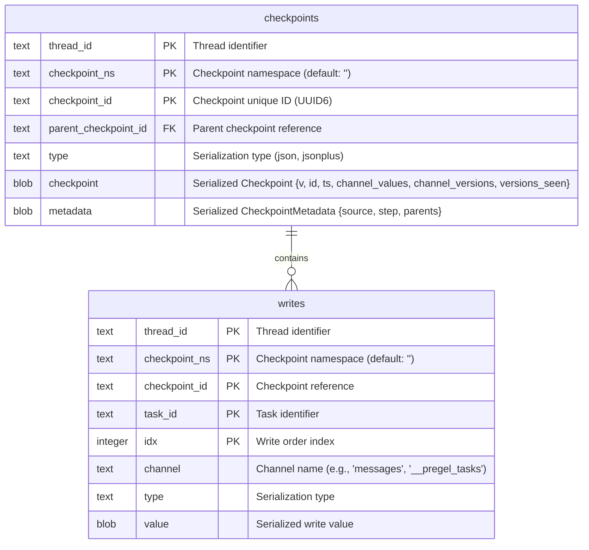
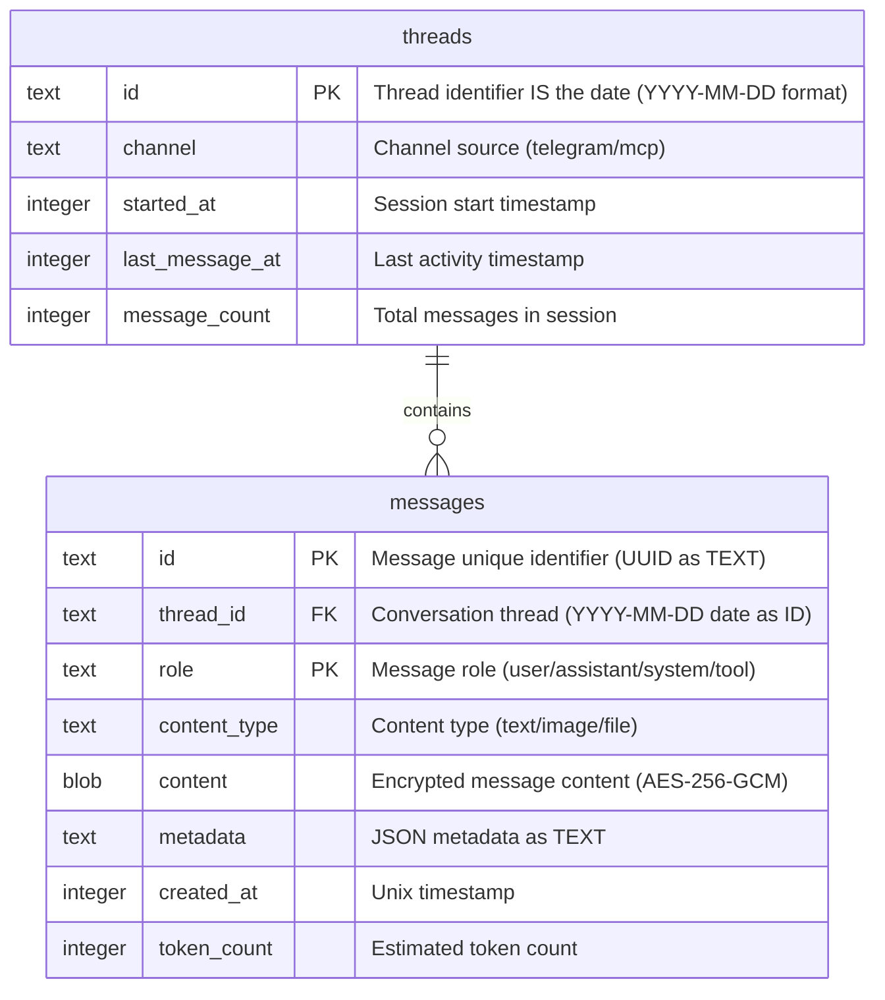
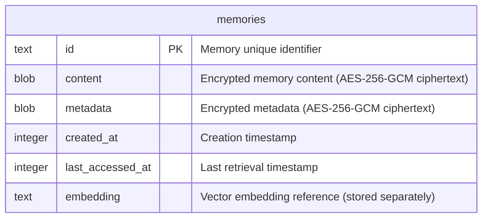
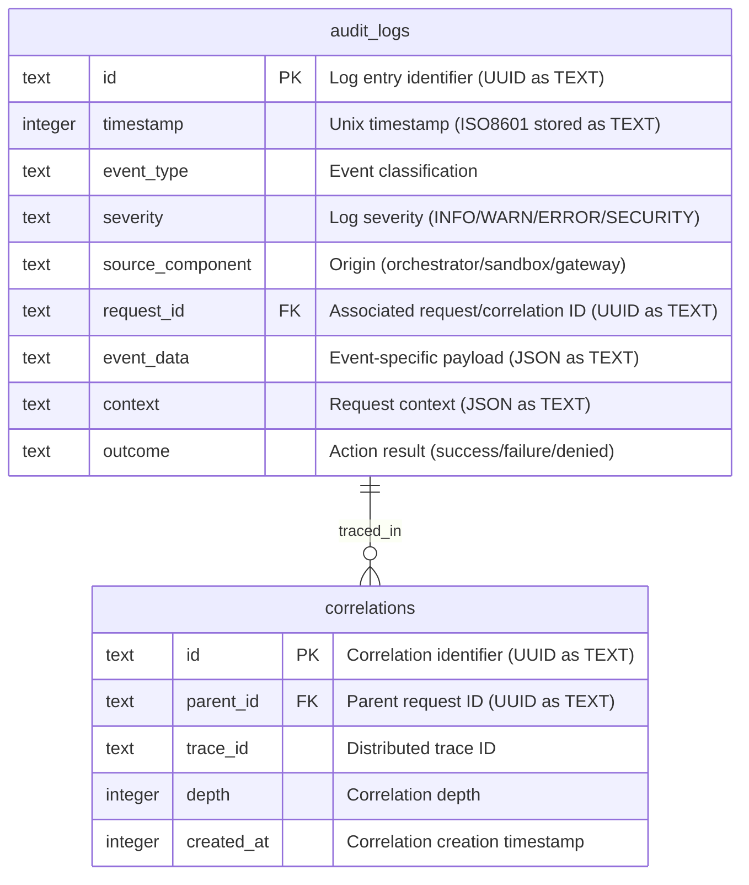
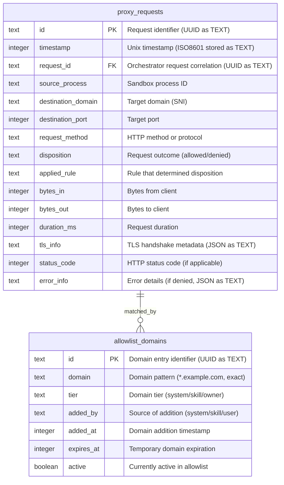

# TechSpec.md: OpenKraken Technical Specification

**Document Version:** 1.0.0  
**Generated:** 2026-02-04  
**Architecture Reference:** ARCHITECTURE.md (v0.11.0)  
**Classification:** Internal Technical Document  

---

## 1. Stack Specification

This section defines the concrete technology stack for OpenKraken, specifying exact versions to ensure reproducibility and prevent supply chain attacks. All dependencies are pinned to specific versions; deviations require explicit architectural review and ADR documentation.

### 1.1 Core Runtime and Language

| Component | Version | Justification |
|-----------|---------|---------------|
| **Bun Runtime** | 1.3.8 | Latest stable as of February 2026. Provides native SQLite support, TypeScript compilation, and superior cold-start performance compared to Node.js. Verified Node.js API compatibility (~95% coverage). |
| **TypeScript** | 5.9.3 (bundled with Bun) | Strict type checking enabled. All source code written in TypeScript with strict mode activated. |
| **Node.js Compatibility** | 20.x LTS (runtime detection only) | Required for packages lacking Bun native support. Bun automatically handles Node.js compatibility layer. |
| **SQLite** | 3.x (bundled with Bun runtime) | Native SQLite support via Bun.sqlite module. Provides durable state persistence with Write-Ahead Logging (WAL) mode. Zero-configuration persistence. |

### 1.2 Agent Orchestration Framework

| Component | Version | Justification |
|-----------|---------|---------------|
| **LangChain.js** | 1.2.18 (bindings) / 1.1.19 (core) | Stable v1 API with TypeScript bindings. Provides canonical `createAgent()` entry point. Extensive middleware ecosystem. Production-ready with active maintenance. Core library (@langchain/core) at 1.1.19 provides base abstractions. Uses SkrOYC's custom bun-sqlite-checkpointer for LangGraph state persistence (Bun-native, avoiding better-sqlite3 FFI issues). |
| **LangGraph.js** | 1.1.2 | Stateful workflow management. Enables checkpoint persistence and state rollback. Used as peer dependency by LangChain bindings. |
| **@langchain/mcp-adapters** | 1.1.2 | Model Context Protocol integration. Handles connection lifecycle and capability negotiation transparently. |

### 1.3 Protocol and Integration Libraries

| Component | Version | Justification |
|-----------|---------|---------------|
| **grammY** | 1.39.3 | Supports Telegram Bot API 9.3 (December 2025 release). Type-safe Telegram protocol handling with webhook verification built-in. |
| **@anthropic-ai/sandbox-runtime** | 0.0.34 | Cross-platform process isolation using bubblewrap (Linux) and sandbox-exec (macOS). Unified configuration interface across platforms. Beta Research Preview—pins to specific version. Configured for chained proxy architecture (httpProxyPort/socksProxyPoint) to route traffic through Egress Gateway. |
| **Vercel Agent Browser** | 0.9.1 | Headless browser automation with CDP protocol support. Isolated profiles per session with proxy enforcement. |

### 1.4 Data Persistence

| Component | Version | Justification |
|-----------|---------|---------------|
| **SQLite** | 3.x (bundled with Bun runtime) | Native SQLite via Bun.sqlite module. Write-Ahead Logging (WAL) mode for concurrent access. Zero-configuration persistence. |
| **Encryption** | AES-256-GCM (application-level) | Application-level encryption for sensitive memory fields. SQLCipher is incompatible with Bun's embedded SQLite. Memory content and metadata columns are encrypted before INSERT and decrypted after SELECT using Node.js crypto module (Bun-compatible). Filesystem-level encryption (LUKS/FileVault) provides defense-in-depth.

### 1.5 Infrastructure and Build

| Component | Version | Justification |
|-----------|---------|---------------|
| **Nix** | 2.33.2 (latest stable) | Reproducible builds via Nix Flakes. Cross-platform package management. |
| **nixpkgs** | 25.11 (stable channel) | Declarative system configuration. Generates systemd units (Linux) and launchd plists (macOS). |
| **Egress Gateway** | Go 1.25.6 | Systems programming language for network proxy. Selected for faster implementation velocity, simpler concurrency (goroutines), and mature HTTP CONNECT proxy ecosystem. |

### 1.6 Dependency Management Strategy

All dependencies declared in `package.json` with exact semver ranges. The build process pins transitive dependencies via `bun.lockb` to prevent dependency confusion attacks. No `*` or `^` prefixes permitted in production dependencies. DevDependencies may use `^` for tooling flexibility but require periodic review.

---

## 2. Architecture Decision Records

The following ADRs document critical architectural decisions. Each record follows the standard format: Title, Context, Decision, and Consequences.

### ADR-001: Bun Runtime over Node.js

**Title:** Bun Runtime v1.3.8 for Orchestrator Implementation

**Context:**
The architecture requires a high-performance runtime for the Orchestrator component. Node.js has been the traditional choice for TypeScript server applications, but Bun offers superior cold-start performance, native TypeScript compilation, and bundled SQLite support. The evaluation considered runtime maturity, package ecosystem compatibility, and operational reliability.

**Decision:**
The Orchestrator runs on Bun 1.3.8 rather than Node.js. Bun provides native SQLite integration through the `bun:sqlite` module, eliminating external database driver dependencies. TypeScript compilation occurs at runtime, reducing build pipeline complexity. Performance benchmarks indicate 3-5x faster cold starts compared to Node.js 20.x LTS.

**Consequences:**
- **Positive:** Reduced startup latency for scheduled tasks and session initialization. Native SQLite eliminates driver compatibility concerns. Simplified deployment—no TypeScript compilation step required in production.
- **Negative:** ~5% of npm packages lack Bun native support, requiring Node.js compatibility layer. Some packages may exhibit unexpected behavior in Bun's JavaScriptCore runtime. Team must monitor Bun ecosystem maturity.
- **Mitigation:** Runtime includes automatic Node.js compatibility detection. Packages with known incompatibilities documented in `BUN_COMPAT.md`. CI/CD validates all package installations on Bun before deployment.

### ADR-002: Unified SQLite Database for All Persistent State

**Title:** Single Database File with Multiple Tables

**Context:**
The architecture defines five distinct persistence requirements: LangGraph checkpoints, message logs, semantic memory, audit logs, and proxy access logs. Each could theoretically use different database files. However, unified persistence simplifies backup operations (single file), reduces operational complexity, enables cross-table queries (correlating audit events with messages), and ensures ACID guarantees across related data.

**Decision:**
All persistent state uses a single SQLite database file (`openkraken.db`) with multiple tables. Write-Ahead Logging (WAL) mode is enabled via `PRAGMA journal_mode = WAL`. Tables include: `checkpoints`, `writes` (LangGraph state), `threads`, `messages` (conversation history), `memories`, `memories_embeddings` (semantic memory), `audit_events` (security events), and `proxy_logs` (network access logs). WAL mode enables concurrent reads while maintaining durability.

**Consequences:**
- **Positive:** Single backup/restore mechanism using Bun's `db.serialize()` API. ACID transactions across all tables. WAL mode prevents writer starvation during read-heavy workloads. Cross-table queries enable correlation of audit events with conversation context. Bun's native `bun:sqlite` module eliminates external driver dependencies.
- **Negative:** Database file corruption possible on system crashes (mitigated by WAL mode and regular integrity checks). Single file means entire state affected by corruption.
- **Mitigation:** Daily automated backups using Bun's `db.serialize()` to Buffer then file write. 7-day retention with compressed archives. Integrity checks during backup using `PRAGMA integrity_check`. Owner recovery commands available. Monitor database size and implement cleanup policies for audit and proxy logs.

### ADR-003: Chained Egress Proxy Architecture

**Title:** Go Egress Gateway in Chained Configuration with Sandbox Runtime Proxy

**Context:**
The Egress Gateway requires systems programming for HTTP CONNECT proxy implementation with high throughput and low latency. The Anthropic Sandbox Runtime includes built-in HTTP and SOCKS5 proxy servers with domain allowlisting. Both components provide network filtering capabilities, creating potential for architectural overlap or redundancy.

**Decision:**
The Egress Gateway operates in a chained architecture with the Sandbox Runtime's built-in proxy. The Sandbox is configured with `httpProxyPort` and `socksProxyPort` pointing to the Go Egress Gateway. All sandbox traffic routes through the Go proxy, which enforces the domain allowlist and logs connection attempts to SQLite. This provides defense-in-depth: the Sandbox handles platform-specific network isolation (Linux namespaces, macOS Seatbelt), while the Go proxy provides structured audit logging and dynamic allowlist management API.

**Consequences:**
- **Positive:** Defense-in-depth with two independent enforcement layers. Sandbox handles hard platform-specific isolation. Go proxy provides audit logging to SQLite, structured JSON errors, and dynamic allowlist management API. Clear separation of concerns.
- **Negative:** Two proxy hops add negligible latency for single-tenant workloads. Slightly more complex configuration. Requires both components to be healthy.
- **Mitigation:** Monitor both proxy health endpoints. Graceful degradation if Go proxy unavailable (sandbox rejects all egress). Configuration validation at startup.

### ADR-004: Custom Bun-Native Checkpointer Implementation

**Title:** SkrOYC's bun-sqlite-checkpointer for LangGraph State Persistence

**Context:**
Agent state must survive Orchestrator restarts without data loss. LangGraph provides multiple checkpointer implementations (Memory, SQLite, Redis). The standard `SqliteCheckpointer` depends on `better-sqlite3`, which requires N-API FFI. Bun's JavaScriptCore runtime does not support N-API, making `better-sqlite3` incompatible (Bun issue #10655).

**Decision:**
The Orchestrator uses SkrOYC's `bun-sqlite-checkpointer`—a custom Bun-native implementation using `bun:sqlite` directly, avoiding FFI entirely. The checkpointer stores state in the `openkraken.db` database using the `checkpoints` and `writes` tables. WAL mode ensures concurrent access.

**Consequences:**
- **Positive:** Zero FFI dependency. Full compatibility with Bun's JavaScriptCore runtime. Zero additional infrastructure. State survives restarts automatically. LangGraph handles checkpoint serialization/deserialization. Supports state rollback for debugging.
- **Negative:** Custom implementation requires maintenance as LangGraph evolves. Checkpoint size grows with conversation history.
- **Mitigation:** Monitor LangGraph releases for checkpointer API changes. Implement checkpoint size limits (configurable, default 10MB). Provide manual checkpoint cleanup commands.

### ADR-005: OS-Level Credential Vaults

**Title:** Credential Storage in Platform-Native Vaults with Dev-Mode Fallback

**Context:**
Credentials must never be exposed to the Agent or written to persistent storage. OpenClaw stored API keys in plaintext files, enabling credential exfiltration through prompt injection. The architecture requires runtime credential retrieval from secure storage.

**Decision:**
Credentials retrieved from OS-level vaults at Orchestrator startup. The Orchestrator implements a `CredentialVault` abstraction with platform-specific implementations: macOS uses Keychain Services API, Linux uses secret-service API (compatible with GNOME Keyring, KWallet, pass). Credentials cached in memory for process duration, never written to logs or filesystem.

**Environment Variable Fallback:** When `OPENKRAKEN_ENV=development` is explicitly set, the CredentialVault falls back to environment variables. This is intended for local development only. A WARNING is logged on every credential retrieval when using env var fallback.

**Consequences:**
- **Positive:** Credentials protected by platform security mechanisms in production. No plaintext credential storage. Credential rotation supported via re-reading from vault. Dev-mode fallback enables rapid local iteration.
- **Negative:** Platform vault complexity. macOS Keychain requires appropriate access groups. Linux secret-service requires D-Bus session bus. Initial credential provisioning requires Owner action.
- **Mitigation:** Provide CLI commands for credential provisioning (`openkraken credentials set`). Document platform-specific setup requirements. Log warnings when using env var fallback. Enforce vault-only in production by default.

---

## 3. Database Schema

This section defines the physical database schema using Mermaid ERD syntax. All tables use SQLite-compatible types. Primary keys, foreign keys, and critical indices are explicitly defined. Database schema implements the persistence layer defined in [Architecture.md Section 5.3](Architecture.md#53-persistence-layer).

### 3.1 Checkpoints Tables

Stores LangGraph agent state persistence within `openkraken.db`. Two-table schema compatible with custom bun-sqlite-checkpointer, using BLOB serialization and composite primary keys.



**Schema Notes:**
- **LangGraph Compatibility**: Schema mirrors LangGraph's SqliteCheckpointer with BLOB storage for serialized state
- **Composite Primary Keys**: `(thread_id, checkpoint_ns, checkpoint_id)` for checkpoints, `(thread_id, checkpoint_ns, checkpoint_id, task_id, idx)` for writes
- **Serialization**: Uses Bun's native serialization (JSON default via `JsonPlusSerializer`)
- **Checkpoint Structure** (BLOB):
  ```typescript
  interface Checkpoint {
    v: number;           // Version (currently 4)
    id: string;          // UUID6 identifier
    ts: string;          // ISO timestamp
    channel_values: Record<string, unknown>;
    channel_versions: Record<string, unknown>;
    versions_seen: Record<string, Record<string, unknown>>;
  }
  ```
- **Metadata Structure** (BLOB):
  ```typescript
  interface CheckpointMetadata {
    source: "input" | "loop" | "update" | "fork";
    step: number;
    parents: Record<string, string>;
    // Additional user-defined properties
  }
  ```
- **WAL Mode**: Database uses Write-Ahead Logging for concurrent access: `PRAGMA journal_mode=WAL;`
- **Index**: No additional indexes needed—composite PKs provide efficient retrieval
- **Special Channels**:
  - `__pregel_tasks`: Task scheduling channel
  - `__error__`: Error handling
  - `__scheduled__`: Scheduled tasks
  - `__interrupt__`: Interruptions
  - `__resume__`: Resumptions

**Table DDL:**
```sql
CREATE TABLE checkpoints (
  thread_id TEXT NOT NULL,
  checkpoint_ns TEXT NOT NULL DEFAULT '',
  checkpoint_id TEXT NOT NULL,
  parent_checkpoint_id TEXT,
  type TEXT,
  checkpoint BLOB,
  metadata BLOB,
  PRIMARY KEY (thread_id, checkpoint_ns, checkpoint_id)
);

CREATE TABLE writes (
  thread_id TEXT NOT NULL,
  checkpoint_ns TEXT NOT NULL DEFAULT '',
  checkpoint_id TEXT NOT NULL,
  task_id TEXT NOT NULL,
  idx INTEGER NOT NULL,
  channel TEXT NOT NULL,
  type TEXT,
  value BLOB,
  PRIMARY KEY (thread_id, checkpoint_ns, checkpoint_id, task_id, idx)
);

PRAGMA journal_mode=WAL;
```

### 3.2 Message Log Tables

Stores cross-session conversation history for context injection and audit purposes within `openkraken.db`.



**Schema Notes:**
- `thread_id`: The thread ID IS the date (YYYY-MM-DD format). New day = new thread context, eliminating the separate date column.
- `role`: Constrained to "user", "assistant", "system", "tool" values.
- `content_type`: Supports "text", "image", "file", "tool_call", "tool_result".
- `content`: Encrypted using AES-256-GCM before storage in `openkraken.db`. Decrypted on retrieval.
- `metadata`: JSON object storing attachments (filename, MIME type, size), tool outputs, and delivery status.
- `token_count`: Estimated via tokenizer. Used for context window management.
- **Index:** `(thread_id, created_at)` on `messages` for chronological retrieval.
- **Constraint:** `FOREIGN KEY (thread_id) REFERENCES threads(id)` for referential integrity.

### 3.3 Semantic Memory Tables

Stores long-term semantic memories for the RMM Memory middleware integration within `openkraken.db`. Sensitive content and metadata fields are encrypted using AES-256-GCM before storage.



**Notes:**
- Database structure matches RMM Memory middleware requirements
- `content` and `metadata` fields are encrypted using AES-256-GCM before INSERT, decrypted after SELECT
- Encryption key derived from master key stored in OS-level vault
- Middleware handles embedding generation, similarity search, and memory decay
- Integration interface defined by middleware API

### 3.4 Audit Log Tables

Stores security-relevant events for compliance and debugging within `openkraken.db`.



**Schema Notes:**
- `event_type`: Constrained vocabulary: "authentication", "authorization", "configuration_change", "session_lifecycle", "tool_invocation", "model_call", "policy_violation", "sandbox_event", "gateway_event".
- `severity`: "INFO" (normal operations), "WARN" (anomalies), "ERROR" (failures), "SECURITY" (security-relevant).
- `request_id`: UUID for cross-component request tracing.
- `event_data`: Structured JSON with event-specific fields (e.g., tool name, arguments, result).
- **Index:** `(timestamp)` for chronological queries.
- **Index:** `(event_type, severity)` for filtered audits.
- **Index:** `(request_id)` for request tracing.
- **Retention:** 30-day rolling retention with automatic archival.

### 3.5 Proxy Access Log Tables

Stores network egress requests for security auditing within `openkraken.db`.



**Schema Notes:**
- `destination_domain`: Extracted from TLS SNI or HTTP Host header. Wildcards stored as literal patterns.
- `request_method`: HTTP methods (GET, POST, PUT, DELETE, PATCH, CONNECT) or protocol identifiers.
- `disposition`: "allowed" (domain in allowlist), "denied" (not in allowlist), "error" (proxy failure).
- `applied_rule`: Specific rule identifier (e.g., "skill:python-requests", "system:api.github.com").
- `tls_info`: JSON object with SNI hostname, negotiated cipher suite, TLS version, certificate subject.
- `error_info`: JSON object with error type, message, and remediation for denied requests.
- **Index:** `(timestamp)` for recent requests.
- **Index:** `(disposition, domain)` for allowlist analysis.
- **Index:** `(request_id)` for correlation with audit logs.
- **Retention:** 30-day rolling retention, automatic rotation at 100MB.

---

## 4. API Contract

OpenKraken implements the **Open Responses API** as its primary interface contract. This positions OpenKraken as an Open Responses Provider, enabling ecosystem compatibility while maintaining its unique deterministic, sandboxed execution model. Telegram and other input sources are implemented as adapters that convert platform-specific protocols to Open Responses input items.

**Open Responses Alignment:**
- OpenKraken is an **Open Responses Provider** - any Open Responses-compatible client can consume it
- The agent loop implements the **agentic loop** pattern (reasoning → tool call → result → continue)
- State management uses **thread_id** and **previous_response_id** mapping to LangGraph checkpoints
- Streaming follows the **semantic event model** (not raw text deltas)
- Tool execution is formalized as **externally-hosted tools** (executed in sandbox)

### 4.1 Open Responses API Endpoint

**Endpoint:** `POST /v1/responses`  
**Base URL:** `http://127.0.0.1:3000` (local-only)  
**Transport:** HTTP over Unix domain socket (production), TCP (development debug)  
**Authentication:** None (local-only access via `127.0.0.1`)  
**Content-Type:** `application/json`  
**Accept:** `text/event-stream` (for streaming responses)

#### 4.1.1 Request Schema

```yaml
openapi: 3.0.3
info:
  title: OpenKraken Open Responses API
  version: 1.0.0
  description: Open Responses Provider API for OpenKraken agent runtime
  x-openkraken-version: "1.0.0"

paths:
  /v1/responses:
    post:
      operationId: createResponse
      summary: Create agent response (Open Responses API)
      requestBody:
        required: true
        content:
          application/json:
            schema:
              type: object
              properties:
                model:
                  type: string
                  description: Agent model identifier (e.g., 'claude-4')
                  default: "claude-sonnet-4-2025"
                input:
                  type: array
                  items:
                    type: object
                    discriminator:
                      propertyName: type
                      mapping:
                        message: "#/components/schemas/MessageItem"
                        function_call: "#/components/schemas/FunctionCallItem"
                        function_call_output: "#/components/schemas/FunctionCallOutputItem"
                        reasoning: "#/components/schemas/ReasoningItem"
                        item_reference: "#/components/schemas/ItemReferenceItem"
                  description: Input items (messages, function calls, etc.). Telegram adapter converts updates to this format.
                previous_response_id:
                  type: string
                  format: uuid
                  description: Thread/checkpoint continuation. Maps to LangGraph checkpoint.
                instructions:
                  type: string
                  description: Additional instructions for this response (appended to SOUL.md).
                tools:
                  type: array
                  items:
                    type: object
                    properties:
                      name:
                        type: string
                        description: Tool name
                      description:
                        type: string
                        description: Tool description
                      type:
                        type: string
                        enum: [function]
                      function:
                        type: object
                        properties:
                          name:
                            type: string
                          description:
                            type: string
                          parameters:
                            type: object
                            description: JSON Schema for parameters
                          strict:
                            type: boolean
                            description: Enforce strict parameter matching
                    required: [name, type]
                  description: Available tools. OpenKraken provides built-in tools (file, terminal, browser, etc.).
                tool_choice:
                  type: string
                  enum: [auto, none, required]
                  default: auto
                  description: Controls which tools the model may use.
                truncation:
                  type: string
                  enum: [auto, disabled]
                  default: auto
                  description: Context truncation strategy.
                max_tool_calls:
                  type: integer
                  minimum: 1
                  maximum: 100
                  default: 10
                  description: Maximum tool call iterations in the agent loop.
                max_output_tokens:
                  type: integer
                  description: Maximum tokens in response.
                temperature:
                  type: number
                  minimum: 0
                  maximum: 2
                  description: Sampling temperature.
                service_tier:
                  type: string
                  enum: [standard, premium]
                  default: standard
                  description: Service tier for resource allocation.
                stream:
                  type: boolean
                  default: true
                  description: Stream response as SSE events.
                # OpenKraken Provider-Specific Extensions
                openkraken:
                  type: object
                  properties:
                    sandbox:
                      type: object
                      properties:
                        enabled:
                          type: boolean
                          default: true
                        network_isolation:
                          type: string
                          enum: [strict, relaxed, none]
                          default: strict
                        filesystem_zones:
                          type: object
                          properties:
                            skills:
                              type: string
                              default: "/sandbox/skills"
                            inputs:
                              type: string
                              default: "/sandbox/inputs"
                            work:
                              type: string
                              default: "/sandbox/work"
                            outputs:
                              type: string
                              default: "/sandbox/outputs"
                    determinism:
                      type: object
                      properties:
                        seed:
                          type: integer
                          description: Random seed for reproducible execution.
                        checkpoint_before_tools:
                          type: boolean
                          default: true
                          description: Checkpoint state before each tool call.
                    session:
                      type: object
                      properties:
                        channel:
                          type: string
                          enum: [telegram, debug, api]
                          default: api
                        channel_id:
                          type: string
                          description: Channel-specific identifier (e.g., Telegram chat_id).
              required: [input]

components:
  schemas:
    MessageItem:
      type: object
      properties:
        type:
          type: string
          enum: [message]
        role:
          type: string
          enum: [user, assistant, system, developer]
        content:
          type: array
          items:
            type: object
            discriminator:
              propertyName: type
              mapping:
                input_text: "#/components/schemas/InputTextContent"
                input_image: "#/components/schemas/InputImageContent"
                input_file: "#/components/schemas/InputFileContent"
    InputTextContent:
      type: object
      properties:
        type:
          type: string
          enum: [input_text]
        text:
          type: string
    InputImageContent:
      type: object
      properties:
        type:
          type: string
          enum: [input_image]
        image_url:
          type: string
          format: uri
    InputFileContent:
      type: object
      properties:
        type:
          type: string
          enum: [input_file]
        file_url:
          type: string
          format: uri
        filename:
          type: string
        mime_type:
          type: string
    FunctionCallItem:
      type: object
      properties:
        type:
          type: string
          enum: [function_call]
        name:
          type: string
        arguments:
          type: string
        function:
          type: object
          properties:
            name:
              type: string
    FunctionCallOutputItem:
      type: object
      properties:
        type:
          type: string
          enum: [function_call_output]
        name:
          type: string
        content:
          type: string
        output_type:
          type: string
          enum: [string, object, error]
    ReasoningItem:
      type: object
      properties:
        type:
          type: string
          enum: [reasoning]
        content:
          type: string
        summary:
          type: string
    ItemReferenceItem:
      type: object
      properties:
        type:
          type: string
          enum: [item_reference]
        id:
          type: string
```
                stream:
                  type: boolean
                  default: true
                  description: Stream response as SSE events.
                # OpenKraken Provider-Specific Extensions
                openkraken:
                  type: object
                  properties:
                    sandbox:
                      type: object
                      properties:
                        enabled:
                          type: boolean
                          default: true
                        network_isolation:
                          type: string
                          enum: [strict, relaxed, none]
                          default: strict
                        filesystem_zones:
                          type: object
                          properties:
                            skills:
                              type: string
                              default: "/sandbox/skills"
                            inputs:
                              type: string
                              default: "/sandbox/inputs"
                            work:
                              type: string
                              default: "/sandbox/work"
                            outputs:
                              type: string
                              default: "/sandbox/outputs"
                    determinism:
                      type: object
                      properties:
                        seed:
                          type: integer
                          description: Random seed for reproducible execution.
                        checkpoint_before_tools:
                          type: boolean
                          default: true
                          description: Checkpoint state before each tool call.
                    session:
                      type: object
                      properties:
                        channel:
                          type: string
                          enum: [telegram, debug, api]
                          default: api
                        channel_id:
                          type: string
                          description: Channel-specific identifier (e.g., Telegram chat_id).
              required: [input]
      responses:
        '200':
          description: Response generated (non-streaming)
          content:
            application/json:
              schema:
                type: object
                properties:
                  id:
                    type: string
                    format: uuid
                    description: Response identifier (maps to checkpoint_id).
                  object:
                    type: string
                    enum: [response]
                  created_at:
                    type: integer
                    description: Unix timestamp.
                  status:
                    type: string
                    enum: [completed, in_progress, cancelled]
                  model:
                    type: string
                  input:
                    type: array
                    description: Echo of input items.
                  output:
                    type: array
                    description: Output items (messages, tool calls, reasoning).
                  error:
                    type: object
                    description: Error information if failed.
        '202':
          description: Response accepted for streaming
          content:
            text/event-stream:
              schema:
                type: string
                description: SSE stream of Open Responses events.
```

#### 4.1.2 Streaming Events (SSE)

OpenKraken streams events following the Open Responses semantic event model:

```yaml
components:
  schemas:
    SSEvent:
      type: object
      properties:
        event:
          type: string
          description: Event type identifier
        data:
          type: string
          description: JSON-serialized event data
        sequence_number:
          type: integer
          description: Event sequence number for ordering
    EventTypes:
      type: string
      enum:
        # Lifecycle
        - response.started
        - response.completed
        - response.failed
        - response.incomplete
        # Output Items
        - response.output_item.added
        - response.output_item.done
        # Content Parts
        - response.content_part.started
        - response.content_part.done
        # Text Delta
        - response.output_text.delta
        # Reasoning (extended thinking)
        - response.reasoning.start
        - response.reasoning.delta
        - response.reasoning.done
        # Tool Calls
        - response.tool_call.started
        - response.tool_call.arguments.delta
        - response.tool_call.result
        - response.tool_call.done
        # State
        - response.state
        # OpenKraken-Specific Events (colon-prefixed per spec)
        - openkraken:sandbox.started
        - openkraken:checkpoint.created
```

**Event Sequence Numbers:**
All events include a `sequence_number` field for ordering. Sequence numbers start at 0 and increment by 1 for each event.

**Terminal Event:**
Streaming responses end with a `[DONE]` literal string (no JSON payload) per Open Responses specification.

**OpenKraken-Specific Extensions:**
OpenKraken extends the Open Responses protocol with custom events prefixed with `openkraken:`:
- `openkraken:sandbox.started`: Emitted when sandbox initialization completes
- `openkraken:checkpoint.created`: Emitted when state checkpoint is persisted

**Output Item Status Machine:**
Output items transition through states:
- `in_progress`: Item being constructed
- `completed`: Item fully formed
- `incomplete`: Response truncated or interrupted
        - openkraken.sandbox.terminated
        - openkraken.checkpoint.created
```

**Example SSE Stream:**
```
event: response.started
data: {"response_id": "resp_abc123", "thread_id": "thread_telegram_123", "model": "claude-4"}

event: response.message.start
data: {"message_id": "msg_1", "role": "assistant"}

event: response.message.delta
data: {"message_id": "msg_1", "delta": "I'll help you with that."}

event: response.tool_call.start
data: {"tool_call_id": "tool_1", "function": {"name": "read_file", "arguments": {}}}

event: response.tool_call.result
data: {"tool_call_id": "tool_1", "content": "file contents..."}

event: openkraken:checkpoint.created
data: {"checkpoint_id": "cp_abc123", "thread_id": "thread_telegram_123"}

event: response.completed
data: {"response_id": "resp_abc123", "status": "completed"}
```

#### 4.1.3 Error Response Schema

OpenKraken returns errors following the Open Responses error format:

```yaml
components:
  schemas:
    ErrorResponse:
      type: object
      properties:
        error:
          type: object
          properties:
            message:
              type: string
              description: Human-readable error message
            type:
              type: string
              description: Error type classification
            code:
              type: string
              description: Machine-readable error code
            param:
              type: string
              description: Parameter that caused the error
          required: [message]
      required: [error]

ErrorTypes:
  - invalid_request_error
  - authentication_error
  - permission_error
  - rate_limit_error
  - service_unavailable_error
  - openkraken_sandbox_error
  - openkraken_policy_violation
  - openkraken_checkpointer_error
```

**Common Error Codes:**
| Code | Description |
|------|-------------|
| `invalid_request_error` | Malformed request or invalid parameters |
| `authentication_error` | Credential retrieval failed |
| `permission_error` | Policy violation or access denied |
| `rate_limit_error` | Request rate limit exceeded |
| `service_unavailable_error` | Backend service unavailable |
| `openkraken_sandbox_error` | Sandbox initialization or execution |
| `openkraken_policy_violation` | Content policy violation detected |
| `openkraken_checkpointer_error` | State persistence failed |

#### 4.1.4 Tool Definitions (Open Responses Format)

OpenKraken exposes its capabilities as Open Responses tools:

```yaml
components:
  schemas:
    OpenKrakenTool:
      type: object
      properties:
        name:
          type: string
          description: Tool identifier
        description:
          type: string
          description: What the tool does
        type:
          type: string
          enum: [function]
        function:
          type: object
          properties:
            name:
              type: string
            description:
              type: string
            parameters:
              type: object
              description: JSON Schema for arguments
              properties:
                type:
                  type: string
                  enum: [object]
                properties:
                  type: object
                  additionalProperties: true
                required:
                  type: array
                  items:
                    type: string
                additionalProperties:
                  type: boolean
            strict:
              type: boolean
              default: true
```

**OpenKraken Built-in Tools:**
```yaml
tools:
  - name: read_file
    description: Read contents of a file in the sandbox work directory.
    type: function
    function:
      name: read_file
      description: Read file contents
      parameters:
        type: object
        properties:
          path:
            type: string
            description: Absolute path within sandbox (e.g., /sandbox/work/file.txt)
        required: [path]

  - name: write_file
    description: Write content to a file in the sandbox work directory.
    type: function
    function:
      name: write_file
      parameters:
        type: object
        properties:
          path:
            type: string
            description: Absolute path within sandbox
          content:
            type: string
            description: File content to write
        required: [path, content]

  - name: list_directory
    description: List contents of a directory in the sandbox.
    type: function
    function:
      name: list_directory
      parameters:
        type: object
        properties:
          path:
            type: string
            description: Directory path

  - name: execute_terminal
    description: Execute a terminal command in the sandbox.
    type: function
    function:
      name: execute_terminal
      parameters:
        type: object
        properties:
          command:
            type: string
            description: Command to execute
          timeout:
            type: integer
            description: Timeout in seconds (default: 30)
        required: [command]

  - name: browse_url
    description: Browse a URL and return rendered content.
    type: function
    function:
      name: browse_url
      parameters:
        type: object
        properties:
          url:
            type: string
            description: URL to browse
          timeout:
            type: integer
            description: Request timeout in seconds

  - name: search_web
    description: Search the web for information.
    type: function
    function:
      name: search_web
      parameters:
        type: object
        properties:
          query:
            type: string
          num_results:
            type: integer
            default: 5
```

### 4.2 Input Adapters

OpenKraken separates input sources from the API layer. Telegram, future web interfaces, and other inputs are adapters that convert platform-specific protocols to Open Responses input items.

#### 4.2.1 Telegram Adapter

**Integration:** Input adapter that converts Telegram Bot API updates to Open Responses input items.

**Flow:**
1. Telegram sends webhook POST to `/webhook/telegram`
2. Adapter extracts message content and metadata
3. Adapter constructs Open Responses `input` array:
   ```typescript
   interface TelegramInputAdapter {
     convert(update: TelegramUpdate): InputItem[] {
       return [
         {
           type: "message",
           role: "user",
           content: update.message.text
         },
         {
           type: "message",
           role: "system",
           content: `Telegram metadata: chat_id=${update.message.chat.id}, from=${update.message.from.username}`
         }
       ];
     }
   }
   ```
4. Adapter calls `POST /v1/responses` with constructed input
5. Response events are streamed back to Telegram as messages

**Endpoint:** `POST /webhook/telegram`  
**Authentication:** HMAC-SHA256 signature verification (grammY built-in)

```yaml
paths:
  /webhook/telegram:
    post:
      operationId: telegramWebhook
      summary: Telegram Bot API webhook (Input Adapter)
      security:
        - apiKey: []
      requestBody:
        required: true
        content:
          application/json:
            schema:
              type: object
              description: Telegram Bot API Update object
      responses:
        '200':
          description: Update processed (response streamed separately)
        '401':
          description: Invalid signature
        '400':
          description: Invalid update format
        '500':
          description: Processing error
```

#### 4.2.2 Future Input Adapters

OpenKraken's architecture supports additional input adapters:

- **Web UI Adapter:** Browser-based chat interface → Open Responses input
- **MCP Adapter:** MCP protocol → Open Responses input (existing)
- **CLI Adapter:** Terminal input → Open Responses input
- **Scheduling Adapter:** Cron triggers → Open Responses input

All adapters follow the same pattern: convert platform input → call `POST /v1/responses` → stream events → convert output to platform format.

### 4.3 Health and Observability Endpoints

```yaml
paths:
  /health:
    get:
      operationId: getHealth
      summary: Liveness probe
      description: Returns 200 OK if process is running
      responses:
        '200':
          description: Process is healthy
          content:
            application/json:
              schema:
                type: object
                properties:
                  status:
                    type: string
                    enum: [healthy]
                  timestamp:
                    type: string
                    format: date-time
                required: [status, timestamp]
        '503':
          description: Process not running or crashed

  /ready:
    get:
      operationId: getReadiness
      summary: Readiness probe
      description: Returns 200 only when all dependencies are healthy
      responses:
        '200':
          description: All dependencies available
          content:
            application/json:
              schema:
                type: object
                properties:
                  status:
                    type: string
                    enum: [ready, not_ready]
                  dependencies:
                    type: object
                    properties:
                      database:
                        type: string
                        enum: [connected, disconnected]
                      sandbox:
                        type: string
                        enum: [available, unavailable]
                      mcpServers:
                        type: string
                        enum: [connected, disconnected, not_configured]
                      egressGateway:
                        type: string
                        enum: [connected, disconnected]
                    required: [database, sandbox, mcpServers, egressGateway]
                  timestamp:
                    type: string
                    format: date-time
                required: [status, dependencies, timestamp]
        '503':
          description: Dependencies not ready

  /metrics:
    get:
      operationId: getMetrics
      summary: Prometheus metrics endpoint
      description: Returns Prometheus-compatible metrics
      responses:
        '200':
          description: Metrics exported
          content:
            text/plain:
              schema:
                type: string
                description: Prometheus exposition format

  /version:
    get:
      operationId: getVersion
      summary: Version information
      description: Returns version for debugging
      responses:
        '200':
          description: Version info available
          content:
            application/json:
              schema:
                type: object
                properties:
                  version:
                    type: string
                    description: Semantic version
                  commit:
                    type: string
                    description: Git commit hash
                  buildTimestamp:
                    type: string
                    format: date-time
                  runtime:
                    type: string
                    enum: [bun]
                  openresponses_version:
                    type: string
                    description: Open Responses API version
```

---

## 5. Implementation Guidelines

### 5.1 Project Structure

The following directory structure enforces Clean Architecture principles. Business logic is isolated from infrastructure concerns. The structure supports horizontal scaling of components while maintaining clear boundaries.

```
openkraken/
├── README.md
├── AGENTS.md
├── PRD.md
├── Architecture.md
├── TechSpec.md                    # This document
├── package.json
├── bun.lock
├── tsconfig.json
├── .nix/
│   ├── flake.nix
│   ├── flake.lock
│   └── nixos-modules/
│       ├── openkraken.nix
│       └── openkraken-darwin.nix
└── src/
    ├── main.ts                    # Application entry point
    ├── orchestrator/              # Bun-based Orchestrator
    │   ├── index.ts               # Orchestrator bootstrap
    │   ├── config/
    │   │   ├── index.ts           # Configuration loader
    │   │   ├── schema.ts          # Configuration validation
    │   │   └── defaults.ts        # Default values
    │   ├── api/                   # HTTP API handlers
    │   │   ├── server.ts          # Bun HTTP server
    │   │   ├── health.ts          # Health endpoints
    │   │   ├── responses.ts       # Open Responses /v1/responses endpoint
    │   │   ├── adapters.ts        # Input adapters (Telegram, MCP, etc.)
    │   │   └── middleware.ts      # Request processing
    │   ├── agent/                 # LangChain/LangGraph agent
    │   │   ├── index.ts           # Agent factory
    │   │   ├── types.ts           # Agent type definitions
    │   │   ├── checkpointer.ts    # SqliteCheckpointer wrapper
    │   │   └── tools/             # Tool implementations
    │   │       ├── index.ts
    │   │       ├── file.ts
    │   │       ├── terminal.ts
    │   │       ├── browser.ts
    │   │       ├── network.ts
    │   │       └── delivery.ts
    │   ├── middleware/            # LangChain middleware stack
    │   │   ├── index.ts
    │   │   ├── policy.ts          # Tier 1: Foundational policy
    │   │   ├── cron.ts            # Tier 2: Scheduled tasks
    │   │   ├── websearch.ts       # Tier 2: Web search
    │   │   ├── browser.ts         # Tier 2: Browser automation
    │   │   ├── memory.ts          # Tier 2: Memory management
    │   │   ├── mcp.ts             # Tier 2: MCP adapter
    │   │   ├── skills.ts          # Tier 2: Skill loading
    │   │   ├── subagent.ts        # Tier 2: Sub-agent delegation
    │   │   ├── summarization.ts   # Tier 3: Context compression
    │   │   └── human-in-loop.ts   # Tier 3: Owner approval
    │   ├── callbacks/             # LangChain callback handlers
    │   │   ├── index.ts
    │   │   ├── logger.ts          # Logger callback
    │   │   └── opentelemetry.ts   # OTel tracing callback
    │   ├── sandbox/               # Platform adapter for sandbox
    │   │   ├── index.ts           # Sandbox factory
    │   │   ├── platform.ts        # Platform detection
    │   │   ├── linux.ts           # Bubblewrap configuration
    │   │   ├── darwin.ts          # Seatbelt configuration
    │   │   └── types.ts           # Sandbox types
    │   ├── credentials/           # Credential vault abstraction
    │   │   ├── index.ts
    │   │   ├── vault.ts           # CredentialVault interface
    │   │   ├── keychain.ts        # macOS Keychain
    │   │   ├── secret-service.ts  # Linux secret-service
    │   │   └── memory.ts          # In-memory caching
    │   ├── channels/              # External channel integrations
    │   │   ├── index.ts
    │   │   ├── telegram/
    │   │   │   ├── index.ts
    │   │   │   ├── bot.ts         # grammY bot
    │   │   │   ├── webhook.ts     # Webhook handler
    │   │   │   └── types.ts
    │   │   └── mcp/
    │   │       ├── index.ts
    │   │       ├── client.ts      # MCP client wrapper
    │   │       └── types.ts
    │   ├── database/              # SQLite database layer
    │   │   ├── index.ts
    │   │   ├── connection.ts      # Database connection pool
    │   │   ├── migrations/        # Schema migrations
    │   │   │   ├── 001_init.sql
    │   │   │   ├── 002_messages.sql
    │   │   │   ├── 003_memory.sql
    │   │   │   ├── 004_audit.sql
    │   │   │   └── 005_proxy.sql
    │   │   └── repositories/      # Data access objects
    │   │       ├── index.ts
    │   │       ├── checkpoints.ts
    │   │       ├── messages.ts
    │   │       ├── memories.ts
    │   │       ├── audit.ts
    │   │       └── proxy.ts
    │   ├── observability/         # Logging and metrics
    │   │   ├── index.ts
    │   │   ├── logger.ts
    │   │   ├── tracer.ts
    │   │   └── metrics.ts
    │   └── gateway/               # Egress gateway client
    │       ├── index.ts
    │       ├── client.ts          # HTTP client for gateway
    │       ├── types.ts
    │       └── exceptions.ts
    │
    ├── gateway/                   # Egress Gateway (Go)
    │   ├── main.go
    │   ├── config/
    │   ├── proxy/
    │   │   ├── http.go            # HTTP CONNECT handler
    │   │   ├── socks5.go          # SOCKS5 handler
    │   │   └── allowlist.go       # Domain validation
    │   ├── logging/
    │   │   ├── logger.go
    │   │   └── database.go
    │   ├── api/
    │   │   ├── server.go
    │   │   └── handlers.go
    │   └── platform/
    │       └── service.go         # Systemd/launchd integration
    │
    ├── skills/                    # Bundled skills (AgentSkills.io format)
    │   ├── python-helper/
    │   │   ├── SKILL.md
    │   │   └── scripts/
    │   │       └── run.sh
    │   └── git-helper/
    │       ├── SKILL.md
    │       └── scripts/
    │
    └── storage/                   # Runtime data (managed by Nix)
        ├── data/
        │   └── openkraken.db       # Unified SQLite database (checkpoints, messages, memories, audit, proxy)
        ├── cache/
        │   ├── browser/
        │   │   └── (isolated profiles per session)
        │   └── downloads/
        │       └── (temporary file storage)
        ├── logs/
        │   └── (application logs)
        └── sandbox/
            ├── skills/
            ├── inputs/
            ├── work/
            └── outputs/
```

### 5.2 Clean Architecture Layer Definitions

**Domain Layer** (`src/orchestrator/domain/`):
Contains enterprise-wide business rules. This layer has no dependencies on other layers. Pure TypeScript interfaces and types defining the core concepts of the domain.

**Application Layer** (`src/orchestrator/application/`):
Contains use cases and application-specific business rules. Coordinates between domain entities and infrastructure. Defines service interfaces that infrastructure implements.

**Infrastructure Layer** (`src/orchestrator/infrastructure/`):
Contains implementations of application interfaces: database adapters, HTTP servers, external service clients. Depends on application layer interfaces, not concrete implementations.

**Interface Layer** (`src/orchestrator/api/`, `src/orchestrator/channels/`):
Contains HTTP handlers, webhook processors, and external protocol implementations. Depends on application layer to process requests.

### 5.3 Coding Standards

**TypeScript Configuration:**
```json
{
  "compilerOptions": {
    "strict": true,
    "noImplicitAny": true,
    "strictNullChecks": true,
    "strictFunctionTypes": true,
    "strictBindCallApply": true,
    "strictPropertyInitialization": true,
    "noImplicitThis": true,
    "alwaysStrict": true,
    "noUnusedLocals": false,
    "noUnusedParameters": false,
    "noImplicitReturns": true,
    "noFallthroughCasesInSwitch": true,
    "noUncheckedIndexedAccess": true,
    "noPropertyAccessFromIndexSignature": false,
    "esModuleInterop": true,
    "skipLibCheck": true,
    "forceConsistentCasingInFileNames": true,
    "target": "ES2022",
    "module": "ESNext",
    "moduleResolution": "bundler"
  }
}
```

**Code Quality Tools:**
- **Biome** with Ultracite preset for linting and formatting
- Replaces ESLint and Prettier with single unified tool
- Uses opt-in rule approach with full visibility into enabled rules
- No console.log statements in production code (use structured logger)

**Async/Await Patterns:**
- All async functions must have try/catch blocks
- Errors must be logged with context before propagation
- Use `Promise.all()` for parallel independent operations
- Use `Promise.allSettled()` when partial failures are acceptable
- Timeouts required for all external service calls (configurable, default 30s)

**Error Handling:**
- Custom error hierarchy extending `Error` class
- Domain errors: `DomainError` with error codes
- Infrastructure errors: wrapped with context
- Structured error responses with request IDs for correlation
- No sensitive data in error messages (credentials, PII)

**Logging Standards:**
- Use structured JSON logging for production
- Log levels: DEBUG, INFO, WARN, ERROR, SECURITY
- All log entries include: timestamp, level, message, context, requestId
- Sensitive fields must be scrubbed before logging
- Performance metrics logged at INFO level for significant operations

**Testing Requirements:**
- Unit tests for all pure functions (100% coverage goal for domain layer)
- Integration tests for database operations
- E2E tests for critical user journeys (Telegram webhook → agent → response)
- Test fixtures for middleware combinations
- No integration tests in CI require external services (use mocks)

### 5.4 Database Access Patterns

**Bun Native SQLite API:**
The Orchestrator uses Bun's native `bun:sqlite` module for all database operations. This module provides a synchronous, typesafe SQLite interface with full WAL mode support.

**Application-Level Encryption (AES-256-GCM):**
Sensitive fields in `messages` and `memories` tables are encrypted using AES-256-GCM before storage and decrypted after retrieval. SQLCipher is incompatible with Bun's embedded SQLite, so encryption is implemented at the application layer.

```typescript
import { createCipheriv, createDecipheriv, randomBytes, createHash } from "node:crypto";

// Master key derived from OS-level vault
const MASTER_KEY = await credentialVault.retrieve("memory-encryption-key");

interface EncryptedPayload {
  ciphertext: Buffer;
  iv: Buffer;
  tag: Buffer;
}

function encrypt(plaintext: string): EncryptedPayload {
  const iv = randomBytes(12);
  const cipher = createCipheriv("aes-256-gcm", MASTER_KEY, iv);
  
  let encrypted = cipher.update(plaintext, "utf8");
  encrypted = Buffer.concat([encrypted, cipher.final()]);
  const tag = cipher.getAuthTag();
  
  return {
    ciphertext: encrypted,
    iv,
    tag,
  };
}

function decrypt(payload: EncryptedPayload): string {
  const decipher = createDecipheriv("aes-256-gcm", MASTER_KEY, payload.iv);
  decipher.setAuthTag(payload.tag);
  
  let decrypted = decipher.update(payload.ciphertext);
  decrypted = Buffer.concat([decrypted, decipher.final()]);
  
  return decrypted.toString("utf8");
}

// Usage in repository
class EncryptedMemoryRepository implements MemoryRepository {
  create(memory: Memory): Memory {
    const encrypted = encrypt(memory.content);
    this.db.run(
      "INSERT INTO memories (id, content, metadata, created_at) VALUES (?, ?, ?, ?)",
      [memory.id, JSON.stringify(encrypted), memory.metadata, Date.now()]
    );
    return memory;
  }
  
  findById(id: string): Memory | null {
    const row = this.db.query("SELECT * FROM memories WHERE id = ?").get(id);
    if (!row) return null;
    
    const encrypted = JSON.parse(row.content);
    return {
      id: row.id,
      content: decrypt(encrypted),
      metadata: row.metadata,
      created_at: row.created_at,
    };
  }
}
```

```typescript
import { Database, Statement, constants, SQLiteError } from "bun:sqlite";

// Open database with WAL mode
const db = new Database('/path/to/data.db');
db.run("PRAGMA journal_mode = WAL");
db.run("PRAGMA synchronous = NORMAL");

// Prepared statements
const stmt = db.prepare("SELECT * FROM messages WHERE thread_id = ?");
const messages = stmt.all(threadId);

// Transaction API
const insertMany = db.transaction((items) => {
  for (const item of items) insert.run(item);
});
insertMany([{ $name: "Alice" }, { $name: "Bob" }]);

// Blob handling (for embeddings and checkpoints)
const encoder = new TextEncoder();
const blobData = encoder.encode(vectorData);
db.run("INSERT INTO memories (vector) VALUES (?)", [blobData]);
```

**Supported Types:**
| JavaScript | SQLite |
|------------|--------|
| `string` | TEXT |
| `number` | INTEGER |
| `boolean` | INTEGER (0/1) |
| `Uint8Array` | BLOB |
| `bigint` | INTEGER |
| `null` | NULL |

**Repository Pattern:**
Each domain entity has a corresponding repository interface and implementation. Repositories abstract database operations behind domain-specific methods.

```typescript
// Example: Repository implementation with Bun SQLite
interface MessageRepository {
  create(message: Message): Message;
  findByThreadId(threadId: string, limit?: number): Message[];
  findById(id: string): Message | null;
  countByThreadId(threadId: string): number;
  deleteOlderThan(timestamp: number): number;
}

class SqliteMessageRepository implements MessageRepository {
  private db: Database;
  private insertStmt: Statement;
  private selectByThreadStmt: Statement;
  private selectByIdStmt: Statement;
  private countStmt: Statement;
  private deleteStmt: Statement;
  
  constructor(dbPath: string) {
    this.db = new Database(dbPath);
    this.db.run("PRAGMA journal_mode = WAL");
    this.db.run("PRAGMA synchronous = NORMAL");
    
    this.insertStmt = this.db.prepare(`
      INSERT INTO messages (id, thread_id, role, content_type, content, metadata, created_at, token_count)
      VALUES (?, ?, ?, ?, ?, ?, ?, ?)
    `);
    
    this.selectByThreadStmt = this.db.prepare(`
      SELECT * FROM messages WHERE thread_id = ? ORDER BY created_at ASC LIMIT ?
    `);
    
    this.selectByIdStmt = this.db.prepare(`SELECT * FROM messages WHERE id = ?`);
    this.countStmt = this.db.prepare(`SELECT COUNT(*) FROM messages WHERE thread_id = ?`);
    this.deleteStmt = this.db.prepare(`DELETE FROM messages WHERE created_at < ?`);
  }
  
  create(message: Message): Message {
    this.insertStmt.run(
      message.id,
      message.threadId,
      message.role,
      message.contentType,
      message.content,
      JSON.stringify(message.metadata),
      message.createdAt,
      message.tokenCount
    );
    return message;
  }
  
  findByThreadId(threadId: string, limit: number = 100): Message[] {
    return this.selectByThreadStmt.all(threadId, limit) as Message[];
  }
  
  findById(id: string): Message | null {
    return this.selectByIdStmt.get(id) as Message | null;
  }
  
  countByThreadId(threadId: string): number {
    return this.countStmt.get(threadId) as number;
  }
  
  deleteOlderThan(timestamp: number): number {
    const result = this.deleteStmt.run(timestamp);
    return result.changes;
  }
}

**Migration Strategy:**
Migrations are SQL files applied sequentially using `db.run()`. Each migration idempotent (can run multiple times safely). Migrations forward-only (no down migrations). Schema documented alongside migration SQL.

```typescript
// Migration runner using Bun SQLite
function runMigrations(db: Database, migrationsDir: string) {
  const migrations = fs.readdirSync(migrationsDir)
    .filter(f => f.endsWith('.sql'))
    .sort();
    
  for (const file of migrations) {
    const sql = fs.readFileSync(path.join(migrationsDir, file), 'utf8');
    db.run(sql); // Throws on error, transaction-safe
  }
}
```

### 5.5 Middleware Composition Order

Middleware executes in the order defined below. Later middleware operates on the outputs of earlier middleware. This order is intentional—foundational policy must execute before capabilities.

#### 5.5.1 Complete Middleware List with Execution Order

| Order | Tier | Middleware | Purpose | Input Contract | Output Contract |
|-------|------|-----------|---------|----------------|-----------------|
| 1 | **Policy** | Policy Middleware | Security boundary enforcement | Raw user input | Validated input or rejection |
| 2 | **Policy** | PII Middleware | Credential/PII detection via LangChain piiMiddleware | Validated input | Clean input or block |
| 3 | **Policy** | Rate Limiting | Request throttling | Clean input | Rate token or proceed |
| 4 | **Capabilities** | Cron Middleware | Scheduled task detection | Proceed signal | Task context or proceed |
| 5 | **Capabilities** | Web Search Middleware | Web capability injection | Proceed signal | web_search tools available |
| 6 | **Capabilities** | Browser Middleware | Browser automation tools | Proceed signal | browser tools available |
| 7 | **Capabilities** | Memory Middleware | Memory retrieval/injection | Proceed signal | Context with memories |
| 8 | **Capabilities** | MCP Adapter Middleware | MCP server access | Proceed signal | MCP tools available |
| 9 | **Capabilities** | Skill Loader Middleware | Skill manifests injection | Proceed signal | Skill tools available |
| 10 | **Capabilities** | Sub-Agent Middleware | Task delegation via createSubAgentMiddleware() pattern | Proceed signal | Sub-agent tools available |
| 11 | **Operational** | Summarization Middleware | Context compression | Full context | Compressed context |
| 12 | **Operational** | Human-in-the-Loop Middleware | Owner approval requests | Proceed signal | Approval or block |

#### 5.5.2 Tier Organization

**Tier 1: Foundational Policy**
- Executes first on every request
- Determines if request should proceed
- No capability expansion—only validation and gating

**Tier 2: Agent Capabilities**
- Expands agent capabilities based on configuration
- Injects tools and context
- Order matters for context injection priority

**Tier 3: Operational Concerns**
- Handles cross-cutting operational needs
- Context optimization (summarization)
- Human-in-the-loop workflows

#### 5.5.3 Middleware Input/Output Contracts

Each middleware must implement the following interface contract:

```typescript
interface Middleware {
  // Input validation before processing
  validateInput(input: unknown): boolean;
  
  // Transform or validate the input
  process(input: unknown): Promise<MiddlewareOutput>;
  
  // Handle errors gracefully
  handleError(error: Error): MiddlewareOutput;
  
  // Middleware health check
  isHealthy(): boolean;
}

interface MiddlewareOutput {
  status: 'proceed' | 'block' | 'error';
  data?: unknown;
  reason?: string;
  metadata?: Record<string, unknown>;
}
```

**Execution Guarantees:**
- Each middleware receives output from previous middleware
- Blocked requests bypass downstream middleware
- Errors are caught and logged without cascading
- Performance overhead tracked per middleware

### 5.6 Callback Execution Order

Callbacks execute in parallel across all middleware layers. Callbacks do not modify behavior—they observe and record. The callback system implements observability as specified in [Architecture.md Section 5.2](Architecture.md#52-observability).

#### 5.6.1 Complete Event Types List

The callback system intercepts the following LangChain.js event types:

| Event Type | Description | Payload Includes |
|------------|-------------|------------------|
| `on_llm_start` | LLM invocation initiated | model name, prompts, run_id |
| `on_llm_end` | LLM invocation completed | model response, token usage, run_id |
| `on_llm_error` | LLM invocation failed | error message, run_id |
| `on_chain_start` | Chain execution began | chain name, inputs, run_id |
| `on_chain_end` | Chain execution completed | chain outputs, run_id |
| `on_chain_error` | Chain execution failed | error, run_id |
| `on_tool_start` | Tool invocation began | tool name, input, run_id |
| `on_tool_end` | Tool invocation completed | tool output, run_id |
| `on_tool_error` | Tool invocation failed | error, run_id |
| `on_agent_action` | Agent decision made | action, run_id |
| `on_agent_finish` | Agent turn completed | final output, run_id |

#### 5.6.2 Handler Execution Order

Callbacks execute in the following order to ensure complete capture and proper data flow:

1. **Logger Callback Handler** (First in chain)
   - Captures all events without modification
   - Writes structured JSON to SQLite `audit_logs` table
   - Includes correlation_id for request tracing
   - Sanitizes sensitive data before storage

2. **OpenTelemetry Callback Handler** (Last in chain)
   - Emits distributed traces via OTLP exporter
   - Records span attributes for performance analysis
   - Exports metrics to Prometheus endpoint
   - Handles export failures gracefully (fallback to local buffer)

**Note:** PII detection and content scanning are handled by LangChain's built-in `piiMiddleware` in the middleware layer, not as callbacks.
   - Supports configurable detection patterns

#### 5.6.3 Error Handling Requirements

All callback handlers must implement the following error handling:

```typescript
interface CallbackHandler {
  // Errors must not propagate to agent execution
  handleError(error: Error, context: CallbackContext): void;
  
  // Graceful degradation if handler fails
  isHealthy(): boolean;
  
  // Retry logic for transient failures
  maxRetries: number;
}
```

- **Non-blocking:** Handler failures must not interrupt agent execution
- **Logging:** Handler errors captured and logged to separate audit stream
- **Recovery:** Handler automatically reinitializes after failure
- **Timeout:** Each handler invocation has 100ms timeout ceiling

#### 5.6.4 Sanitization Rules for Logs

All callbacks must sanitize sensitive data before logging or export. LangChain provides built-in middleware for content moderation and sensitive data detection.

| Data Type | Action | Method |
|-----------|--------|--------|
| **API Keys** | Remove entirely | Regex match and strip |
| **Bearer Tokens** | Hash with SHA-256 | Keep first 4 chars for debugging |
| **Email Addresses** | Mask | `u***@domain.com` format |
| **Phone Numbers** | Mask | `***-***-1234` format |
| **Credit Cards** | Remove entirely | Luhn validation + regex |
| **File Paths** | Hash with SHA-256 | Preserve structure only |

Sanitization applies to:
- Log entries stored in SQLite
- Traces exported via OTLP
- Metrics published to Prometheus
- Debug output in development mode

---

## 6. Configuration Specification

### 6.1 Environment Variables

The Orchestrator reads configuration from environment variables set by the Platform Manager (Nix).

| Variable | Required | Default | Description |
|----------|----------|---------|-------------|
| `OPENKRAKEN_ENV` | No | `production` | Runtime environment: `production` (vault-only credentials) or `development` (env var fallback with WARNING logs) |
| `OPENKRAKEN_HOME` | Yes | - | Platform-appropriate data directory |
| `OPENKRAKEN_CONFIG` | No | `$OPENKRAKEN_HOME/config.yaml` | Configuration file path |
| `OPENKRAKEN_LOG_LEVEL` | No | `INFO` | Logging verbosity |
| `OPENKRAKEN_SANDBOX_PATH` | No | Platform default | Sandbox binary location |
| `OPENKRAKEN_GATEWAY_URL` | No | `http://127.0.0.1:3001` | Egress gateway URL |
| `OPENKRAKEN_TELEGRAM_TOKEN` | Yes* | - | Telegram bot token (Keychain/macOS, secret-service/Linux) |
| `OPENKRAKEN_ANTHROPIC_API_KEY` | Yes* | - | Anthropic API key (Keychain/secret-service) |
| `OPENKRAKEN_VERCEL_API_KEY` | No | - | Vercel Agent Browser API key |
| `OPENKRAKEN_EXA_API_KEY` | No | - | Exa API key for web search |
| `OPENKRAKEN_MCP_SERVERS` | No | - | JSON array of MCP server configurations |

*Required for respective integrations. May be empty if integration not configured.

### 6.2 Configuration File Schema

The Orchestrator reads configuration from a YAML file at `$OPENKRAKEN_CONFIG`.

```yaml
# OpenKraken Configuration Schema v1.0
version: "1.0"

orchestrator:
  host: "127.0.0.1"
  port: 3000
  session:
    maxConcurrent: 10
    idleTimeoutMinutes: 60
    dayBoundaryEnabled: true
  context:
    maxTokens: 100000
    summarizationThreshold: 80000
    summarizationPrompt: "Summarize the following conversation..."

sandbox:
  enabled: true
  timeoutSeconds: 3600
  memoryLimitMb: 4096
  cpuLimitPercent: 100
  zones:
    skills: "/sandbox/skills/"
    inputs: "/sandbox/inputs/"
    work: "/sandbox/work/"
    outputs: "/sandbox/outputs/"
  nix:
    enabled: true
    cacheUrl: "https://cache.nixos.org"

gateway:
  http:
    enabled: true
    port: 8080
  socks5:
    enabled: true
    port: 1080
  allowlist:
    system:
      - "api.anthropic.com"
      - "api.telegram.org"
      - "api.github.com"
    owner: []
    ttlSeconds: 3600

credentials:
  vault: "keychain"  # macOS: keychain, Linux: secret-service, dev: environment
  cacheTimeoutMinutes: 60

channels:
  telegram:
    enabled: true
    mode: "webhook"  # or "polling" for development
    webhookUrl: "https://your-domain.com/webhook/telegram"
    secretToken: "${TELEGRAM_SECRET}"  # Interpolated from vault
  mcp:
    enabled: true
    servers: []  # Configurable list of MCP server configurations
    connectionTimeoutSeconds: 30

middleware:
  policy:
    rateLimit:
      enabled: true
      requestsPerMinute: 60
    contentScan:
      enabled: true
      blockCredentials: true
      blockPii: true
  memory:
    enabled: true
    # RMM Memory middleware configuration deferred to middleware documentation
  humanInLoop:
    enabled: true
    operations:
      - "file:create"
      - "file:delete"
      - "terminal:exec"
      - "skill:install"
    approvalTimeoutMinutes: 30

observability:
  logging:
    enabled: true
    level: "INFO"
    rotateBytes: 104857600  # 100MB
    retentionDays: 30
  tracing:
    enabled: true
    exporter: "sqlite"  # or "otlp", "langsmith"
    otlpEndpoint: "http://localhost:4318/v1/traces"
  metrics:
    enabled: true
    exportIntervalSeconds: 15

storage:
  directory: "${OPENKRAKEN_HOME}/data"
  backup:
    enabled: true
    schedule: "0 3 * * *"  # Daily at 3 AM
    retentionDays: 7
    # Single database file backup (openkraken.db contains all tables)
```

## 7. Performance Requirements

This section defines measurable SLAs for system performance. These benchmarks guide implementation decisions and provide acceptance criteria for operational readiness.

### 7.1 Latency Requirements

| Operation | Target P50 | Target P99 | Measurement Method |
|-----------|------------|------------|-------------------|
| **Sandbox invocation** | < 50ms | < 100ms | Time from `invoke()` call to first output |
| **Egress Gateway allowlist update** | < 10ms | < 25ms | HTTP response time for add/remove operations |
| **Policy middleware validation** | < 5ms | < 15ms | Time to evaluate request against policies |
| **Memory retrieval (top-k=5)** | < 20ms | < 50ms | Vector similarity search + content fetch |
| **Checkpointer write** | < 10ms | < 30ms | SQLite WAL append operation |
| **Gateway HTTP API response** | < 10ms | < 50ms | End-to-end request handling (health endpoints) |
| **Telegram webhook processing** | < 100ms | < 200ms | From signature verification to acknowledgment |

### 7.2 Throughput Requirements

| Metric | Target | Conditions |
|--------|--------|------------|
| **Concurrent sessions** | 1 | Single-tenant design. Maximum one active session per Owner |
| **Messages per session** | Unlimited | Practically limited by checkpoint storage (default 10MB) |
| **Proxy connections/second** | 100 | Per-session connection rate limit |
| **Embedding computations/second** | 10 | Sequential embedding model. Supports real-time retrieval |

### 7.3 Resource Utilization

| Resource | Target | Threshold |
|----------|--------|-----------|
| **Memory (Orchestrator)** | < 500MB | < 2GB (OOM killer threshold) |
| **CPU utilization** | < 80% | Sustained during agent execution |
| **Database size** | < 10GB | Per database file. Triggers Owner alert |
| **Proxy log retention** | 30 days | 100MB automatic rotation |

### 7.4 Benchmark Methodology

Performance benchmarks are measured using:

1. **Synthetic Tests:** Automated benchmarks run hourly via cron job
2. **Production Metrics:** Prometheus counters track real-world performance
3. **Profile-Guided Optimization:** pprof analysis identifies bottlenecks

All benchmarks produce structured output stored in `audit.db` for trend analysis.

---

## 8. Security Considerations

### 8.1 Threat Model

| Threat | Mitigation |
|--------|------------|
| Prompt injection leading to credential access | Credentials never in sandbox context. CredentialVault abstraction prevents exposure. |
| Sandbox escape via Unix domain sockets | Seccomp BPF (Linux) and Seatbelt profiles (macOS) block `socket(AF_UNIX)` syscalls. |
| Network exfiltration to C2 servers | All egress through domain-allowlisted proxy. Direct internet access blocked by sandbox. |
| Credential leakage in logs | Content scanning callback handler inspects all output. Structured logging scrubs sensitive fields. |
| Session hijacking | Unix domain socket authentication via process ID verification. Local-only network binding. |
| Supply chain attacks | Pin all dependencies in package.json. Hash verification via Nix. Skill script LLM pre-analysis. |

### 8.2 Credential Handling

Credentials follow strict lifecycle rules:

1. **Provisioning:** Owner provisions credentials via OS-native tools (Keychain Access, secret-service) or CLI commands.
2. **Retrieval:** Orchestrator reads credentials at startup via CredentialVault abstraction.
3. **Caching:** Credentials cached in memory with configurable timeout (default 60 minutes).
4. **Rotation:** Re-read from vault on signal (SIGHUP) or timeout. No restart required.
5. **Destruction:** Process memory cleared on shutdown. No persistent storage.

### 8.3 Sandboxing Guarantees

| Capability | Linux (Bubblewrap) | macOS (Seatbelt) |
|------------|-------------------|------------------|
| Filesystem isolation | Bind mounts, literal paths only | Seatbelt profile rules, glob support |
| Network isolation | Network namespace, proxy routing | Seatbelt rules, proxy routing |
| Process limits | cgroups | Process timeout mechanisms |
| Unix socket blocking | Seccomp BPF filter | Seatbelt rules |
| Violation detection | Exit codes, error messages | Native `os_log` integration |

---

## 9. Deployment Architecture

### 9.1 Nix Flake Structure

The Platform Manager uses Nix Flakes for reproducible builds across Linux and macOS.

```nix
{
  description = "OpenKraken - Deterministic Security-First Agentic Runtime";

  inputs = {
    nixpkgs.url = "github:NixOS/nixpkgs/nixos-25.11";
    flake-utils.url = "github:numtide/flake-utils";
    bun-overlay.url = "github:oven-sh/bun/flake";
  };

  outputs = { self, nixpkgs, flake-utils, bun-overlay }:
    flake-utils.lib.eachDefaultSystem (system:
      let
        pkgs = import nixpkgs {
          inherit system;
          overlays = [ bun-overlay ];
        };
      in
      {
        packages.openkraken-orchestrator = pkgs.callPackage ./nix/package.nix { };
        packages.openkraken-gateway = pkgs.callPackage ./nix/gateway-package.nix { };
        packages.default = self.packages.${system}.openkraken-orchestrator;

        devShells.default = pkgs.callPackage ./nix/shell.nix { };

        nixosModules.openkraken = import ./nix/nixos-modules/openkraken.nix;
        darwinModules.openkraken = import ./nix/darwin-modules/openkraken.nix;
      }
    );
}
```

### 9.2 Service Management

**Linux (systemd):**
```ini
[Unit]
Description=OpenKraken Orchestrator
After=network.target

[Service]
Type=simple
User=openkraken
Environment=OPENKRAKEN_HOME=/var/lib/openkraken
ExecStart=/nix/store/openkraken-orchestrator/bin/openkraken
Restart=always
RestartSec=10

[Install]
WantedBy=multi-user.target
```

**macOS (launchd plist):**
```xml
<?xml version="1.0" encoding="UTF-8"?>
<!DOCTYPE plist PUBLIC "-//Apple//DTD PLIST 1.0//EN" "http://www.apple.com/DTDs/PropertyList-1.0.dtd">
<plist version="1.0">
<dict>
  <key>Label</key>
  <string>com.openkraken.orchestrator</string>
  <key>ProgramArguments</key>
  <array>
    <string>/nix/store/openkraken-orchestrator/bin/openkraken</string>
  </array>
  <key>EnvironmentVariables</key>
  <dict>
    <key>OPENKRAKEN_HOME</key>
    <string>/Users/owner/Library/Application Support/OpenKraken</string>
  </dict>
  <key>RunAtLoad</key>
  <true/>
  <key>KeepAlive</key>
  <true/>
</dict>
</plist>
```

---

## 10. Appendix: Version History

| Version | Date | Author | Changes |
|---------|------|--------|---------|
| 1.0.0 | 2026-02-04 | Principal Software Engineer | Initial TechSpec from Architecture v0.11.0 |
| 1.1.0 | 2026-02-04 | Principal Software Engineer | Verified and corrected versions; fixed SQLite type mismatches; added pending decisions section |
| 1.2.0 | 2026-02-04 | Principal Software Engineer | Verified Bun native SQLite API via documentation; updated ADR-002 and section 5.4 with accurate API details |
| 1.3.0 | 2026-02-04 | Principal Software Engineer | Decisions made: Go 1.25.6 for Egress Gateway (ADR-003 resolved), intfloat/e5-small-v2 for embedding model |
| 1.4.0 | 2026-02-04 | Principal Software Engineer | Verified intfloat/e5-small-v2 details via HuggingFace model card: 384 dimensions, 33.4M params, 12 layers, 512 max tokens |
| 1.5.0 | 2026-02-04 | Principal Software Engineer | Changed embedding model from intfloat/e5-small-v2 to intfloat/multilingual-e5-small (multilingual support). Verified via HuggingFace API: 384 dimensions, 12 layers, 512 max tokens, XLMRobertaTokenizer, 100+ languages. |
| 1.6.0 | 2026-02-04 | Principal Software Engineer | Removed duplicate code (Repository Pattern example). Removed Section 9 "Pending Architectural Decisions" - all decisions resolved. Renumbered Appendix to Section 9. |
| 1.7.0 | 2026-02-04 | Principal Software Engineer | Major updates: Adopted Open Responses API as primary interface contract; Updated checkpointer schema to LangGraph-compatible with BLOB serialization; Removed embedding model details (RMM Memory middleware is external integration); Replaced ESLint/Prettier with Biome + Ultracite; Removed Content Scanning callback (uses LangChain built-in piiMiddleware); Updated Nix versions (2.31.3/nixpkgs 25.11); Removed Docker Compose (Nix-driven sandboxing only); Simplified project structure.

---

**End of TechSpec.md**
