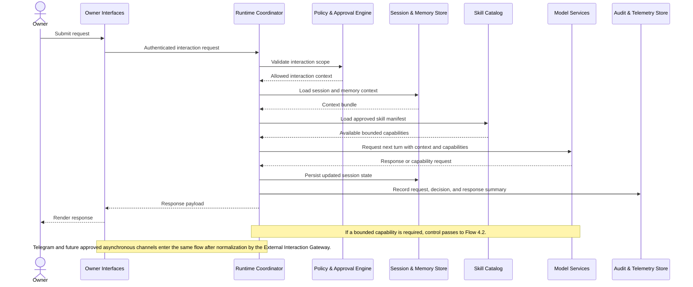
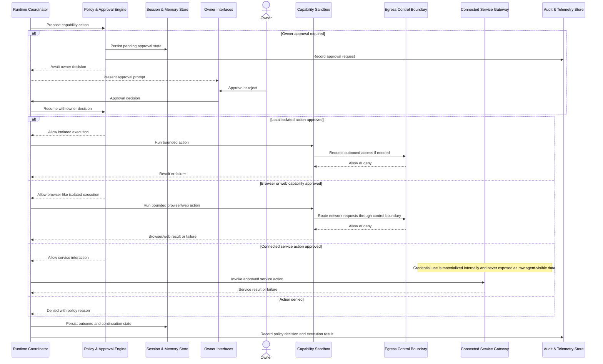
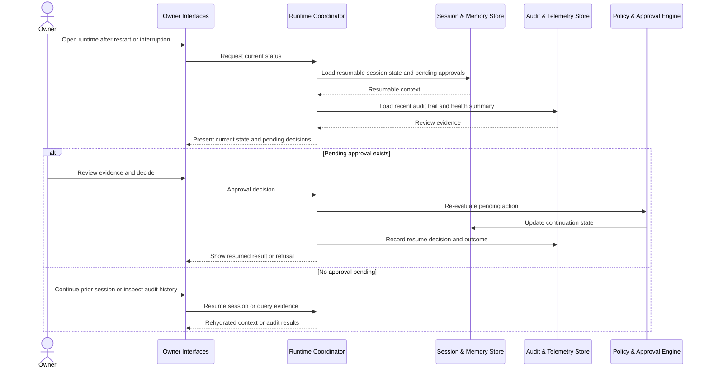

# Solution Architecture

## 0. Version History & Changelog
- v2.2.0 - Restored the missing problem-context rationale, standards positioning, layered model, middleware inventory, named flows, and richer cross-cutting architecture content.
- v2.1.0 - Restored the missing architectural philosophy detail and explicit entity/trust-boundary guidance that had been reduced too aggressively.
- v2.0.0 - Realigned the architecture to the current framework structure and the revised PRD, with stricter logical boundaries.
- v1.1.0 - Expanded runtime containers, isolation boundaries, and execution flows in the previous architecture format.
- v1.0.0 - Established the initial architecture artifact and moved core planning documents under `docs/`.
- ... [Older history truncated, refer to git logs]

## 1. Architectural Strategy & Archetype Alignment
### 1.1 Problem Context and Pattern Fit
- **Problem context:** OpenKraken is intentionally designed as a response to unsafe personal-agent patterns proven in earlier systems: prompt-based safety, implicit localhost trust, flat credential storage, unaudited memory mutation, uncontrolled outbound delivery, weak supply-chain controls, and full-host network inheritance. The architecture exists to remove those classes of failure by boundary design rather than by model obedience.
- **Architectural Pattern:** Layered modular monolith with isolated execution and adjunct control boundaries
- **Why this pattern fits the PRD:** The PRD describes a single-owner personal runtime that needs deterministic control, durable local state, explicit review points, and low operational overhead. A central coordinating runtime with clear internal boundaries satisfies those needs better than a distributed architecture. Brownfield repo reality already points in this direction: separate owner surfaces, a central runtime package, and dedicated outbound-control logic exist today, even though implementation depth is still uneven.
- **Core trade-offs accepted:** A central coordinator becomes a deliberate chokepoint; some tasks take extra hops through policy and approval boundaries before execution; extensibility is intentionally constrained by review and trust controls; deployment simplicity is favored over horizontal scale or multi-tenant elasticity.

### 1.2 Scope Definition and Interaction Boundaries
- **Local owner surfaces remain mandatory:** Command-line and browser-based operation are the baseline interaction surfaces for configuration, review, and direct work.
- **Asynchronous owner interaction remains in scope:** The architecture allows owner-approved external interaction channels, but they must normalize into the same runtime control path rather than creating sidecar orchestration logic.
- **Primary asynchronous channel:** Telegram is the primary non-local owner channel for the first-wave implementation.
- **Follow-on mediated channels:** Broader messaging and service channels may arrive through MCP-mediated paths later, but they inherit the same audit, approval, and policy boundaries.
- **Separate integration workstreams:** External units such as the Open Responses compliance adapter, AgentSkills.io-compatible skill intake, core filesystem tool bundle, and the RMM memory bank remain valid architectural commitments even when their source repositories or package publication live outside this repo.
- **Layer model:** The system still follows the five-layer conceptual model of Platform Manager, Host, Sandbox, Middleware Stack, and Runtime Coordinator; the container model below refines that layered view into explicit logical boundaries.

### 1.3 Core Philosophies
1. **Trust the sandbox, not the model.** Safety is enforced by isolated execution, policy boundaries, and explicit review points rather than by assuming the Agent will obey prompts.
2. **Immutability by default.** The Agent's constitutional inputs are runtime-injected and not modifiable by the Agent as working files or mutable local state.
3. **Ephemeral tooling.** Capability availability is provisioned by the platform boundary and exposed only as approved runtime capabilities, not through ad hoc package installation during execution.
4. **Capability-based security.** The system uses allowlists and bounded capability surfaces for files, execution, and network access; implicit trust and broad blacklists are insufficient.
5. **Supply-chain integrity.** Extension and dependency intake remain reviewable and reproducible; the Agent cannot silently extend its own execution base.
6. **Gated egress.** Outbound access is always mediated, attributable, and reviewable through a dedicated control boundary.
7. **Minimal tool surface.** Every exposed capability increases attack surface, so the Agent should receive only the smallest bounded capability set needed for approved work.
8. **Middleware-managed memory.** Durable memory is extracted, retrieved, consolidated, and injected by the runtime, not self-managed by the Agent.
9. **Single-tenant by design.** The system serves one Owner per instance as a deliberate simplification of trust, review, and operational boundaries.
10. **Everything is middleware.** Capabilities and controls are meant to compose through explicit runtime extension points rather than through hidden privileged shortcuts.
11. **Build on proven foundations.** Security-critical infrastructure should reuse battle-tested components and narrow custom logic to OpenKraken-specific boundary work.
12. **Reproducible infrastructure, invisible internals.** Packaging and deployment reproducibility matter, but those mechanics remain outside the Agent's world model.
13. **Tool-level isolation.** Different capability classes use isolation and validation suited to their actual risk, rather than pretending all actions share the same boundary.
14. **Identity injection.** The Agent receives the constitutional identity and standing directives as runtime context, not as exfiltratable files inside its execution environment.
15. **Durable state persistence.** Sessions, approvals, recovery state, and memory survive restarts as a core product behavior rather than a best-effort convenience.
16. **Observable by default.** Requests, decisions, actions, failures, and recoveries leave locally reviewable evidence.
17. **Credential isolation.** Raw credential material remains outside the Agent's direct reach and outside normal application state.
18. **Day-bounded sessions.** The logical session model remains tied to owner-local day boundaries so continuity, memory, and workspace reset semantics stay predictable.

### 1.4 Architectural Entities & Trust Relationships
- **Project:** Defines the platform, constitutional defaults, review posture, and the rules by which an OpenKraken instance is allowed to operate.
- **Owner:** Operates exactly one instance, provisions credentials, sets policy, approves sensitive work, and remains the only human authority inside that instance.
- **Agent:** Performs reasoning and work inside deterministic boundaries, but is never treated as a peer authority over policy, credentials, or its own constraints.
- **Runtime Coordinator:** Mediates between the Owner, the Agent, external channels, connected services, and host facilities, and is the only place where full orchestration context is assembled.
- **Egress Gateway:** A distinct outbound-control dependency that is required for policy-backed network access but is not treated as an implicitly trusted peer merely because it is local.
- **Platform Manager:** The host-facing provisioning and service-definition authority that translates canonical runtime requirements into native service-management behavior.
- **Trust posture:** The Owner chooses to trust the Project. The Project grants authority to the Owner. Neither the Owner nor the Project grants implicit trust to the Agent. The Runtime Coordinator does not blindly trust the Egress Gateway, external channels, or connected services; they are all explicit dependencies governed by narrow contracts.

### 1.5 Standards Positioning and Competitive Posture
- **Primary standards direction:** OpenKraken treats Open Responses as the primary interoperable external interface direction for standards-facing integration, while preserving a distinct owner-local control API for native CLI and browser operation.
- **Why it matters architecturally:** A standards-based response protocol keeps the runtime client-agnostic, makes external adapters less proprietary, and allows OpenKraken-specific extensions to be isolated behind explicit prefixed extension points instead of leaking custom behavior into every client.
- **Competitive posture:** OpenKraken differentiates by combining standards-based interoperability with deterministic local enforcement. The goal is not only to be compatible with emerging client ecosystems, but to offer a stricter trust boundary model than agent runtimes that treat shell access, memory writes, or secret handling as soft conventions.

## 2. System Containers
**Middleware classes in scope:**
- **Policy middleware:** Validates and constrains work before capability expansion.
- **Safety middleware:** Scrubs or blocks sensitive content and unsafe output.
- **Memory middleware:** Injects and consolidates durable context without giving the Agent raw memory authority.
- **Skill middleware:** Surfaces approved skills and trust metadata.
- **Scheduler middleware:** Injects scheduled execution context into the normal runtime path.
- **Human-in-the-loop middleware:** Suspends execution indefinitely until explicit owner decision is available.
- **Browser, web-search, and sub-agent middleware:** Valid capability classes that remain part of the architectural inventory even when some stay deferred in implementation planning.

### Owner Interfaces
- **Logical Type:** local client boundary
- **Responsibility:** Provide the command-line and browser-based surfaces through which the Owner starts conversations, reviews system state, answers approval requests, and inspects audit evidence.
- **Inputs:** Owner requests, approval decisions, review queries, runtime status updates
- **Outputs:** Authenticated requests to the Runtime Coordinator, rendered responses and review screens to the Owner
- **Depends on:** Runtime Coordinator

### External Interaction Gateway
- **Logical Type:** asynchronous channel boundary
- **Responsibility:** Normalize owner-approved non-local interactions into the same control path used by local owner surfaces and deliver outbound responses back through the approved channel.
- **Inputs:** Owner messages or events from approved asynchronous channels, runtime response payloads, policy-qualified delivery requests
- **Outputs:** Normalized interaction requests to the Runtime Coordinator, outbound channel deliveries, channel-origin metadata for audit
- **Depends on:** Runtime Coordinator, Audit & Telemetry Store

### Runtime Coordinator
- **Logical Type:** application service
- **Responsibility:** Orchestrate sessions, model turns, context assembly, capability sequencing, and response delivery across all other containers.
- **Inputs:** Requests from Owner Interfaces, triggers from Scheduler, approved skill manifests, stored session state, pending approval resumptions
- **Outputs:** Model requests, capability requests, state mutations, audit events, owner-facing responses
- **Depends on:** Policy & Approval Engine, Session & Memory Store, Audit & Telemetry Store, Capability Sandbox, Connected Service Gateway, Skill Catalog, Model Services

### Policy & Approval Engine
- **Logical Type:** policy boundary
- **Responsibility:** Evaluate owner-defined rules, determine whether actions are allowed, denied, or paused, and manage approval-gated execution.
- **Inputs:** Proposed actions, policy configuration, approval decisions, prior execution context
- **Outputs:** Allow or deny decisions, pending approval state, approval prompts, policy annotations for execution
- **Depends on:** Session & Memory Store, Audit & Telemetry Store

### Capability Sandbox
- **Logical Type:** isolated execution boundary
- **Responsibility:** Perform bounded command execution, file operations, and other local capability work in a constrained environment outside the Agent's direct control.
- **Inputs:** Approved execution requests, bounded working context, permitted resource descriptors
- **Outputs:** Execution results, artifacts, failure signals, outbound access attempts
- **Depends on:** Egress Control Boundary, Audit & Telemetry Store

### Egress Control Boundary
- **Logical Type:** network policy boundary
- **Responsibility:** Enforce outbound access rules for isolated execution and produce reviewable records for outbound attempts.
- **Inputs:** Outbound requests from the Capability Sandbox, effective network policy from the Runtime Coordinator
- **Outputs:** Allow or deny outcomes, connection results, audit-ready network events
- **Depends on:** Audit & Telemetry Store

### Connected Service Gateway
- **Logical Type:** adapter boundary
- **Responsibility:** Mediate interactions with Connected Services and use approved credential material without exposing raw secret values to the Agent.
- **Inputs:** Approved service actions, service configuration, credential handles, policy context
- **Outputs:** Service responses, delivery confirmations, service failures
- **Depends on:** Host Services, Audit & Telemetry Store

### Session & Memory Store
- **Logical Type:** state storage boundary
- **Responsibility:** Persist session state, Memory Records, schedule state, and resumable approval context across restarts.
- **Inputs:** Session writes, memory updates, schedule updates, approval continuation state
- **Outputs:** Retrieved context, resumable workflow state, memory retrieval results, schedule definitions
- **Depends on:** None

### Audit & Telemetry Store
- **Logical Type:** audit storage boundary
- **Responsibility:** Capture append-oriented Audit Records, health signals, and exportable operational evidence for local review and external analysis.
- **Inputs:** Audit events from runtime, policy, execution, scheduling, and service mediation boundaries
- **Outputs:** Review queries, health snapshots, export streams
- **Depends on:** None

### Scheduler
- **Logical Type:** trigger boundary
- **Responsibility:** Start delayed and recurring work, reconcile missed triggers after restart, and hand off scheduled execution to the Runtime Coordinator.
- **Inputs:** Schedule definitions, timer events, recovery state
- **Outputs:** Execution triggers, schedule status updates, audit events
- **Depends on:** Runtime Coordinator, Session & Memory Store, Audit & Telemetry Store

### Skill Catalog
- **Logical Type:** extension boundary
- **Responsibility:** Stage, review, classify, and expose approved Skills as bounded capabilities available to the Runtime Coordinator.
- **Inputs:** Skill packages, trust decisions, skill metadata, policy metadata
- **Outputs:** Approved skill manifests, activation status, review findings
- **Depends on:** Policy & Approval Engine, Session & Memory Store, Audit & Telemetry Store

## 3. Container Diagram (Mermaid)

```mermaid
C4Container
title Container Diagram

Person(owner, "Owner", "Single human who configures and supervises the runtime")

System_Boundary(openkraken, "OpenKraken") {
    Container(interfaces, "Owner Interfaces", "Local clients", "Command-line and browser surfaces for operation, review, and approvals")
    Container(channel_gateway, "External Interaction Gateway", "Asynchronous channel boundary", "Normalizes approved non-local interactions into the runtime control path")
    Container(runtime, "Runtime Coordinator", "Application service", "Coordinates sessions, model turns, and task execution")
    Container(policy, "Policy & Approval Engine", "Policy boundary", "Evaluates rules and manages approval gates")
    Container(exec, "Capability Sandbox", "Isolated execution boundary", "Runs bounded command and file capabilities")
    Container(egress, "Egress Control Boundary", "Network policy boundary", "Enforces outbound access rules for isolated execution")
    Container(service_gateway, "Connected Service Gateway", "Adapter boundary", "Executes credential-mediated service actions")
    ContainerDb(state, "Session & Memory Store", "State storage boundary", "Durable sessions, memory, schedule state, and approval continuation")
    ContainerDb(audit, "Audit & Telemetry Store", "Audit storage boundary", "Audit records, health signals, and exportable evidence")
    Container(scheduler, "Scheduler", "Trigger boundary", "Starts delayed and recurring work")
    Container(skill_catalog, "Skill Catalog", "Extension boundary", "Stages, reviews, and exposes approved skills")
}

System_Ext(model_services, "Model Services", "External reasoning services")
System_Ext(connected_services, "Connected Services", "Owner-approved external systems")
System_Ext(host_services, "Host Services", "Clock, credential facilities, and local platform services")

Rel(owner, interfaces, "Uses")
Rel(interfaces, runtime, "Synchronous request / response")
Rel(owner, channel_gateway, "Uses through approved asynchronous channels")
Rel(channel_gateway, runtime, "Normalized request / response")
Rel(channel_gateway, audit, "Append channel events")
Rel(runtime, policy, "In-process decision request")
Rel(runtime, state, "Read / write session and memory state")
Rel(runtime, audit, "Append audit and health events")
Rel(runtime, exec, "Dispatch approved isolated actions")
Rel(runtime, service_gateway, "Dispatch approved service actions")
Rel(runtime, skill_catalog, "Load approved skill manifests")
Rel(runtime, model_services, "Request reasoning from")
Rel(policy, state, "Persist approval continuation state")
Rel(policy, audit, "Append policy decisions")
Rel(exec, egress, "Route outbound access through")
Rel(exec, audit, "Emit execution outcomes to")
Rel(service_gateway, connected_services, "Interact with")
Rel(service_gateway, host_services, "Materialize credential use via")
Rel(service_gateway, audit, "Emit service outcomes to")
Rel(scheduler, runtime, "Asynchronous execution trigger")
Rel(scheduler, state, "Read / write schedule state")
Rel(scheduler, audit, "Emit schedule events to")
Rel(skill_catalog, policy, "Receive trust and activation decisions from")
Rel(skill_catalog, state, "Persist skill review state to")
Rel(skill_catalog, audit, "Emit review events to")
```

## 4. Critical Execution Flows
### 4.1 Interactive Conversation via Local Interfaces or Telegram
- **Maps to PRD capability:** Owner Interaction (P0), Durable Context and Continuity (P0)

### 4.2 Guarded Terminal and Browser Capability Invocation
- **Maps to PRD capability:** Constrained Work Execution (P0), Credential-Mediated Integrations (P0)

### 4.3 Recovery, Review, and Approval Resumption
- **Maps to PRD capability:** Auditability and Oversight (P0), Durable Context and Continuity (P0)

## 5. Resilience & Cross-Cutting Concerns
- **Security / Identity Strategy:** The Owner authenticates at the interface boundary, while the Runtime Coordinator acts as the sole path into model use, capability invocation, and service interaction. Policy evaluation is mandatory before any meaningful action. Sensitive service access is mediated through the Connected Service Gateway so the Agent never receives raw credential material. Isolated execution and outbound control remain separate boundaries to preserve fail-closed behavior.
- **Observability Strategy:** Every ingress, policy decision, approval request, isolated execution, connected-service action, schedule trigger, and recovery step emits Audit Records with correlation to the owning session or task. Local review is first-class, while export remains a downstream concern rather than the primary source of truth.
- **Failure Handling and Degradation:** The architecture fails closed on policy uncertainty, approval ambiguity, credential retrieval failure, and outbound-control failure. Capability failures degrade only the affected action, not the entire runtime, and resumable state allows recovery after restarts. If a mandatory control boundary is unhealthy, the runtime remains alive but not ready for unsafe work.
- **Skill Ingestion and Trusting Process:** Skill intake is a separate architectural path from ordinary capability execution. Skills are staged, classified, reviewed, approved, and only then surfaced through bounded runtime capability exposure. The runtime must preserve tiered trust rather than collapsing all extensions into one undifferentiated tool surface.
- **Service Lifecycle Management:** Startup order matters: configuration, state, credential boundary, sandbox/egress checks, then owner-facing bind. Shutdown likewise prioritizes quiescing ingress, settling work, persisting resumable state, and only then releasing dependencies.
- **Configuration Strategy:** Owner-managed configuration is separated logically into interaction settings, policy rules, service authorizations, skill trust metadata, and schedule definitions. Runtime state and audit evidence are not used as configuration stores. Secret material remains outside normal configuration and is accessed only through the credential-mediated boundary.
- **Data Integrity / Consistency Notes:** Session state, memory state, schedule state, and approval continuation state are durable and authoritative for recovery. Audit storage is append-oriented to preserve reconstructability. Memory is derived from prior work but remains owner-reviewable and purgeable. Scheduled work and approval resumption must be safe to retry without duplicating the logical outcome.

## 6. Logical Risks & Technical Debt
### High-Priority Risks
- **Risk:** The Runtime Coordinator can become a structural bottleneck or "god object."
- **Why it matters:** Too much decision-making concentrated in one place will blur boundaries, make policy bypasses easier, and complicate later implementation contracts.
- **Mitigation or follow-up:** The TechSpec should define explicit ports between runtime coordination, policy evaluation, execution, storage, and service mediation so the coordinator remains orchestration-only.

- **Risk:** Extensibility and deterministic safety will pull against each other.
- **Why it matters:** Skills, standards adapters, and connected-service integrations create the highest pressure to weaken review, approval, or policy boundaries in the name of convenience.
- **Mitigation or follow-up:** Keep skill review, trust classification, credential-mediated service access, and standards-facing adapters as explicit architectural seams rather than collapsing them into direct runtime execution.

### Medium-Priority Risks
- **Risk:** Brownfield code currently trails the intended boundary model.
- **Why it matters:** The repo already contains the right major packages, but several flows are still scaffolded or partial, so the docs can overstate present guarantees if this gap is ignored.
- **Mitigation or follow-up:** Treat this architecture as the target logical shape, and make the TechSpec explicitly call out where current implementation is incomplete versus where the boundary is already materially present.

- **Risk:** Equivalent semantics across supported host environments may drift over time.
- **Why it matters:** The PRD promises consistent product behavior for the Owner, but isolated execution, outbound control, and host-service mediation are the most platform-sensitive parts of the system.
- **Mitigation or follow-up:** The TechSpec should define semantic parity tests at the boundary level so cross-platform support is validated as behavior, not assumed from implementation intent.

### Technical Debt
- **Risk:** The current architecture depends on several separate external workstreams landing cleanly.
- **Why it matters:** Core filesystem tools, AgentSkills.io-compatible skill workflows, Open Responses compliance, and the RMM memory bank each exist as separate units of work, so integration timing can create drift between target architecture and repo reality.
- **Mitigation or follow-up:** TechSpec and Tasks should keep these units explicit as integration contracts rather than smearing their responsibilities across unrelated runtime tickets.
