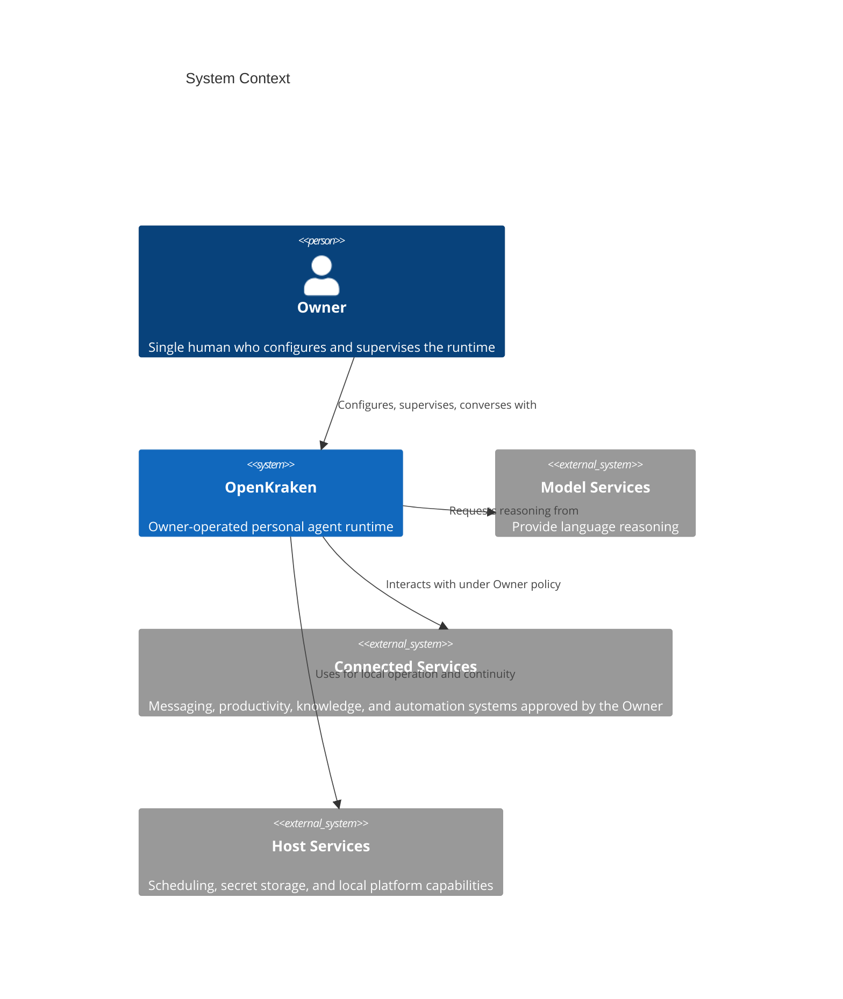
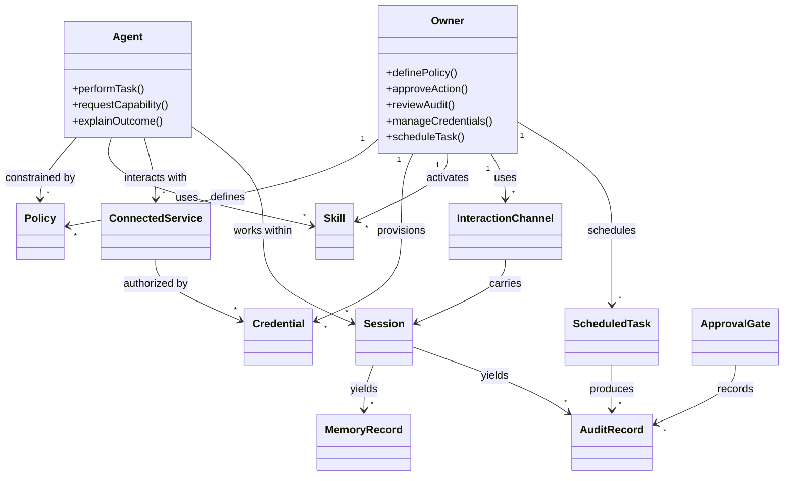

# Product Requirements Document

## 0. Version History & Changelog
- v2.2.1 - Restored the hard release-quality success thresholds so QA and acceptance decisions keep the original OpenKraken-specific behavioral bars.
- v2.2.0 - Re-expanded the PRD inside the framework structure so the old success criteria, persona posture, capability continuity, named integration scope, and anti-pattern commitments are preserved rather than merely summarized.
- v2.1.0 - Restored the missing success criteria, value/constitution model, explicit capability IDs, named integration scope, and anti-pattern commitments within the current framework structure.
- ... [Older history truncated, refer to git logs]

## 1. Executive Summary & Target Archetype
- **Target Archetype:** Owner-operated personal agent runtime
- **Vision:** A single person can run a genuinely useful AI agent on their own infrastructure without trusting the model to behave safely; the system remains helpful because its boundaries are deterministic, inspectable, and owner-controlled.
- **Problem:** Personal AI agents are often either powerful but unsafe, or safe only because they refuse useful work. Existing offerings commonly mix secret handling, unrestricted execution, weak auditability, and vague safety promises, forcing security-conscious owners to choose between capability and trust.
- **Jobs to Be Done:** Help me delegate real work to an AI agent without surrendering control; let me connect the agent to my files, tools, and services under explicit rules; let me audit, pause, approve, and recover the agent's actions as the sole operator of the system.
- **Success Metrics:** The Owner can provision credentials for integrations without those credentials appearing in logs, files, or agent-visible traffic; the Agent cannot reach unapproved files or network destinations regardless of prompt framing; every meaningful action is observable and reconstructable; the runtime remains continuously available enough for scheduled work and fast owner interaction; and the system feels like a capable assistant that happens to be unbreakable rather than an unbreakable runtime that refuses useful work.
- **Cross-Platform Consistency Criteria:** Supported platforms shall preserve equivalent capability semantics for path validation, egress policy enforcement, credential handling, owner interfaces, and session recovery, with platform-specific differences limited to the underlying host mechanism rather than the product behavior experienced by the Owner.

The qualitative product posture above is backed by explicit release-quality thresholds:
- **Helpfulness threshold:** The Agent completes at least `80%` of non-policy-violating Owner requests within the configured capability scope, with meaningful progress communicated when full completion requires Owner intervention.
- **Honesty threshold:** `Zero confirmed hallucinations` are accepted in Owner-audited sessions; uncertainty must be stated explicitly instead of masked by plausible synthesis.
- **Harmlessness threshold:** `Zero policy violations that result in actual harm` are accepted for release.
- **Transparency threshold:** The Owner can audit `100%` of meaningful Agent decisions and actions through the product's review surfaces and durable evidence model.

OpenKraken is not meant to feel like a research demo or a "safe mode" wrapper around an unsafe agent. The product promise is stronger and narrower: it should feel like a capable personal operator that happens to be architecturally hard to misuse. The Owner should not have to trade away usefulness to obtain trust.

The project also preserves a specific emotional and operational posture. The Owner is expected to feel cautious confidence rather than blind trust: they should be able to inspect boundaries, verify outcomes, and understand why the Agent could or could not perform an action. That owner-facing clarity is itself part of the product requirement.

The product also preserves four operating values as owner-visible commitments: helpfulness, honesty, harmlessness, and transparency. The system must stay useful for real work without hiding uncertainty, relaxing safety boundaries, or making its behavior opaque to the Owner.

OpenKraken also preserves a stable four-part constitutional model that remains intelligible to the Owner: an immutable identity layer, a normative safety layer, a factual operating-environment layer, and owner-authored standing directives. Higher-priority constitutional layers override lower-priority ones, and later implementation details SHALL preserve that user-facing precedence model.

## 2. Ubiquitous Language (Glossary)
| Term | Definition | Do Not Use |
| --- | --- | --- |
| Owner | The single human who provisions, configures, supervises, and uses one OpenKraken instance. | User, customer, tenant, admin |
| Agent | The managed AI subsystem that performs work for the Owner within enforced boundaries. | Bot, chatbot, worker, assistant |
| Policy | An owner-defined rule that constrains what the Agent may access, invoke, or send. | Preference, hint, suggestion |
| Skill | A packaged extension that gives the Agent additional bounded capabilities. | Plugin, addon, module |
| Interaction Channel | Any surface through which the Owner and the Agent exchange requests or responses. | Endpoint, transport, adapter |
| Connected Service | Any external system the Owner authorizes OpenKraken to interact with on their behalf. | Vendor, provider, dependency |
| Credential | A secret value that authorizes access to a Connected Service. | Secret, token, password, key |
| Session | A bounded working context in which conversations, actions, and state evolve together. | Thread, chat, run |
| Memory Record | Durable context retained from prior work so future sessions can recover relevant facts. | Note, cache, scratchpad |
| Audit Record | A durable record of an Agent action, decision, approval, refusal, or failure. | Log line, trace event, debug output |
| Scheduled Task | A task the Owner configures to run without a live interactive conversation. | Cron job, automation script |
| Approval Gate | An explicit owner review point that must be satisfied before a sensitive action proceeds. | Pop-up, confirmation dialog, interrupt |

## 3. Actors & Personas
### 3.1 Primary Actor
- **Role:** Owner
- **Context:** A technically capable individual operating a single personal instance on hardware or hosting they control.
- **Goals:** Delegate meaningful work to an AI agent; maintain sovereignty over credentials, data, and policy; understand what the Agent did and why; keep the system operable without enterprise overhead.
- **Frictions:** Existing agents overreach, hide behavior, blur trust boundaries, expose secrets, or become unusably timid when safety is bolted on after the fact.

The Owner is the entire user base for this version of OpenKraken. They are not looking for shared workspaces, delegated administration, team RBAC, or hosted convenience. They want one instance they fully control, can reason about, and can recover themselves. Telegram may be the first non-local interaction path, but the Owner remains the only human authority across all channels.

### 3.2 Secondary Actor
- **Role:** Agent
- **Context:** A managed subsystem asked to reason, use tools, interact with services, and continue work across sessions without becoming an authority over its own constraints.
- **Goals:** Complete Owner-authorized tasks, stay within policy, explain limitations clearly, and hand control back when approval is required.
- **Frictions:** Limited access by design, incomplete context, temporary external failures, and the need to remain useful without bypassing constraints.

The Agent is not a co-equal user of the system. It is a bounded subsystem. It does not own credentials, cannot redefine its constitutional inputs, and does not get to decide that a constraint is optional because a task feels urgent. Its usefulness comes from operating well inside that envelope, not from being treated as a privileged shell user.

### 3.3 Secondary Actor
- **Role:** Connected Service
- **Context:** External messaging, productivity, knowledge, or automation systems that exchange data with OpenKraken under Owner authorization.
- **Goals:** Receive bounded requests, return predictable results, and support the Owner's workflows without becoming implicit trust anchors.
- **Frictions:** Variable reliability, rate limits, changing interfaces, and the risk of becoming a path for exfiltration or prompt injection.

Connected Services include both first-class named channels and broader mediated integrations. Named early scope includes Telegram, Slack, Discord, email, and calendar-class services. Additional services may arrive later, but they must still behave as explicit, owner-authorized edges of the system rather than as trusted internal components.

## 4. Functional Capabilities
The following capability inventory preserves the legacy capability identifiers so that downstream architecture, TechSpec, issue planning, and external workstreams can continue to refer to stable product commitments. Missing numeric ranges are intentional continuity gaps rather than omitted requirements.

### Epic: Owner Interaction
- **Priority:** P0
- **Capability ID:** CAP-001
- **Capability:** The System shall provide conversational interaction between the Owner and the Agent through both command and browser interfaces while maintaining conversation context across turns within a session.
- **Rationale:** A personal agent runtime must be operable directly by its Owner without requiring another service or interface layer.
- **Priority:** P0
- **Capability ID:** CAP-080
- **Capability:** The System shall provide a Command Line Interface for configuration management, diagnostics, automation, and direct interaction, with secure owner authentication and feature parity expectations relative to the browser interface.
- **Rationale:** The Owner needs a scriptable and inspection-friendly surface for development, debugging, and operational control.
- **Priority:** P0
- **Capability ID:** CAP-081
- **Capability:** The System shall provide a browser-based interface for conversation, system visibility, policy/configuration workflows, and dashboard-style review of system state.
- **Rationale:** The Owner needs a persistent visual surface for monitoring and day-to-day operation, not only command-driven access.
- **Priority:** P1
- **Capability ID:** CAP-053
- **Capability:** The System shall support Telegram as the primary real-time bidirectional asynchronous interaction channel for the first non-local implementation line.
- **Rationale:** The product needs one explicit off-machine owner channel that preserves the single-owner interaction model.
- **Priority:** P1
- **Capability ID:** CAP-082
- **Capability:** The command interface shall remain keyboard-navigable and screen-reader compatible.
- **Rationale:** Accessibility is part of owner operability, not an optional polish item.
- **Priority:** P1
- **Capability ID:** CAP-083
- **Capability:** The browser interface shall satisfy WCAG 2.1 AA-equivalent accessibility expectations for color contrast, keyboard navigation, focus management, and screen-reader compatibility.
- **Rationale:** The primary browser surface must remain usable without excluding accessible interaction modes.
- **Priority:** P1
- **Capability ID:** CAP-050
- **Capability:** The System shall support owner-approved asynchronous and mediated interaction paths beyond Telegram through integration adapters for services such as Slack, Discord, email, and calendar, with additional adapters allowed over time.
- **Rationale:** Personal agents become more useful when they can reach the Owner through selected external channels without changing the single-owner model.

### Epic: Constrained Work Execution
- **Priority:** P0
- **Capability ID:** CAP-002
- **Capability:** The System shall execute terminal commands on behalf of the Agent within the bounded execution environment, with command invocations recorded before execution.
- **Rationale:** The product must enable meaningful task completion rather than act as a read-only chat shell.
- **Priority:** P0
- **Capability ID:** CAP-003
- **Capability:** The System shall perform file operations on behalf of the Agent, including read, write, list, and delete, subject to owner-defined path boundaries.
- **Rationale:** Practical automation depends on bounded file manipulation, not only on language output.
- **Priority:** P0
- **Capability ID:** CAP-004
- **Capability:** The System shall provide web and browser automation capabilities under the same bounded outbound-control model used for other external interactions.
- **Rationale:** Useful agent work often includes information retrieval and browser-mediated workflows.
- **Priority:** P0
- **Capability ID:** CAP-010
- **Capability:** The System shall isolate Agent execution so the Agent cannot access host resources, network destinations, or filesystem paths outside explicitly permitted boundaries regardless of input manipulation.
- **Rationale:** Deterministic safety is the core product promise and must apply to every capability, not only the most dangerous ones.
- **Priority:** P0
- **Capability ID:** CAP-012
- **Capability:** The System shall enforce allowlist-based outbound control, blocking all outbound connections to destinations not explicitly approved by the Owner.
- **Rationale:** Uncontrolled egress turns otherwise bounded capabilities into exfiltration paths.
- **Priority:** P0
- **Capability ID:** CAP-014
- **Capability:** The System shall validate all file paths against the Owner-defined allowlist before execution and operate the Agent within a bounded filesystem model with logical zones.
- **Rationale:** Path control is a first-class safety boundary, not a convenience feature.
- **Priority:** P0
- **Capability ID:** CAP-013
- **Capability:** The System shall inject Agent identity at runtime rather than as agent-readable files.
- **Rationale:** Identity material must not become exfiltratable content inside the execution environment.
- **Priority:** P0
- **Capability ID:** CAP-015
- **Capability:** The System shall require explicit Owner approval before high-risk actions proceed when policy calls for human review.
- **Rationale:** Some work should be possible, but only with a deliberate owner checkpoint instead of blanket refusal or silent execution.

### Epic: Credential-Mediated Integrations
- **Priority:** P0
- **Capability ID:** CAP-011
- **Capability:** The System shall let the Owner provision credentials for Connected Services without exposing raw secret values to the Agent.
- **Rationale:** Connected services are necessary for usefulness, but secret handling cannot depend on model obedience.
- **Priority:** P1
- **Capability ID:** CAP-051
- **Capability:** The System shall let the Owner configure integrations through owner-facing interfaces while preserving credential-mediated access and explicit per-service authorization.
- **Rationale:** The runtime should support real workflows across the services the Owner actually uses.
- **Priority:** P1
- **Capability ID:** CAP-052
- **Capability:** The System shall support Telegram as a first-class integration channel, providing real-time bidirectional interaction semantics under the same owner, audit, and policy model as the local interfaces.
- **Rationale:** Telegram is the primary first-wave non-local channel and must be treated as an explicit product capability rather than incidental adapter behavior.
- **Priority:** P1
- **Capability ID:** CAP-054
- **Capability:** The System shall let the Owner review, rotate, revoke, and re-authorize service access over time.
- **Rationale:** Long-lived personal systems need ongoing secret hygiene and reversible integration management.

### Epic: Durable Context and Continuity
- **Priority:** P0
- **Capability ID:** CAP-005
- **Capability:** The System shall preserve conversation state, intermediate reasoning, and execution context so useful work is not lost when the runtime stops or recovers.
- **Rationale:** A personal agent runtime must behave like durable infrastructure, not a disposable chat tab.
- **Priority:** P0
- **Capability ID:** CAP-030
- **Capability:** The System shall automatically extract and consolidate relevant context from prior sessions for later retrieval without requiring the Agent to self-manage long-term memory.
- **Rationale:** The product should compound usefulness over time while keeping the Owner in control of what is retained.
- **Priority:** P1
- **Capability ID:** CAP-031
- **Capability:** The System shall persist memory data in protected form so durable context cannot be trivially exfiltrated through ordinary agent-visible storage paths.
- **Rationale:** Durable context must not become a new secret leakage channel.
- **Priority:** P1
- **Capability ID:** CAP-032
- **Capability:** The System shall let the Owner inspect and selectively purge stored context, including memories and session history.
- **Rationale:** Retention without owner control would undermine trust and make the system operationally brittle.

### Epic: Auditability and Oversight
- **Priority:** P0
- **Capability ID:** CAP-060
- **Capability:** The System shall provide comprehensive telemetry for Agent operations, including execution traces, timing information, and structured event logs.
- **Rationale:** A deterministic runtime needs operational visibility as part of its core value.
- **Priority:** P0
- **Capability ID:** CAP-061
- **Capability:** The System shall create durable Audit Records for Agent actions, tool use, approvals, failures, and policy decisions.
- **Rationale:** The Owner must be able to reconstruct what happened without relying on the Agent's description after the fact.
- **Priority:** P0
- **Capability ID:** CAP-062
- **Capability:** The System shall expose operational evidence both through local reviewable storage and through exportable formats for external monitoring chosen by the Owner.
- **Rationale:** Local review remains primary, but owners may still want integration with broader observability tooling.
- **Priority:** P0
- **Capability ID:** CAP-064
- **Capability:** The System shall present health, recent activity, and error state in a way the Owner can review locally.
- **Rationale:** A security-first runtime that cannot be observed or debugged is not operationally trustworthy.
- **Priority:** P1
- **Capability ID:** CAP-063
- **Capability:** The System shall retry transient failures in model and external-service interactions using bounded retry behavior while recording those retries for owner review.
- **Rationale:** Reliability should improve without turning failures invisible or unauditable.

### Epic: Skills and Extensibility
- **Priority:** P1
- **Capability ID:** CAP-020
- **Capability:** The System shall let the Owner install or author Skills that extend the Agent's capabilities under explicit trust boundaries.
- **Rationale:** Personal workflows differ; extensibility is necessary, but it must not bypass the product's safety model.
- **Priority:** P1
- **Capability ID:** CAP-021
- **Capability:** The System shall ingest Skill dependencies from reviewable and reproducible dependency declarations rather than relying on unconstrained runtime dependency resolution.
- **Rationale:** Skills must remain reproducible and reviewable as packages, not ad hoc code drops.
- **Priority:** P1
- **Capability ID:** CAP-022
- **Capability:** The System shall prevent Skills from self-installing arbitrary runtime dependencies during use.
- **Rationale:** Supply-chain integrity is incompatible with arbitrary live package installation.
- **Priority:** P1
- **Capability ID:** CAP-023
- **Capability:** The System shall make approved Skills available on demand without requiring system mutation at the moment of use.
- **Rationale:** The Owner should gain extensibility without turning the host into a mutable tool staging area.
- **Priority:** P1
- **Capability ID:** CAP-024
- **Capability:** The System shall enforce a tiered trust model for Skills, classifying them as `System`, `Owner`, or `Community` Skills and applying different review and execution constraints to each class.
- **Rationale:** Not every extension deserves the same level of trust, and downstream policy, UI, persistence, and adjacent skill workstreams need stable tier names rather than generic trust language.
- **Priority:** P2
- **Capability ID:** CAP-025
- **Capability:** The System shall help the Owner understand what a Skill can do before it becomes active.
- **Rationale:** Extension safety depends on informed activation, not blind installation.

### Epic: Scheduled and Background Work
- **Priority:** P1
- **Capability ID:** CAP-040
- **Capability:** The System shall let the Owner schedule recurring or delayed tasks that run without a live conversation.
- **Rationale:** A useful personal agent should continue working when the Owner is away, not only in an interactive session.
- **Priority:** P1
- **Capability ID:** CAP-041
- **Capability:** The System shall trigger scheduled work through the normal execution path with the same context and boundary model used for interactive work.
- **Rationale:** Scheduled work must not become a side door around the core safety model.
- **Priority:** P1
- **Capability ID:** CAP-042
- **Capability:** The System shall retain the result, status, and audit trail of each Scheduled Task for later review.
- **Rationale:** Background automation only builds trust when its outcomes are visible and reconstructable.

### Epic: Deployment Portability
- **Priority:** P1
- **Capability ID:** CAP-006
- **Capability:** The System shall operate as a persistent background service so scheduled work, external callbacks, and owner interactions do not depend on manually starting the runtime for each use.
- **Rationale:** This is infrastructure, not a disposable one-shot script.
- **Priority:** P1
- **Capability ID:** CAP-070
- **Capability:** The System shall support the single-owner deployment model across supported host environments with equivalent product semantics.
- **Rationale:** The product promise should not materially change based on the Owner's operating environment.
- **Priority:** P2
- **Capability ID:** CAP-071
- **Capability:** The System shall normalize paths and equivalent capability semantics across supported host environments so platform differences do not change what the product means.
- **Rationale:** Cross-platform support is a product promise, not just an implementation note.
- **Priority:** P2
- **Capability ID:** CAP-072
- **Capability:** The System shall make installation, upgrade, backup, and recovery manageable by one technically capable owner.
- **Rationale:** Operational complexity directly erodes the value of a personal runtime.

## 5. Non-Functional Constraints
- **Performance:** Interactive operations should feel immediate relative to model and external-service latency; routine diagnostics and configuration reads should return promptly; scheduled work should begin close to its configured time under normal conditions.
- **Reliability:** Durable state must survive routine restarts and recoverable failures; degradation in one Connected Service must not take down the entire runtime; background tasks and interactive sessions must leave reviewable outcomes even on failure.
- **Security & Privacy:** Safety boundaries must default to deny rather than assume trust; credentials must remain inaccessible to the Agent as raw values; outbound actions must be attributable and reviewable; the product must not depend on prompt obedience as its primary safety control.
- **Operability:** A single technically capable Owner must be able to install, configure, observe, back up, and recover the system without enterprise-only tooling or multi-person operations.
- **Domain-specific Constraints:** The first version remains single-owner and single-instance; command and browser interfaces must be accessible by keyboard and screen reader; the runtime must remain useful even when some external services are temporarily unavailable.
- **Prohibited Patterns:** Prompt-based safety as the primary control model, credentials in agent-accessible operating context, implicit localhost trust, agent-modifiable identity or governing constraints, flat permission models, unaudited durable memory writes, uncontrolled outbound access, runtime self-installation of new capabilities, and mutable agent-visible constitutional identity are all explicitly disallowed.

The prohibition list is normative because these are the exact failure classes the product exists to avoid. OpenKraken is not allowed to "temporarily" violate them for convenience. If a future capability appears to require any of these patterns, that is evidence that the capability needs to be redesigned or re-scoped.

## 6. Boundary Analysis
### In Scope
- A single-owner personal AI agent runtime
- Deterministic control over what the Agent may access, invoke, or transmit
- Local command and browser-based interfaces for operation and oversight
- Owner-approved external interaction channels and Connected Services, including Telegram as the first non-local channel and Slack, Discord, email, and calendar-class services as named mediated integration scope
- Durable sessions, Memory Records, Scheduled Tasks, and Audit Records
- Skill-based extensibility with trust-aware review and activation controls

### Out of Scope
- Multi-user collaboration, shared instances, or tenant isolation
- A hosted multi-tenant SaaS offering
- Agent self-modification of its governing rules or safety boundaries
- Unrestricted file access, unrestricted outbound access, or implicit trust in any channel
- Direct WhatsApp integration without a mediated bridge
- Voice-first experiences, consumer social features, or native mobile applications
- A general-purpose container, cluster, or infrastructure orchestration platform
- An open marketplace where unreviewed extensions execute with broad trust by default

Direct WhatsApp support remains excluded because it would require a distinct mediation bridge and trust story not yet accepted into the product scope. Additional channels are allowed only when they fit the same owner-authorized, auditable, and bounded interaction model.

## 7. Conceptual Diagrams (Mermaid)
### 7.1 System Context

### 7.2 Domain Model

## Appendix: Operator Preferences
- Continue the four-document planning pipeline and use the latest framework structure for all follow-on documentation.
- Preserve the single-tenant, owner-operated product stance as a non-negotiable direction.
- Existing project preferences to honor in later layers, without treating them as product requirements: Bun for the orchestration runtime, OS-native isolation, SQLite-based durable state, LangChain/LangGraph-style agent orchestration, OpenTelemetry-compatible observability, and Nix-based packaging/deployment.
- Existing repo direction suggests the first owner-facing surfaces should remain a command-line interface and a browser-based interface, with additional external channels added under explicit owner control.
