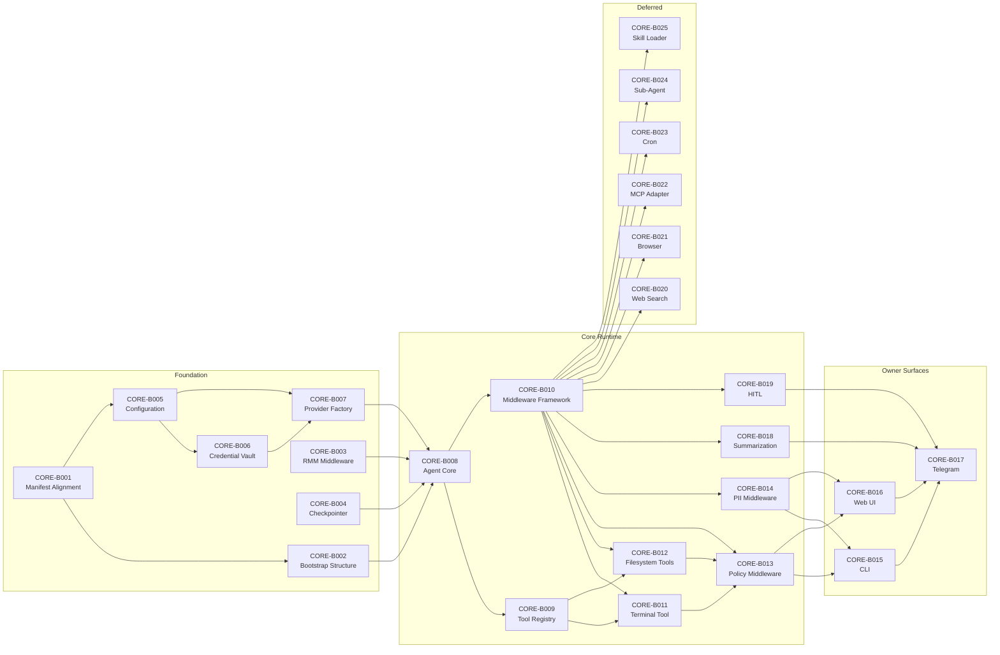

# Engineering Execution Plan

## 0. Version History & Changelog
- v2.1.0 - Restored one-to-one issue-backed Epic 2 tickets, reinstated RMM and secondary-provider planning, and restored full deferred ticket bodies with Gherkin.
- v2.0.0 - Rebuilt the Epic 2 plan against the current PRD, Architecture, and TechSpec; preserved legacy GitHub issue continuity; separated active work from deferred follow-ons.
- v1.1.0 - Legacy Epic 2 decomposition revised after infrastructure review and effort re-estimation.
- v1.0.0 - Initial Epic 2 task breakdown before framework-aligned restructuring.
- Older history truncated, refer to git logs.

## 1. Executive Summary & Active Critical Path
- **Total Active Story Points:** 69
- **Critical Path:** `CORE-B001 -> CORE-B002 -> CORE-B005 -> CORE-B006 -> CORE-B007 -> CORE-B008 -> CORE-B010 -> CORE-B011 -> CORE-B013 -> CORE-B019 -> CORE-B017`
- **Planning Assumptions:** Epic 1 infrastructure remains completed brownfield baseline and is not replanned here. Legacy GitHub issue continuity is preserved through explicit `Legacy Issue ID` mapping for every open Epic 2 issue. Telegram remains the primary non-local interaction channel for Epic 2. User-confirmed continuity assumptions that shall remain active in this plan, even where upstream docs need later backfill, are: RMM middleware as a real Epic 2 commitment, multi-provider readiness through LangChain connectors for Anthropic, OpenAI, and Google, and full deferred ticket preservation for `CORE-018` through `CORE-023`.

## 2. Project Phasing & Iteration Strategy
### Current Active Scope
- Deliver the runtime foundation for Epic 2: dependency alignment, bootstrap ordering, configuration enforcement, vault-backed owner auth, provider factory, agent core, middleware composition, and checkpoint-backed resumability.
- Complete the active capability line: RMM memory, terminal and filesystem tools, policy and PII controls, summarization, and human-in-the-loop approval.
- Ship the owner-facing surfaces for Epic 2: CLI, Web UI, and Telegram as the primary external interaction gateway.
- Keep the plan one-to-one with the live GitHub issue set rather than silently collapsing multiple issues into fewer tickets.

### Future / Deferred Scope
- `CORE-018` Web Search Middleware remains deferred until the synchronous Epic 2 runtime path is stable enough to absorb retrieval-specific policies and external dependency handling.
- `CORE-019` Browser Middleware remains deferred until browser automation constraints are ready to move from target-state planning into active implementation.
- `CORE-020` MCP Adapter remains deferred until the Telegram-first interaction path is stable and broader mediated channels are ready to inherit the same runtime boundaries.
- `CORE-021` Cron Middleware remains deferred until synchronous turns, approvals, and resumable execution are stable enough to support unattended scheduling.
- `CORE-022` Sub-Agent Middleware remains deferred until the single-agent runtime is stable enough to safely expose delegation.
- `CORE-023` Skill Loader Middleware remains deferred until the skill intake and approval path moves into active implementation.

### Archived or Already Completed Scope
- Epic 1 already delivered the platform path abstraction, SQLite migration baseline, sandbox zone model, credential-provider fallback chain, service modules, and the initial CLI and Web UI shells that this Epic 2 plan builds on.
- Completed Epic 1 work is authoritative brownfield context and SHALL NOT be copied back into the active backlog unless a specific regression or new delta is opened.
- Epic 1 brownfield inventory remains part of this plan because Epic 2 tickets are integration-heavy and must stay auditable against what already exists in-repo.

**Epic 1 Brownfield Inventory (authoritative baseline for Epic 2 planning):**

| Component | Current Repo Location | Brownfield Status | Planning Impact |
| --- | --- | --- | --- |
| Configuration system | `packages/orchestrator/src/config/index.ts` | Partial, basic loading exists | Config/bootstrap tickets are integration and expansion work, not blank-slate design |
| Credential vault | `packages/orchestrator/src/credentials/vault.ts` | Present with fallback-chain behavior | Auth and secret-management tickets build on an existing abstraction |
| Sandbox integration | `packages/orchestrator/src/sandbox/index.ts` | Framework present, tool integration incomplete | Execution tickets are boundary wiring plus capability integration |
| Platform path resolver | `packages/orchestrator/src/platform/resolver.ts` | Cross-platform resolver exists | Path semantics are a baseline, not new Epic 2 scope |
| Database schema lineage | `packages/orchestrator/migrations/*.sql` | Base tables and schema lineage exist | Checkpoint and state tickets extend brownfield state instead of inventing all persistence from scratch |
| CUE schema | `nix/schema/config.cue` | Validation baseline exists | Runtime config enforcement integrates an existing schema source of truth |
| Service modules | `nix/nixos-modules/openkraken.nix`, `nix/darwin-modules/openkraken.nix` | Platform service-management baseline exists | Lifecycle tickets integrate with existing deployment posture |
| CLI shell | `apps/cli/src` | Initial shell exists | CLI tickets are surface completion, auth wiring, and feature fill-in |
| Web UI shell | `apps/web-ui/src` | Initial shell exists | Web tickets are not-from-zero; they complete the owner surface over the canonical runtime contract |

**Brownfield gaps still driving Epic 2 scope:**
- Missing or incomplete dependency alignment for the intended LangChain, provider, Telegram, and RMM lines
- Incomplete orchestrator bootstrap and runtime entry flow
- Incomplete tool registry and middleware composition over the brownfield scaffolding
- Placeholder or partial owner-surface auth and interaction flows

## 3. Build Order (Mermaid)


## 4. Ticket List
### Epic B — Core Agent Runtime (CORE)

**CORE-B001 Dependency and Manifest Alignment**
- **Legacy Issue ID:** `CORE-PREP`
- **Type:** Chore
- **Effort:** 1
- **Dependencies:** None
- **Description:** Align orchestrator, CLI, and Web UI manifests and lockfiles with the active Epic 2 runtime line so the backlog reflects real dependencies rather than stale package assumptions.
- **Acceptance Criteria (Gherkin):**
```gherkin
Given the Epic 2 manifests for the orchestrator, CLI, and Web UI
When dependency alignment is completed
Then every package required by the active Epic 2 scope is declared in the correct workspace
And lockfiles reflect the aligned manifests
And missing-package assumptions from the old plan are removed where the repo already provides those dependencies
```

**CORE-B002 Runtime Entry Point and Module Structure**
- **Legacy Issue ID:** `CORE-PREP-2`
- **Type:** Chore
- **Effort:** 1
- **Dependencies:** `CORE-B001`
- **Description:** Convert the existing stubs and partial module layout into a coherent runtime entry structure for Epic 2 startup, exports, and surface initialization.
- **Acceptance Criteria (Gherkin):**
```gherkin
Given the Epic 2 runtime source tree
When the entry point and module structure are finalized
Then the orchestrator has a real startup shell instead of a placeholder-only main
And agent, tool, middleware, and surface modules resolve through the expected workspace structure
And the plan no longer claims required entry points or directories are missing when they already exist
```

**CORE-B003 RMM Middleware Integration**
- **Legacy Issue ID:** `CORE-001`
- **Type:** Feature
- **Effort:** 3
- **Dependencies:** `CORE-B001`
- **Description:** Integrate `@skroyc/rmm-middleware` as an active Epic 2 memory layer, including Prospective Reflection, Retrospective Reflection, and persistence behavior compatible with the broader runtime state model.
- **Acceptance Criteria (Gherkin):**
```gherkin
Given the RMM middleware package is available to the orchestrator
When memory middleware is configured for Epic 2
Then Prospective Reflection extracts topic-based memories after sessions
And Retrospective Reflection reranks retrieved memories using the configured learned weights
And Top-K retrieval and Top-M reranking are configurable and enabled by default for the runtime profile
And the memory bank persists through the approved runtime storage path without bypassing audit or encryption requirements
```

**CORE-B004 Checkpointer Integration**
- **Legacy Issue ID:** `CORE-002`
- **Type:** Feature
- **Effort:** 2
- **Dependencies:** `CORE-B001`
- **Description:** Integrate `@skroyc/bun-sqlite-checkpointer` as the LangGraph-compatible checkpoint layer for resumable execution, approval suspension, and restart recovery.
- **Acceptance Criteria (Gherkin):**
```gherkin
Given the checkpointer package is configured for the orchestrator
When the runtime starts against a valid SQLite database
Then checkpoint and write state are initialized using the canonical compatibility-safe tables
And agent execution state persists across process restarts
And checkpoint serialization and restore behavior remain compatible with the brownfield schema lineage documented in TechSpec
```

**CORE-B005 Configuration System Extension**
- **Legacy Issue ID:** `CORE-003`
- **Type:** Feature
- **Effort:** 2
- **Dependencies:** `CORE-B001`
- **Description:** Extend the existing configuration system to the current runtime contract, including precedence handling, env interpolation, CUE-backed validation, and restart-vs-live mutability behavior.
- **Acceptance Criteria (Gherkin):**
```gherkin
Given a runtime configuration document with environment placeholders and overrides
When the orchestrator starts or reloads configuration
Then environment interpolation and source precedence follow the TechSpec contract
And runtime validation rejects invalid or unknown fields before migrations or API bind
And mutability class differences are explicit between bootstrap-only, restart-required, and live-reloadable settings
And channel configuration preserves Telegram as primary and MCP as deferred follow-on scope
```

**CORE-B006 Credential Vault Integration**
- **Legacy Issue ID:** `CORE-004`
- **Type:** Security
- **Effort:** 1
- **Dependencies:** `CORE-B005`
- **Description:** Wire the existing CredentialVault implementation into runtime bootstrap and owner credential operations without weakening fallback or recovery behavior.
- **Acceptance Criteria (Gherkin):**
```gherkin
Given the orchestrator starts with credential-backed features enabled
When the CredentialVault is initialized
Then the primary provider is attempted first and the encrypted fallback is used only under the documented conditions
And credentials are never written to logs or plaintext storage
And the runtime exposes a clear provisioning path for missing secrets
And credential-management operations can be driven by owner-facing surfaces without bypassing the vault abstraction
```

**CORE-B007 LLM Provider Factory**
- **Legacy Issue ID:** `CORE-005`
- **Type:** Feature
- **Effort:** 3
- **Dependencies:** `CORE-B006`
- **Description:** Implement the provider factory that actively supports Anthropic, OpenAI, and Google through LangChain connectors, with Anthropic as the primary baseline and secondary providers ready through the same runtime boundary.
- **Acceptance Criteria (Gherkin):**
```gherkin
Given the orchestrator is configured with a supported model provider
When the agent runtime requests model inference
Then the provider factory initializes the matching LangChain connector with credentials from the vault
And Anthropic, OpenAI, and Google provider selections are supported through configuration
And token usage and provider errors are tracked through the runtime observability path
And provider fallback, where enabled, remains a runtime concern rather than a client-side branch
```

**CORE-B008 LangChain Agent Core**
- **Legacy Issue ID:** `CORE-006`
- **Type:** Feature
- **Effort:** 5
- **Dependencies:** `CORE-B002`, `CORE-B003`, `CORE-B004`, `CORE-B005`, `CORE-B006`, `CORE-B007`
- **Description:** Implement the main LangChain/LangGraph execution loop with constitution injection, checkpointer wiring, memory middleware, and thread-safe session behavior.
- **Acceptance Criteria (Gherkin):**
```gherkin
Given all Epic 2 foundation components are initialized
When the agent runtime is created
Then the runtime uses the configured provider factory, checkpointer, and RMM memory path
And the system prompt composes the canonical constitution inputs in the required order
And thread/session state is isolated and resumable
And the runtime can execute a chat turn without bypassing middleware or tool boundaries
```

**CORE-B009 Tool Registry System**
- **Legacy Issue ID:** `CORE-007`
- **Type:** Feature
- **Effort:** 3
- **Dependencies:** `CORE-B008`
- **Description:** Promote the brownfield registry into the canonical tool-registration boundary for built-in tools and future mediated capability loading.
- **Acceptance Criteria (Gherkin):**
```gherkin
Given the runtime capability set for Epic 2
When tools are registered into the registry
Then each tool has deterministic metadata, enablement state, and lookup behavior
And duplicate registrations are rejected
And the registry can enumerate only the tools enabled for the active runtime context
And tool execution returns structured results or structured failures
```

**CORE-B010 Middleware Composition Framework**
- **Legacy Issue ID:** `CORE-008`
- **Type:** Feature
- **Effort:** 5
- **Dependencies:** `CORE-B008`, `CORE-B009`
- **Description:** Implement the ordered middleware and callback composition model for policy, PII, summarization, HITL, and future deferred middleware layers.
- **Acceptance Criteria (Gherkin):**
```gherkin
Given the runtime middleware stack is configured
When an agent turn executes
Then middleware executes in deterministic order with explicit block and error behavior
And callbacks remain observational rather than privileged execution modifiers
And execution timing and failure information can be observed without breaking the ordering contract
And deferred middleware slots can later be added without invalidating the active runtime boundary
```

**CORE-B011 Terminal Tool Integration**
- **Legacy Issue ID:** `CORE-009`
- **Type:** Security
- **Effort:** 3
- **Dependencies:** `CORE-B009`, `CORE-B010`
- **Description:** Complete the terminal tool by routing execution through the sandbox runtime with timeout, structured result handling, and audit visibility.
- **Acceptance Criteria (Gherkin):**
```gherkin
Given an agent turn requests terminal execution
When the terminal tool is invoked
Then the command is validated by upstream runtime controls before execution
And execution occurs inside the sandbox boundary with timeout enforcement
And stdout, stderr, and exit status are returned in the canonical tool result shape
And command execution is observable through audit or telemetry without exposing secret material
```

**CORE-B012 Filesystem Tools Adaptation**
- **Legacy Issue ID:** `CORE-010`
- **Type:** Security
- **Effort:** 3
- **Dependencies:** `CORE-B009`, `CORE-B010`
- **Description:** Adapt the filesystem capabilities into the Epic 2 tool model with sandbox-zone enforcement, path validation, and structured read/write/list behavior.
- **Acceptance Criteria (Gherkin):**
```gherkin
Given the agent requests a filesystem operation
When a read, write, or directory action is invoked
Then path handling respects canonical sandbox-zone boundaries
And read and write permissions follow the configured zone policy
And directory results and file operation responses are returned in structured form
And denied paths fail explicitly before execution rather than being silently coerced
```

**CORE-B013 Policy Middleware**
- **Legacy Issue ID:** `CORE-011`
- **Type:** Security
- **Effort:** 5
- **Dependencies:** `CORE-B010`, `CORE-B011`, `CORE-B012`
- **Description:** Implement the foundational policy layer for rate limits, tool allowlisting, and pre-execution blocking of unsafe operations.
- **Acceptance Criteria (Gherkin):**
```gherkin
Given a runtime request that reaches the policy layer
When the request violates package, path, rate, or allowlist rules
Then policy middleware blocks execution before the tool runs
And the rejection reason is explicit to the runtime and audit path
And allowed requests continue through the remaining middleware chain
And policy decisions do not require client-local enforcement to be effective
```

**CORE-B014 PII Middleware**
- **Legacy Issue ID:** `CORE-012`
- **Type:** Security
- **Effort:** 3
- **Dependencies:** `CORE-B010`
- **Description:** Implement PII and sensitive-content detection as the callback-layer scanning and scrubbing path for Epic 2 interactions.
- **Acceptance Criteria (Gherkin):**
```gherkin
Given inbound or outbound content contains credentials, tokens, or sensitive patterns
When PII middleware processes that content
Then configured scrub or block behavior is applied consistently
And detection events are logged without exposing the sensitive values themselves
And sanitized content, where allowed, proceeds through the remaining runtime path
And the PII layer does not bypass policy or approval decisions
```

**CORE-B015 CLI Application**
- **Legacy Issue ID:** `CORE-013`
- **Type:** Feature
- **Effort:** 8
- **Dependencies:** `CORE-B011`, `CORE-B012`, `CORE-B013`, `CORE-B014`
- **Description:** Build the OpenTUI-based owner CLI as a thin surface over the canonical runtime control API, including chat, status, config, credentials, and logs.
- **Acceptance Criteria (Gherkin):**
```gherkin
Given the CLI is installed against a running local orchestrator
When the owner uses chat, status, config, credentials, or logs commands
Then the CLI authenticates through the documented owner-session contract
And commands call the canonical runtime API instead of embedding orchestration logic locally
And interactive chat behaves as an owner surface rather than a parallel runtime
And accessibility and keyboard-first operation remain intact for the TUI experience
```

**CORE-B016 Web UI Core**
- **Legacy Issue ID:** `CORE-014`
- **Type:** Feature
- **Effort:** 8
- **Dependencies:** `CORE-B011`, `CORE-B012`, `CORE-B013`, `CORE-B014`
- **Description:** Build the SvelteKit Web UI as the browser owner surface over the same local runtime API and session contract used by the CLI.
- **Acceptance Criteria (Gherkin):**
```gherkin
Given the Web UI is running against the local orchestrator
When the owner authenticates and uses chat, dashboard, or configuration views
Then browser flows use the canonical runtime API and session-cookie contract
And streaming or status behavior reflects runtime events rather than client-local orchestration
And the UI remains a thin surface over runtime decisions for policy, state, and approvals
And the interface remains accessible and responsive across supported owner devices
```

**CORE-B017 Telegram Adapter**
- **Legacy Issue ID:** `CORE-015`
- **Type:** Feature
- **Effort:** 5
- **Dependencies:** `CORE-B015`, `CORE-B016`, `CORE-B018`, `CORE-B019`
- **Description:** Implement Telegram via grammY as the first non-local external interaction gateway while reusing the same runtime execution, auth, audit, and approval boundaries as the local owner surfaces.
- **Acceptance Criteria (Gherkin):**
```gherkin
Given Telegram bot configuration is present and the runtime is healthy
When an authorized Telegram message reaches the runtime
Then the transport is normalized into the same orchestrator flow used by local owner requests
And approvals and audit events reuse the shared runtime boundaries
And unsupported or invalid transport events fail safely without creating a parallel orchestration path
And Telegram delivery and webhook failures are observable through the runtime error path
```

**CORE-B018 Summarization Middleware**
- **Legacy Issue ID:** `CORE-016`
- **Type:** Feature
- **Effort:** 3
- **Dependencies:** `CORE-B010`
- **Description:** Implement context compression and summarization so long-running sessions stay within context limits without losing durable continuity.
- **Acceptance Criteria (Gherkin):**
```gherkin
Given a conversation exceeds the active context threshold
When summarization middleware processes the session history
Then older content is condensed into a durable summary representation
And recent context needed for turn quality remains intact
And summary generation preserves key decisions and thread continuity
And summarization behavior and token savings are observable for debugging and audit
```

**CORE-B019 Human-in-the-Loop Middleware**
- **Legacy Issue ID:** `CORE-017`
- **Type:** Security
- **Effort:** 5
- **Dependencies:** `CORE-B010`, `CORE-B013`, `CORE-B004`
- **Description:** Implement the approval workflow that suspends execution for owner review, persists the interruption safely, and resumes or rejects based on the resulting decision.
- **Acceptance Criteria (Gherkin):**
```gherkin
Given an agent turn reaches an operation that requires owner approval
When HITL middleware intercepts that operation
Then execution is suspended and persisted through the approved resumability path
And the owner can approve or reject through the supported runtime surfaces
And approved operations resume from persisted state without losing thread continuity
And rejected operations terminate safely with explicit audit evidence
```

**CORE-B020 Web Search Middleware**
- **Legacy Issue ID:** `CORE-018`
- **Type:** Feature
- **Effort:** 5
- **Dependencies:** `CORE-B010`
- **Description:** Implement web search as a deferred middleware capability that routes retrieval through approved external dependency controls and exposes search results to the agent through the same capability boundary as built-in tools.
- **Acceptance Criteria (Gherkin):**
```gherkin
Given web search is enabled in a future Epic 2 follow-on increment
When the agent invokes a web search capability
Then the runtime routes the search through the approved external access boundary
And search usage, failures, and result provenance are observable
And retrieval policy and rate controls apply before results reach the agent
```

**CORE-B021 Browser Middleware**
- **Legacy Issue ID:** `CORE-019`
- **Type:** Feature
- **Effort:** 8
- **Dependencies:** `CORE-B010`
- **Description:** Implement browser automation as a deferred capability with isolated browser state, bounded execution, and the same outbound-control posture as the rest of the runtime.
- **Acceptance Criteria (Gherkin):**
```gherkin
Given browser middleware is enabled in a future Epic 2 follow-on increment
When the agent invokes a browser capability
Then browser sessions are isolated per runtime context
And network and filesystem activity remain bounded by the same runtime controls used elsewhere
And rendered page results are returned through a structured capability interface
And browser failures or policy violations fail closed
```

**CORE-B022 MCP Adapter**
- **Legacy Issue ID:** `CORE-020`
- **Type:** Feature
- **Effort:** 5
- **Dependencies:** `CORE-B010`
- **Description:** Implement the deferred MCP mediation layer so future external channels and connected services can be attached through the same orchestrator boundaries rather than through ad hoc adapters.
- **Acceptance Criteria (Gherkin):**
```gherkin
Given MCP server configuration exists in a future Epic 2 follow-on increment
When the MCP adapter initializes
Then server connections are established through the approved runtime mediation boundary
And MCP tools are exposed with explicit metadata and health visibility
And connection failures or tool errors are surfaced without bypassing policy or audit
And the adapter does not create a separate orchestration path outside the runtime
```

**CORE-B023 Cron Middleware**
- **Legacy Issue ID:** `CORE-021`
- **Type:** Feature
- **Effort:** 5
- **Dependencies:** `CORE-B010`
- **Description:** Implement deferred scheduled-task execution with missed-run recovery, auditability, and the same checkpoint and approval semantics used for interactive work.
- **Acceptance Criteria (Gherkin):**
```gherkin
Given a scheduled task is configured in a future Epic 2 follow-on increment
When its trigger time arrives or a missed run is recovered
Then the runtime executes the task through the canonical agent flow
And schedule execution is logged with enough detail to reconcile missed or repeated runs
And approvals and checkpoint persistence apply when the scheduled work requires them
```

**CORE-B024 Sub-Agent Middleware**
- **Legacy Issue ID:** `CORE-022`
- **Type:** Feature
- **Effort:** 8
- **Dependencies:** `CORE-B010`
- **Description:** Implement deferred task delegation through bounded sub-agent execution that inherits the same policy, sandbox, and observability constraints as the parent runtime.
- **Acceptance Criteria (Gherkin):**
```gherkin
Given sub-agent execution is enabled in a future Epic 2 follow-on increment
When the parent agent delegates a task
Then the sub-agent runs with inherited constraints and explicit delegation metadata
And delegated results are returned through the parent runtime path
And sub-agent creation remains bounded by explicit policy rather than open-ended recursion
And delegation activity is fully observable through audit and telemetry
```

**CORE-B025 Skill Loader Middleware**
- **Legacy Issue ID:** `CORE-023`
- **Type:** Feature
- **Effort:** 5
- **Dependencies:** `CORE-B010`
- **Description:** Implement deferred skill loading so approved skills can be activated through the staged intake pipeline and exposed safely to the runtime.
- **Acceptance Criteria (Gherkin):**
```gherkin
Given approved skill metadata exists in a future Epic 2 follow-on increment
When skill loader middleware initializes
Then only approved skills are resolved into the active runtime
And skill tools and manifests are exposed with version and provenance metadata
And unapproved or invalid skills are rejected before activation
And skill activation and failure events are recorded for audit
```
