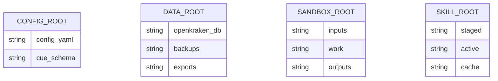

# Technical Specification

## 0. Version History & Changelog
- v2.10.0 - Re-expanded the TechSpec within the framework structure so the old implementation method, interface detail, data-model detail, configuration, testing, deployment, and security contracts remain canonical instead of surviving only as compressed summaries.
- v2.9.0 - Restored the Open Responses primary interface posture, external adapter integration units, regulatory/SBOM discussion, drift-prevention rules, richer implementation contracts, and the remaining missing operational details without bringing back research-only appendices.
- v2.8.0 - Restored missing canonical detail for RMM, constitution injection, day-bounded sessions, and the more explicit auth/recovery/service-resilience contracts that had been reduced too far.
- v2.7.0 - Realigned interaction-channel posture with the revised architecture: restored the asynchronous channel boundary logically, while keeping Telegram primary and MCP-backed channels as delayed follow-on implementation scope.
- v2.6.0 - Restored the explicit field-encryption contract and the compact build/CI/SBOM contract, including a brownfield note for the current `.#sbom` workflow drift.
- v2.5.0 - Restored a compact canonical security threat model and failure posture so the four-document set retains the old TechSpec's security intent without bringing back the full narrative appendix.
- v2.4.0 - Restored the remaining codebase-backed contracts for checkpoint schema lineage, owner auth lifecycle, config mutability, and platform path resolution without reverting to the old mixed-layer document.
- v2.3.0 - Restored high-signal configuration, migration, deployment, middleware, and recovery contracts that were too aggressively reduced in the earlier structural rewrite.
- v2.2.0 - Added the missing project-scale ADRs covering configuration precedence, auth, migrations, recovery, lifecycle, middleware, scheduling, service mediation, path abstraction, model strategy, and health semantics.
- v2.1.0 - Expanded the ADR set for the four-document model and restored checkpoint persistence to the target state model.
- v2.0.0 - Rebuilt the TechSpec around the revised PRD and Architecture with concrete contracts, ADRs, and a target state model.
- v1.1.0 - Expanded stack notes, operational details, and implementation patterns in the previous document shape.
- v1.0.0 - Established the initial technical specification artifact under `docs/`.
- ... [Older history truncated, refer to git logs]

## 1. Stack Specification (Bill of Materials)
- **Primary Language / Runtime:** Bun `1.3.10` for the Runtime Coordinator and CLI; TypeScript `5.9.3`; Go `1.26.1` for the Egress Gateway. Brownfield note: the repo currently compiles the gateway with `go 1.25.6`, so the Go toolchain upgrade is a follow-up delta rather than already-landed reality.
- **Primary Frameworks / Libraries:** `langchain@1.2.34`, `@langchain/core@1.1.34`, `@langchain/anthropic@1.3.25`, `@langchain/langgraph@1.2.3`, `@langchain/mcp-adapters@1.1.3`, `@anthropic-ai/sandbox-runtime@0.0.42`, `grammy@1.41.1`, `zod@4.3.6`, `age-encryption@0.3.0`, `@opentui/core@0.1.88`, `@sveltejs/kit@2.55.0`, `svelte@5.54.0`, `vite@8.0.0`.
- **Active Epic 2 Adjunct Packages:** `@skroyc/rmm-middleware@0.1.0` remains a required memory-middleware dependency for the Epic 2 line, but publication is pending and the current source of truth is the local package repository rather than the public registry. Secondary provider readiness also remains active scope through LangChain connector packages for OpenAI and Google-family model access; those connectors SHALL be exact-pinned when the dependency-alignment delta lands in repo manifests.
- **State Stores / Persistence:** SQLite `3.x` through `bun:sqlite` with WAL enabled as the authoritative application store; filesystem-backed sandbox zones for staged inputs, work artifacts, outputs, backups, and active Skills; platform-native credential vaults with age-encrypted fallback for headless or dev-only scenarios.
- **Infrastructure / Tooling:** Nix Flakes on `nixpkgs/nixos-25.11`, `devenv` for local orchestration, `just` for cross-language build coordination, CUE for configuration validation, and repo-local build outputs under `bin/`.
- **Testing / Quality Tooling:** `bun test`, `go test`, `tsc --noEmit`, `svelte-check`, `@biomejs/biome@2.4.8` as the target formatter/linter baseline, and OpenAPI contract validation as part of CI. Brownfield note: the repo currently pins Biome `2.3.13`.
- **Version Pinning / Compatibility Policy:** Runtime and build dependencies SHALL be pinned exactly in manifests. Lockfiles SHALL be committed. Bun and Go patch upgrades may land without ADR changes when interface compatibility is preserved; minor or major upgrades for agent, sandbox, UI, or gateway packages require ADR review. The canonical Owner-facing runtime API SHALL remain at `/v1` until a breaking contract change is explicitly versioned and migrated.
- **External Integration Units:** The following remain canonical integration targets even when their source repositories or publication lifecycle live outside this repo: the Open Responses compliance adapter, the AgentSkills.io-compatible skill intake/tooling line, the core filesystem tools bundle, and the RMM memory bank package. They SHALL be treated as explicit integration units rather than as undocumented future magic.
- **Compliance / Regulatory Posture:** Production-bound build and release flows SHALL preserve machine-readable SBOM capability and enough dependency traceability to support CRA-oriented supply-chain evidence, PCI DSS-style inventory expectations, FDA-style software bill of materials requests where relevant, and similar 2026-era compliance asks. This is a contract for build evidence and traceability, not a claim of immediate certification.

### 1.1 Core Runtime and Language Posture
- **Bun runtime role:** Bun remains the canonical Runtime Coordinator and CLI runtime because the repo, build model, and brownfield execution surfaces already assume Bun-native package and SQLite behavior.
- **Go gateway role:** The Egress Gateway remains a separately compiled network-control unit because outbound enforcement is intentionally outside the main runtime trust boundary.
- **TypeScript posture:** Strict TypeScript remains mandatory for runtime-facing packages. The TypeScript contract is part of the maintainability posture, not optional style.

### 1.2 Agent-Orchestration and Middleware Stack
- **LangChain / LangGraph role:** LangChain provides model, tool, middleware, and callback abstractions; LangGraph provides resumable execution and checkpoint semantics.
- **RMM role:** Reflective Memory Management is not generic "future memory"; it is the intended middleware-backed memory-bank contract for the active Epic 2 line.
- **Connector readiness:** Secondary provider readiness for OpenAI- and Google-family access remains in scope through LangChain-native connectors even where manifests have not yet been updated to exact pins.

### 1.3 Protocol and Integration Libraries
- **Standards-facing protocol:** Open Responses is the primary standards-facing contract through a dedicated adapter/unit.
- **Owner-local control protocol:** Native runtime control remains loopback HTTP with SSE for streaming.
- **Channel and service posture:** Telegram remains the first non-local interaction channel. MCP-backed channels and services remain a follow-on mediated path, not a separate orchestration architecture.

### 1.4 Persistence and Storage Method
- **Relational persistence:** SQLite with WAL remains the single authoritative store for non-secret runtime data.
- **Credential persistence:** Platform vaults are the primary secret backend; age-encrypted fallback exists only under explicit headless or development posture.
- **Filesystem method:** Sandbox zones, staged skills, backups, and export directories remain a first-class part of the physical design rather than incidental local folders.

### 1.5 Infrastructure, Build, and Compliance Method
- **Nix and devenv:** Flakes are authoritative for packaging and deployment. `devenv` is the development orchestration substrate, not the production service manager.
- **Task runner:** `just` remains the human-facing entrypoint across Bun and Go.
- **SBOM and compliance evidence:** The build pipeline SHALL remain capable of producing software inventory evidence suitable for CRA-oriented supply-chain traceability, PCI DSS-style dependency inventory, and FDA-style SBOM requests when procurement or regulated deployment contexts demand it.

### 1.6 Dependency Management Policy
- **Exact pinning target state:** Manifests are expected to move to exact pins. Until brownfield manifests finish converging, lockfiles remain the immediate compatibility floor and exact pins remain the contractual target state.
- **Reversibility threshold:** Runtime, sandbox, orchestration, and UI stack changes that are expensive to reverse SHALL remain ADR-governed.
- **Publication-gap rule:** Dependencies that are authoritative but not yet public, such as the RMM middleware package, SHALL still be named canonically with their source-of-truth location and integration contract.

## 2. Architecture Decision Records (ADRs)
### ADR-001 Runtime Topology and Language Split
- **Status:** accepted
- **Context:** The approved architecture requires a central Runtime Coordinator, separate Owner Interfaces, and a distinct outbound-control boundary. Brownfield reality already uses a TypeScript/Bun package for orchestration and a separate Go package for the egress gateway. Replacing this split would add redesign risk without improving the approved logical boundaries.
- **Decision:** Keep a monorepo with a Bun/TypeScript Runtime Coordinator and a separately compiled Go Egress Gateway. The CLI and Web UI remain thin Owner Interfaces over the Runtime API. Shared product semantics stay centralized in the Runtime Coordinator rather than duplicated in clients.
- **Consequences:** The implementation keeps a clear trust boundary between orchestration and outbound enforcement. It also introduces a dual-toolchain maintenance burden, so `just`, Nix, and CI must treat the Bun and Go paths as first-class build targets.

### ADR-002 Unified Relational State with Vault-Backed Secret Material
- **Status:** accepted
- **Context:** The architecture requires durable sessions, memory, approvals, schedules, skill review state, and append-oriented audit evidence. At the same time, raw credentials must not be stored where the Agent can read them. Brownfield migrations already use SQLite and partially implement message, memory, audit, and skill tables.
- **Decision:** Use a single SQLite database file as the authoritative state store for non-secret application data. Store only credential references and service-binding metadata in SQLite. Store raw credential material in platform-native vaults, with age-encrypted fallback only where vault access is unavailable by explicit operator choice.
- **Consequences:** Backup, restore, migration, and local inspection remain simple. Cross-table auditability remains possible. Secret exposure risk is reduced because database compromise alone does not reveal raw credentials. The single-database approach requires disciplined migration strategy and explicit write-path control to avoid accidental lock contention.

### ADR-003 Runtime Control API over Local HTTP with Optional SSE Streaming
- **Status:** accepted
- **Context:** Both Owner Interfaces need one canonical control surface. Brownfield clients already assume an HTTP runtime on `localhost`, while the Web UI has placeholder auth and streaming routes. The architecture requires synchronous request/response semantics for control operations, with optional streaming for interactive turns.
- **Decision:** Define one canonical loopback-bound HTTP API described by OpenAPI 3.1. Use JSON request/response for control operations and Server-Sent Events for streaming chat progress. CLI authentication uses bearer tokens. Browser flows may use either bearer tokens or an HttpOnly session cookie minted by the same runtime contract.
- **Consequences:** One API contract serves both Owner Interfaces and keeps compatibility management centralized. SSE is simpler than WebSocket for one-way response streaming and aligns with request-scoped chat execution. If future bidirectional low-latency features become necessary, they must be added as a versioned secondary contract rather than replacing `/v1`.

### ADR-004 Isolated Execution with Fail-Closed Outbound Control
- **Status:** accepted
- **Context:** The architecture separates the Capability Sandbox from the Egress Control Boundary and requires fail-closed behavior for execution, outbound access, and approval uncertainty. The repo already includes a sandbox wrapper and a distinct gateway package, but the implementations are still partial.
- **Decision:** Use `@anthropic-ai/sandbox-runtime@0.0.42` as the primary isolation runtime and keep a separately managed Egress Gateway for outbound allowlisting and network audit events. All isolated execution requests SHALL pass through policy evaluation before dispatch. Outbound failures SHALL deny the action rather than bypass the control boundary.
- **Consequences:** The implementation preserves the approved defense-in-depth model and makes outbound activity independently observable. It also creates a hard dependency between local execution and gateway health, so runtime health checks, startup ordering, and recovery behavior must be explicit.

### ADR-005 Nix-Managed Monorepo Delivery with Contract-First Development
- **Status:** accepted
- **Context:** The project is large, multi-package, and cross-language. The user has explicitly indicated that documentation must remain comprehensive because the codebase is expected to grow significantly. Brownfield reality already includes Flakes, `devenv`, `just`, and package-local manifests.
- **Decision:** Keep Nix as the canonical packaging and development substrate, `just` as the task entrypoint, and OpenAPI/SQL/CUE artifacts as first-class sources of truth inside the repo. Implementation must follow contract-first changes for runtime API, migration-first changes for state, and versioned documentation changes for all externally consumed contracts.
- **Consequences:** The project stays tractable as it grows because contracts, schema, and packaging are reviewable separately from code. The cost is more up-front specification work and the need to keep docs, migrations, and manifests synchronized before implementation is considered complete.

### ADR-006 Credential Vault Abstraction with Headless Fallback
- **Status:** accepted
- **Context:** The project requires platform-native credential handling on macOS and Linux, but also needs an explicit posture for headless hosts where secret-service may be absent. The runtime must preserve the architectural guarantee that the Agent never sees raw credential material and that SQLite stores references rather than secrets.
- **Decision:** Define one `CredentialVault` abstraction owned by the Runtime Coordinator. The primary implementations are macOS Keychain and Linux secret-service. A secondary age-encrypted file fallback is allowed only for explicit headless or development scenarios and remains outside the Agent-visible execution context. The runtime SHALL record only credential references in SQLite and SHALL fail closed when required credential material cannot be resolved.
- **Consequences:** Secret handling stays consistent across platforms and keeps the trust boundary explicit. The cost is extra platform integration and a more careful backup posture, because encrypted fallback material and its recovery path must be managed alongside the main database.

### ADR-007 Resumable Execution via LangGraph-Compatible Checkpoint Persistence
- **Status:** accepted
- **Context:** The approved architecture requires approval pause/resume, schedule-triggered execution, and restart recovery without reconstructing control state from chat transcripts alone. Brownfield repo reality already depends on LangGraph packages and partial persistence, but the target-state schema must make resumable execution explicit rather than implicit.
- **Decision:** Persist execution checkpoints in SQLite using a LangGraph-compatible checkpoint model. Approval waits, interrupted tool executions, and schedule-triggered runs SHALL resume from checkpointed execution state when available. Message history remains the human-review log, while checkpoint tables remain the machine-resumption source of truth.
- **Consequences:** Recovery behavior becomes deterministic and testable, and approval or schedule resumption does not rely on prompt reconstruction. The cost is added schema and migration complexity plus compatibility work whenever LangGraph checkpoint contracts change.

### ADR-008 Typed Configuration Validation with CUE
- **Status:** accepted
- **Context:** OpenKraken has a large number of security-sensitive runtime settings spanning sandboxing, credentials, observability, scheduling, and skill policy. Runtime-only validation is too late for many deployment and packaging failures, while hand-maintained duplicate schemas would drift.
- **Decision:** Use CUE as the canonical schema language for runtime configuration. Nix checks SHALL validate shipped configuration artifacts against the CUE schema, and runtime startup SHALL reject invalid configuration before opening the control API. Example configs and generated defaults SHALL conform to the same schema lineage.
- **Consequences:** The project gains one strongly typed source of truth for configuration and catches invalid deployments earlier. The cost is an additional toolchain dependency and the need to keep CUE schema evolution synchronized with runtime config loading.

### ADR-009 OpenTelemetry-Native Observability with Langfuse
- **Status:** accepted
- **Context:** The project requires local auditability, execution tracing, and optional external telemetry export without inventing a custom observability stack. Project-level commitments already name Langfuse v4 and OpenTelemetry as the observability foundation.
- **Decision:** Keep the local audit store as the authoritative review surface and emit OpenTelemetry-compatible spans and metrics from the Runtime Coordinator, gateway, and owner-facing flows. Use Langfuse v4 as the primary LangChain/LangGraph tracing integration rather than bespoke callback plumbing. External collectors remain optional consumers, not the system of record.
- **Consequences:** Execution traces, model calls, tool dispatch, approvals, and gateway decisions can be correlated with less implementation overhead. The cost is another credentialed integration and the need to scrub sensitive material before export beyond the local trust boundary.

### ADR-010 Thin Owner Interfaces on OpenTUI and SvelteKit
- **Status:** accepted
- **Context:** The architecture defines command-line and browser-based Owner Interfaces, and the brownfield repo already contains dedicated CLI and web UI applications. For a project of this size, the interface stack is expensive enough to reverse that it should be captured as an ADR rather than left implicit in package manifests.
- **Decision:** Use OpenTUI for the Bun-native CLI/TUI and Svelte 5 plus SvelteKit for the browser interface. Both clients SHALL remain thin surfaces over the same runtime control API and SHALL NOT duplicate core orchestration, policy, or state-transition logic locally.
- **Consequences:** The project keeps a clear single-source-of-truth runtime contract while still supporting two distinct owner experiences. The cost is interface-specific tooling churn and the need to maintain streaming, auth, and compatibility behavior consistently across both clients.

### ADR-011 Skill Intake through Staging, Analysis, Approval, and Activation
- **Status:** accepted
- **Context:** Skills are a core extensibility mechanism, but they also create one of the highest-risk ingestion paths in the system. The architecture already separates the Skill Catalog from execution, and the brownfield schema includes skill review and audit tables, so the lifecycle needs to be captured as a first-class implementation decision.
- **Decision:** All imported Skills SHALL pass through a four-step lifecycle: staging, analysis, approval, and activation. Active skill manifests SHALL be digest-pinned and exposed to the Runtime Coordinator only after approval state is persisted. Updates SHALL re-enter the same review flow rather than mutating active skill content in place. Skill runtime dependencies SHALL be declared canonically through `metadata.x-openkraken.dependencies`, with Nix package requirements expressed there so packages can be provisioned before sandbox invocation rather than installed by native package managers at runtime. Skill trust tiers SHALL remain canonical and named: `system`, `owner`, and `community`.
- **Consequences:** Extensibility remains compatible with the project's deterministic-safety posture and produces auditable review evidence. The cost is slower skill adoption, more state transitions, extra UI/API surfaces for review and lifecycle management, and the need to preserve both one project-specific manifest contract for dependency declaration and one stable tier vocabulary across adjacent skill repositories.

### ADR-012 Configuration Source of Truth and Precedence
- **Status:** accepted
- **Context:** The system now exposes configuration through shipped examples, environment variables, runtime config loading, and control-surface APIs for configuration documents. Without an explicit precedence model, operators and future implementation work will produce ambiguous runtime behavior and drift between packaging, startup, and live administration.
- **Decision:** The canonical configuration source order is: immutable build defaults, then host environment, then the root config file, then validated persisted configuration documents loaded by the Runtime Coordinator. Environment variables are reserved for bootstrap concerns such as runtime mode, home directory, config file location, and emergency overrides. Persisted configuration documents may override operational policy and integration settings only after successful validation and version checks. Invalid configuration at any layer SHALL block startup or reject the update rather than falling back silently.
- **Consequences:** Packaging, deployment, and operator workflows share one deterministic precedence model. The cost is stricter config discipline and the need to classify each setting as bootstrap-only, runtime-mutable, or restart-required.

### ADR-013 Owner Authentication and Session Model
- **Status:** accepted
- **Context:** The runtime API is loopback-bound, but the project explicitly assumes host environments where other local processes may exist. The previous TechSpec established a static token for local ownership and a browser session layered over the same local trust boundary, but the decision was lost when the TechSpec was reduced.
- **Decision:** The CLI authenticates with an opaque bearer token derived from a vault-stored owner secret. The browser authenticates by presenting the same owner secret to the runtime once, after which the runtime issues an HttpOnly session cookie backed by `auth_sessions` records in SQLite. Session validation, expiry, revocation, and invalidation remain runtime responsibilities. OAuth, OIDC, and federated identity are explicitly out of scope for the single-owner deployment model.
- **Consequences:** The owner interfaces share one security model without introducing external identity dependencies. The cost is that token lifecycle, session revocation, and local secret provisioning become first-class runtime behavior that must be testable and auditable.

### ADR-014 Migration and Schema Evolution Strategy
- **Status:** accepted
- **Context:** SQLite is the authoritative state store and now carries sessions, approvals, schedules, skill state, audit evidence, and resumable checkpoints. The removed TechSpec contained the actual migration posture, but the current document reduced it to short notes. For this project, migration semantics are too expensive to leave implicit.
- **Decision:** Database evolution SHALL be forward-only, ordered, checksum-verified, and executed inside SQLite transactions. Each successful migration SHALL record its version and checksum in `schema_versions`. Startup SHALL refuse to bind the runtime API until all pending migrations succeed and integrity checks pass. Breaking schema changes SHALL use expand-migrate-contract sequencing and include a compatibility note, data transition plan, and rollback posture based on restore, not reverse SQL.
- **Consequences:** Brownfield upgrades become deterministic and safer to reason about. The cost is more up-front migration design and a refusal to tolerate ad hoc manual schema edits in production state.

### ADR-015 Backup, Restore, and Key Recovery Posture
- **Status:** accepted
- **Context:** Encrypted messages, memories, credential fallback material, and resumable state create a recovery model that is inseparable from the security model. The previous TechSpec correctly treated backup and key recovery as part of the canonical design, and that guidance should remain authoritative inside the four-document set.
- **Decision:** A valid recovery set consists of the SQLite database backup, active configuration state, and the required recovery material for any encrypted records that cannot be reconstructed from live vault state alone. The canonical recovery material is a one-time recovery code derived from or representing the master encryption material and shown to the Owner during initialization and rotation workflows for offline storage. Backup creation SHALL verify database integrity before writing artifacts. Restore SHALL verify schema compatibility and attempt sample decryption before replacing active state. Loss of both vault material and recovery material for encrypted records is an unrecoverable condition that MUST be stated explicitly in operator-facing flows.
- **Consequences:** Recovery procedures remain honest about the real failure modes of a security-first local system. The cost is more operator burden around recovery-code handling and stricter restore validation before bringing the runtime back online.

### ADR-016 Service Lifecycle and Startup Ordering
- **Status:** accepted
- **Context:** Runtime correctness depends on ordered initialization across config loading, database migration, credential resolution, gateway readiness, and API binding. The prior TechSpec also documented platform service management and graceful shutdown behavior, but the revised doc no longer captured that as a canonical decision.
- **Decision:** The runtime lifecycle SHALL follow this order: config bootstrap, configuration validation, database open, migration execution, credential boundary initialization, sandbox and gateway dependency checks, then runtime API bind. Shutdown SHALL stop new ingress first, allow in-flight work to settle within a bounded timeout, persist resumable state where required, and only then release resources. Linux and macOS service managers may differ in implementation, but they SHALL preserve the same runtime lifecycle semantics.
- **Consequences:** Health and recovery behavior become predictable across hosts and packaging forms. The cost is more rigid startup behavior and explicit degraded-mode handling instead of opportunistic partial startup.

### ADR-017 Middleware Ordering and Callback Semantics
- **Status:** accepted
- **Context:** Project guidance explicitly distinguishes middleware from callbacks, and the removed TechSpec captured a concrete ordering model. Because OpenKraken enforces safety by architectural control rather than prompt policy, middleware ordering is not an implementation detail; it is part of the runtime contract.
- **Decision:** Middleware SHALL execute in deterministic tier order: policy and content-safety gates first, capability and context expansion second, operational cross-cutting behavior third, and approval gates before any sensitive action leaves the runtime. Callbacks SHALL remain observational, non-blocking, and unable to alter control flow. Callback failures SHALL not change the execution outcome, while middleware failures SHALL fail closed according to their boundary.
- **Consequences:** Safety-sensitive behavior stays reviewable and does not drift as new capabilities are added. The cost is tighter composition rules and less freedom to insert middleware arbitrarily.

### ADR-018 Scheduling Semantics and Missed-Run Recovery
- **Status:** accepted
- **Context:** Scheduled and background work is a first-class product capability, but the current spec only models schedule state and API shapes. The system still needs an explicit decision for how recurring work behaves across downtime, overlap, approval requirements, and resumable execution.
- **Decision:** Schedules SHALL be stored as explicit owner-managed definitions with timezone-aware execution rules. The Scheduler SHALL reconcile missed runs after restart using deterministic catch-up rules rather than silently dropping them. Each run SHALL be idempotent at the `(schedule_id, scheduled_for)` boundary and SHALL emit its own audit trail. If scheduled work hits an approval gate, the resulting pending state SHALL remain resumable rather than forcing the task to restart from scratch.
- **Consequences:** Background automation remains trustworthy after restart or temporary downtime. The cost is more scheduler state, explicit catch-up logic, and careful operator communication about skipped, merged, or resumed runs.

### ADR-019 Connected Service Mediation Boundary
- **Status:** accepted
- **Context:** The architecture already defines a Connected Service Gateway, but the current ADR set does not yet capture why service access must remain separate from the sandbox and from raw credential handling. This boundary is too central to the trust model to remain only an architectural label.
- **Decision:** All interactions with external owner-authorized services SHALL pass through a mediation layer that resolves credential references, applies service-specific policy, records audit evidence, and returns normalized results to the Runtime Coordinator. The Agent SHALL never receive raw service credentials, and sandboxed local execution SHALL not bypass the service mediation boundary for integrations that require owner-authorized secrets.
- **Consequences:** External-service access remains attributable, reviewable, and policy-aware. The cost is more adapter work and a stricter separation between local capability execution and credential-mediated integrations.

### ADR-020 Platform Path Abstraction and Directory Resolution
- **Status:** accepted
- **Context:** The repo already contains cross-platform path-resolution code, and project guidance explicitly distinguishes platform abstraction from platform-specific configuration. Without an ADR, path handling will tend to leak into clients, tools, and deployment code in inconsistent ways.
- **Decision:** The Runtime Coordinator owns canonical directory resolution for configuration, state, sandbox zones, backups, logs, and skills. Owner interfaces, tools, and adapters SHALL consume resolved paths through runtime services rather than hardcoding platform-specific locations. Linux and macOS may differ in root directories and service-manager conventions, but the logical directory model SHALL remain stable.
- **Consequences:** Cross-platform behavior stays coherent and easier to test. The cost is a dedicated abstraction layer and the need to reject shortcuts in clients or scripts that try to bypass it.

### ADR-021 Model Provider Strategy and Fallback Rules
- **Status:** accepted
- **Context:** The previous TechSpec recorded multi-provider support through LangChain-native abstractions, but the current reduced spec only pins the primary Anthropic integration packages. Provider strategy is still important because it affects configuration shape, credential handling, observability, and future failover behavior.
- **Decision:** The runtime SHALL use LangChain-native provider abstractions as the integration boundary for model calls. Anthropic remains the primary pinned baseline for the current stack, while secondary providers may be enabled through explicit exact-pinned additions and owner-supplied credentials. Provider fallback, if configured, SHALL occur through runtime policy and model routing rather than ad hoc client behavior. Provider-specific features may be used only when their absence does not invalidate the canonical runtime control contract.
- **Consequences:** The project preserves future provider flexibility without committing the owner interfaces or runtime API to vendor-specific semantics. The cost is extra configuration and testing complexity whenever new providers are turned on.

### ADR-022 Operational Health Surface and Degradation Semantics
- **Status:** accepted
- **Context:** The current runtime API exposes `/health` and `/status`, while the previous TechSpec also defined readiness, metrics, and version-reporting surfaces. For a security-sensitive personal runtime, health semantics are not only observability detail; they govern startup, recovery, and operator trust.
- **Decision:** The operational health surface SHALL distinguish liveness from readiness. Liveness answers whether the process is alive enough to respond; readiness answers whether core dependencies such as database state, credential boundary, sandbox capability, and egress control are healthy enough for real work. Metrics and version-reporting surfaces are canonical optional operational endpoints and may be exposed when enabled, but they SHALL NOT replace local audit state as the source of truth. Degraded dependencies SHALL be surfaced explicitly instead of being flattened into generic success.
- **Consequences:** Operators and service managers can make better restart and recovery decisions, and the runtime can fail closed without becoming opaque. The cost is a richer dependency-health model and more explicit endpoint contracts.

### ADR-023 Native Service Management via NixOS and Darwin Modules
- **Status:** accepted
- **Context:** The brownfield repo already includes NixOS and Darwin service modules, and their platform-specific behavior is not interchangeable. The previous TechSpec captured more of this deployment shape than the current document, but for a project this large the production service-management contract is expensive to reverse and should remain explicit.
- **Decision:** Production deployment SHALL use native Nix-managed service definitions: systemd units on Linux through the NixOS module and launchd agents on macOS through the Darwin module. `devenv`, `process-compose`, and package-local scripts remain development surfaces only. Service definitions SHALL provision required directories, environment variables, resource limits, restart policy, and companion gateway service wiring while preserving the canonical runtime lifecycle defined in ADR-016.
- **Consequences:** Production behavior stays reproducible and platform-native without relying on a lowest-common-denominator service wrapper. The cost is dual platform maintenance and the need to document security and operability differences explicitly.

### ADR-024 Reflective Memory Management Middleware Integration
- **Status:** accepted
- **Context:** RMM remains an active Epic 2 commitment and a live GitHub issue, even though it was accidentally normalized away during the reduction pass. The memory strategy is not generic "durable context"; it specifically depends on the `@skroyc/rmm-middleware` package and its reflective retrieval model. The package is not yet published, but the local package source and README are authoritative enough to preserve the contract now.
- **Decision:** The runtime SHALL integrate `@skroyc/rmm-middleware@0.1.0` as the canonical memory middleware for the Epic 2 line. Prospective Reflection organizes dialogue into topic-based memories for future retrieval. Retrospective Reflection refines retrieval using citation-derived reward signals and a learnable reranker. Default runtime configuration SHALL preserve configurable Top-K retrieval and Top-M reranking, with the benchmark-aligned defaults remaining `Top-K=20` and `Top-M=5` unless the Owner overrides them.
- **Consequences:** OpenKraken preserves the intended memory architecture instead of collapsing into generic transcript persistence. The cost is an extra package-integration dependency, more state surfaces for embeddings and reranker data, and a temporary publication gap until the package is public.

### ADR-025 Constitution Injection and Day-Bounded Session Model
- **Status:** accepted
- **Context:** The previous Architecture and TechSpec explicitly treated constitution injection and day-bounded sessions as first-class design constraints. Those commitments were weakened during the reduction pass, but they still govern how the runtime constructs identity, isolates working context, and recovers across restarts.
- **Decision:** The Agent SHALL receive the constitutional inputs (`SOUL.md`, `SAFETY.md`, `CAPABILITIES.md`, and owner-authored directives) through runtime prompt assembly rather than as mutable sandbox files. Session identity SHALL remain day-bounded: one owner-local calendar day corresponds to one primary thread/session identifier formatted as `YYYY-MM-DD`, and workspace-reset behavior is keyed to that boundary. Previous sessions remain available for audit, recovery, and memory retrieval, but the new day starts with a clean working context.
- **Consequences:** Identity and safety instructions remain hard to exfiltrate through file access, and session lifecycle semantics stay predictable for memory, backup, and owner review. The cost is stricter thread/session modeling and the need to handle timezone-aware day rollover explicitly.

### ADR-026 Open Responses as the Primary Standards-Facing Interface Contract
- **Status:** accepted
- **Context:** OpenKraken maintains a native owner-local control API for CLI and browser surfaces, but the product also has a standards-facing interoperability commitment. The Open Responses adapter is being developed as a separate unit of work and must remain visible in the canonical spec so it is not normalized away in future rewrites.
- **Decision:** OpenKraken SHALL treat Open Responses as its primary standards-facing external interface contract. Compliance may be realized through a dedicated adapter component or companion package, but that adapter remains part of the canonical system contract and SHALL front the same underlying runtime boundaries. OpenKraken-specific response items or streaming events SHALL use prefixed extensions so that standards clients can ignore them safely.
- **Consequences:** The system remains client-agnostic and interoperable without forcing the owner-local API to become the only externally meaningful surface. The cost is maintaining two related but distinct contracts: a native owner control API and a standards-facing response adapter.

### ADR-027 External Integration Units and Ownership Boundaries
- **Status:** accepted
- **Context:** Several important capabilities are being built as adjacent units outside this repo, including the Open Responses adapter, AgentSkills.io-aligned skill usage, the core filesystem tools line, and the RMM memory bank. Prior reduction passes blurred or erased these boundaries.
- **Decision:** The canonical spec SHALL name these units explicitly and treat them as integration workstreams with stable contracts, not as undocumented future ideas. OpenKraken owns the integration boundaries, trust model, persistence model, and owner-facing semantics. Adjacent repositories or packages may own the concrete implementation of those units.
- **Consequences:** The docs can remain accurate without pretending every capability is implemented inside this repo. The cost is a more explicit integration matrix and the need to preserve ownership boundaries in Tasks and TechSpec.

### ADR-028 Documentation-Implementation Drift Prevention
- **Status:** accepted
- **Context:** This repo is large enough that drift between docs, manifests, migrations, APIs, and task planning is a material engineering risk. Earlier rewrites already demonstrated that structurally correct reduction can still erase binding project intent if drift-prevention rules are not explicit.
- **Decision:** Documentation drift prevention is part of the technical implementation contract. Changes to runtime API, state schema, config schema, auth/session behavior, service-management assumptions, or active Epic scope SHALL update the affected canonical docs in the same change set. CI SHALL validate formal artifacts where possible, and brownfield discrepancies SHALL be called out explicitly rather than hidden.
- **Consequences:** Canonical docs remain trustworthy and survivable through long planning and delivery cycles. The cost is stricter review discipline and more frequent spec updates during implementation.

## 3. State & Data Modeling
### 3.1 Runtime Control Database
- **Purpose:** Persist the Runtime Coordinator's authoritative application state: sessions, resumable execution checkpoints, messages, memory, approvals, schedules, skill review state, audit evidence, and service-binding metadata.
- **Storage Shape:** One SQLite database file named `openkraken.db` with forward-only SQL migrations. Existing brownfield tables (`schema_versions`, `threads`, `messages`, `memories`, `memories_embeddings`, `audit_events`, `proxy_logs`, `skills`, `skill_analysis_reports`, `skill_audit_log`) remain valid lineage. The target schema expands that baseline with `auth_sessions`, `execution_checkpoints`, `approvals`, `schedules`, `schedule_runs`, `config_documents`, and `connected_service_bindings`.
- **Constraints / Invariants:** Raw credentials SHALL NOT be stored in SQLite. Tokens SHALL be stored as hashes, not cleartext. `threads.id` for the primary owner session model SHALL remain the owner-local date string `YYYY-MM-DD`. `messages.content` SHALL be encrypted at rest when marked sensitive. `execution_checkpoints.checkpoint_key` SHALL be unique per active execution thread namespace. `approvals.status` SHALL be one of `pending`, `approved`, `rejected`, or `expired`. `schedule_runs` SHALL be idempotent per `(schedule_id, scheduled_for)`. `config_documents.document_type` SHALL be unique per active scope. Audit tables SHALL be append-oriented. Soft deletion is preferred over destructive mutation for audit-sensitive records.
- **Indexes / Access Paths:** `threads(updated_at)` for session resume lists; `messages(thread_id, created_at)` for ordered replay; `execution_checkpoints(thread_id, created_at)` for recovery lookup; `execution_checkpoints(checkpoint_namespace, checkpoint_key)` unique lookup for resumptions; `memories_embeddings(memory_id, model)` plus vector access sidecar strategy for retrieval; `audit_events(timestamp, event_type)` for recent review; `proxy_logs(timestamp)` for network audit; `approvals(status, created_at)` for pending approval inbox; `schedules(enabled, next_run_at)` for trigger scanning; `schedule_runs(schedule_id, scheduled_for)` unique index for dedupe; `skills(name)` unique lookup; `connected_service_bindings(service_type, enabled)` for gateway routing.
- **Migration Notes:** Migrations are forward-only and checksum-verified in `schema_versions`. Existing tables are upgraded in place through expand-migrate-contract sequencing. Breaking schema changes require a data migration plan, rollback posture, and compatibility note in the owning ADR. Startup SHALL refuse to serve the runtime API until migrations complete successfully.

```mermaid
erDiagram
    schema_versions {
        text version PK
        text applied_at
        text checksum
        text description
    }

    auth_sessions {
        text id PK
        text subject_type
        text subject_id
        text token_hash
        text issued_at
        text expires_at
        text revoked_at
        blob metadata
    }

    threads {
        text id PK
        text owner_id
        text status
        blob metadata
        text created_at
        text updated_at
    }

    messages {
        text id PK
        text thread_id FK
        text role
        blob content
        integer encrypted
        blob metadata
        text created_at
    }

    execution_checkpoints {
        text id PK
        text thread_id FK
        text checkpoint_namespace
        text checkpoint_key
        blob payload
        blob metadata
        text created_at
    }

    memories {
        text id PK
        text thread_id FK
        text content
        blob metadata
        real importance
        text created_at
        text updated_at
    }

    memories_embeddings {
        text id PK
        text memory_id FK
        text model
        blob embedding
        text created_at
    }

    approvals {
        text id PK
        text thread_id FK
        text proposed_action
        text status
        text requested_at
        text decided_at
        text decided_by
        blob context
    }

    schedules {
        text id PK
        text name
        text schedule_expression
        text timezone
        integer enabled
        blob payload
        text next_run_at
        text created_at
        text updated_at
    }

    schedule_runs {
        text id PK
        text schedule_id FK
        text scheduled_for
        text status
        text started_at
        text completed_at
        text thread_id FK
        blob result
    }

    config_documents {
        text id PK
        text document_type
        integer version
        blob payload
        text created_at
        text superseded_at
    }

    connected_service_bindings {
        text id PK
        text service_type
        text display_name
        text credential_ref
        integer enabled
        blob metadata
        text created_at
        text updated_at
    }

    audit_events {
        text id PK
        text event_type
        text actor
        text target
        text action
        text result
        blob metadata
        text timestamp
    }

    proxy_logs {
        text id PK
        text url
        text method
        integer response_status
        integer duration_ms
        text error
        text timestamp
    }

    skills {
        text id PK
        text name
        text version
        text source
        blob manifest
        integer enabled
        text created_at
        text updated_at
    }

    skill_analysis_reports {
        text id PK
        text skill_id FK
        text analysis_type
        blob findings
        text risk_level
        integer approved
        text created_at
    }

    skill_audit_log {
        text id PK
        text skill_id FK
        text action
        text actor
        blob details
        text timestamp
    }

    threads ||--o{ messages : contains
    threads ||--o{ execution_checkpoints : resumes
    threads ||--o{ memories : yields
    threads ||--o{ approvals : blocks
    threads ||--o{ schedule_runs : may_spawn
    memories ||--o{ memories_embeddings : indexed_by
    schedules ||--o{ schedule_runs : executes
    skills ||--o{ skill_analysis_reports : reviewed_by
    skills ||--o{ skill_audit_log : tracked_by
```



#### 3.1.1 Checkpoint and Resumable Execution Tables
- **Logical tables:** `checkpoints` and `writes` remain the brownfield LangGraph-compatible persistence pair for resumable execution.
- **Primary key contract:** `checkpoints` use `(thread_id, checkpoint_ns, checkpoint_id)` and `writes` use `(thread_id, checkpoint_ns, checkpoint_id, task_id, idx)`.
- **Payload contract:** Checkpoint payloads store serialized state including channel values, channel versions, and version-seen metadata. Write records preserve ordered task-channel outputs required for deterministic resume.
- **Compatibility rule:** The runtime SHALL treat these records as compatibility-sensitive state. Manual edits to payload blobs, composite keys, or namespace semantics are forbidden operational shortcuts.

#### 3.1.2 Message Log Tables
- **Tables:** `threads` and `messages`
- **Thread identity:** `threads.id` remains the owner-local calendar day string `YYYY-MM-DD` for the primary session model.
- **Message role contract:** Roles are constrained to the runtime's canonical message roles, and content-type metadata SHALL distinguish text, file, tool-call, and tool-result variants where applicable.
- **Sensitive content contract:** `messages.content` SHALL support application-level encryption with metadata sufficient to determine ciphertext handling state without exposing plaintext.
- **Primary access path:** ordered replay by `(thread_id, created_at)`

#### 3.1.3 Semantic Memory Tables
- **Tables:** `memories` and `memories_embeddings`
- **Purpose:** Provide the storage substrate required by the RMM memory bank while leaving extraction, reranking, consolidation, and decay behavior to the middleware implementation.
- **Encryption posture:** Sensitive memory content and memory metadata SHALL be encryptable at rest independently of transcript retention.
- **Retrieval posture:** Embedding references, importance metadata, and recency fields SHALL remain attributable to a specific memory record so purge, re-embedding, and audit remain possible.

#### 3.1.4 Audit and Correlation Tables
- **Tables:** `audit_events` plus correlation-bearing identifiers embedded in runtime records
- **Purpose:** Preserve reconstructable evidence for owner actions, policy decisions, tool calls, service calls, restores, rotations, failures, and retry activity.
- **Append-only posture:** Audit records are authoritative historical evidence and SHALL prefer append semantics over mutative "current status" rewriting.
- **Severity posture:** The logical severity vocabulary SHALL distinguish ordinary operation, warning, error, and security-significant events.

#### 3.1.5 Skill Review and Provenance Tables
- **Tables:** `skills`, `skill_analysis_reports`, and `skill_audit_log`
- **Purpose:** Preserve staged-versus-active skill state, provenance, trust tier, analysis output, approval decisions, update events, and operator review evidence.
- **Tier contract:** Skill trust SHALL remain materially encoded rather than being implied by directory location alone. The canonical tier vocabulary is `system`, `owner`, and `community`.

#### 3.1.6 Proxy and Outbound Audit Tables
- **Tables:** `proxy_logs` and runtime-managed allowlist state
- **Purpose:** Preserve outbound request evidence including destination, method/protocol, decision outcome, duration, and error context.
- **Correlation rule:** Outbound audit records SHALL remain joinable to the owning runtime request or session context.

#### 3.1.7 SQLite Type and Migration Conventions
- **UUID posture:** UUIDs are stored as `TEXT` in canonical string form.
- **Boolean posture:** Boolean values are stored as integer `0/1`.
- **Blob posture:** Ciphertext, checkpoint payloads, embeddings, and similar binary records SHALL use `BLOB`.
- **Migration naming:** Forward-only migration files SHALL remain numerically ordered with descriptive suffixes, and schema lineage SHALL be recorded in `schema_versions`.

### 3.2 Filesystem Layout
- **Purpose:** Provide deterministic local paths for configuration, runtime state, sandbox zones, backups, and active Skill material.
- **Storage Shape:** Host-managed directories rooted under the platform-specific OpenKraken home, with explicit separation between mutable runtime state and read-mostly staged content.
- **Constraints / Invariants:** Sandbox work directories are disposable and may be cleared after successful completion or session compaction. Backup directories are write-only for the runtime and read-only for the Agent. Skill source staging and active skill manifests are separated so review state cannot be bypassed by directly dropping files into the active path.
- **Indexes / Access Paths:** Runtime resolves canonical directories through the platform abstraction layer; no interface layer hardcodes platform-specific absolute paths.
- **Migration Notes:** Path migrations require a startup reconciliation step and MUST preserve database path, backup chain, and active skill manifests before switching.



### 3.3 Brownfield Schema Lineage and Checkpoint Compatibility
- **Purpose:** Preserve the actual repository schema lineage while the canonical target-state model stays expressed in the higher-level runtime database contract above.
- **Storage Shape:** Current SQL migrations create `schema_versions`, `threads`, `messages`, `memories`, `memories_embeddings`, `audit_events`, `proxy_logs`, `skills`, `skill_analysis_reports`, and `skill_audit_log`. LangGraph-compatible resumable state remains a brownfield adjunct managed through the checkpointer-owned `checkpoints` and `writes` tables rather than through a single application-defined `execution_checkpoints` table.
- **Constraints / Invariants:** `schema_versions.version` matches the migration filename prefix. `001_initial_schema.sql` intentionally leaves `checkpoints` and `writes` outside direct migration ownership. Any future convergence from `checkpoints` plus `writes` into the logical `execution_checkpoints` model SHALL preserve thread isolation, checkpoint namespace semantics, parent linkage, and ordered writes.
- **Indexes / Access Paths:** Brownfield SQL currently guarantees `idx_messages_thread`, `idx_audit_events_type`, `idx_audit_events_timestamp`, `idx_proxy_logs_timestamp`, `idx_skills_name`, `idx_skill_audit_log_skill`, and `idx_skill_analysis_reports_skill`. Checkpointer tables remain responsible for their own composite-key access paths.
- **Migration Notes:** Migrations SHALL treat checkpointer-managed tables as compatibility-sensitive state. Manual edits to persisted checkpoint payloads or composite keys are forbidden because they can break resume behavior even when the broader SQLite schema remains valid.

### 3.4 RMM Memory Compatibility Contract
- **Purpose:** Preserve the active RMM memory commitment as a canonical technical contract instead of letting it disappear behind generic "memory" language.
- **Storage Shape:** The runtime-owned `memories` and `memories_embeddings` tables provide durable storage for topic-based memory entries, retrieval metadata, and embedding references. Additional reranker weights, gradients, or probe state owned by RMM MAY live in dedicated adjunct stores so long as they remain bound to the same audit and backup posture.
- **Constraints / Invariants:** The Runtime Coordinator owns storage, encryption, and audit boundaries; RMM owns extraction, consolidation, retrieval, reranking, and decay logic. Prospective Reflection runs after session completion or compaction boundaries. Retrospective Reflection operates during model-turn retrieval and post-response feedback handling. Configurable retrieval width and rerank width SHALL remain exposed, with `Top-K=20` and `Top-M=5` preserved as the default profile.
- **Indexes / Access Paths:** Memory retrieval requires ordered access by `thread_id`, recency, and embedding-model namespace. Embedding references MUST remain attributable to the memory entries they were derived from so that re-embedding or purge operations remain possible.
- **Migration Notes:** Any future change to RMM-owned storage surfaces SHALL preserve the ability to purge, re-embed, and audit memory entries independently of chat transcript retention.

## 4. Interface Contract
### 4.1 Open Responses Provider Contract
- **Style:** HTTP API plus semantic SSE streaming
- **Authentication / Authorization:** The standards-facing adapter SHALL require explicit authorization and SHALL NOT rely on implicit localhost trust. Authentication material may differ from the owner-local API, but authorization must terminate in the same runtime approval, policy, and audit boundaries.
- **Compatibility Strategy:** OpenKraken is compliant when it implements the base Open Responses contract directly or as a proper superset. Extensions SHALL preserve standard behavior, prefer additive optionality, and use implementation-prefixed item or event names so portable clients can ignore unknown extensions safely.
- **Error model:** Open Responses-compliant structured error payloads plus semantic stream terminal `[DONE]`

```yaml
openapi: 3.1.0
info:
  title: OpenKraken Open Responses Adapter
  version: 1.0.0
paths:
  /v1/responses:
    post:
      summary: Create a response through the standards-facing adapter
      requestBody:
        required: true
        content:
          application/json:
            schema:
              type: object
              required: [input]
              properties:
                model:
                  type: string
                input:
                  oneOf:
                    - type: string
                    - type: array
                previous_response_id:
                  type: string
                instructions:
                  type: string
                tools:
                  type: array
                  items:
                    type: object
                tool_choice:
                  oneOf:
                    - type: string
                      enum: [auto, required, none]
                    - type: object
                stream:
                  type: boolean
                  default: true
      responses:
        "200":
          description: Response resource or semantic event stream
          content:
            application/json:
              schema:
                type: object
            text/event-stream:
              schema:
                type: string
                description: |
                  Semantic SSE stream. Canonical lifecycle includes:
                  - response.created
                  - response.output_item.added
                  - response.content_part.added
                  - response.content_part.done
                  - response.output_item.done
                  - response.completed
                  - [DONE]
```

**Tool invocation contract:**
- Function tool calls are surfaced through standard tool declarations and `tool_choice` semantics.
- Tool results return through the same response lifecycle rather than a proprietary side channel.
- OpenKraken-specific tool metadata or event semantics SHALL use prefixed extension names rather than mutating standard item meaning.

**Adapter ownership note:**
- The Open Responses adapter may live as a separate repository or package from this repo.
- OpenKraken still owns the integration contract, policy mediation, approval semantics, and mapping from response identifiers to resumable runtime state.

#### 4.1.1 Request Semantics
- `input` SHALL accept either a shorthand string or a structured input-item array.
- `previous_response_id` SHALL map to resumable runtime state rather than being treated as a best-effort client hint.
- `instructions` are request-scoped augmentations layered beneath the constitutional hierarchy and runtime policy model; they SHALL NOT override those higher-priority controls.
- Tool declarations SHALL map to bounded runtime capabilities or approved externally hosted tool surfaces. Declaring a tool in-request does not bypass runtime policy or trust boundaries.

#### 4.1.2 Streaming Event Model
- Streaming SHALL use semantic SSE events rather than raw token-only deltas.
- The canonical lifecycle includes response creation, output-item addition, content-part progression, tool-call progression, completion or failure, and terminal `[DONE]`.
- OpenKraken-specific events SHALL remain additive and prefixed, for example `openkraken:*`, so standards clients can ignore unknown extensions safely.
- Event ordering SHALL remain deterministic enough for adapters to replay or inspect stream progress meaningfully.

#### 4.1.3 Error Response Model
- The standards-facing adapter SHALL emit structured errors compatible with the Open Responses error envelope.
- Error classes SHALL preserve at least invalid request, authentication or authorization failure, rate limiting, service unavailability, sandbox or policy failure, and checkpoint or runtime persistence failure.
- OpenKraken-specific failures SHALL NOT be flattened into a meaningless generic error when a more precise standards-compatible error class exists.

#### 4.1.4 Tool Declaration and Result Model
- Core filesystem, terminal, browser, web-search, and connected-service capabilities SHALL surface as formal tool declarations rather than undocumented side channels.
- Tool results SHALL re-enter the response lifecycle as structured result items or tool-result events.
- Sandbox hints, checkpoint creation, review-state transitions, and similar OpenKraken-specific metadata SHALL remain extension metadata rather than redefining the meaning of standard items.

#### 4.1.5 Adapter Model
- Telegram, CLI, browser UI, scheduler triggers, and future mediated channels are adapter surfaces that normalize into either the owner-local runtime API or the standards-facing Open Responses adapter.
- Telegram remains the primary first-wave non-local adapter and SHALL preserve the same audit, approval, and session semantics as local owner surfaces.
- MCP-backed channels remain explicit follow-on adapters, not proof that the runtime has multiple authority models.

### 4.2 Runtime Control API
- **Style:** HTTP API
- **Authentication / Authorization:** Loopback-bound runtime API. CLI uses bearer tokens. Browser flows may use bearer tokens or an HttpOnly session cookie. All mutating endpoints require authenticated Owner identity. Approval and skill-review endpoints additionally require explicit confirmation semantics in request payloads.
- **Compatibility Strategy:** `/v1` is the canonical stable namespace. Additive fields and endpoints are allowed within `/v1`. Field removals, enum narrowing, authentication changes, or semantic changes to approval, scheduling, or chat execution require `/v2` plus migration guidance. Streaming event names are part of the compatibility contract and may only be extended additively within a version.
- **Error model:** RFC 9457 Problem Details using `application/problem+json`

```yaml
openapi: 3.1.0
info:
  title: OpenKraken Runtime Control API
  version: 1.0.0
  summary: Canonical local control surface for CLI and Web UI clients
servers:
  - url: http://127.0.0.1:3000/v1
security:
  - bearerAuth: []
  - sessionCookie: []
paths:
  /health:
    get:
      summary: Runtime liveness check
      security: []
      responses:
        "200":
          description: Runtime is alive
          content:
            application/json:
              schema:
                $ref: "#/components/schemas/HealthResponse"
  /status:
    get:
      summary: Runtime readiness and dependency status
      responses:
        "200":
          description: Full runtime status
          content:
            application/json:
              schema:
                $ref: "#/components/schemas/StatusResponse"
        default:
          $ref: "#/components/responses/Problem"
  /auth/login:
    post:
      summary: Issue an Owner session
      security: []
      requestBody:
        required: true
        content:
          application/json:
            schema:
              $ref: "#/components/schemas/AuthLoginRequest"
      responses:
        "200":
          description: Session issued
          headers:
            Set-Cookie:
              schema:
                type: string
          content:
            application/json:
              schema:
                $ref: "#/components/schemas/AuthSessionResponse"
        default:
          $ref: "#/components/responses/Problem"
  /auth/session:
    get:
      summary: Inspect the current session
      responses:
        "200":
          description: Session state
          content:
            application/json:
              schema:
                $ref: "#/components/schemas/AuthSessionResponse"
        default:
          $ref: "#/components/responses/Problem"
    delete:
      summary: Revoke the current session
      responses:
        "204":
          description: Session revoked
        default:
          $ref: "#/components/responses/Problem"
  /chat:
    post:
      summary: Execute a synchronous chat turn
      requestBody:
        required: true
        content:
          application/json:
            schema:
              $ref: "#/components/schemas/ChatRequest"
      responses:
        "200":
          description: Completed turn result
          content:
            application/json:
              schema:
                $ref: "#/components/schemas/ChatResponse"
        default:
          $ref: "#/components/responses/Problem"
  /chat/stream:
    post:
      summary: Execute a streaming chat turn
      requestBody:
        required: true
        content:
          application/json:
            schema:
              $ref: "#/components/schemas/ChatRequest"
      responses:
        "200":
          description: Event stream of agent progress
          content:
            text/event-stream:
              schema:
                type: string
                description: |
                  SSE events named:
                  - message.delta
                  - tool.started
                  - tool.finished
                  - approval.requested
                  - message.final
                  - error
        default:
          $ref: "#/components/responses/Problem"
  /config:
    get:
      summary: List active configuration documents
      responses:
        "200":
          description: Configuration documents
          content:
            application/json:
              schema:
                type: array
                items:
                  $ref: "#/components/schemas/ConfigDocument"
        default:
          $ref: "#/components/responses/Problem"
  /config/{documentId}:
    put:
      summary: Replace an active configuration document
      parameters:
        - $ref: "#/components/parameters/DocumentId"
      requestBody:
        required: true
        content:
          application/json:
            schema:
              $ref: "#/components/schemas/ConfigDocumentWrite"
      responses:
        "200":
          description: Updated configuration document
          content:
            application/json:
              schema:
                $ref: "#/components/schemas/ConfigDocument"
        default:
          $ref: "#/components/responses/Problem"
  /credentials:
    get:
      summary: List configured credential references
      responses:
        "200":
          description: Credential descriptors
          content:
            application/json:
              schema:
                type: array
                items:
                  $ref: "#/components/schemas/CredentialDescriptor"
        default:
          $ref: "#/components/responses/Problem"
  /approvals:
    get:
      summary: List pending and recent approvals
      responses:
        "200":
          description: Approval queue
          content:
            application/json:
              schema:
                type: array
                items:
                  $ref: "#/components/schemas/Approval"
        default:
          $ref: "#/components/responses/Problem"
  /approvals/{approvalId}/decision:
    post:
      summary: Approve or reject a pending action
      parameters:
        - $ref: "#/components/parameters/ApprovalId"
      requestBody:
        required: true
        content:
          application/json:
            schema:
              $ref: "#/components/schemas/ApprovalDecisionRequest"
      responses:
        "200":
          description: Updated approval state
          content:
            application/json:
              schema:
                $ref: "#/components/schemas/Approval"
        default:
          $ref: "#/components/responses/Problem"
  /schedules:
    get:
      summary: List configured schedules
      responses:
        "200":
          description: Schedule list
          content:
            application/json:
              schema:
                type: array
                items:
                  $ref: "#/components/schemas/Schedule"
        default:
          $ref: "#/components/responses/Problem"
    post:
      summary: Create or replace a schedule
      requestBody:
        required: true
        content:
          application/json:
            schema:
              $ref: "#/components/schemas/ScheduleWrite"
      responses:
        "200":
          description: Persisted schedule
          content:
            application/json:
              schema:
                $ref: "#/components/schemas/Schedule"
        default:
          $ref: "#/components/responses/Problem"
  /skills:
    get:
      summary: List active and staged skills
      responses:
        "200":
          description: Skill inventory
          content:
            application/json:
              schema:
                type: array
                items:
                  $ref: "#/components/schemas/SkillSummary"
        default:
          $ref: "#/components/responses/Problem"
  /logs:
    get:
      summary: Query recent audit events
      parameters:
        - in: query
          name: limit
          schema:
            type: integer
            minimum: 1
            maximum: 500
            default: 100
        - in: query
          name: eventType
          schema:
            type: string
      responses:
        "200":
          description: Audit event page
          content:
            application/json:
              schema:
                type: array
                items:
                  $ref: "#/components/schemas/AuditEventSummary"
        default:
          $ref: "#/components/responses/Problem"
components:
  securitySchemes:
    bearerAuth:
      type: http
      scheme: bearer
      bearerFormat: opaque
    sessionCookie:
      type: apiKey
      in: cookie
      name: openkraken_session
  parameters:
    DocumentId:
      in: path
      name: documentId
      required: true
      schema:
        type: string
    ApprovalId:
      in: path
      name: approvalId
      required: true
      schema:
        type: string
  responses:
    Problem:
      description: Problem details response
      content:
        application/problem+json:
          schema:
            $ref: "#/components/schemas/Problem"
  schemas:
    Problem:
      type: object
      required: [type, title, status]
      properties:
        type:
          type: string
          format: uri-reference
        title:
          type: string
        status:
          type: integer
        detail:
          type: string
        instance:
          type: string
          format: uri-reference
        code:
          type: string
        correlationId:
          type: string
    HealthResponse:
      type: object
      required: [status, version]
      properties:
        status:
          type: string
          const: ok
        version:
          type: string
    StatusResponse:
      type: object
      required: [status, uptimeMs, dependencies]
      properties:
        status:
          type: string
          enum: [ok, degraded, failed]
        uptimeMs:
          type: integer
        dependencies:
          type: object
          additionalProperties:
            type: string
            enum: [ok, degraded, failed]
    AuthLoginRequest:
      type: object
      required: [username, secret]
      properties:
        username:
          type: string
        secret:
          type: string
          format: password
    AuthSessionResponse:
      type: object
      required: [authenticated]
      properties:
        authenticated:
          type: boolean
        token:
          type: string
        expiresAt:
          type: string
          format: date-time
        subjectId:
          type: string
    ChatRequest:
      type: object
      required: [message]
      properties:
        sessionId:
          type: string
        message:
          type: string
        clientRequestId:
          type: string
        stream:
          type: boolean
          default: false
    ChatResponse:
      type: object
      required: [sessionId, status]
      properties:
        sessionId:
          type: string
        status:
          type: string
          enum: [completed, approval_required, blocked, failed]
        response:
          type: string
        approvalId:
          type: string
        auditId:
          type: string
    ConfigDocument:
      type: object
      required: [id, documentType, version, payload]
      properties:
        id:
          type: string
        documentType:
          type: string
        version:
          type: integer
        payload:
          type: object
          additionalProperties: true
    ConfigDocumentWrite:
      type: object
      required: [documentType, payload]
      properties:
        documentType:
          type: string
        payload:
          type: object
          additionalProperties: true
    CredentialDescriptor:
      type: object
      required: [id, serviceType, configured]
      properties:
        id:
          type: string
        serviceType:
          type: string
        configured:
          type: boolean
        backend:
          type: string
    Approval:
      type: object
      required: [id, status, proposedAction, requestedAt]
      properties:
        id:
          type: string
        status:
          type: string
          enum: [pending, approved, rejected, expired]
        proposedAction:
          type: string
        requestedAt:
          type: string
          format: date-time
        decidedAt:
          type: string
          format: date-time
        context:
          type: object
          additionalProperties: true
    ApprovalDecisionRequest:
      type: object
      required: [decision]
      properties:
        decision:
          type: string
          enum: [approve, reject]
        reason:
          type: string
    Schedule:
      type: object
      required: [id, name, scheduleExpression, timezone, enabled]
      properties:
        id:
          type: string
        name:
          type: string
        scheduleExpression:
          type: string
        timezone:
          type: string
        enabled:
          type: boolean
        nextRunAt:
          type: string
          format: date-time
    ScheduleWrite:
      type: object
      required: [name, scheduleExpression, timezone, payload]
      properties:
        name:
          type: string
        scheduleExpression:
          type: string
        timezone:
          type: string
        payload:
          type: object
          additionalProperties: true
        enabled:
          type: boolean
          default: true
    SkillSummary:
      type: object
      required: [id, name, version, state]
      properties:
        id:
          type: string
        name:
          type: string
        version:
          type: string
        state:
          type: string
          enum: [staged, active, disabled]
        riskLevel:
          type: string
    AuditEventSummary:
      type: object
      required: [id, eventType, timestamp]
      properties:
        id:
          type: string
        eventType:
          type: string
        actor:
          type: string
        target:
          type: string
        result:
          type: string
        timestamp:
          type: string
          format: date-time
```

**Input adapter contract:**
- Telegram is the primary non-local owner adapter and SHALL translate channel payloads into the runtime's canonical interaction shape.
- MCP-mediated channels remain follow-on scope and SHALL map into the same runtime interaction path when they arrive.
- The Open Responses adapter is standards-facing rather than owner-primary, but it still terminates in the same runtime orchestration boundary.

### 4.3 CLI Surface
- **Style:** CLI
- **Authentication / Authorization:** CLI stores an opaque bearer token in an owner-readable file under the OpenKraken home. Token file mode SHALL be `0600` where supported.
- **Compatibility Strategy:** Command names and exit codes are stable within a minor line. New flags may be added additively. Renames require deprecation warnings for one minor release before removal.
- **Error model:** Human-readable stderr plus machine-stable exit codes

```text
openkraken
├── auth
│   ├── login [--username <value>]
│   ├── logout
│   └── whoami
├── chat [--session <id>] [--stream] <message>
├── status
├── config
│   ├── list
│   ├── get <document>
│   └── set <document> --file <path>
├── credentials
│   ├── list
│   ├── set <service>
│   └── delete <service>
├── approvals
│   ├── list
│   └── decide <approval-id> --approve|--reject [--reason <text>]
├── schedules
│   ├── list
│   ├── add --name <name> --expr <schedule> --tz <timezone> --file <payload>
│   └── remove <schedule-id>
├── skills
│   ├── list
│   ├── add <source>
│   ├── update <skill-id>
│   └── remove <skill-id>
└── logs
    ├── list [--limit <n>] [--event-type <type>]
    └── tail

Exit codes:
0  success
2  usage error
3  authentication failure
4  policy denial
5  dependency unavailable
6  unexpected runtime failure
```

### 4.4 Operational Endpoints
- **Style:** HTTP API
- **Authentication / Authorization:** Loopback-bound operational endpoints. `/health`, `/ready`, and `/version` MAY be unauthenticated on loopback. `/metrics` MAY be exposed for local scraping only when explicitly enabled by configuration; otherwise it remains owner-authenticated.
- **Compatibility Strategy:** Endpoint names are stable within `/v1` once published. Dependency keys in readiness payloads may be extended additively. Metrics names follow exporter conventions and may grow additively but shall not silently repurpose an existing metric.
- **Error model:** `application/problem+json` for JSON endpoints; plain-text exporter output for `/metrics`

**Canonical operational endpoint set:**
- `/health` for liveness
- `/ready` or equivalent readiness surface for dependency health
- `/metrics` for optional Prometheus-compatible export
- `/version` for build/runtime inspection

The endpoint contract SHALL distinguish process aliveness from work-readiness. A running process with failed migrations, missing vault material, or unavailable mandatory control boundaries is alive but not ready.

```yaml
paths:
  /ready:
    get:
      summary: Runtime readiness probe
      security: []
      responses:
        "200":
          description: Core dependencies are ready for real work
          content:
            application/json:
              schema:
                $ref: "#/components/schemas/ReadinessResponse"
        "503":
          description: One or more required dependencies are unavailable
          content:
            application/problem+json:
              schema:
                $ref: "#/components/schemas/Problem"
  /metrics:
    get:
      summary: Prometheus-compatible metrics surface
      responses:
        "200":
          description: Metrics exported
          content:
            text/plain:
              schema:
                type: string
                description: Prometheus exposition format
  /version:
    get:
      summary: Build and version information
      security: []
      responses:
        "200":
          description: Runtime build metadata
          content:
            application/json:
              schema:
                $ref: "#/components/schemas/VersionResponse"
components:
  schemas:
    ReadinessResponse:
      type: object
      required: [status, dependencies]
      properties:
        status:
          type: string
          enum: [ready, not_ready, degraded]
        dependencies:
          type: object
          required: [database, credentials, sandbox, egressGateway]
          properties:
            database:
              type: string
              enum: [ok, degraded, failed]
            credentials:
              type: string
              enum: [ok, degraded, failed]
            sandbox:
              type: string
              enum: [ok, degraded, failed]
            egressGateway:
              type: string
              enum: [ok, degraded, failed]
            modelProvider:
              type: string
              enum: [ok, degraded, failed, not_configured]
    VersionResponse:
      type: object
      required: [version, runtime]
      properties:
        version:
          type: string
        commit:
          type: string
        buildTimestamp:
          type: string
          format: date-time
        runtime:
          type: string
          enum: [bun]
        gatewayVersion:
          type: string
```

### 4.5 Owner Authentication Lifecycle
- **Style:** Hybrid HTTP session contract plus local CLI token cache
- **Authentication / Authorization:** The runtime is the authority for owner authentication. CLI flows obtain a bearer token, persist only the issued session token locally, and present that token on subsequent API calls. Browser flows exchange the same owner secret for an HttpOnly session cookie backed by runtime session state.
- **Compatibility Strategy:** The canonical browser cookie name within `/v1` is `openkraken_session`. The CLI cache file contract is stable within a major version and may only grow fields additively. Expired or malformed cached sessions SHALL be ignored rather than partially trusted.
- **Error model:** `401` for missing or invalid credentials, `403` for authenticated but disallowed actions, and local CLI cache miss/expiry represented as an unauthenticated state rather than as a special transport error.

```yaml
cliTokenCache:
  type: object
  required: [token, expiresAt]
  properties:
    token:
      type: string
      description: Opaque bearer token issued by the runtime
    expiresAt:
      type: integer
      description: Unix epoch milliseconds after which the cache is invalid
    userId:
      type: string
      description: Optional owner identifier echoed back by the runtime
  x-storage:
    path: "$OPENKRAKEN_HOME/.openkraken-token"
    permissions: "0600 where supported"
    invalidation:
      - logout
      - expiry
      - runtime-side revocation
```

Brownfield note: the current CLI already implements the local JSON cache shape in [auth.ts](/home/oscar/GitHub/OpenKraken/apps/cli/src/lib/auth.ts#L10). The current Web UI route in [auth/+server.ts](/home/oscar/GitHub/OpenKraken/apps/web-ui/src/routes/api/auth/+server.ts#L13) still uses a placeholder `session` cookie and mock token issuance, so it MUST NOT be treated as the final canonical auth implementation.

**Session issuance and rotation contract:**
1. `openkraken init` provisions one owner authentication secret and stores it in the system credential class.
2. CLI login exchanges that owner secret for an opaque bearer token with bounded expiry and stores only the issued session material in the local token cache.
3. Browser login exchanges the same owner secret for an HttpOnly session cookie whose server-side state lives in `auth_sessions`.
4. Rotation of the owner authentication secret invalidates all outstanding browser sessions and CLI session tokens.
5. Runtime validation uses constant-time comparison or equivalent non-leaky secret validation for root authentication material.
6. The canonical owner token prefix remains `ok_` for shell/profile identification, and root token rotation invalidates all derived runtime sessions immediately.

**Operational auth notes:**
- CLI cache files SHALL remain owner-readable only and MUST store revocable session material, never the root owner secret.
- Session expiry, revocation, logout, and root-secret rotation are all canonical invalidation paths.
- Placeholder browser auth implementations in brownfield code are non-authoritative until they align with this session contract.

## 5. Implementation Guidelines
### 5.1 Project Structure
```text
.
├── apps
│   ├── cli
│   │   ├── package.json
│   │   └── src
│   │       ├── commands
│   │       ├── lib
│   │       └── main.ts
│   └── web-ui
│       ├── package.json
│       └── src
│           ├── lib
│           │   ├── api
│           │   ├── components
│           │   └── stores
│           └── routes
├── docs
│   ├── PRD.md
│   ├── Architecture.md
│   ├── TechSpec.md
│   └── Tasks.md
├── nix
│   ├── schema
│   │   ├── config.cue
│   │   └── example.config.yaml
│   ├── package.nix
│   ├── gateway-package.nix
│   └── shell.nix
├── packages
│   ├── egress-gateway
│   │   ├── go.mod
│   │   └── src
│   │       └── main.go
│   └── orchestrator
│       ├── contracts
│       │   └── runtime.openapi.yaml
│       ├── migrations
│       ├── package.json
│       ├── scripts
│       └── src
│           ├── agent
│           ├── api
│           ├── auth
│           ├── config
│           ├── credentials
│           ├── middleware
│           ├── platform
│           ├── sandbox
│           ├── scheduler
│           ├── services
│           ├── skills
│           ├── state
│           ├── telemetry
│           ├── tools
│           └── main.ts
├── services
│   ├── local-development.nix
│   └── process-compose.yml
├── flake.nix
└── Justfile
```

**Canonical monorepo method:**
- `devenv` is the development-environment orchestrator, not the production service manager.
- `flake.nix` defines reproducible packages, modules, and checks.
- `just` is the human-facing entrypoint for routine build, test, and lint workflows.
- External integration units may be referenced from adjacent repositories, but the OpenKraken repo remains the source of truth for integration contracts, service topology, and owner-facing semantics.

**Clean architecture guidance:**
- `packages/orchestrator/src/agent`, `services`, `state`, and `skills` own application orchestration and domain-adjacent logic.
- `api`, `auth`, `credentials`, `platform`, `sandbox`, and `telemetry` own infrastructure and interface concerns.
- `contracts` and `migrations` are first-class reviewed artifacts and SHALL evolve with their corresponding runtime behavior.

**devenv method:**
- Package-local `devenv` configuration MAY vary by language/runtime needs, but shared environment rules belong in common Nix-managed inputs rather than ad hoc shell scripts.
- `devenv` scripts are short-running operator conveniences; `devenv` tasks represent dependency-aware workflows and test/bootstrap sequences.
- `direnv` auto-activation is the preferred local ergonomics path, but the repo MUST remain operable through explicit `devenv shell` and `just` entrypoints when auto-activation is unavailable.

**Cross-language coordination posture:**
- Bun and Go packages are maintained in one monorepo because the runtime and gateway contracts evolve together.
- Shared operational semantics such as versioning, release evidence, and CI acceptance gates are repo-global even when implementation toolchains differ.

### 5.2 Coding Standards
- **Formatting / Linting:** TypeScript uses Biome as the canonical formatter and linter. Go uses `gofmt` and `go vet`. All OpenAPI, YAML, and SQL artifacts are treated as reviewable source and must remain deterministic under formatting.
- **Testing Expectations:** Unit tests cover policy evaluation, credential boundary behavior, middleware ordering, config loading, provider routing, filesystem tool wrappers, and gateway domain decisions. Migration tests validate forward-only application on empty and brownfield databases. Contract tests validate the OpenAPI and Open Responses artifacts against runtime handlers or adapters. End-to-end tests cover chat turn, approval pause/resume, schedule execution, Telegram ingress, Open Responses adapter ingress, and outbound denial behavior.
- **Observability Hooks:** Emit correlation IDs at ingress. Record spans and audit events for auth, chat turn lifecycle, model calls, tool dispatch, approval state transitions, schedule execution, gateway allow/deny decisions, and migration startup. Health endpoints SHALL expose liveness and readiness separately. Runtime exports MAY forward telemetry to external collectors, but the local audit store remains the primary source of truth.
- **Migration / Deployment Notes:** `just build`, `just test`, and `just lint` remain the canonical task entrypoints. Runtime startup order is: config load, migration run, credential boundary init, gateway health verification, runtime API bind. Deployments MUST be able to run migrations before accepting traffic. Breaking API or schema changes require a rollout note and compatibility plan inside the same change set.
- **Performance / Capacity Notes:** Optimize for one active Owner and low concurrent session count, not multi-tenant throughput. SQLite WAL is acceptable for this profile, but writes should be batched where possible around audit-heavy flows. Streaming chat responses should use backpressure-aware SSE emission. Request, message, and artifact size limits must be explicit in the runtime config to avoid unbounded growth of session state, audit payloads, or sandbox outputs.

**Test categories:**
- Unit: pure policy/config/path/provider logic
- Integration: database, vault abstraction, sandbox/gateway, adapter mapping
- Contract: native runtime API, Open Responses adapter, CUE config schema
- End-to-end: owner interaction, approval suspension/resume, Telegram path, scheduled work path

**Coverage and quality targets:**

| Layer | Minimum | Target |
| --- | --- | --- |
| Domain and policy logic | 90% | 95% |
| Application orchestration | 80% | 90% |
| Infrastructure adapters | 70% | 80% |
| Integration and end-to-end coverage | scenario-based | critical-path complete |

**Performance requirements:**
- Interactive overhead introduced by the runtime should remain materially below model latency.
- Standard isolated tool invocation should remain fast enough that the sandbox/control path does not dominate a routine owner workflow.
- Checkpoint, audit, and message persistence should not stall owner-facing streaming output under nominal single-owner load.

**Performance baseline targets:**

| Operation | Target P50 | Target P99 |
| --- | --- | --- |
| Sandbox invocation overhead | under 50ms | under 100ms |
| Policy validation | under 5ms | under 15ms |
| Memory retrieval (nominal Top-K profile) | under 20ms | under 50ms |
| Checkpoint write | under 10ms | under 30ms |
| Telegram ingress acknowledgment path | under 100ms | under 200ms |

**Architecture layer definitions for code organization:**
- **Domain-adjacent logic:** policy vocabulary, bounded action types, trust-tier semantics, and schedule or approval domain concepts.
- **Application layer:** orchestration use cases coordinating auth, chat turns, approval pause/resume, scheduling, and integration dispatch.
- **Infrastructure layer:** database adapters, vault implementations, sandbox integration, gateway transport, tracing exporters, and native service interactions.
- **Interface layer:** HTTP handlers, Telegram/web adapters, CLI command bindings, and standards-facing adapter boundaries.

**Database access posture:**
- Database access SHALL remain repository- or service-mediated rather than scattering raw SQL through owner interfaces and adapters.
- Sensitive-field encryption and decryption belong at the state-adapter boundary, not in arbitrary callers.
- Migrations, repositories, and runtime state services SHALL share one canonical schema vocabulary.

**Observability implementation posture:**
- Langfuse/OpenTelemetry integration remains the canonical tracing direction.
- Local audit capture always runs even when external telemetry export is disabled or unhealthy.
- Export failures are observability failures, not runtime authorization outcomes.

### 5.3 Configuration Contract
The runtime uses a layered configuration model that combines bootstrap environment variables, a root YAML configuration file, validated CUE schema, and persisted configuration documents.

**Canonical bootstrap environment variables:**

| Variable | Required | Default | Contract |
| --- | --- | --- | --- |
| `OPENKRAKEN_ENV` | No | `production` | Bootstrap runtime mode. Enables or disables explicit development-only fallbacks. |
| `OPENKRAKEN_HOME` | Yes | none | Root directory for runtime state, token file placement, sandbox zones, and local artifacts. |
| `OPENKRAKEN_CONFIG` | No | `$OPENKRAKEN_HOME/config.yaml` | Root configuration file path used before persisted config documents load. |
| `OPENKRAKEN_LOG_LEVEL` | No | `INFO` | Bootstrap logging level before full runtime config is active. |
| `OPENKRAKEN_EGRESS_GATEWAY_URL` | No | `http://127.0.0.1:3001` | Canonical runtime-to-gateway address. |
| `OPENKRAKEN_LANGFUSE_ENABLED` | No | `false` | Bootstrap override for tracing export enablement. |
| `OPENKRAKEN_LANGFUSE_PUBLIC_KEY` | No | none | Optional tracing credential override for dev/bootstrap use. |
| `OPENKRAKEN_LANGFUSE_SECRET_KEY` | No | none | Optional tracing credential override for dev/bootstrap use. |

**Canonical vault-stored identifiers:**

| Identifier | Purpose |
| --- | --- |
| `openkraken-master-key` | Root encryption material for message, memory, and backup subkeys |
| `openkraken-egress-hmac-key` | Shared secret for gateway management/auth flows where required |
| `openkraken-api-token` | Root owner authentication secret or seed material for session issuance |

Brownfield note: the current loader in [config/index.ts](/home/oscar/GitHub/OpenKraken/packages/orchestrator/src/config/index.ts#L15) still consumes a narrower transitional shape including aliases such as `OPENKRAKEN_SANDBOX_TYPE`, `OPENKRAKEN_EGRESS_HOST`, and `OPENKRAKEN_EGRESS_PORT`. The target implementation SHALL converge these aliases onto the canonical contract above.

**Canonical root configuration document:**

```yaml
version: "1.0"

orchestrator:
  host: "127.0.0.1"
  port: 3000
  session:
    maxConcurrent: 10
    idleTimeoutMinutes: 60
    dayBoundaryEnabled: true
  context:
    maxTokens: 100000
    summarizationThreshold: 80000
    summarizationPrompt: "Summarize the following conversation..."

sandbox:
  enabled: true
  timeoutSeconds: 3600
  memoryLimitMb: 4096
  cpuLimitPercent: 100
  zones:
    skills: "/var/lib/openkraken/skills"
    inputs: "/var/lib/openkraken/inputs"
    work: "/var/lib/openkraken/work"
    outputs: "/var/lib/openkraken/outputs"

egressGateway:
  http:
    enabled: true
    port: 8080
  socks5:
    enabled: true
    port: 1080
  allowlist:
    system:
      - "api.anthropic.com"
      - "api.telegram.org"
      - "api.github.com"
    owner: []
    ttlSeconds: 3600

credentials:
  backend: "keychain"
  cacheTimeoutMinutes: 60

channels:
  telegram:
    enabled: false
    mode: "webhook"
    webhookUrl: "https://example.invalid/webhook/telegram"
    secretToken: "${TELEGRAM_SECRET}"
  mcp:
    enabled: false
    servers: []
    connectionTimeoutSeconds: 30

middleware:
  humanInTheLoop: true
  memory: true
  skillLoader: true

skills:
  autoUpdate: true
  updateCheckIntervalHours: 24
  directory: "/var/lib/openkraken/skills"
  executionTimeoutSeconds: 300

observability:
  langfuse: false
  langfusePublicKey: "${LANGFUSE_PUBLIC_KEY}"
  langfuseSecretKey: "${LANGFUSE_SECRET_KEY}"
  otelEndpoint: "http://127.0.0.1:4318"
  logLevel: "INFO"

storage:
  database:
    path: "/var/lib/openkraken/db/openkraken.db"
    walMode: true
    cacheSize: 2000
  backup:
    enabled: true
    directory: "/var/lib/openkraken/backups"
    retentionDays: 30
    intervalHours: 24

alerting:
  enabled: true
  evaluationIntervalSeconds: 30
  suppressionMinutes: 15
  channels:
    telegram:
      enabled: true
      severity: ["CRITICAL", "ERROR"]
      immediate: true
    email:
      enabled: false
      severity: ["CRITICAL", "ERROR", "WARN", "INFO"]
      digest: true
      digestIntervalMinutes: 60
```

**Validation points:**
1. Build-time validation via `cue vet` against [config.cue](/home/oscar/GitHub/OpenKraken/nix/schema/config.cue#L1).
2. Startup validation before database migration or API bind.
3. Runtime update validation before `config_documents` writes become active.
4. Unknown fields, invalid enums, and structurally invalid documents SHALL be rejected rather than coerced.

**Implementation posture for channels:**
- `channels.telegram` is the primary non-local owner interaction channel for the first implementation line.
- `channels.mcp` represents the follow-on path for broader mediated channel and service interaction, but it is not required for Epic 1 completeness.
- Additional asynchronous channels SHALL reuse the same runtime auth, audit, and policy boundaries rather than introducing a parallel orchestration path.

**Mutability classes:**

| Class | Examples | Contract |
| --- | --- | --- |
| Bootstrap-only | `OPENKRAKEN_HOME`, `OPENKRAKEN_CONFIG`, path-resolution mode | Read once before config load; changes require restart and path reconciliation |
| Restart-required | `orchestrator.host`, `orchestrator.port`, sandbox zone paths, gateway bind ports | Persisted updates may be accepted, but they do not take effect until controlled restart |
| Live-reloadable | allowlist entries, alerting thresholds, skill update cadence, telemetry export enablement | May be activated after validation and audit recording without full process restart |

**Configuration source-of-truth and precedence:**
1. Bootstrap environment variables required to locate the runtime home and root config
2. Root YAML configuration file validated against the canonical CUE schema
3. Persisted configuration documents stored in `config_documents`
4. Runtime-generated effective configuration assembled after validation

**Rejection rules:**
- Unknown fields are rejected rather than ignored.
- Invalid enums, structurally invalid payloads, and partial writes are rejected rather than coerced.
- Security-sensitive defaults SHALL fail closed when required values are absent.

### 5.4 Migration and Schema Operations
OpenKraken uses forward-only SQL migrations with checksum verification, transactionality, and integrity checks. The brownfield runner already implements this contract in [migrate.ts](/home/oscar/GitHub/OpenKraken/packages/orchestrator/scripts/db/migrate.ts#L57).

**Migration file contract:**

```text
packages/orchestrator/migrations/
├── 001_initial_schema.sql
├── 002_add_encrypted_fields.sql
├── 003_add_skills_tables.sql
└── NNN_descriptive_change.sql
```

**Schema version tracking contract:**

```sql
CREATE TABLE schema_versions (
  version TEXT PRIMARY KEY,
  applied_at TEXT NOT NULL,
  checksum TEXT NOT NULL,
  description TEXT
);
```

**Execution guarantees:**
1. Migration files are ordered lexically by numeric prefix.
2. The SHA-256 checksum of each file is computed before execution.
3. Each migration runs inside a SQLite transaction.
4. `PRAGMA integrity_check` runs after execution before version recording.
5. Applied migrations are never silently re-run with a new checksum.

**Rollback posture:**
- OpenKraken does not define reverse SQL as the primary rollback mechanism.
- Rollback is restore-based: recover the previous database snapshot and matching recovery material when necessary.
- Breaking schema changes SHALL use expand-migrate-contract sequencing so that brownfield upgrades do not require synchronized cutovers.

**Startup integration:**
1. Resolve runtime paths and open the configured database.
2. Enable WAL, foreign keys, busy timeout, and other required pragmas.
3. Execute pending migrations.
4. Refuse API bind if migration or integrity validation fails.
5. Record the active schema version for operational review.

**Migration file naming and review rules:**
- Migration filenames SHALL use zero-padded numeric prefixes followed by a descriptive suffix.
- Each migration SHALL state the intent of the change clearly enough to support brownfield review and recovery.
- Checksum drift for an already-applied migration is a hard error, not a warning.

**Migration testing expectations:**
- New migrations SHALL be exercised against an empty database and against a realistic brownfield lineage.
- Expand-migrate-contract steps SHALL be validated across at least one compatibility path where old rows already exist.

### 5.5 Middleware and Callback Semantics
The runtime relies on deterministic middleware ordering because control flow, not prompting, enforces safety. The current repo contains a minimal composition framework in [framework.ts](/home/oscar/GitHub/OpenKraken/packages/orchestrator/src/middleware/framework.ts#L66), but the canonical ordering contract is broader than the brownfield implementation.

**Middleware tier order:**

| Order | Tier | Concern | Notes |
| --- | --- | --- | --- |
| 1 | Policy | Policy and input validation | Rejects or constrains work before capability expansion. |
| 2 | Safety | PII and sensitive-content controls | Scrubs or blocks content that would violate safety policy. |
| 3 | Context | RMM-backed memory retrieval and context augmentation | Adds durable context without changing earlier policy decisions or exposing raw memory management internals to the Agent. |
| 4 | Capability | Skill and tool exposure | Injects only approved bounded capabilities. |
| 5 | Operational | Summarization and context compression | Optimizes context after capability set is known. |
| 6 | Approval | Human-in-the-loop gating | Pauses sensitive actions before execution leaves the runtime. |

**Complete middleware inventory:**
- Policy middleware for package, path, rate, and action validation
- Safety middleware for PII and sensitive-output controls
- Scheduler middleware for cron or delayed trigger injection
- Web-search middleware for bounded retrieval capability
- Browser middleware for isolated browser automation
- RMM memory middleware for retrieval, consolidation, and reflective memory behavior
- MCP or service-connector middleware where mediated channels/tools are enabled
- Skill-loader middleware for approved skill exposure and provenance context
- Sub-agent middleware for bounded delegation capability
- Summarization middleware for context compression
- Human-in-the-loop middleware for indefinite approval suspension until explicit owner decision

**Callback rules:**
- Callbacks are observational only and SHALL NOT alter agent control flow.
- Local audit capture runs before external telemetry export.
- Callback failure SHALL NOT convert an allowed action into success or failure; it only affects observability health.
- Sensitive values SHALL be sanitized before persistence or export.

**Canonical callback order:**
1. Correlation and request context creation
2. Local audit capture
3. Telemetry/tracing emission
4. Optional export-oriented post-processing
5. Best-effort error reporting for observability failures

**Canonical callback event families:**
- model start, end, and error
- chain or graph start, end, and error
- tool start, end, and error
- agent action and finish
- schedule trigger
- approval requested, approved, rejected, resumed
- gateway allow, deny, and failure

**Minimum sanitization rules:**

| Data Type | Persistence Rule |
| --- | --- |
| API keys and credentials | Remove entirely or store only a stable fingerprint |
| Bearer/session tokens | Never log raw value; hash or redact |
| Email addresses | Mask local part |
| Phone numbers | Mask all but trailing digits |
| File paths outside owner-visible diagnostics | Hash or normalize before export |

### 5.6 Lifecycle, Deployment, and Service Management
OpenKraken distinguishes between development orchestration and production service management.

**Execution surfaces:**

| Surface | Purpose | Canonical Use |
| --- | --- | --- |
| `devenv` and `process-compose` | Local development loops | Developer-only |
| NixOS module | Linux production deployment | Canonical production path on Linux |
| Darwin module | macOS owner-operated deployment | Canonical production path on macOS |

**Startup sequence:**
1. Resolve canonical paths from the platform abstraction layer.
2. Load and validate bootstrap configuration.
3. Open the SQLite database and run migrations.
4. Initialize the credential vault and determine whether fallback mode is active.
5. Verify sandbox and egress gateway dependencies.
6. Bind the runtime API and begin serving owner traffic.

**Shutdown sequence:**
1. Stop accepting new interactive requests.
2. Allow in-flight work to settle within a bounded timeout.
3. Persist resumable execution state where required.
4. Flush audit/telemetry exporters as best effort.
5. Close database and dependent resources.

**Linux production contract:**
- Service names: `openkraken-orchestrator` and `openkraken-egress-gateway`
- Environment variables: `OPENKRAKEN_HOME`, `OPENKRAKEN_CONFIG`, `ORCHESTRATOR_PORT`, `EGRESS_GATEWAY_PORT`, `EGRESS_SOCKET_PATH`
- Directory provisioning and permissions are managed by the NixOS module in [openkraken.nix](/home/oscar/GitHub/OpenKraken/nix/nixos-modules/openkraken.nix#L31)
- Restart policy, resource limits, and temp/runtime directories are declared in systemd service config

**macOS production contract:**
- Launchd labels: `com.openkraken.orchestrator` and `com.openkraken.egress-gateway`
- Environment variables mirror Linux at the logical layer even when paths differ
- Directory provisioning and agent definitions are managed by the Darwin module in [openkraken.nix](/home/oscar/GitHub/OpenKraken/nix/darwin-modules/openkraken.nix#L17)
- launchd resource limits replace Linux cgroup-style quotas where the platform lacks equivalent primitives

**Brownfield note:**
The deployment modules are materially ahead of the orchestrator entry point in [main.ts](/home/oscar/GitHub/OpenKraken/packages/orchestrator/src/main.ts#L10). The service-management contract therefore remains canonical target state even though runtime bootstrap is still incomplete.

**CI/CD and release contract:**
- CI is Nix-first and multi-platform.
- Release candidates SHALL validate runtime API artifacts, CUE schema, migrations, and package builds together.
- SBOM generation belongs in the release path, not as an afterthought client-side script.

**Flake and development-surface contract:**
- `flake.nix` is authoritative for build outputs, NixOS and Darwin modules, and release-facing checks.
- `devenv` and `process-compose` remain developer ergonomics surfaces and SHALL NOT become the canonical production service definition.
- Optional hosted binary-cache or incremental-build systems such as Garnix MAY accelerate builds, but they do not replace the flake as the source of truth.

**Egress gateway resilience contract:**

| Parameter | Value |
| --- | --- |
| Check interval | 30 seconds |
| Timeout | 5 seconds |
| Failure threshold | 3 consecutive failures |
| Recovery threshold | 2 consecutive successes |

When the gateway is unhealthy, new outbound-capable sandbox work SHALL fail closed or enter a bounded waiting state rather than bypassing the egress boundary. Recovery and repeated failure events SHALL emit distinct audit evidence.
The bounded waiting posture uses a maximum queue of `100` requests with a per-request wait ceiling of `60` seconds before surfacing `service_unavailable_error` to the runtime.

### 5.7 Credential, Encryption, Backup, and Recovery Notes
The credential and recovery model is part of the product's safety contract, not just an operational convenience.

**Credential classes:**

| Class | Examples | Storage |
| --- | --- | --- |
| System credentials | `openkraken-master-key`, `openkraken-egress-hmac-key`, `openkraken-api-token` | Platform vault, with explicit headless fallback where allowed |
| Integration credentials | Anthropic API key, Telegram token, future connected-service secrets | Platform vault or approved fallback path |

**Credential retrieval contract:**
1. Resolve credentials through `CredentialVault`.
2. Prefer platform-native storage.
3. Fall back to age-encrypted file storage only in explicit headless or development scenarios.
4. Expose credential references and backend state to the runtime, never raw values to the Agent.

**Key hierarchy:**

```text
Master Key (vault-stored)
├── Message Encryption Key  = HKDF(master, "openkraken-messages-v1")
├── Memory Encryption Key   = HKDF(master, "openkraken-memory-v1")
└── Backup Encryption Key   = HKDF(master, "openkraken-backup-v1")
```

**Sensitive-field encryption contract:**
- `messages.content` and any future sensitive memory payloads SHALL use application-level AES-256-GCM rather than relying on database-level transparent encryption.
- Each encrypted record SHALL use a unique random IV and authenticated tag.
- Encryption keys SHALL be derived from the vault-stored master key via HKDF purpose separation, not reused directly across message, memory, and backup domains.
- `messages.encrypted` and related schema markers indicate ciphertext handling state and SHALL remain queryable without disclosing plaintext.
- Filesystem encryption such as FileVault or LUKS is defense-in-depth, not a substitute for the application-level contract above.

Brownfield note: the current repo already carries encrypted-field markers in [001_initial_schema.sql](/home/oscar/GitHub/OpenKraken/packages/orchestrator/migrations/001_initial_schema.sql#L25) and [002_add_encrypted_fields.sql](/home/oscar/GitHub/OpenKraken/packages/orchestrator/migrations/002_add_encrypted_fields.sql#L1), but the full encrypt/decrypt pipeline is still target-state work rather than completed implementation.

**Backup set contract:**

| Component | Required | Notes |
| --- | --- | --- |
| SQLite database snapshot | Yes | Must pass integrity checks before being considered valid |
| Active configuration state | Yes | Includes root config and effective persisted config documents |
| Recovery code / equivalent recovery material for encrypted data | Yes | Required whenever encrypted records cannot be decrypted from current live vault state; the canonical operator-facing form is a one-time recovery code shown during init or key rotation |

**Disaster recovery matrix:**

| Scenario | Procedure | Data Loss |
| --- | --- | --- |
| Orchestrator crash | Restart service and resume from WAL plus checkpointer state | None under healthy storage |
| Database corruption | Restore validated backup, then restart under canonical startup sequence | Since last valid backup |
| Vault reset or OS reinstall | Restore recovery code or equivalent recovery material, then restore database and configuration | None if recovery material is intact |
| Complete host loss | Fresh install, restore config, restore recovery code or equivalent recovery material, restore database | Since last valid backup |
| Recovery code lost while vault remains intact | System continues, but operator should rotate material immediately | None if vault remains intact |
| Vault and recovery code both lost | Encrypted records become unrecoverable | Encrypted message and memory payloads |

**Restore validation steps:**
1. Stop the active runtime.
2. Validate backup integrity and schema compatibility.
3. Attempt sample decryption for encrypted fields when applicable.
4. Replace active state only after validation succeeds.
5. Restart under the canonical startup sequence and emit an audit event for the restore.

**Headless fallback chain:**

```text
Platform vault
  -> age-encrypted file fallback
  -> explicit provisioning error
```

**Headless fallback properties:**

| Property | Contract |
| --- | --- |
| Location | `$OPENKRAKEN_HOME/credentials.enc` |
| Encryption | `age` with owner-restricted permissions |
| Permissions | `0600` or platform-equivalent owner-only access |
| Usage posture | Allowed only when platform-native vault access is unavailable or explicitly bypassed for development |

**Owner auth secret lifecycle:**
1. Provision one owner authentication secret during initialization and store it as a system credential.
2. Issue revocable runtime sessions from that secret for CLI and browser use instead of persisting the root secret in client-local state.
3. Persist only expiring session material in the CLI cache file defined in Section 4.4.
4. Rotation of the owner authentication secret SHALL invalidate outstanding derived sessions and require re-authentication.

**Recovery-code operator contract:**
1. Initialization SHALL display a one-time recovery code representing or derived from the master encryption material for offline storage.
2. Master-key rotation SHALL display a replacement recovery code and invalidate reliance on the prior one for newly encrypted records.
3. The recovery code itself SHALL NOT be stored in ordinary runtime state, logs, or agent-visible files.

**Master key rotation contract:**
1. Generate a replacement master key.
2. Re-derive message, memory, and backup subkeys through HKDF purpose separation.
3. Re-encrypt affected application-level ciphertext within a transactionally safe migration or maintenance pass.
4. Replace active vault material only after re-encryption succeeds.
5. Emit a SECURITY audit event recording the rotation without disclosing raw key material.

**Backup verification contract:**
1. Restore the backup into a temporary validation target.
2. Run integrity validation.
3. Attempt sample decryption for encrypted fields.
4. Emit success or failure evidence to local audit.
5. Destroy the temporary validation target after verification completes.

**Default backup schedules:**
- Backup schedule default: `0 3 * * *`
- Verification schedule default: `0 4 * * 0`

**Backup verification result handling:**

| Result | Severity | Required Action |
| --- | --- | --- |
| Success | INFO | Record locally; no urgent alert required |
| Integrity failure | CRITICAL | Alert Owner immediately and mark latest backup set invalid |
| Decryption failure | CRITICAL | Alert Owner immediately and block confidence in encrypted-state recovery |
| Timeout or interrupted verification | ERROR | Record and retry on next scheduled verification window |

Brownfield note: the fallback chain is already implemented in [vault.ts](/home/oscar/GitHub/OpenKraken/packages/orchestrator/src/credentials/vault.ts#L37), but automated backup verification, full key rotation workflows, and complete restore tooling remain target-state obligations rather than finished runtime behavior.

**Egress gateway alert posture:**
- Gateway failure emits a critical alert through the configured urgent channel.
- Gateway recovery emits a lower-severity recovery event.
- Repeated restart or health-flap patterns remain separately visible rather than collapsing into one generic outage message.

**Fallback credential document shape:**
- The age-encrypted fallback file SHALL map logical credential identifiers to encrypted values.
- System credentials, integration credentials, and owner auth material MAY share one encrypted fallback document so long as access remains owner-restricted and audit posture is preserved.

### 5.8 Platform Path Resolution Contract
The runtime owns all canonical path resolution. Owner interfaces, scripts, and adapters SHALL consume resolved paths instead of hardcoding platform-specific absolute locations.

**Resolution precedence:**
1. Explicit resolver mode override supplied by trusted runtime code.
2. `OPENKRAKEN_HOME`, which forces `custom` mode.
3. Platform default resolution:
   - Linux on NixOS: `xdg`
   - Linux as root outside WSL: `fhs`
   - Other Linux environments including non-root, containers, WSL, and sandboxed hosts: `xdg`
   - macOS: `cocoa`
   - Windows or unknown platforms: `custom`

**Canonical resolved roots:**

| Mode | Config | Data | Logs | Cache |
| --- | --- | --- | --- | --- |
| `fhs` | `/etc/openkraken/config.yaml` | `/var/lib/openkraken` | `/var/log/openkraken` | `/var/cache/openkraken` |
| `xdg` | `$XDG_CONFIG_HOME/openkraken/config.yaml` or `~/.config/openkraken/config.yaml` | `$XDG_DATA_HOME/openkraken/data` or `~/.local/share/openkraken/data` | `$XDG_DATA_HOME/openkraken/logs` or `~/.local/share/openkraken/logs` | `$XDG_CACHE_HOME/openkraken/cache` or `~/.cache/openkraken/cache` |
| `cocoa` | `~/Library/Application Support/OpenKraken/config.yaml` | `~/Library/Application Support/OpenKraken` | `~/Library/Logs/OpenKraken` | `~/Library/Caches/OpenKraken` |
| `custom` | `<OPENKRAKEN_HOME>/config.yaml` | `<OPENKRAKEN_HOME>/data` | `<OPENKRAKEN_HOME>/logs` | `<OPENKRAKEN_HOME>/cache` |

**Override and validation rules:**
- Partial XDG overrides are valid in Linux `fhs` mode; config, data, and cache may each independently honor explicitly exported XDG variables.
- Custom base paths SHALL be absolute after tilde expansion, SHALL NOT contain `..`, and SHALL reject null bytes.
- Config paths, data paths, and service modules SHALL agree on the same logical directory model even when platform-native roots differ.

**Permission expectations:**

| Surface | Expected Mode |
| --- | --- |
| Sensitive data directories | `0700` |
| Config directories | `0640` or platform-equivalent owner-restricted permissions |
| Log directories | `0750` on Linux service deployments, `0755` for macOS owner-local logs |
| Database files and local token cache | `0600` |
| Socket files | `0660` |

### 5.9 Security Threat Model and Failure Posture
OpenKraken is security-first infrastructure. The canonical TechSpec therefore retains a concise threat model even though the older STRIDE narrative has been removed.

**Primary threat classes:**

| Threat Class | Canonical Risk | Required Mitigation |
| --- | --- | --- |
| Owner spoofing | Another local process issues privileged commands | Owner auth secret, revocable sessions, loopback binding, owner-audited auth events |
| State tampering | Messages, memories, checkpoints, or config are modified out of band | owner-restricted filesystem permissions, checksum-verified migrations, encrypted sensitive fields, checkpoint compatibility rules |
| Credential disclosure | Raw credentials leak to the Agent, logs, or exports | platform vault boundary, redaction/sanitization, no raw credential persistence in SQLite, fail-closed credential resolution |
| Sandbox escape or capability escalation | Agent obtains host or network capabilities outside policy | isolated execution runtime, policy-first middleware, egress chokepoint, bounded mounted paths |
| Service denial or dependency failure | gateway, vault, sandbox, or database outage leads to unsafe degraded behavior | readiness semantics, startup ordering, restore-based recovery, dependency-specific degraded/failed state reporting |
| Repudiation gaps | owner or runtime action cannot be reconstructed later | append-oriented audit events, actor identity capture, dependency health and restore events recorded locally |

**Non-negotiable security properties:**
1. Raw credentials are never exposed to the Agent.
2. Unsafe dependency failure fails closed rather than bypassing the control boundary.
3. Security-sensitive config cannot silently downgrade through invalid or partial configuration.
4. Resumable state is compatibility-sensitive and cannot be manually edited as an operational shortcut.
5. Significant owner, runtime, and gateway actions are locally auditable.

**Failure posture rules:**
1. Missing vault material, failed migrations, failed integrity checks, or unavailable mandatory control boundaries block readiness.
2. Degraded observability may remain non-fatal if local audit persistence continues to function.
3. Recovery from encrypted-state failure is restore-based and depends on both backup artifacts and recovery material.

**STRIDE-oriented view:**
- **Spoofing:** mitigated through owner auth secret, bounded sessions, no implicit localhost trust, and authenticated external channel ingress.
- **Tampering:** mitigated through migration checksums, encrypted sensitive fields, owner-restricted filesystem permissions, and append-oriented audit storage.
- **Repudiation:** mitigated through local audit, actor attribution, correlation IDs, and explicit restore/rotation events.
- **Information disclosure:** mitigated through vault isolation, redaction, application-level encryption, and standards-prefixed extensions rather than raw secret-rich payloads.
- **Denial of service:** mitigated through readiness semantics, bounded queues, service restart posture, and degrade-versus-fail distinctions.
- **Elevation of privilege:** mitigated through isolated execution, policy-first middleware ordering, tool-level bounds, and no agent authority over its own constitution or credentials.

**Threat-maintenance rule:**
- New channels, providers, service connectors, or adjacent integration units SHALL be evaluated against the same spoofing, tampering, repudiation, information-disclosure, denial-of-service, and privilege-escalation categories before they are treated as canonical runtime scope.
- The threat model is therefore a living implementation contract, not a one-time appendix.

**Sandboxing guarantees:**
- The Agent does not receive host filesystem access outside bounded mounts or zones.
- Outbound traffic is mediated by the egress boundary rather than inherited from the host.
- Tool classes may vary in isolation mechanics, but all meaningful execution remains policy-mediated and auditable.

Brownfield note: the old TechSpec's full STRIDE walkthrough, gateway resilience narrative, and backup runbook were useful context, but much of that content was explanatory rather than canonical. This section preserves the binding security intent inside the current TechSpec format.

### 5.10 Build, CI, and SBOM Contract
Build and verification remain part of the technical implementation contract because OpenKraken is a cross-language, Nix-managed system with reproducibility and supply-chain requirements.

**Canonical build surfaces:**

| Surface | Contract |
| --- | --- |
| `just` | Human-facing local entrypoint for `build`, `test`, `lint`, and `build-verified` |
| Nix flake packages | Canonical reproducible build outputs for `openkraken-orchestrator` and `openkraken-gateway` |
| Nix checks | Must validate shipped configuration artifacts against the CUE schema before release acceptance |

**CI contract:**
1. Run on both Linux and macOS through the matrix defined in [ci.yml](/home/oscar/GitHub/OpenKraken/.github/workflows/ci.yml#L1).
2. Install Nix with flakes enabled.
3. Build the orchestrator and gateway through flake package outputs, not ad hoc shell scripts.
4. Run `devenv test --no-cached` as the development-environment integration check.
5. Preserve artifact-generation hooks for SBOM or equivalent supply-chain outputs on production-bound builds.

**SBOM contract:**
- Production builds SHALL be capable of emitting a machine-readable SBOM in CycloneDX or SPDX-compatible form.
- SBOM generation belongs to the Nix build/release surface, not to a client application.
- Uploaded SBOM artifacts are release evidence, not the source of truth for dependency pinning; manifests and flake inputs remain authoritative.
- Regulatory-facing build evidence should remain sufficient for 2026-era asks such as CRA-oriented software inventory, PCI DSS supply-chain visibility, and similar procurement or compliance requests where a machine-readable bill of materials is expected.

**Build verification layers:**
1. Manifest and lockfile consistency
2. CUE config-schema validation
3. Contract artifact validation for runtime API and standards adapter surfaces
4. Package build verification across Bun and Go outputs
5. Release-evidence generation, including SBOM where enabled

Brownfield note: the current workflow already invokes `nix run .#sbom` in [ci.yml](/home/oscar/GitHub/OpenKraken/.github/workflows/ci.yml#L60), but [flake.nix](/home/oscar/GitHub/OpenKraken/flake.nix#L1) does not currently expose an `sbom` app or package. That is an active implementation drift to resolve, not a reason to drop the SBOM contract from the specification.

### 5.11 Documentation and Artifact Drift Prevention
The canonical docs are part of the implementation surface for this project.

**Required update pairings:**
- Runtime API contract changes -> `TechSpec.md`, formal contract artifact, and affected client docs
- Schema or migration changes -> `TechSpec.md`, migration files, and relevant Tasks
- Configuration contract changes -> `TechSpec.md`, CUE schema, example config, and deployment modules if affected
- Architecture or scope-affecting delivery changes -> upstream `Architecture.md` or `PRD.md` before planning adjustments

**Review discipline:**
- Brownfield drift SHALL be called out explicitly in the spec rather than silently normalized away.
- Issue-backed planning SHALL preserve external integration units and active commitments, even when implementation is staged across multiple repositories.

**Drift-prevention layers:**
1. **PR and review layer:** contract changes are not complete unless the owning canonical doc changes in the same diff.
2. **CI validation layer:** formal artifacts such as OpenAPI, CUE schema, build checks, and migration lineage remain machine-checkable wherever possible.
3. **Periodic maintenance layer:** long-lived brownfield drift called out in docs must either be resolved or explicitly re-accepted rather than left to rot as accidental contradictions.
