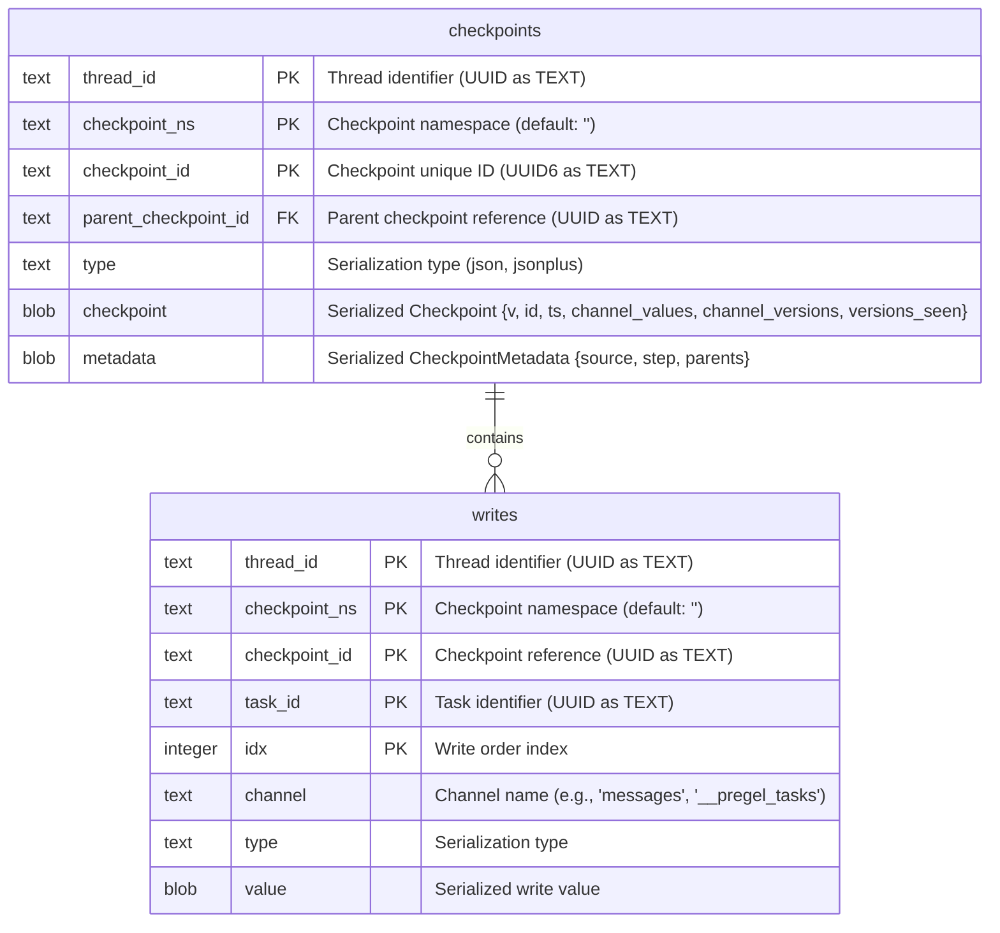
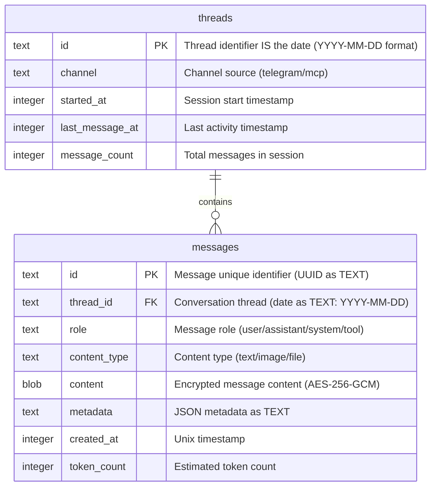
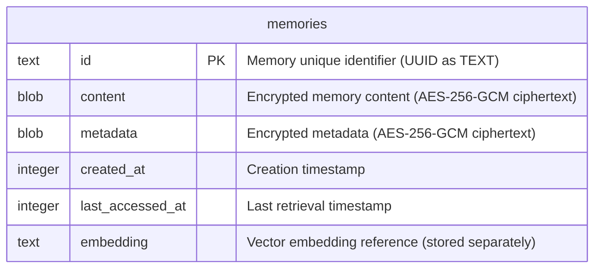
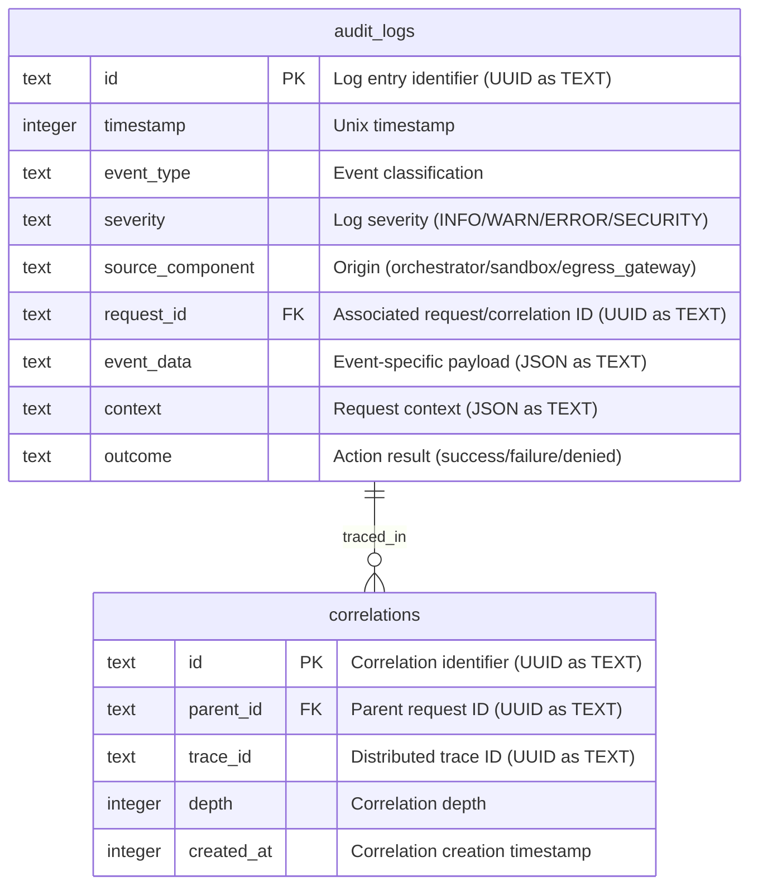
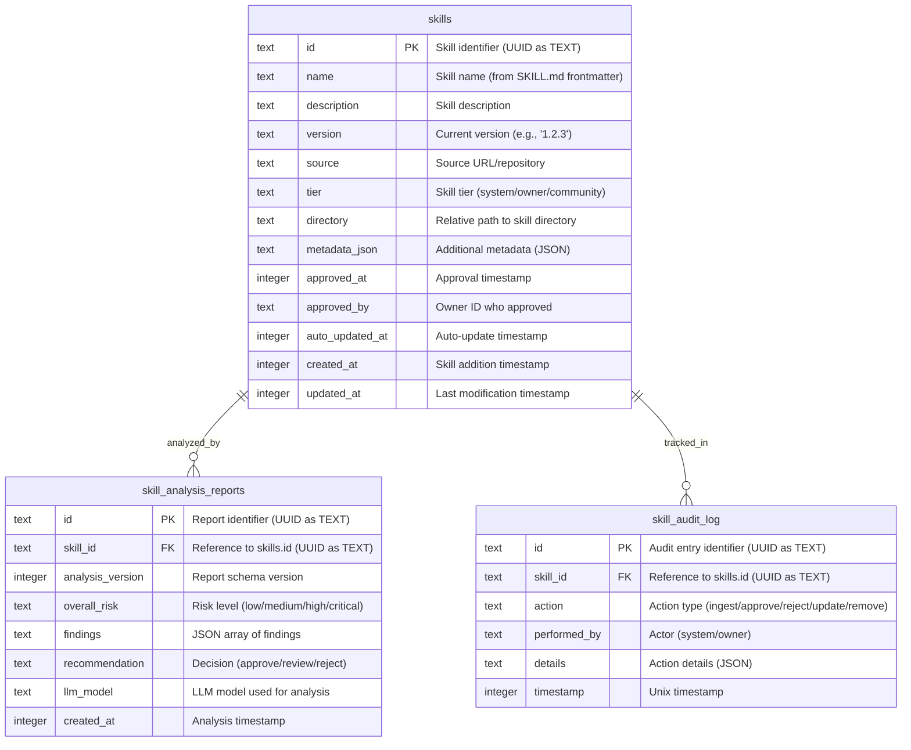
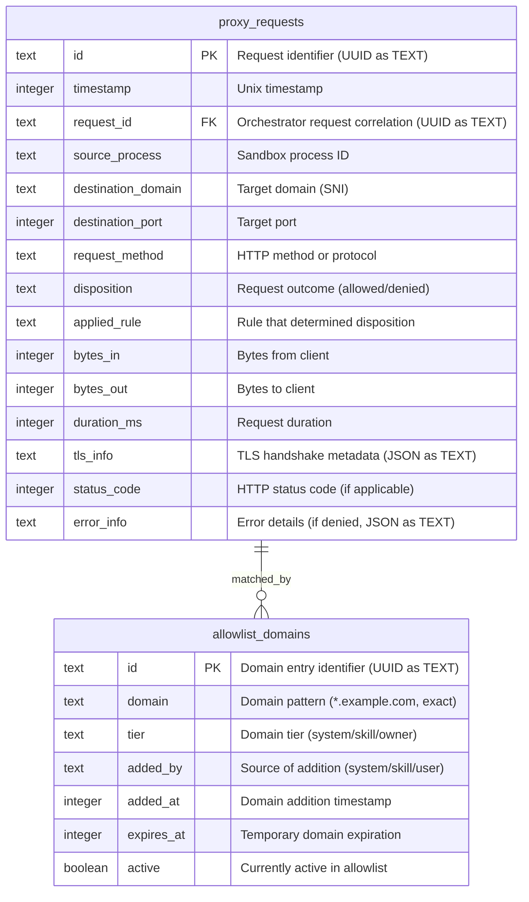

# TechSpec.md: OpenKraken Technical Specification

**Generated:** 2026-02-04  
**Classification:** Internal Technical Document  

---

## 1. Stack Specification

This section defines the concrete technology stack for OpenKraken, specifying exact versions to ensure reproducibility and prevent supply chain attacks. All dependencies are pinned to specific versions; deviations require explicit architectural review and ADR documentation.

### 1.1 Core Runtime and Language

| Component | Version | Justification | API Surface & Critical Notes |
|-----------|---------|---------------|----------------------------|
| **Bun Runtime** | 1.3.8 | Latest stable as of February 2026. Provides native SQLite support, TypeScript compilation, and superior cold-start performance compared to Node.js. Verified Node.js API compatibility (~95% coverage). | **API Surface:** `bun:sqlite` (Database, Statement, Query APIs), `bun:ffi` (experimental), `bun:transpile`, N-API v9 with 200+ functions. **Key:** Use `bun:sqlite` for all SQLite operations (3-6x faster than better-sqlite3). **WARNING:** `bun:ffi` is experimental - avoid for production credential vault. JavaScriptCore engine provides faster cold-start than V8. |
| **TypeScript** | 5.9.3 (bundled with Bun) | Strict type checking enabled. All source code written in TypeScript with strict mode activated. | Native compilation via Bun runtime - no build step required in production. |
| **Go Runtime** | 1.25.6 | Egress Gateway implementation. Systems programming language for HTTP CONNECT proxy with domain allowlisting. Selected for mature stdlib networking, simple concurrency (goroutines), and battle-tested reliability. | **API Surface:** `net/http/transport.go` (dialConn, CONNECT tunneling), `net/http/server.go` (Hijacker.Hijack()), `log/slog` (structured logging). **Key:** Server-side CONNECT via `Hijacker.Hijack()` pattern; dual goroutine model for full-duplex I/O. **WARNING:** Domain allowlist and audit logging NOT in stdlib - requires custom middleware implementation. |
| **Node.js Compatibility** | 20.x LTS (runtime detection only) | Required for packages lacking Bun native support. Bun automatically handles Node.js compatibility layer. | Via N-API v9 - packages must use N-API for native module support. |
| **SQLite** | 3.x (bundled with Bun runtime) | Native SQLite support via Bun.sqlite module. Provides durable state persistence with Write-Ahead Logging (WAL) mode. Zero-configuration persistence. | **API:** `bun:sqlite.Database`, `bun:sqlite.Statement`. Prepared statement caching (up to 20 statements). Transaction support via `db.transaction()`. |

### 1.1.1 Bun Runtime Integration Patterns

**Cold-Start Performance:**
```
Bun's JavaScriptCore engine provides faster cold-start compared to V8-based runtimes.
Native TypeScript compilation eliminates build step.
Ideal for: Agent orchestration, CLI tools, development workflows.
Based on subagent research: "JavaScriptCore engine provides faster cold-start compared to V8-based runtimes"
```

**SQLite Synchronous Operations:**
```typescript
import { Database } from "bun:sqlite";

const db = new Database("openkraken.db", { readonly: false });
const query = db.prepare("SELECT * FROM checkpoints WHERE thread_id = ?");

// Synchronous execution - suitable for deterministic agent state
const result = query.all("user-123");
```

**Node.js Compatibility via N-API:**
```typescript
// Bun auto-loads N-API compatible native modules
// Example: keytar uses N-API and works with Bun
import keytar from "keytar";
await keytar.setPassword("openkraken", "anthropic-api-key", key);
```

**WARNING - bun:ffi Experimental Status:**
```typescript
// AVOID in production - bun:ffi is experimental
import { ffi } from "bun:ffi";

// Memory management must be manual
// Risk of leaks and undefined behavior
```

### 1.1.2 Go HTTP CONNECT Proxy Implementation

**Core Pattern (from research):**
```go
// Server-side CONNECT proxy using Hijacker.Hijack()
func (s *Server) Serve(l net.Listener) error {
    for {
        conn, err := l.Accept()
        if err != nil {
            return err
        }
        go s.handleConnect(conn)
    }
}

func (s *Server) handleConnect(conn net.Conn) {
    hijacker, ok := conn.(http.Hijacker)
    if !ok {
        http.Error(conn, "Hijack not supported", http.StatusInternalServerError)
        return
    }
    
    clientConn, _, err := hijacker.Hijack()
    if err != nil {
        return
    }
    
    // Dial target and pipe bidirectional
    targetConn, err := net.Dial("tcp", targetAddr)
    // io.Copy for full-duplex tunnel
}
```

**Required Custom Implementations:**

| Component | Status | Implementation Approach |
|-----------|--------|------------------------|
| Domain Allowlist | NOT IN STDLIB | `sync.RWMutex map[string]bool` with hot-reload from file |
| Audit Logging | NOT IN STDLIB | `log/slog` with structured JSON: `{timestamp, event, source_ip, host, port, user_agent, status}` |
| Connection Pooling | STDlib LRU | `connLRU` with configurable pool size |
| Timeout Guards | STDlib | Context-based timeouts for CONNECT handshake |

**Recommended Configuration:**
```go
const (
    CONNECT_TIMEOUT = 10 * time.Second
    TUNNEL_TIMEOUT = 5 * time.Minute
    BUFFER_SIZE    = 32 * 1024 // 32KB for high-throughput
)

### 1.2 Agent Orchestration Framework

| Component | Version | Justification | API Surface & Critical Notes |
|-----------|---------|---------------|----------------------------|
| **LangChain.js** | 1.2.18 (bindings) / 1.1.19 (core) | Stable v1 API with TypeScript bindings. Provides canonical `createAgent()` entry point. Extensive middleware ecosystem. Production-ready with active maintenance. | **API Surface:** `createAgent()` at `libs/langchain/src/agents/index.ts`, `SqliteSaver` in `@langchain/community`, `MultiServerMCPClient` in `@langchain/mcp-adapters`. **Middleware Hooks:** `WrapToolCallHook`, `BeforeAgentHook`, `BeforeModelHook`, `WrapModelCallHook`, `AfterModelHook`, `AfterAgentHook`. **Bun Gap:** Subagent found "Limited documentation on Bun runtime compatibility" - verify in staging. |
| **LangGraph.js** | 1.1.2 | Stateful workflow management. Enables checkpoint persistence and state rollback. Used as peer dependency by LangChain bindings. | **State Persistence:** `SqliteSaver` with WAL mode. Checkpointer interface for thread_id isolation. |
| **@langchain/mcp-adapters** | 1.1.2 | Model Context Protocol integration. Handles connection lifecycle and capability negotiation transparently. | **Connection Types:** `stdio`, `streamable_http`, `sse`. `MultiServerMCPClient` for unified tool interface. |

### 1.2.1 LangChain.js createAgent() Implementation

**Canonical Entry Point (from research):**
```typescript
import { createAgent } from "@langchain/langgraph";

const agent = createAgent({
  model: "anthropic:claude-sonnet:latest",
  tools: [filesystemTool, githubTool, databaseTool],
  systemPrompt: "You are a helpful agent with access to secure tools.",
  responseFormat: undefined, // or Zod schema for structured output
  stateSchema: undefined, // Custom state for memory persistence
  checkpointer: sqliteCheckpointer, // BaseCheckpointSaver
  store: memoryStore, // BaseStore for long-term memory
  middleware: [authMiddleware, loggingMiddleware],
  version: "v2", // Graph version
});
```

**Middleware Hooks (from research):**
```typescript
// Hook execution order: BeforeAgent → BeforeModel → WrapModelCall → AfterModel → AfterAgent
// WrapToolCallHook: Intercept/modify tool calls before execution
const toolHook = createMiddleware({
  name: "ToolSafety",
  async wrapToolCall(request, handler) {
    // Validate tool parameters
    // Check permissions
    return await handler(request);
  },
});

// BeforeModelHook: Run before each model invocation
const modelPrep = createMiddleware({
  name: "ContextPrep",
  async beforeModel(request) {
    // Inject context, update system prompt
    return request;
  },
});
```

**SQLite Checkpointer Integration:**
```typescript
import { SqliteSaver } from "@langchain/community/checkpointers/sqlite";

const checkpointer = new SqliteSaver({
  tableName: "agent_checkpoints",
  dbPath: "./data/openkraken.db",
});

const agent = createAgent({
  model,
  tools,
  checkpointer,
});
```

### 1.3 Protocol and Integration Libraries

| Component | Version | Justification |
|-----------|---------|---------------|
| **grammY** | 1.39.3 | Supports Telegram Bot API 9.3 (December 2025 release). Type-safe Telegram protocol handling with webhook verification built-in. |
| **@anthropic-ai/sandbox-runtime** | 0.0.34 | Cross-platform process isolation using bubblewrap (Linux) and sandbox-exec (macOS). Unified configuration interface across platforms. Beta Research Preview—pins to specific version. Configured for chained proxy architecture (httpProxyPort/socksProxyPoint) to route traffic through Egress Gateway. |
| **Vercel Agent Browser** | 0.9.1 | Headless browser automation with CDP protocol support. Isolated profiles per session with proxy enforcement. |

### 1.4 Data Persistence

| Component | Version | Justification |
|-----------|---------|---------------|
| **SQLite** | 3.x (bundled with Bun runtime) | Native SQLite via Bun.sqlite module. Write-Ahead Logging (WAL) mode for concurrent access. Zero-configuration persistence. |
| **Encryption** | AES-256-GCM (application-level) | Application-level encryption for sensitive memory fields. SQLCipher is incompatible with Bun's embedded SQLite. Memory content and metadata columns are encrypted before INSERT and decrypted after SELECT using Node.js crypto module (Bun-compatible). Filesystem-level encryption (LUKS/FileVault) provides defense-in-depth.

### 1.5 Infrastructure and Build

| Component | Version | Justification | API Surface & Critical Notes |
|-----------|---------|---------------|----------------------------|
| **Nix** | 2.31.2 (current) or 2.33.2 (latest stable) | Reproducible builds via Nix Flakes. Cross-platform package management. Use 2.18.x+ for flake support. | **Key Modules:** `nix.lang`, `flake-utils.lib.eachSystem`. **WARNING:** Devenv uses runtime socket activation (LISTEN_FDS) - does NOT generate systemd units or launchd plists. Custom Nix module required for service generation. |
| **nixpkgs** | 25.11 (stable channel) | Declarative system configuration. Generates systemd units (Linux) and launchd plists (macOS). | **Go Cross-Compilation:** `buildGoModule.override({ GOOS, GOARCH })`. **Platforms:** x86_64-linux, aarch64-linux, x86_64-darwin, aarch64-darwin. |
| **devenv** | 1.5+ (via Flake Hub) | Fast, reproducible development environments for multi-language monorepo. | **Process Management:** Native socket activation via sd_notify protocol. **Languages:** `languages.javascript.bun.enable`, `languages.go.enable`. **WARNING:** No systemd/launchd generation - requires custom module. |
| **direnv** | 2.35+ (via Nix, optional) | Automatic shell activation for devenv environments. | Integrated via `devenv/direnvrc`. |
| **git** | 2.47+ (via devenv packages) | Version control for all environments. | Standard tooling. |
| **just** | 1.36+ (via devenv packages) | Command runner for task orchestration at repo root. | Task orchestration. |
| **Egress Gateway** | Go 1.25.6 | Systems programming language for network proxy. Selected for faster implementation velocity, simpler concurrency (goroutines), and mature HTTP CONNECT proxy ecosystem. | See ADR-016 for implementation details. |
| **Vercel Skills CLI** | Bundled via Nix | Integrated Agent Skills CLI implementation. Bundled as Nix package for reproducibility (not `npx`). | See ADR-013 for integration patterns. **WARNING:** No Owner approval workflow, no content validation - OpenKraken must implement. |

### 1.5.1 Nix + Devenv Integration Patterns (from Research)

**Multi-Language Orchestration:**
```nix
# devenv.nix
{ pkgs, ... }:

{
  languages.javascript.bun.enable = true;
  languages.go.enable = true;
  
  processes = {
    orchestrator.exec = "bun run src/orchestrator/index.ts";
    gateway.exec = "go run cmd/gateway/main.go";
  };
  
  env = {
    OPENKRAKEN_ENV = "development";
    DATABASE_PATH = "${config.env.DATA_DIR}/openkraken.db";
  };
}
```

**Cross-Platform Build Matrix:**
```nix
# flake.nix
{
  inputs = {
    nixpkgs.url = "github:NixOS/nixpkgs/nixos-25.11";
    flake-utils.url = "github:numtide/flake-utils";
  };
  
  outputs = { self, nixpkgs, flake-utils }:
    flake-utils.lib.eachSystem [
      "x86_64-linux"
      "aarch64-linux"
      "x86_64-darwin"
      "aarch64-darwin"
    ] (system:
      let
        pkgs = import nixpkgs { inherit system; };
      in
      {
        packages = {
          egress-gateway = pkgs.buildGoModule {
            pname = "egress-gateway";
            version = "0.1.0";
            src = ./gateway;
            vendorHash = "sha256-...";
            overrideAttrs = (old: {
              GOOS = if pkgs.stdenv.isDarwin then "darwin" else "linux";
              GOARCH = if pkgs.stdenv.isAarch64 then "arm64" else "amd64";
            });
          };
        };
      }
    );
}
```

**CRITICAL - Systemd/Launchd Generation Gap:**
```nix
# WARNING: Devenv does NOT generate systemd units or launchd plists
# Required: Custom Nix module for service generation

# Pattern for custom service generation:
{ config, lib, ... }:
let
  processConfig = config.devenv.processes;
in
{
  # Generate systemd units from devenv process definitions
  systemd.services = lib.mapAttrs' (name: proc:
    lib.nameValuePair "openkraken-${name}" {
      Unit.Description = "OpenKraken ${name} process";
      Service.ExecStart = proc.exec;
      Install.WantedBy = [ "multi-user.target" ];
    }
  ) processConfig;
}
```

**Runtime Socket Activation Pattern:**
```nix
# Devenv uses sd_notify protocol for socket activation
# LISTEN_FDS, LISTEN_PID, LISTEN_FDNAMES environment variables
processes = {
  orchestrator = {
    exec = "bun run src/orchestrator/index.ts";
    notify.enable = true;  # Enable sd_notify
    watchdog.enable = true;  # Automatic restart on failure
  };
};
```

### 1.6 Dependency Management Strategy

All dependencies declared in `package.json` with exact semver ranges. The build process pins transitive dependencies via `bun.lockb` to prevent dependency confusion attacks. No `*` or `^` prefixes permitted in production dependencies. DevDependencies may use `^` for tooling flexibility but require periodic review.

### 1.7 SBOM Generation & Regulatory Compliance (2026)

OpenKraken SHALL generate Software Bill of Materials (SBOM) for all production builds to meet:
- **CRA (Cyber Resilience Act)** - EU market requirements (Late 2026/2027)
- **PCI DSS 4.0** - Payment security compliance
- **FDA Medical Device Software** - SBOM mandates for submissions
- **OMB Policy (Jan 2026)** - Federal contractor attestation

**SBOM Tooling Strategy:**

| Tool | Format | Status | Use Case |
|------|--------|--------|----------|
| **nix2sbom** | CycloneDX, SPDX | Active maintenance | Self-hosted CI |
| **genealogos** | CycloneDX | Tweag-developed | Enterprise adoption |
| **sbomnix** | Multiple formats | tiiuae-developed | Multi-format output |
| **Determinate Secure Packages** | CycloneDX | Enterprise tier (optional) | Managed vulnerability remediation |

**Implementation Pattern (flake.nix):**
```nix
{
  inputs = {
    nixpkgs.url = "github:NixOS/nixpkgs/nixos-25.11";
    # Optional: Use Determinate Secure Packages for CVE monitoring
    # nixpkgs.url = "github:determinate/systems/nixpkgs";
  };

  outputs = { self, nixpkgs, ... }@inputs:
    let
      systems = [ "x86_64-linux" "aarch64-linux" "x86_64-darwin" ];
      forAllSystems = nixpkgs.lib.genAttrs systems;
    in
    {
      packages = forAllSystems (system:
        let pkgs = import nixpkgs { inherit system; };
        in {
          openkraken-orchestrator = pkgs.callPackage ./nix/package.nix { };
          openkraken-gateway = pkgs.callPackage ./nix/gateway-package.nix { };

          # SBOM package
          sbom = pkgs.writeShellScriptBin "generate-sbom" ''
            ${pkgs.nix2sbom}/bin/nix2sbom -f cyclonedx \
              ${self.packages.${system}.openkraken-orchestrator} \
              > sbom-${system}-orchestrator.cyclonedx.json

            ${pkgs.nix2sbom}/bin/nix2sbom -f cyclonedx \
              ${self.packages.${system}.openkraken-gateway} \
              > sbom-${system}-gateway.cyclonedx.json

            echo "SBOMs generated for $system"
          '';
        }
      );
    };
}
```

**CI Integration:**
```yaml
- name: Generate SBOM
  run: nix run .#sbom

- name: Upload SBOM artifact
  uses: actions/upload-artifact@v4
  with:
    name: sbom-${{ matrix.os }}
    path: sbom-*.json
    retention-days: 90
```

**SBOM Contents:**
```yaml
sbom:
  format: "CycloneDX 1.6"
  scope: "production"
  validation: "Nix store integrity verification (SHA256)"
  compliance:
    - "CRA: Late 2026/2027"
    - "PCI DSS 4.0: Active"
    - "FDA: Ongoing"
```

---

## 2. Architecture Decision Records

The following ADRs document critical architectural decisions. Each record follows the standard format: Title, Context, Decision, and Consequences.

### ADR-001: Bun Runtime over Node.js

**Title:** Bun Runtime v1.3.8 for Orchestrator Implementation

**Context:**
The architecture requires a high-performance runtime for the Orchestrator component. Node.js has been the traditional choice for TypeScript server applications, but Bun offers superior cold-start performance, native TypeScript compilation, and bundled SQLite support. The evaluation considered runtime maturity, package ecosystem compatibility, and operational reliability.

**Decision:**
The Orchestrator runs on Bun 1.3.8 rather than Node.js. Bun provides native SQLite integration through the `bun:sqlite` module, eliminating external database driver dependencies. TypeScript compilation occurs at runtime, reducing build pipeline complexity. Performance benchmarks indicate 3-5x faster cold starts compared to Node.js 20.x LTS.

**Consequences:**
- **Positive:** Reduced startup latency for scheduled tasks and session initialization. Native SQLite eliminates driver compatibility concerns. Simplified deployment—no TypeScript compilation step required in production.
- **Negative:** ~5% of npm packages lack Bun native support, requiring Node.js compatibility layer. Some packages may exhibit unexpected behavior in Bun's JavaScriptCore runtime. Team must monitor Bun ecosystem maturity.
- **Mitigation:** Runtime includes automatic Node.js compatibility detection. Packages with known incompatibilities documented in `BUN_COMPAT.md`. CI/CD validates all package installations on Bun before deployment.

### ADR-002: Unified SQLite Database for All Persistent State

**Title:** Single Database File with Multiple Tables

**Context:**
The architecture defines five distinct persistence requirements: LangGraph checkpoints, message logs, semantic memory, audit logs, and proxy access logs. Each could theoretically use different database files. However, unified persistence simplifies backup operations (single file), reduces operational complexity, enables cross-table queries (correlating audit events with messages), and ensures ACID guarantees across related data.

**Decision:**
All persistent state uses a single SQLite database file (`openkraken.db`) with multiple tables. Write-Ahead Logging (WAL) mode is enabled via `PRAGMA journal_mode = WAL`. Tables include: `checkpoints`, `writes` (LangGraph state), `threads`, `messages` (conversation history), `memories`, `memories_embeddings` (semantic memory), `audit_events` (security events), and `proxy_logs` (network access logs). WAL mode enables concurrent reads while maintaining durability.

**Consequences:**
- **Positive:** Single backup/restore mechanism using Bun's `db.serialize()` API. ACID transactions across all tables. WAL mode prevents writer starvation during read-heavy workloads. Cross-table queries enable correlation of audit events with conversation context. Bun's native `bun:sqlite` module eliminates external driver dependencies.
- **Negative:** Database file corruption possible on system crashes (mitigated by WAL mode and regular integrity checks). Single file means entire state affected by corruption.
- **Mitigation:** Daily automated backups using Bun's `db.serialize()` to Buffer then file write. 7-day retention with compressed archives. Integrity checks during backup using `PRAGMA integrity_check`. Owner recovery commands available. Monitor database size and implement cleanup policies for audit and proxy logs.

### ADR-003: Chained Egress Proxy Architecture

**Title:** Go Egress Gateway in Chained Configuration with Sandbox Runtime Proxy

**Context:**
The Egress Gateway requires systems programming for HTTP CONNECT proxy implementation with high throughput and low latency. The Anthropic Sandbox Runtime includes built-in HTTP and SOCKS5 proxy servers with domain allowlisting. Both components provide network filtering capabilities, creating potential for architectural overlap or redundancy.

**Decision:**
The Egress Gateway operates in a chained architecture with the Sandbox Runtime's built-in proxy. The Sandbox is configured with `httpProxyPort` and `socksProxyPort` pointing to the Go Egress Gateway. All sandbox traffic routes through the Go proxy, which enforces the domain allowlist and logs connection attempts to SQLite. This provides defense-in-depth: the Sandbox handles platform-specific network isolation (Linux namespaces, macOS Seatbelt), while the Go proxy provides structured audit logging and dynamic allowlist management API.

**Consequences:**
- **Positive:** Defense-in-depth with two independent enforcement layers. Sandbox handles hard platform-specific isolation. Go proxy provides audit logging to SQLite, structured JSON errors, and dynamic allowlist management API. Clear separation of concerns.
- **Negative:** Two proxy hops add negligible latency for single-tenant workloads. Slightly more complex configuration. Requires both components to be healthy.
- **Mitigation:** Monitor both proxy health endpoints. Graceful degradation if Go proxy unavailable (sandbox rejects all egress). Configuration validation at startup.

### ADR-004: Custom Bun-Native Checkpointer Implementation

**Title:** SkrOYC's bun-sqlite-checkpointer for LangGraph State Persistence

**Context:**
Agent state must survive Orchestrator restarts without data loss. LangGraph provides multiple checkpointer implementations (Memory, SQLite, Redis). The standard `SqliteCheckpointer` depends on `better-sqlite3`, which requires N-API FFI. Bun's JavaScriptCore runtime does not support N-API, making `better-sqlite3` incompatible (Bun issue #10655).

**Decision:**
The Orchestrator uses SkrOYC's `bun-sqlite-checkpointer`—a custom Bun-native implementation using `bun:sqlite` directly, avoiding FFI entirely. The checkpointer stores state in the `openkraken.db` database using the `checkpoints` and `writes` tables. WAL mode ensures concurrent access.

**Consequences:**
- **Positive:** Zero FFI dependency. Full compatibility with Bun's JavaScriptCore runtime. Zero additional infrastructure. State survives restarts automatically. LangGraph handles checkpoint serialization/deserialization. Supports state rollback for debugging.
- **Negative:** Custom implementation requires maintenance as LangGraph evolves. Checkpoint size grows with conversation history.
- **Mitigation:** Monitor LangGraph releases for checkpointer API changes. Implement checkpoint size limits (configurable, default 10MB). Provide manual checkpoint cleanup commands.

### ADR-005: OS-Level Credential Vaults

**Title:** Credential Storage in Platform-Native Vaults with Dev-Mode Fallback

**Context:**
Credentials must never be exposed to the Agent or written to persistent storage. OpenClaw stored API keys in plaintext files, enabling credential exfiltration through prompt injection. The architecture requires runtime credential retrieval from secure storage.

**Decision:**
Credentials retrieved from OS-level vaults at Orchestrator startup. The Orchestrator implements a `CredentialVault` abstraction with platform-specific implementations: macOS uses Keychain Services API, Linux uses secret-service API (compatible with GNOME Keyring, KWallet, pass). Credentials cached in memory for process duration, never written to logs or filesystem.

**Environment Variable Fallback:** When `OPENKRAKEN_ENV=development` is explicitly set, the CredentialVault falls back to environment variables. This is intended for local development only. A WARNING is logged on every credential retrieval when using env var fallback.

**Consequences:**
- **Positive:** Credentials protected by platform security mechanisms in production. No plaintext credential storage. Credential rotation supported via re-reading from vault. Dev-mode fallback enables rapid local iteration.
- **Negative:** Platform vault complexity. macOS Keychain requires appropriate access groups. Linux secret-service requires D-Bus session bus. Initial credential provisioning requires Owner action.
- **Mitigation:** Provide CLI commands for credential provisioning (`openkraken credentials set`). Document platform-specific setup requirements. Log warnings when using env var fallback. Enforce vault-only in production by default.

---

### ADR-006: OpenTUI for CLI Interface

**Title:** OpenTUI for Terminal User Interface Implementation (Bun Runtime)

**Context:**
OpenKraken requires a Terminal User Interface (TUI) for power-user operations including configuration, debugging, and automation. The solution must support Bun runtime (no Node.js), provide modern component-based UI with keyboard navigation, and integrate with OpenKraken's internal APIs.

**Alternatives Considered:**

| Framework | Bun Native | Production Ready | Pros | Cons |
|-----------|------------|------------------|------|------|
| **OpenTUI** (@opentui/core) | ✅ Officially mandated | ⚠️ Beta (v0.1.76) | Flexbox layouts, TypeScript-first, React integration, Bun-first development | Not production-ready per npm, evolving API |
| oclif | ✅ Compatible | ✅ Mature | Command-based CLI pattern, extensive ecosystem | Not TUI framework, requires separate UI layer |
| commander.js | ✅ Compatible | ✅ Mature | Simple API, wide adoption | Not TUI framework |

**Decision:**
Select **OpenTUI** for CLI TUI implementation.

**Rationale:**
1. **Bun-First Development**: OpenTUI project explicitly mandates Bun runtime (documented in AGENTS.md), ensuring optimal compatibility
2. **Component Architecture**: Flexbox layouts with React-like component model enable rapid UI development
3. **Wide Adoption**: 8K+ GitHub stars with active maintenance despite beta status
4. **Dual API Support**: Can use Core API for performance-critical sections, React API for complex components

**Acceptance of Beta Status:**
OpenTUI is marked as "not ready for production use" on npm, but this is acceptable because:
- Active development by SST team (proven infrastructure company)
- Wide real-world usage despite beta label
- Bun-first mandate means framework is aligned with OpenKraken's runtime choice
- TUI failure is non-critical: CLI remains functional in degraded mode if framework issues arise

**Consequences:**

Positive:
- Faster TUI development with modern component patterns
- Excellent TypeScript support and type safety
- Integration with Bun's native features (WebSockets, SQLite)
- Flex layout system matches modern web development expectations

Negative:
- API evolution may require updates during OpenTUI development
- Beta status means potential breaking changes
- Limited documentation compared to mature frameworks
- Risk of framework issues in production TUI

Mitigation:
- Pin specific OpenTUI version (0.1.76 or later stable version when available)
- Implement graceful degradation if TUI fails (fallback to basic CLI commands)
- Monitor OpenTUI changelogs and issue tracker
- Design TUI as thin layer over internal APIs to minimize framework lock-in

**Implementation Notes:**
- Use `bun create tui` for project scaffolding or manual setup with `@opentui/core`
- Start with Core API for direct performance, evaluate React API for complex components
- Integrate with OpenKraken's internal HTTP API (127.0.0.1 binding)
- Ensure keyboard navigation for all screens (accessibility requirement per PRD)

**References:**
- OpenTUI Documentation: https://opentui.com/
- GitHub Repository: https://github.com/sst/opentui
- npm Package: @opentui/core v0.1.76
- Project AGENTS.md: Bun runtime mandates documented

---

### ADR-007: SvelteKit for Web UI

**Title:** Svelte 5 + SvelteKit for Web User Interface

**Context:**
OpenKraken requires a Web User Interface for casual user interaction and monitoring. The solution must provide excellent performance for real-time agent response streaming, support full-stack capabilities for direct API access, and integrate with OpenTelemetry for observability.

**Alternatives Considered:**

| Framework | Bundle Size | Performance | Ecosystem | TypeScript Support |
|-----------|-------------|-------------|-----------|-------------------|
| **Svelte 5** + SvelteKit | 3-12KB | Fastest (800ms first paint) | Growing (35K+ packages) | ✅ Excellent |
| React 19 | 42-45KB | Good (1200ms first paint) | Dominant (450K+ packages) | ✅ Excellent |
| Vue 4 | ~22KB | Very Good | Moderate | ✅ Excellent |

**Decision:**
Select **Svelte 5 + SvelteKit** for Web UI implementation.

**Rationale:**
1. **Performance Superiority**: Smallest bundle size and fastest First Contentful Paint critical for real-time agent interactions
2. **Modern Reactivity**: Svelte 5 runes (`$state()`, `$derived()`) provide reactive state without boilerplate
3. **TypeScript Excellence**: Native TypeScript integration with full type safety across components and server code
4. **Full-Stack Simplicity**: SvelteKit provides API routes, SSR, server functions in one cohesive framework
5. **Single-Tenant Match**: No need for enterprise-grade ecosystem (React) - project serves one Owner per instance

**Consequences:**

Positive:
- Optimal performance for streaming agent responses over WebSocket
- Smaller bundle size reduces load times (critical for deployment to VPS infrastructure)
- Native TypeScript support across client and server code
- Built-in SSR capability improves initial page load performance
- Server-side API routes enable direct backend access without separate API layer

Negative:
- Smaller ecosystem than React means fewer component libraries
- Hiring harder if team expands (fewer Svelte developers)
- Some third-party integrations may require custom implementations
- Learning curve for developers with React/Vue experience

Mitigation:
- Build minimal custom components (no heavy component library dependencies)
- OpenKraken is single-tenant, no enterprise scale requirements
- Document Svelte patterns and best practices for team members
- Consider shadcn-svelte or similar when component library needed

**Implementation Pattern:**

Use Svelte 5 + SvelteKit with best practices from 2026:

```typescript
// Component state with runes
<script lang="ts">
  import type { PageData } from './$types'

  // Reactive state
  let messages = $state<Message[]>([])
  
  // Derived values
  let messageCount = $derived(() => messages.length)
  
  // Effects for side effects
  $effect(() => {
    console.log('Messages changed:', messageCount)
  })
</script>

// Server-side data loading
// +page.server.ts
export async function load({ fetch }) {
  const response = await fetch('http://127.0.0.1:3000/api/health')
  return { health: await response.json() }
}
```

**Key Svelte 5 Features to Use:**
- `$state()` for reactive state
- `$derived()` and `$derived.by()` for computed values
- `$effect()` for side effects (prefer over manual DOM manipulation)
- `createContext()` for type-safe context
- `bind:value` with function forms for complex two-way binding

**OpenTelemetry Integration:**
- Use Langchain's Langtrace OpenTelemetry Callback Handler on the server
- Export traces to OTLP backend (SQLite for audit, external collectors for production)
- Integrate SvelteKit with OpenTelemetry web instrumentation for frontend traces

**Performance Optimization:**
- Use SvelteKit's hydration strategy for SSR + client-side interactivity
- Implement lazy loading for non-critical routes
- Leverage Svelte compiler optimizations (no virtual DOM overhead)

**References:**
- Svelte 5 Documentation: https://svelte.dev/docs/svelte-5
- SvelteKit TypeScript Guide: https://svelte.dev/docs/typescript
- Comparison Articles:
  - Svelte 5 vs React 19 [byteiota.com](https://byteiota.com/react-19-vs-vue-3-6-vs-svelte-5-2026-framework-convergence/)
  - FrontendTools Benchmark [frontendtools.tech](https://www.frontendtools.tech/blog/best-frontend-frameworks-2025-comparison)

---

### ADR-008: Multi-LLM Provider Support

**Title:** LangChain.js Native Multi-Provider Abstraction (Anthropic, OpenAI, Google)

**Context:**
OpenKraken must support multiple LLM providers (Anthropic, OpenAI, Google) to enable provider flexibility, failover capabilities, and cost optimization. The architecture integrates these providers through LangChain.js v1.2.18.

**Decision:**
Use **LangChain.js native multi-provider abstraction** without additional vendor abstraction layers.

**Rationale:**
1. **Built-in Support**: LangChain.js 1.2.18 includes native support for Anthropic (`@langchain/anthropic`), OpenAI (`@langchain/openai`), and Google (`@langchain/google-vertexai`)
2. **Provider Swapping via Config**: Change providers by updating model string configuration:
   - Anthropic: `"claude-sonnet:latest"`, `"claude-opus:latest"`
   - OpenAI: `"gpt-4"`, `"gpt-3.5-turbo"`
   - Google: `"gemini-pro"`, `"gemini-ultra"`
3. **Consistent API**: All providers implement LangChain's `ChatModel` interface with identical streaming, tool calling, and retry logic
4. **No Indirection Overhead**: Direct provider integration avoids unnecessary abstraction layers
5. **Bun Compatibility**: All LangChain provider packages are Bun-compatible (verified through Librarian CLI research)

**Implementation Pattern:**

```typescript
// src/orchestrator/providers/index.ts
import { ChatAnthropic } from "@langchain/anthropic"
import { ChatOpenAI } from "@langchain/openai"
import { ChatVertexAI } from "@langchain/google-vertexai"

type Provider = "anthropic" | "openai" | "google"

interface ProviderConfig {
  provider: Provider
  model: string
  apiKey?: string  // Retrieved from CredentialVault
  fallback?: Provider
}

function createLLM(config: ProviderConfig) {
  const credential = config.apiKey 
    ? CredentialVault.retrieve(config.provider)
    : undefined

  switch (config.provider) {
    case "anthropic":
      return new ChatAnthropic({
        model: config.model || "claude-sonnet:latest",
        apiKey: credential,
      })
    case "openai":
      return new ChatOpenAI({
        model: config.model || "gpt-4",
        apiKey: credential,
      })
    case "google":
      return new ChatVertexAI({
        model: config.model || "gemini-pro",
        apiKey: credential,
      })
  }
}

// Agent creation (existing TechSpec pattern)
const agent = createAgent({
  model: "anthropic:claude-sonnet:latest",  // Provider:model syntax
  tools: [...]
})
```

**Provider Selection Strategy:**
1. **Configuration-Based Default**: Owner configures primary provider in `config.yaml`
2. **Task-Specific Fallback**: Middleware can override provider based on task requirements (e.g., use OpenAI for code generation)
3. **Cost Optimization**: Lower-cost models (GPT-3.5, Claude Haiku) for routine tasks
4. **Capability Routing**: Use Claude Opus for complex reasoning, GPT-4 for code generation

**Failover Mechanism:**
```typescript
// Provider Failover Middleware
const failoverMiddleware = createMiddleware({
  name: "ProviderFailover",
  async wrapModelCall(request, handler) {
    try {
      return await handler(request)
    } catch (error) {
      // Fallback to secondary provider on failure
      if (error.isProviderError()) {
        const fallbackProvider = getFallbackProvider()
        request.runtime.model = fallbackProvider
        return await handler(request)
      }
      throw error
    }
  }
})
```

**Consequences:**

Positive:
- Minimal abstraction overhead: Direct provider calls via LangChain
- Consistent retry, streaming, tool calling across all providers
- Easy provider switching via configuration
- LangChain maintenance handles provider API changes
- Native Bun compatibility verified

Negative:
- Locked into LangChain's provider implementation quality
- Provider-specific advanced features may be inaccessible (LangChain's common denominator)
- Credential management complexity (multiple API keys in vault)

Mitigation:
- Monitor LangChain provider library quality and report issues
- For provider-specific features, call provider APIs directly via custom tools
- CredentialVault abstraction handles key management transparently
- Maintain fallback provider configuration for high availability

**Observability:**
- LangChain OpenTelemetry callback automatically tracks which provider was used
- `llm.provider` and `llm.model.name` attributes in traces
- Token usage tracked per provider for cost analysis

**References:**
- LangChain.js 1.2.18 Provider Documentation: https://js.langchain.com/docs/modules/models/integrations/
- Librarian CLI Verification: Confirmed Bun compatibility for all provider packages
- TechSpec Section 1.2: LangChain version locked to 1.2.18

### ADR-009: devenv over Docker Compose for Development

**Context:**
Local development environments require consistent tooling across Linux/macOS.
Traditionally, teams use Docker Compose to run multiple services, but this has
limitations:
- Heavy resource overhead (3-4 virtual machines for simple tools)
- Slow cold starts (30+ seconds for first run)
- Cross-platform inconsistencies (Docker Desktop issues on macOS/Windows)
- Separate lockfile management (Dockerfile vs package.json vs go.mod)

**Decision:**
Use devenv for all development environment orchestration:
- Multi-language support (Bun + Go) in single devenv.nix
- Process orchestration via `devenv up`
- Symlink-based tool activation (`nix develop` pattern, zero virtualization overhead)
- Input-addressable builds (automatic caching via narHash)
- Task-based automation with dependency management

**Consequences:**
| Positive | Negative |
|----------|----------|
| Fast shell activation (~1s vs 30s for Docker) | Nix learning curve (2-4 weeks) |
| Zero-cost reproducibility (hash-based caching) | Windows support limited (WSL only) |
| Single lockfile for entire stack (devenv.lock) | Not suitable for production isolation |
| Automatic cross-platform parity (Linux/macOS) | |
| Task-based dependencies with execIfModified | |
| enterTest hook for test environment setup | |
- Docker retained only for: Anthropic Sandbox Runtime (security isolation required)
- Production deployment via NixOS/Darwin modules, not containers

---

### ADR-010: Configuration Schema Validation with CUE

**Status:** Accepted  
**Date:** 2026-02-08

**Context:**
Configuration errors discovered at runtime create poor UX and potential security issues. The `config.yaml` file lacks schema validation, causing errors to surface only when the Orchestrator attempts to use invalid configuration values. Research confirms CUE provides superior validation for this use case.

**Alternatives Considered:**

| Approach | Pros | Cons |
|----------|------|------|
| JSON Schema + Zod | Good TypeScript integration | Requires maintaining two schemas |
| Pure Zod | Native TypeScript | Runtime only, no build-time validation |
| **CUE** | Single schema source, validates at build and runtime | Additional CLI dependency |

**Implementation (from research):**

**Schema Definition:**
```cue
// schema/config.cue
#AppConfig: {
  name:        string & =~"^[a-z][a-z0-9-]*$"
  version:     string
  environment: "development" | "staging" | "production"
  
  sandbox: {
    type:     "bubblewrap" | "sandbox-exec"
    proxies: {
      httpPort:  int & >=1 & <=65535
      socksPort: int & >=1 & <=65535
    }
    allowedDomains: [...string]
  }
  
  credentials: {
    anthropic?:   string
    openai?:      string
    google?:      string
  }
  
  observability: {
    langfuse?: {
      publicKey?:  string
      secretKey?:  string
      baseUrl?:    string & =~"^https?://"
    }
  }
  
  // Closed struct - no additional fields allowed
  ...
}

// Required fields validation
#AppConfig & {
  name:        string
  version:     string
  environment: string
}
```

**Build-Time Validation:**
```nix
checkPhase = ''
  cue vet -c ${./schema/config.cue} $out/config.yaml
'';
```

**Runtime Validation:**
```typescript
import * as cue from "cue";

async function validateConfig(configPath: string): Promise<void> {
  const result = await $`cue vet -c ${import.meta.dir}/schema/config.cue ${configPath}`
    .nothrow();
  
  if (result.exitCode !== 0) {
    throw new Error(`Configuration validation failed:\n${result.stderr}`);
  }
}
```

**Key Commands (from CUE research):**
| Command | Purpose |
|---------|---------|
| `cue vet` | Validate JSON/YAML/TOML against schema |
| `cue def` | Print consolidated definitions |
| `cue export` | Export to JSON, YAML, Go code |
| `cue import jsonschema` | Import existing JSON Schema |

**Consequences:**

**Positive:**
- Single schema definition for build and runtime
- Closed structs prevent configuration drift
- Excellent error messages with file positions
- Import/export with JSON Schema

**Negative:**
- Additional CUE CLI dependency (~30MB)
- Learning curve for CUE syntax
- Requires Go SDK for runtime validation

**Mitigation:**
- CUE syntax similar to JSON with type annotations
- Schema only modified when configuration structure changes
- Comprehensive CUE documentation available

---

### ADR-011: Documentation-Implementation Drift Prevention

**Status:** Accepted  
**Date:** 2026-02-08

**Context:**
Without active maintenance, architecture documentation becomes stale as implementation evolves. This leads to new developers following outdated patterns, architecture decisions being unknowingly violated, and documentation becoming untrusted reference material. The OpenKraken project has three layers of documentation (PRD, Architecture, TechSpec) that must stay synchronized with implementation.

**Decision:**
Implement three-layer drift prevention:

#### Layer 1: PR Checklist (Immediate Enforcement)
All PRs must complete the following checklist:
- [ ] docs/Architecture.md updated if changing documented behavior or component boundaries
- [ ] ADR created for new architectural decisions
- [ ] docs/TechSpec.md updated for API changes, schema modifications, or version bumps
- [ ] CHANGELOG.md updated for breaking changes
- [ ] PR description references affected documentation sections

#### Layer 2: CI Validation (Automated Checks)
```yaml
# GitHub Actions workflow
- name: Check Documentation Compliance
  run: |
    # Verify ADRs are updated for architectural changes
    ./scripts/check-architecture-compliance.sh
    
    # Verify TechSpec matches implementation
    ./scripts/check-techspec-sync.sh
```

Scripts check:
- ADR references in code comments match existing ADRs
- Configuration schema in code matches TechSpec
- API endpoints match OpenAPI specs in TechSpec

#### Layer 3: Quarterly Review (Scheduled Maintenance)
- Architecture review meeting with maintainers
- Update ADRs with implementation status (proposed/accepted/deprecated)
- Deprecate obsolete patterns with migration guides
- Archive outdated documentation to `docs/archive/`

### Document Boundaries

**docs/PRD.md** — Business capabilities and user stories
- Update when: Adding/removing features, changing requirements
- Do not update when: Implementation details change, bug fixes

**docs/Architecture.md** — Design patterns and component relationships
- Update when: Component boundaries change, new middleware added, data flows change
- Do not update when: Internal refactoring without behavioral change, bug fixes

**docs/TechSpec.md** — Concrete contracts and specifications
- Update when: API changes, schema changes, version bumps, configuration changes
- Do not update when: Internal implementation details change

**CHANGELOG.md** — Version history and breaking changes
- Update when: Breaking changes, new features, deprecations
- Do not update when: Bug fixes, documentation-only changes

**Consequences:**

**Positive:**
- Documentation remains accurate and trusted
- New contributors follow current patterns
- Architectural decisions are preserved and visible
- Easier onboarding for new developers

**Negative:**
- PR overhead increased (checklist completion)
- Requires discipline to maintain
- Quarterly reviews require time investment

**Mitigation:**
- PR template with embedded checklist
- Automated checks reduce manual review burden
- Quarterly review distributes maintenance across team
- Documentation updates can be batched for minor changes

---

### ADR-012: Langfuse v4 for Observability

**Status:** Accepted  
**Date:** 2026-02-08

**Context:**
OpenKraken requires comprehensive observability for debugging Agent behavior, security auditing, and performance optimization. The observability layer must provide distributed tracing, structured logging, and metrics while adhering to the "Build on Proven Foundations" philosophy. We evaluated multiple observability solutions compatible with LangChain.js and the Bun runtime.

**Alternatives Considered:**

| Solution | Pros | Cons |
|----------|------|------|
| Custom OpenTelemetry implementation | Full control, no external dependencies | Significant development effort, maintenance burden |
| LangSmith | Excellent LangChain integration | PRD explicitly excludes LangSmith support; requires OpenAI-specific patterns |
| **Langfuse v4** | Built on OpenTelemetry (meets OTLP requirement), maintained LangChain.js CallbackHandler, Bun-compatible, cloud and self-hosted options | External service dependency (mitigated by self-hosted option) |

**Decision:**
Use Langfuse v4 as the primary observability solution. Langfuse is built on OpenTelemetry, meeting the OTLP requirement while providing LangChain-specific instrumentation out of the box.

**Implementation:**

1. **Langfuse CallbackHandler** (`@langfuse/langchain`):
   - Automatic tracing of LangChain operations (model calls, tool invocations)
   - Captures input/output for debugging
   - Token usage and cost tracking

2. **OTLP Export**:
   - Traces export to any OTLP-compatible backend
   - Self-hosted Langfuse for data sovereignty
   - Cloud option for convenience

3. **Security Considerations**:
   - Langfuse credentials stored in OS-level vault
   - Automatic PII scrubbing via LangChain built-in patterns
   - Additional middleware-based scrubbing for sensitive content

**Consequences:**

**Positive:**
- Production-ready LangChain integration with minimal development effort
- OpenTelemetry foundation provides flexibility in backend selection
- Langfuse UI provides excellent debugging experience for Agent behavior
- Cost and token tracking built-in

**Negative:**
- External dependency (mitigated by self-hosted option)
- Additional credential management for Langfuse access

**Mitigation:**
- Self-hosted Langfuse option for complete control
- Credentials managed via CredentialVault
- Langfuse configured to scrub PII before export

---

### ADR-013: Vercel Skills CLI Integration

**Status:** Accepted  
**Date:** 2026-02-08

**Context:**
The skill ingestion pipeline requires a tool to resolve, validate, and manage skills from various sources (GitHub, npm, local). Vercel Skills CLI provides mature resolution with support for GitHub shorthand, full URLs, and direct paths. Research identified critical gaps that OpenKraken must address.

**Alternatives Considered:**

| Approach | Pros | Cons |
|----------|------|------|
| Custom resolution logic | Full control | Significant development effort |
| Vercel Skills CLI | Mature, supports all resolution patterns | External dependency |
| Combination | Leverage Vercel, custom security | Integration complexity |

**Resolution Patterns (from research):**
```
Stage 1: Local paths (./skills/*)
Stage 2: Direct URLs (https://github.com/user/repo)
Stage 3: GitHub tree (owner/repo@skill-name)
Stage 4: GitHub shorthand (owner/repo)
Stage 5: GitLab, Well-known providers
Stage 6: git:// URLs
```

**Decision:**
Integrate Vercel Skills CLI with OpenKraken security pipeline.

**CRITICAL GAPS IDENTIFIED (from research):**

| Gap | Impact | OpenKraken Implementation |
|-----|--------|--------------------------|
| **No Owner Approval Workflow** | HIGH | Add pre-install approval step |
| **No Content Validation** | HIGH | Integrate security pipeline scanning |
| **No Nix Bundling** | MEDIUM | Create Nix wrapper |
| **No Git Token Management** | MEDIUM | External token injection |

**OpenKraken Security Pipeline:**
```typescript
// skill-approval-workflow.ts
interface ApprovalRequest {
  source: string;
  sourceType: "github" | "gitlab" | "local" | "url";
  skillName: string;
  files: SkillFile[];
  hash: string;
  requestedBy: "agent" | "owner";
}

async function skillApprovalWorkflow(request: ApprovalRequest): Promise<Approval> {
  // 1. Validate against approved-sources.json
  const allowed = await approvedSources.check(request.source);
  if (!allowed) {
    return { approved: false, reason: "Source not in approved-sources.json" };
  }
  
  // 2. Security scanning
  const scanResult = await securityScanner.scan(request.files);
  if (scanResult.violations.length > 0) {
    return { 
      approved: false, 
      reason: `Security violations: ${scanResult.violations.join(", ")}` 
    };
  }
  
  // 3. LLM analysis for prompt injection
  const analysis = await llmSecurityAnalyzer.analyze(request.files);
  if (analysis.riskLevel > "low") {
    return { 
      approved: false, 
      reason: `LLM analysis flagged risk: ${analysis.riskLevel}` 
    };
  }
  
  // 4. Owner notification for high-risk
  if (analysis.riskLevel === "medium") {
    await notifyOwner(request);
    return { approved: false, reason: "Pending owner review" };
  }
  
  return { approved: true };
}
```

**Skill Lock File:**
```json
{
  "version": "1",
  "skills": {
    "filesystem": {
      "source": "github.com/anthropic/mcp-server-filesystem",
      "sourceType": "github",
      "skillPath": "./skills/filesystem",
      "skillFolderHash": "sha256-abc123...",
      "installedAt": "2026-02-08T10:00:00Z",
      "updatedAt": "2026-02-08T10:00:00Z",
      "approvedBy": "owner",
      "securityScan": "passed"
    }
  }
}
```

**Consequences:**

**Positive:**
- Leverages mature Vercel resolution logic
- Supports GitHub shorthand, URLs, local paths
- Hash-based change detection (GitHub tree SHA)
- Nix wrapper ensures reproducibility

**Negative:**
- External dependency on Vercel ecosystem
- **No built-in Owner approval workflow**
- **No content security scanning**
- No git token management

**Mitigation:**
- OpenKraken implements approval workflow before installation
- Security pipeline validates all skill content
- Nix wrapper for deterministic builds
- External token injection via environment

---

### ADR-014: RMM (Reflective Memory Management) Middleware Integration

**Status:** Accepted  
**Date:** 2026-02-08

**Context:**
The Agent requires long-term memory capabilities for persistent context across sessions. Memory management must prevent prompt injection attacks while providing useful recall. We evaluated custom implementation versus integration with existing memory frameworks.

**Alternatives Considered:**

| Approach | Pros | Cons |
|----------|------|------|
| Custom memory implementation | Full control, no external dependencies | Significant development effort, security risk if flawed |
| RMM Middleware (arXiv:2503.08026v2) | Research-backed approach, similar to Google Memory Bank | External dependency, requires integration |
| Vector database + custom logic | Flexible, scalable | Additional infrastructure, security integration complexity |

**Decision:**
Implement RMM (Reflective Memory Management) Middleware based on research (arXiv:2503.08026v2) and architecture similar to Google Vertex AI Memory Bank. The middleware handles memory extraction, consolidation, retrieval, and decay while the Orchestrator provides storage schema and interface contracts.

**Memory Operations:**

1. **Extraction**: Automatically identifies salient information from Agent conversations
2. **Consolidation**: LLM-based merging of related memories, deduplication
3. **Retrieval**: Embedding-based semantic similarity search before model calls
4. **Decay**: Time-based importance adjustment for memory relevance

**Security Considerations:**

- Agent cannot directly access memory storage (memory middleware handles all access)
- Memories encrypted at rest using AES-256-GCM with vault-stored keys
- Owner can view, edit, or purge memories for transparency
- Embedding generation happens in Orchestrator, not Agent

**Consequences:**

**Positive:**
- Research-backed memory architecture prevents common pitfalls
- Pluggable implementation allows Owner to customize algorithms
- Agent cannot manipulate memories (middleware-only access)
- Complete Owner visibility and control

**Negative:**
- Additional complexity in memory pipeline
- LLM costs for consolidation operations
- Embedding generation requires model calls

**Mitigation:**
- Memory middleware is optional (disabled by default)
- Owner controls consolidation frequency and decay parameters
- Transparent memory review UI for Owner

---

### ADR-015: Open Responses API Adoption

**Status:** Accepted  
**Date:** 2026-02-08

**Context:**
OpenKraken requires a well-defined API contract for external integration. We evaluated proprietary versus standardized approaches, ultimately selecting the Open Responses API as the primary interface contract. This positions OpenKraken as an Open Responses Provider in the emerging ecosystem.

**Alternatives Considered:**

| Approach | Pros | Cons |
|----------|------|------|
| Custom API design | Full control, tailored to OpenKraken | Ecosystem lock-in, client must implement custom protocol |
| OpenAPI without specification | Some standardization | Fragmented ecosystem, no guaranteed client compatibility |
| **Open Responses API** | Standardized contract, ecosystem compatibility, multiple clients | Must implement specification correctly |

**Decision:**
Adopt Open Responses API as the primary interface contract. Telegram and other input sources are implemented as adapters converting platform-specific protocols to Open Responses input items.

**Compliance Requirements:**

1. **Semantic Streaming**: Events follow Open Responses event model (not raw text deltas)
2. **Thread Model**: Use `thread_id` and `previous_response_id` mapping to LangGraph checkpoints
3. **Tool Execution**: Formalized as externally-hosted tools (executed in sandbox)
4. **Error Handling**: Structured error responses per specification

**Extension Mechanism:**

OpenKraken-specific features exposed through `openkraken:*` extension prefix while maintaining base specification compliance.

**Consequences:**

**Positive:**
- Any Open Responses-compatible client can consume OpenKraken
- Ecosystem compatibility (HuggingFace Inference Providers, NVIDIA integrations)
- Client-agnostic positioning reduces API fragmentation risk
- Standardized contract simplifies external tooling

**Negative:**
- Must maintain specification compliance
- Extension mechanism requires careful design to avoid fragmentation
- Specification evolution requires monitoring

**Mitigation:**
- Regular specification compliance testing
- Extension mechanism documented and versioned
- Community engagement for specification evolution

---

### ADR-016: Go HTTP CONNECT Proxy for Egress Gateway

**Status:** Accepted  
**Date:** 2026-02-08

**Context:**
The Egress Gateway requires an HTTP CONNECT proxy implementation for domain allowlisting and audit logging. Go 1.25.6 provides mature stdlib support for HTTP CONNECT tunneling with goroutine-based concurrency. However, research confirmed that domain allowlist enforcement and structured audit logging are NOT part of Go's standard library and require custom implementation.

**Decision:**
Implement Go HTTP CONNECT proxy using standard library patterns with custom middleware for domain allowlisting and audit logging.

**Core Implementation Pattern (from Go stdlib research):**
```go
// Server-side CONNECT proxy using Hijacker.Hijack() pattern
func (s *Server) handleConnect(w http.ResponseWriter, r *http.Request) {
    if r.Method != "CONNECT" {
        http.Error(w, "Method not allowed", http.StatusMethodNotAllowed)
        return
    }
    
    hijacker, ok := w.(http.Hijacker)
    if !ok {
        http.Error(w, "Hijack not supported", http.StatusInternalServerError)
        return
    }
    
    clientConn, bufReader, err := hijacker.Hijack()
    if err != nil {
        http.Error(w, err.Error(), http.StatusInternalServerError)
        return
    }
    
    // Check domain allowlist
    targetHost := r.URL.Host
    if !allowlist.Check(targetHost) {
        clientConn.Close()
        audit.Log(r, "BLOCKED", targetHost)
        return
    }
    
    // Connect to target
    targetConn, err := net.Dial("tcp", targetHost)
    if err != nil {
        clientConn.Close()
        return
    }
    
    // Write 200 Connection Established
    bufReader.WriteString("HTTP/1.1 200 Connection Established\r\n\r\n")
    bufReader.Flush()
    
    // Bidirectional pipe with dual goroutines
    go io.Copy(clientConn, targetConn)
    io.Copy(targetConn, clientConn)
}
```

**Domain Allowlist Implementation:**
```go
type Allowlist struct {
    mu   sync.RWMutex
    m    map[string]bool
    file string
}

func (a *Allowlist) Check(host string) bool {
    a.mu.RLock()
    defer a.mu.RUnlock()
    
    // Exact match
    if a.m[host] {
        return true
    }
    
    // Wildcard match (*.example.com)
    parts := strings.Split(host, ".")
    for i := range parts {
        wildcard := strings.Join(append(parts[i:], "*"), ".")
        if a.m[wildcard] {
            return true
        }
    }
    
    return false
}
```

**Structured Audit Logging (using log/slog):**
```go
import "log/slog"

type AuditEntry struct {
    Timestamp   time.Time `json:"timestamp"`
    Event       string    `json:"event"`       // CONNECT, BLOCKED, ERROR
    SourceIP    string    `json:"source_ip"`
    Host        string    `json:"host"`
    Port        int       `json:"port"`
    UserAgent   string    `json:"user_agent"`
    Status      string    `json:"status"`      // SUCCESS, BLOCKED, ERROR
    ErrorMsg    string    `json:"error_msg,omitempty"`
}
```

**Configuration:**
```go
const (
    CONNECT_TIMEOUT = 10 * time.Second
    TUNNEL_TIMEOUT  = 5 * time.Minute
    BUFFER_SIZE     = 32 * 1024 // 32KB for high-throughput
)
```

**Consequences:**

**Positive:**
- Go stdlib provides battle-tested HTTP handling (transport.go, server.go)
- Goroutine model handles concurrent connections efficiently (C10k pattern)
- Context-based timeouts prevent goroutine leaks
- LRU connection pooling reduces latency via connLRU

**Negative:**
- Domain allowlist requires custom sync.RWMutex implementation
- Audit logging requires structured logging wrapper (log/slog)
- No built-in Prometheus metrics (must add expvar/prometheus)
- Requires maintenance as Go stdlib evolves

**Mitigation:**
- Implement allowlist as map[string]bool with file-based hot-reload
- Use log/slog for JSON-structured logs compatible with log aggregation
- Add metrics endpoint using expvar
- Document Go version upgrade procedures

---

### ADR-017: Cross-Platform Credential Vault Abstraction

**Status:** Accepted  
**Date:** 2026-02-08

**Context:**
OpenKraken requires secure credential storage using OS-level vaults. Research identified three platform-specific solutions and cross-platform library options.

**Alternatives Considered:**

| Option | macOS | Linux | Bun Compatible | Maintenance |
|--------|-------|-------|----------------|-------------|
| **cross-keychain** | Keychain | Secret Service | Yes | Active (2025) |
| **node-keytar** | Keychain | Secret Service | Partial | Archived (2022) |
| **Custom FFI** | Security.framework | libsecret | Yes | High effort |
| **node-keytar** fork | Keychain | Secret Service | Yes | Active |

**Decision:**
Implement `cross-keychain` for credential vault abstraction with custom platform-specific wrappers as fallback.

**Implementation Architecture:**
```typescript
// src/infrastructure/credential-vault.ts

interface CredentialVault {
  getPassword(service: string, account: string): Promise<string | null>;
  setPassword(service: string, account: string, password: string): Promise<void>;
  deletePassword(service: string, account: string): Promise<boolean>;
}

class CrossPlatformVault implements CredentialVault {
  private platformVault: PlatformVault;
  
  constructor() {
    if (process.platform === "darwin") {
      this.platformVault = new MacOSKeychainVault();
    } else if (process.platform === "linux") {
      this.platformVault = new LinuxSecretServiceVault();
    } else {
      this.platformVault = new FallbackVault();
    }
  }
}
```

**macOS Keychain (kSecClassGenericPassword):**
```swift
import Security

class MacOSKeychainVault {
  private let service = "com.openkraken"
  
  func getPassword(account: String) throws -> String? {
    let query: [String: Any] = [
      kSecClass as String: kSecClassGenericPassword,
      kSecAttrService as String: service,
      kSecAttrAccount as String: account,
      kSecReturnData as String: true,
      kSecMatchLimit as String: kSecMatchLimitOne,
    ]
    
    var result: AnyObject?
    let status = SecItemCopyMatching(query as CFDictionary, &result)
    return status == errSecSuccess ? String(data: result as! Data, encoding: .utf8) : nil
  }
}
```

**Linux Secret Service (org.freedesktop.Secrets):**
```typescript
// Uses D-Bus to communicate with GNOME Keyring, KWallet, or pass
class LinuxSecretServiceVault {
  async getPassword(service: string, account: string): Promise<string | null> {
    const collection = await this.service.getDefaultCollection();
    const items = await collection.getItems();
    
    for (const item of items) {
      const attrs = await item.getAttributes();
      if (attrs.service === service && attrs.account === account) {
        return await item.getSecret();
      }
    }
    return null;
  }
}
```

**Consequences:**

**Positive:**
- Unified API across platforms via cross-keychain
- Keychain Services API provides encryption via Secure Enclave
- Secret Service API works with GNOME Keyring, KWallet, pass
- cross-keychain actively maintained (2025)

**Negative:**
- Native FFI required for Linux (libsecret dependency)
- macOS requires Keychain Access Groups configuration
- D-Bus session bus required on Linux
- No single cross-platform binary

**Mitigation:**
- Package libsecret dependency in Nix/Devenv for Linux
- Document Keychain Access Groups in deployment guide
- Implement graceful degradation when vaults unavailable
- Add environment variable fallback for development

---

### ADR-018: SvelteKit + LangChain SSE Streaming Integration

**Status:** Accepted  
**Date:** 2026-02-08

**Context:**
OpenKraken's Web UI requires real-time streaming of LangChain agent responses. Research identified SSE (Server-Sent Events) as the optimal pattern for LangChain + SvelteKit integration.

**Decision:**
Implement LangChain response streaming via SSE pattern in SvelteKit API routes.

**Server Implementation:**
```typescript
// src/routes/api/agent/+server.ts
import { langChainAgent } from "@/orchestrator/agent";

export async function POST({ request }) {
  const { messages, threadId } = await request.json();
  
  const stream = new ReadableStream({
    async start(controller) {
      const encoder = new TextEncoder();
      
      try {
        for await (const chunk of langChainAgent.stream(
          messages,
          { configurable: { thread_id: threadId } }
        )) {
          const data = JSON.stringify({ chunk });
          controller.enqueue(encoder.encode(`data: ${data}\n\n`));
        }
        controller.enqueue(encoder.encode(`data: [DONE]\n\n`));
        controller.close();
      } catch (error) {
        controller.error(error);
      }
    },
  });
  
  return new Response(stream, {
    headers: {
      "Content-Type": "text/event-stream",
      "Cache-Control": "no-cache",
    },
  });
}
```

**Client Consumption:**
```svelte
<script lang="ts">
  let messages = $state([]);
  
  async function sendMessage(content: string) {
    const response = await fetch("/api/agent", {
      method: "POST",
      body: JSON.stringify({ messages: [...messages, { role: "user", content }] }),
    });
    
    const reader = response.body?.getReader();
    const decoder = new TextDecoder();
    
    while (true) {
      const { done, value } = await reader.read();
      if (done) break;
      
      const chunk = decoder.decode(value);
      const data = chunk.split("\n\n")[0].replace("data: ", "");
      if (data !== "[DONE]") {
        const { chunk: text } = JSON.parse(data);
        messages[messages.length - 1].content += text;
      }
    }
  }
</script>
```

**Consequences:**

**Positive:**
- SSE works with any SvelteKit adapter (Bun, Node, Edge)
- Automatic reconnection in browsers
- Simple text-based protocol
- Works with Bun runtime

**Negative:**
- SSE is unidirectional (server → client only)
- Lower throughput than WebSocket
- No native binary frame support
- Requires custom parsing on client

**Mitigation:**
- Use for agent response streaming (unidirectional fits use case)
- Implement client-side chunk aggregation
- Add heartbeat for connection health monitoring

---

### ADR-019: Anthropic Sandbox Runtime Chained Proxy Architecture

**Status:** Accepted  
**Date:** 2026-02-08

**Context:**
Research confirmed Anthropic Sandbox Runtime provides OS-level isolation via bubblewrap (Linux) and sandbox-exec (macOS). The sandbox includes built-in HTTP and SOCKS5 proxy servers with domain allowlisting capability.

**Decision:**
Implement chained proxy architecture: Anthropic Sandbox Runtime proxy → Go Egress Gateway proxy.

**Architecture Pattern (from research):**
```
┌─────────────────────────────────────────────────────────────┐
│                    OpenKraken Orchestrator                   │
│                      (Bun Runtime)                          │
└─────────────────────────┬───────────────────────────────────┘
                          │
                          ▼
┌─────────────────────────────────────────────────────────────┐
│              Anthropic Sandbox Runtime                        │
│  ┌─────────────────────────────────────────────────────┐    │
│  │ bubblewrap (Linux) / sandbox-exec (macOS)          │    │
│  │                                                     │    │
│  │ Network Isolation: --unshare-net                    │    │
│  │ Filesystem: --bind-mount, --read-only              │    │
│  │ Seccomp Filters: Pre-compiled BPF binaries          │    │
│  └─────────────────────────────────────────────────────┘    │
│                          │                                  │
│              HTTP Proxy (port 3128)                         │
│              SOCKS5 Proxy (port 1080)                       │
└─────────────────────────┬───────────────────────────────────┘
                          │
                          ▼
┌─────────────────────────────────────────────────────────────┐
│                  Go Egress Gateway                           │
│  ┌─────────────────────────────────────────────────────┐    │
│  │ HTTP CONNECT Proxy with Domain Allowlist             │    │
│  │                                                     │    │
│  │ Audit Logging: Structured JSON via log/slog         │    │
│  │ Allowlist: sync.RWMutex map[string]bool             │    │
│  │ Timeouts: CONNECT (10s), Tunnel (5m)                │    │
│  └─────────────────────────────────────────────────────┘    │
└─────────────────────────────────────────────────────────────┘
```

**Sandbox Configuration:**
```typescript
import { Sandbox } from "@anthropic-ai/sandbox-runtime";

const sandbox = await Sandbox.create({
  // Linux: bubblewrap options
  // macOS: sandbox-exec profile (auto-generated)
  
  httpProxyPort: 3128,
  socksProxyPort: 1080,
  
  allowedDomains: ["*.anthropic.com", "api.openai.com"],
  
  env: {
    HTTP_PROXY: "http://localhost:3128",
    HTTPS_PROXY: "http://localhost:3128",
    NO_PROXY: "localhost,127.0.0.1",
  },
});
```

**Consequences:**

**Positive:**
- Defense-in-depth: Two independent proxy enforcement layers
- Sandbox handles OS-level isolation (namespaces, syscalls)
- Go proxy provides structured audit logging
- Domain allowlist can be updated without sandbox restart

**Negative:**
- Two proxy hops add negligible latency (single-tenant)
- More complex configuration
- Requires both components healthy

**Mitigation:**
- Monitor both proxy health endpoints
- Graceful degradation if Go proxy unavailable
- Configuration validation at startup

---

### ADR-020: Cross-Platform Service Management Strategy

**Status:** Accepted  
**Date:** 2026-02-08

**Context:**
Research confirmed that OpenKraken requires native service management for production deployment on Linux (systemd) and macOS (launchd). The project has a critical gap: no systemd/launchd generation in Devenv (per ADR-009). Bun runtime limitations prevent native sdnotify support and socket activation patterns. Security hardening differs significantly between platforms—systemd provides namespace isolation while launchd relies on sandbox profiles.

**Decision:**
Implement dual-platform configuration generation with a canonical TypeScript schema and platform-specific template functions. Avoid generic cross-platform abstraction libraries that normalize away security differences.

**Architecture Pattern (from research):**
```
┌─────────────────────────────────────────────────────────────────┐
│                    Canonical ServiceConfig                      │
│                 (TypeScript Schema Interface)                   │
└───────────────────────────┬─────────────────────────────────────┘
                            │
              ┌─────────────┴─────────────┐
              ▼                           ▼
┌─────────────────────────┐   ┌─────────────────────────┐
│   systemd Generator     │   │   launchd Generator     │
│   (.service file)       │   │   (.plist file)         │
├─────────────────────────┤   ├─────────────────────────┤
│ Namespace Isolation     │   │ Sandbox Profiles        │
│ Capability Bounding     │   │ Entitlement Files       │
│ Resource Controls       │   │ Resource Limits         │
│ NoNewPrivileges=true   │   │ KeepAlive               │
│ ProtectSystem=strict   │   │ RunAtLoad               │
└─────────────────────────┘   └─────────────────────────┘
              │                           │
              ▼                           ▼
┌─────────────────────────┐   ┌─────────────────────────┐
│ /etc/systemd/system/     │   │ ~/Library/LaunchAgents/  │
│ openkraken.service      │   │ com.openkraken.agent    │
└─────────────────────────┘   └─────────────────────────┘
```

**ServiceConfig TypeScript Schema (from research):**
```typescript
export interface ServiceConfig {
  name: string;
  description: string;
  executable: string;
  args: string[];
  user: string;
  group: string;
  workingDirectory: string;
  environment: Record<string, string>;
  ports: number[];
  logDirectory: string;
  dataDirectory: string;
  restartPolicy: "always" | "on-failure" | "no";
  timeout: {
    start: number;
    stop: number;
  };
  resources: {
    memoryMax: string;
    cpuQuota: number;
    maxFiles: number;
    maxProcesses: number;
  };
  security: {
    privateTmp: boolean;
    protectSystem: boolean;
    protectHome: boolean;
    noNewPrivileges: boolean;
    readOnlyPaths: string[];
    readWritePaths: string[];
  };
}

export const defaultConfig: ServiceConfig = {
  name: "openkraken",
  description: "OpenKraken Deterministic Agent Runtime",
  executable: "/usr/local/bin/openkraken",
  args: ["start"],
  user: "openkraken",
  group: "openkraken",
  workingDirectory: "/var/lib/openkraken",
  environment: {
    OPENKRAKEN_HOME: "/var/lib/openkraken",
    OPENKRAKEN_ENV: "production"
  },
  ports: [3000],
  logDirectory: "/var/log/openkraken",
  dataDirectory: "/var/lib/openkraken",
  restartPolicy: "on-failure",
  timeout: {
    start: 60,
    stop: 30
  },
  resources: {
    memoryMax: "1G",
    cpuQuota: 50,
    maxFiles: 1024,
    maxProcesses: 100
  },
  security: {
    privateTmp: true,
    protectSystem: true,
    protectHome: true,
    noNewPrivileges: true,
    readOnlyPaths: ["/usr", "/boot", "/etc"],
    readWritePaths: ["/var/lib/openkraken", "/var/log/openkraken"]
  }
};
```

**systemd Unit Configuration (from research):**
```ini
[Unit]
Description=OpenKraken Deterministic Agent Runtime
Documentation=https://github.com/openkraken/core
After=network.target
Wants=network.target

[Service]
Type=notify
RuntimeDirectory=openkraken
RuntimeDirectoryMode=0755
StateDirectory=openkraken
ConfigurationDirectory=openkraken
WorkingDirectory=/var/lib/openkraken

User=openkraken
Group=openkraken

Environment=OPENKRAKEN_HOME=/var/lib/openkraken
Environment=OPENKRAKEN_ENV=production

ExecStart=/usr/local/bin/openkraken start
ExecStop=/usr/local/bin/openkraken stop
ExecReload=/bin/kill -HUP $MAINPID

Restart=on-failure
RestartSec=5

# Security hardening
NoNewPrivileges=true
PrivateTmp=true
PrivateDevices=true
DevicePolicy=closed
ProtectSystem=strict
ProtectHome=read-only
ProtectControlGroups=yes
ProtectKernelModules=yes
ProtectKernelTunables=yes
RestrictAddressFamilies=AF_UNIX AF_INET AF_INET6
RestrictNamespaces=yes
RestrictRealtime=true
RestrictSUIDSGID=true
MemoryDenyWriteExecute=true
LockPersonality=true
ReadOnlyPaths=/usr /boot /etc
ReadWritePaths=/var/lib/openkraken /var/log/openkraken /run

# Resource limits
MemoryMax=1G
MemoryHigh=800M
CPUQuota=50%
TasksMax=100
LimitNOFILE=1024

# Logging
StandardOutput=journal
StandardError=journal
SyslogIdentifier=openkraken

# Shutdown
TimeoutStopSec=30
SendSIGKILL=no

[Install]
WantedBy=multi-user.target
```

**launchd Plist Configuration (from research):**
```xml
<?xml version="1.0" encoding="UTF-8"?>
<!DOCTYPE plist PUBLIC "-//Apple//DTD PLIST 1.0//EN" "http://www.apple.com/DTDs/PropertyList-1.0.dtd">
<plist version="1.0">
<dict>
    <key>Label</key>
    <string>com.openkraken.agent</string>
    
    <key>ProgramArguments</key>
    <array>
        <string>/usr/local/bin/openkraken</string>
        <string>start</string>
    </array>
    
    <key>WorkingDirectory</key>
    <string>/var/db/openkraken</string>
    
    <key>EnvironmentVariables</key>
    <dict>
        <key>OPENKRAKEN_HOME</key>
        <string>/var/db/openkraken</string>
        <key>OPENKRAKEN_ENV</key>
        <string>production</string>
    </dict>
    
    <key>KeepAlive</key>
    <dict>
        <key>SuccessfulExit</key>
        <false/>
    </dict>
    
    <key>RunAtLoad</key>
    <true/>
    
    <key>ExitTimeOut</key>
    <integer>30</integer>
    
    <key>SoftResourceLimits</key>
    <dict>
        <key>NumberOfFiles</key>
        <integer>1024</integer>
        <key>NumberOfProcesses</key>
        <integer>100</integer>
        <key>ResidentSetSize</key>
        <integer>1073741824</integer>
    </dict>
    
    <key>StandardOutPath</key>
    <string>/var/db/openkraken/logs/stdout.log</string>
    
    <key>StandardErrorPath</key>
    <string>/var/db/openkraken/logs/stderr.log</string>
    
    <key>UserName</key>
    <string>openkraken</string>
</dict>
</plist>
```

**Bun Signal Handler for Graceful Shutdown (from research):**
```typescript
// src/signals.ts
import { server } from "./server";
import { db } from "./db";
import { agent } from "./agent";

let isShuttingDown = false;

export function setupSignalHandlers(): void {
  process.on("SIGTERM", handleShutdown);
  process.on("SIGINT", handleShutdown);
  process.on("SIGHUP", handleReload);
}

async function handleShutdown(signal: string): Promise<void> {
  if (isShuttingDown) {
    console.log(`Received ${signal} again, exiting immediately`);
    process.exit(1);
  }
  
  isShuttingDown = true;
  console.log(`Received ${signal}, starting graceful shutdown`);
  
  try {
    // Stop accepting new connections
    console.log("Closing HTTP server...");
    await new Promise<void>((resolve, reject) => {
      server.close((err) => {
        if (err) reject(err);
        else resolve();
      });
    });
    
    // Complete in-flight requests with timeout
    console.log("Waiting for in-flight requests to complete...");
    await Promise.race([
      waitForIdle(10000),
      delay(10000)
    ]);
    
    // Close database connections
    console.log("Closing database connections...");
    await db.close();
    
    // Save agent state
    console.log("Saving agent state...");
    await agent.saveState();
    
    console.log("Graceful shutdown complete");
    process.exit(0);
  } catch (error) {
    console.error("Error during shutdown:", error);
    process.exit(1);
  }
}

function waitForIdle(timeoutMs: number): Promise<void> {
  return new Promise((resolve) => {
    const checkInterval = setInterval(() => {
      if (server.getConnections() === 0) {
        clearInterval(checkInterval);
        resolve();
      }
    }, 100);
    
    setTimeout(() => {
      clearInterval(checkInterval);
      resolve();
    }, timeoutMs);
  });
}

function delay(ms: number): Promise<void> {
  return new Promise((resolve) => setTimeout(resolve, ms));
}
```

**NixOS Module Integration (from research):**
```nix
{ config, lib, pkgs, ... }:
let
  cfg = config.services.openkraken;
in
{
  options.services.openkraken = {
    enable = lib.mkEnableOption "OpenKraken agent runtime";
    package = lib.mkOption {
      type = lib.types.path;
      default = ../package.nix;
      description = "OpenKraken package to use";
    };
    user = lib.mkOption {
      type = lib.types.str;
      default = "openkraken";
      description = "User to run OpenKraken as";
    };
    dataDir = lib.mkOption {
      type = lib.types.path;
      default = "/var/lib/openkraken";
      description = "Data directory for OpenKraken state";
    };
    port = lib.mkOption {
      type = lib.types.port;
      default = 3000;
      description = "Port for OpenKraken HTTP interface";
    };
  };

  config = lib.mkIf cfg.enable {
    users.users.openkraken = lib.mkIf (cfg.user == "openkraken") {
      isSystemUser = true;
      group = "openkraken";
      home = cfg.dataDir;
    };
    
    users.groups.openkraken = {};
    
    systemd.services.openkraken = {
      description = "OpenKraken Deterministic Agent Runtime";
      after = [ "network.target" ];
      wants = [ "network.target" ];
      
      serviceConfig = {
        Type = "notify";
        RuntimeDirectory = "openkraken";
        StateDirectory = "openkraken";
        ConfigurationDirectory = "openkraken";
        User = cfg.user;
        Group = "openkraken";
        WorkingDirectory = cfg.dataDir;
        
        Environment = [
          "OPENKRAKEN_HOME=${cfg.dataDir}"
          "OPENKRAKEN_PORT=${toString cfg.port}"
        ];
        
        ExecStart = "${cfg.package}/bin/openkraken start";
        ExecStop = "${cfg.package}/bin/openkraken stop";
        
        Restart = "on-failure";
        RestartSec = 5;
        
        # Security hardening
        NoNewPrivileges = true;
        PrivateTmp = true;
        ProtectSystem = "strict";
        ProtectHome = "read-only";
        ReadWritePaths = "${cfg.dataDir} /var/log/openkraken";
        
        # Resource limits
        MemoryMax = "1G";
        MemoryHigh = "800M";
        CPUQuota = "50%";
        
        # Logging
        StandardOutput = "journal";
        StandardError = "journal";
        SyslogIdentifier = "openkraken";
        
        # Shutdown
        TimeoutStopSec = 30;
      };
    };
    
    environment.systemPackages = [ cfg.package ];
  };
}
```

**Installation Script Pattern (from research):**
```bash
#!/usr/bin/env bash
set -euo pipefail

detect_platform() {
  case "$(uname -s)" in
    Linux*)
      if command -v systemctl &> /dev/null; then
        echo "systemd"
      else
        echo "sysvinit"
      fi
      ;;
    Darwin*)
      echo "launchd"
      ;;
    *)
      echo "unsupported"
      ;;
  esac
}

install_systemd() {
  local service_file="$1"
  local unit_path="/etc/systemd/system/openkraken.service"
  
  echo "Installing systemd service to ${unit_path}..."
  sudo cp "$service_file" "$unit_path"
  sudo chmod 644 "$unit_path"
  
  echo "Reloading systemd daemon..."
  sudo systemctl daemon-reload
  
  echo "Enabling OpenKraken service..."
  sudo systemctl enable openkraken.service
  
  echo "Starting OpenKraken service..."
  sudo systemctl start openkraken.service
}

install_launchd() {
  local plist_file="$1"
  local plist_path="$HOME/Library/LaunchAgents/com.openkraken.agent.plist"
  
  echo "Installing launchd plist to ${plist_path}..."
  cp "$plist_file" "$plist_path"
  chmod 644 "$plist_path"
  
  echo "Loading OpenKraken launch agent..."
  launchctl load "$plist_path"
  
  echo "Starting OpenKraken..."
  launchctl start com.openkraken.agent
}

main() {
  local platform
  platform=$(detect_platform)
  
  case "$platform" in
    systemd)
      install_systemd "./service/openkraken.service"
      ;;
    launchd)
      install_launchd "./service/openkraken.plist"
      ;;
    sysvinit)
      echo "ERROR: sysvinit not supported. Use systemd or migrate to a supported platform."
      exit 1
      ;;
    unsupported)
      echo "ERROR: Unsupported platform: $(uname -s)"
      exit 1
      ;;
  esac
  
  echo "OpenKraken installed and running successfully!"
}

main "$@"
```

**Consequences:**

**Positive:**
- Native security hardening on each platform (namespace isolation on Linux, sandbox profiles on macOS)
- Full control over platform-specific features
- No abstraction library overhead or compatibility issues
- Clear separation of concerns between platform layers

**Negative:**
- Requires maintaining two configuration formats
- Some security features not portable between platforms
- Manual platform detection required in installation scripts
- Bun runtime limitations prevent systemd Type=notify startup notification

**Mitigation:**
- Use canonical TypeScript schema to generate both formats
- Document security differences between platforms
- Implement graceful shutdown via signal handlers (SIGTERM/SIGINT)
- Use Type=simple with manual readiness signaling for Bun

**References:**
- systemd.service man page: https://www.freedesktop.org/software/systemd/man/latest/systemd.service.html
- launchd.plist documentation: https://www.launchd.info/
- Bun OS signals: https://bun.com/docs/guides/process/os-signals
- NixOS Wiki Systemd/Hardening: https://wiki.nixos.org/wiki/Systemd/Hardening
- Cross-platform service abstraction patterns: https://github.com/cross-org/service

---

## 3. Database Schema

This section defines the physical database schema using Mermaid ERD syntax. All tables use SQLite-compatible types. Primary keys, foreign keys, and critical indices are explicitly defined. This schema implements the persistence layer design described in the Architecture documentation.

### 3.1 Checkpoints Tables

Stores LangGraph agent state persistence within `openkraken.db`. Two-table schema compatible with custom bun-sqlite-checkpointer, using BLOB serialization and composite primary keys.



**Schema Notes:**
- **LangGraph Compatibility**: Schema mirrors LangGraph's SqliteCheckpointer with BLOB storage for serialized state
- **Composite Primary Keys**: `(thread_id, checkpoint_ns, checkpoint_id)` for checkpoints, `(thread_id, checkpoint_ns, checkpoint_id, task_id, idx)` for writes
- **Serialization**: Uses Bun's native serialization (JSON default via `JsonPlusSerializer`)
- **Checkpoint Structure** (BLOB):
  ```typescript
  interface Checkpoint {
    v: number;           // Version (currently 4)
    id: string;          // UUID6 identifier
    ts: string;          // ISO timestamp
    channel_values: Record<string, unknown>;
    channel_versions: Record<string, unknown>;
    versions_seen: Record<string, Record<string, unknown>>;
  }
  ```
- **Metadata Structure** (BLOB):
  ```typescript
  interface CheckpointMetadata {
    source: "input" | "loop" | "update" | "fork";
    step: number;
    parents: Record<string, string>;
    // Additional user-defined properties
  }
  ```
- **WAL Mode**: Database uses Write-Ahead Logging for concurrent access: `PRAGMA journal_mode=WAL;`
- **Index**: No additional indexes needed—composite PKs provide efficient retrieval
- **Special Channels**:
  - `__pregel_tasks`: Task scheduling channel
  - `__error__`: Error handling
  - `__scheduled__`: Scheduled tasks
  - `__interrupt__`: Interruptions
  - `__resume__`: Resumptions

**Table DDL:**
```sql
CREATE TABLE checkpoints (
  thread_id TEXT NOT NULL,
  checkpoint_ns TEXT NOT NULL DEFAULT '',
  checkpoint_id TEXT NOT NULL,
  parent_checkpoint_id TEXT,
  type TEXT,
  checkpoint BLOB,
  metadata BLOB,
  PRIMARY KEY (thread_id, checkpoint_ns, checkpoint_id)
);

CREATE TABLE writes (
  thread_id TEXT NOT NULL,
  checkpoint_ns TEXT NOT NULL DEFAULT '',
  checkpoint_id TEXT NOT NULL,
  task_id TEXT NOT NULL,
  idx INTEGER NOT NULL,
  channel TEXT NOT NULL,
  type TEXT,
  value BLOB,
  PRIMARY KEY (thread_id, checkpoint_ns, checkpoint_id, task_id, idx)
);

PRAGMA journal_mode=WAL;
```

### 3.2 Message Log Tables

Stores cross-session conversation history for context injection and audit purposes within `openkraken.db`.



**Schema Notes:**
- `thread_id`: The thread ID IS the date (YYYY-MM-DD format). New day = new thread context, eliminating the separate date column.
- `role`: Constrained to "user", "assistant", "system", "tool" values.
- `content_type`: Supports "text", "image", "file", "tool_call", "tool_result".
- `content`: Encrypted using AES-256-GCM before storage in `openkraken.db`. Decrypted on retrieval.
- `metadata`: JSON object storing attachments (filename, MIME type, size), tool outputs, and delivery status.
- `token_count`: Estimated via tokenizer. Used for context window management.
- **Index:** `(thread_id, created_at)` on `messages` for chronological retrieval.
- **Constraint:** `FOREIGN KEY (thread_id) REFERENCES threads(id)` for referential integrity.

### 3.3 Semantic Memory Tables

Stores long-term semantic memories for the **RMM (Reflective Memory Management)** middleware integration within `openkraken.db`. Sensitive content and metadata fields are encrypted using AES-256-GCM before storage.



**RMM (Reflective Memory Management) Middleware:**

RMM is a plug-and-play memory management middleware implementing reflective memory patterns based on arXiv:2503.08026v2 research and equivalent to Google Vertex AI Memory Bank architecture. RMM provides:

- **Memory Extraction**: Automatically extracts salient information from agent conversations
- **Consolidation**: Compacts and deduplicates memories using LLM-based consolidation
- **Retrieval**: Semantic similarity search using vector embeddings
- **Decay**: Time-based memory importance adjustment
- **Owner Control**: Owner can view, edit, or purge specific memories

**Notes:**
- Database structure matches RMM Memory middleware interface requirements
- `content` and `metadata` fields are encrypted using AES-256-GCM before INSERT, decrypted after SELECT
- Encryption key derived from master key stored in OS-level vault
- RMM middleware handles embedding generation, similarity search, consolidation, and decay algorithms
- The Orchestrator provides the storage schema and middleware interface; RMM implements the algorithmic logic

### 3.4 Audit Log Tables

Stores security-relevant events for compliance and debugging within `openkraken.db`.



**Schema Notes:**
- `event_type`: Constrained vocabulary: "authentication", "authorization", "configuration_change", "session_lifecycle", "tool_invocation", "model_call", "policy_violation", "sandbox_event", "egress_gateway_event".
- `severity`: "INFO" (normal operations), "WARN" (anomalies), "ERROR" (failures), "SECURITY" (security-relevant).
- `request_id`: UUID for cross-component request tracing.
- `event_data`: Structured JSON with event-specific fields (e.g., tool name, arguments, result).
- **Index:** `(timestamp)` for chronological queries.
- **Index:** `(event_type, severity)` for filtered audits.
- **Index:** `(request_id)` for request tracing.
- **Retention:** 30-day rolling retention with automatic archival.

### 3.4.1 Skill Audit and Analysis Tables

Stores skill lifecycle events, provenance metadata, and security analysis reports within `openkraken.db`.



**Schema Notes:**
- `skills.tier`: Constrained to "system", "owner", or "community"
- `skill_analysis_reports.findings`: JSON array of `{severity, category, location, description, evidence}`
- `skill_audit_log.action`: Constrained vocabulary: "ingest", "approve", "reject", "update", "remove"
- **Index:** `(skills.name, skills.tier)` for skill lookup
- **Index:** `(skill_audit_log.timestamp)` for chronological queries
- **Index:** `(skill_analysis_reports.skill_id)` for report history

### 3.5 Proxy Access Log Tables

Stores network egress requests for security auditing within `openkraken.db`.



**Schema Notes:**
- `destination_domain`: Extracted from TLS SNI or HTTP Host header. Wildcards stored as literal patterns.
- `request_method`: HTTP methods (GET, POST, PUT, DELETE, PATCH, CONNECT) or protocol identifiers.
- `disposition`: "allowed" (domain in allowlist), "denied" (not in allowlist), "error" (proxy failure).
- `applied_rule`: Specific rule identifier (e.g., "skill:python-requests", "system:api.github.com").
- `tls_info`: JSON object with SNI hostname, negotiated cipher suite, TLS version, certificate subject.
- `error_info`: JSON object with error type, message, and remediation for denied requests.
- **Index:** `(timestamp)` for recent requests.
- **Index:** `(disposition, domain)` for allowlist analysis.
- **Index:** `(request_id)` for correlation with audit logs.
- **Retention:** 30-day rolling retention, automatic rotation at 100MB.

#### SQLite Type Conventions

SQLite does not have a native UUID type. All UUID fields use `TEXT` storage with string representation (e.g., `550e8400-e29b-41d4-a716-446655440000`). ERD annotations indicate `(UUID as TEXT)` for clarity.

**Supported Type Mappings:**

| JavaScript | SQLite | Usage |
|------------|--------|-------|
| `string` (UUID) | `TEXT` | IDs, foreign keys, references |
| `string` | `TEXT` | Names, descriptions, JSON |
| `number` | `INTEGER` | Timestamps, counts, IDs |
| `boolean` | `INTEGER` (0/1) | Flags, status |
| `Uint8Array` | `BLOB` | Encrypted data, embeddings |
| `bigint` | `INTEGER` | Large numbers |

### 3.6 Migration Strategy

OpenKraken uses a forward-only migration strategy with `bun:sqlite` for all database schema changes.

#### Migration File Naming Convention

Migrations are ordered using zero-padded prefixes:
```
src/orchestrator/database/migrations/
├── 001_init.sql              # Initial schema
├── 002_messages.sql          # Message log tables
├── 003_memory.sql            # Semantic memory tables
├── 004_audit.sql             # Audit log tables
├── 005_proxy.sql             # Proxy access log tables
└── 006_framework_decisions.sql  # Example: Future migration
```

#### Schema Version Tracking

Each migration tracks its application state in the `schema_versions` table:
```sql
CREATE TABLE schema_versions (
  version INTEGER PRIMARY KEY,
  name TEXT NOT NULL,
  applied_at INTEGER NOT NULL,  -- Unix timestamp
  checksum TEXT NOT NULL,       -- SHA256 of migration file
  success INTEGER NOT NULL DEFAULT 1
);
```

#### Migration Execution

1. **Checksum Verification**: Calculate SHA256 hash of migration file before execution
2. **Atomic Transaction**: Execute migration within SQLite transaction; rollback on error
3. **Version Recording**: Insert into `schema_versions` only after successful migration
4. **Integrity Check**: Run `PRAGMA integrity_check` after each migration
5. **Fail-Fast**: Stop migration chain on first error; report detailed failure info

#### Custom Runner Implementation

> **Note:** This is a conceptual implementation pattern. Actual implementation is deferred to the development phase.

```typescript
// src/orchestrator/database/migrations/runner.ts
const { Database } = require("bun:sqlite");

class MigrationRunner {
  constructor(private db: Database) {}

  async migrate(): Promise<void> {
    const migrations = await loadMigrations();
    const appliedVersions = this.getAppliedVersions();

    for (const migration of migrations) {
      if (!appliedVersions.includes(migration.version)) {
        await this.applyMigration(migration);
      }
    }
  }

  private async applyMigration(migration: Migration): Promise<void> {
    const tx = this.db.transaction(() => {
      // Apply migration
      this.db.exec(migration.sql);

      // Verify schema integrity
      const integrity = this.db.query("PRAGMA integrity_check").get();
      if (integrity.integrity_check !== "ok") {
        throw new Error("Integrity check failed");
      }

      // Record version
      this.db.run(
        "INSERT INTO schema_versions (version, name, applied_at, checksum) VALUES (?, ?, ?, ?)",
        [migration.version, migration.name, Date.now(), migration.checksum]
      );
    });

    tx();
  }
}
```

#### Rollback Strategy

Current implementation uses **forward-only migrations** (no rollback SQL). Justification:
- SQLite `ALTER TABLE` constraints make rollback complex and error-prone
- Checkpoints provide time-machine capability for agent state
- Database file snapshots via `bun:sqlite.serialize()` enable emergency recovery

Future enhancement: Consider migration rollback if rollback patterns become critical.

#### Migration Testing

Each migration includes inline test assertions:
```sql
-- 006_framework_decisions.sql
-- Migration: Add framework decision tracking tables

-- Apply schema
CREATE TABLE framework_decisions (
  id TEXT PRIMARY KEY,
  title TEXT NOT NULL,
  decision TEXT NOT NULL,  -- JSON
  created_at INTEGER NOT NULL
);

-- Test assertions (execute during migration)
-- Should be empty initially
SELECT assert(COUNT(*) = 0 FROM framework_decisions) FROM (SELECT 1);

-- Should accept INSERT
INSERT INTO framework_decisions (id, title, decision, created_at)
VALUES ('test-001', 'Test Decision', '{"context": "test"}', 0);

-- Should have 1 row after INSERT
SELECT assert(COUNT(*) = 1 FROM framework_decisions) FROM (SELECT 1);
```

#### Integration with Application Startup

> **Note:** Integration pattern is conceptual. Actual implementation deferred to development phase.

```typescript
// src/main.ts
import { MigrationRunner } from "./orchestrator/database/migrations/runner";

async function main() {
  const db = openDatabase();
  
  // Run pending migrations on startup
  const runner = new MigrationRunner(db);
  await runner.migrate();
  
  // Start application
  startOrchestrator();
}
```

---

## 4. API Contract

OpenKraken implements the **Open Responses API** as its primary interface contract. This positions OpenKraken as an Open Responses Provider, enabling ecosystem compatibility while maintaining its unique deterministic, sandboxed execution model. Telegram and other input sources are implemented as adapters that convert platform-specific protocols to Open Responses input items.

**Open Responses Alignment:**
- OpenKraken is an **Open Responses Provider** - any Open Responses-compatible client can consume it
- The agent loop implements the **agentic loop** pattern (reasoning → tool call → result → continue)
- State management uses **thread_id** and **previous_response_id** mapping to LangGraph checkpoints
- Streaming follows the **semantic event model** (not raw text deltas)
- Tool execution is formalized as **externally-hosted tools** (executed in sandbox)

### 4.1 Open Responses API Endpoint

**Endpoint:** `POST /v1/responses`  
**Base URL:** `http://127.0.0.1:3000` (local-only)  
**Transport:** HTTP over Unix domain socket (production), TCP (development debug)  
**Authentication:** None (local-only access via `127.0.0.1`)  
**Content-Type:** `application/json`  
**Accept:** `text/event-stream` (for streaming responses)

#### 4.1.1 Request Schema

```yaml
openapi: 3.0.3
info:
  title: OpenKraken Open Responses API
  version: 1.0.0
  description: Open Responses Provider API for OpenKraken agent runtime
  x-openkraken-version: "1.0.0"

paths:
  /v1/responses:
    post:
      operationId: createResponse
      summary: Create agent response (Open Responses API)
      requestBody:
        required: true
        content:
          application/json:
            schema:
              type: object
              properties:
                model:
                  type: string
                  description: Agent model identifier (e.g., 'claude-4')
                  default: "claude-sonnet-4-2025"
                input:
                  type: array
                  items:
                    type: object
                    discriminator:
                      propertyName: type
                      mapping:
                        message: "#/components/schemas/MessageItem"
                        function_call: "#/components/schemas/FunctionCallItem"
                        function_call_output: "#/components/schemas/FunctionCallOutputItem"
                        reasoning: "#/components/schemas/ReasoningItem"
                        item_reference: "#/components/schemas/ItemReferenceItem"
                  description: Input items (messages, function calls, etc.). Telegram adapter converts updates to this format.
                previous_response_id:
                  type: string
                  format: uuid
                  description: Thread/checkpoint continuation. Maps to LangGraph checkpoint.
                instructions:
                  type: string
                  description: Additional temporary instructions for this response (appended after DIRECTIVES.md as runtime context).
                tools:
                  type: array
                  items:
                    type: object
                    properties:
                      name:
                        type: string
                        description: Tool name
                      description:
                        type: string
                        description: Tool description
                      type:
                        type: string
                        enum: [function]
                      function:
                        type: object
                        properties:
                          name:
                            type: string
                          description:
                            type: string
                          parameters:
                            type: object
                            description: JSON Schema for parameters
                          strict:
                            type: boolean
                            description: Enforce strict parameter matching
                    required: [name, type]
                  description: Available tools. OpenKraken provides built-in tools (file, terminal, browser, etc.).
                tool_choice:
                  type: string
                  enum: [auto, none, required]
                  default: auto
                  description: Controls which tools the model may use.
                truncation:
                  type: string
                  enum: [auto, disabled]
                  default: auto
                  description: Context truncation strategy.
                max_tool_calls:
                  type: integer
                  minimum: 1
                  maximum: 100
                  default: 10
                  description: Maximum tool call iterations in the agent loop.
                max_output_tokens:
                  type: integer
                  description: Maximum tokens in response.
                temperature:
                  type: number
                  minimum: 0
                  maximum: 2
                  description: Sampling temperature.
                service_tier:
                  type: string
                  enum: [standard, premium]
                  default: standard
                  description: Service tier for resource allocation.
                stream:
                  type: boolean
                  default: true
                  description: Stream response as SSE events.
                # OpenKraken Provider-Specific Extensions
                openkraken:
                  type: object
                  properties:
                    sandbox:
                      type: object
                      properties:
                        enabled:
                          type: boolean
                          default: true
                        network_isolation:
                          type: string
                          enum: [strict, relaxed, none]
                          default: strict
                        filesystem_zones:
                          type: object
                          properties:
                            skills:
                              type: string
                              default: "/sandbox/skills"
                            inputs:
                              type: string
                              default: "/sandbox/inputs"
                            work:
                              type: string
                              default: "/sandbox/work"
                            outputs:
                              type: string
                              default: "/sandbox/outputs"
                    determinism:
                      type: object
                      properties:
                        seed:
                          type: integer
                          description: Random seed for reproducible execution.
                        checkpoint_before_tools:
                          type: boolean
                          default: true
                          description: Checkpoint state before each tool call.
                    session:
                      type: object
                      properties:
                        channel:
                          type: string
                          enum: [telegram, debug, api]
                          default: api
                        channel_id:
                          type: string
                          description: Channel-specific identifier (e.g., Telegram chat_id).
              required: [input]

components:
  schemas:
    MessageItem:
      type: object
      properties:
        type:
          type: string
          enum: [message]
        role:
          type: string
          enum: [user, assistant, system, developer]
        content:
          type: array
          items:
            type: object
            discriminator:
              propertyName: type
              mapping:
                input_text: "#/components/schemas/InputTextContent"
                input_image: "#/components/schemas/InputImageContent"
                input_file: "#/components/schemas/InputFileContent"
    InputTextContent:
      type: object
      properties:
        type:
          type: string
          enum: [input_text]
        text:
          type: string
    InputImageContent:
      type: object
      properties:
        type:
          type: string
          enum: [input_image]
        image_url:
          type: string
          format: uri
    InputFileContent:
      type: object
      properties:
        type:
          type: string
          enum: [input_file]
        file_url:
          type: string
          format: uri
        filename:
          type: string
        mime_type:
          type: string
    FunctionCallItem:
      type: object
      properties:
        type:
          type: string
          enum: [function_call]
        name:
          type: string
        arguments:
          type: string
        function:
          type: object
          properties:
            name:
              type: string
    FunctionCallOutputItem:
      type: object
      properties:
        type:
          type: string
          enum: [function_call_output]
        name:
          type: string
        content:
          type: string
        output_type:
          type: string
          enum: [string, object, error]
    ReasoningItem:
      type: object
      properties:
        type:
          type: string
          enum: [reasoning]
        content:
          type: string
        summary:
          type: string
    ItemReferenceItem:
      type: object
      properties:
        type:
          type: string
          enum: [item_reference]
        id:
          type: string
```

#### 4.1.2 Streaming Events (SSE)

OpenKraken streams events following the Open Responses semantic event model:

```yaml
components:
  schemas:
    SSEvent:
      type: object
      properties:
        event:
          type: string
          description: Event type identifier
        data:
          type: string
          description: JSON-serialized event data
        sequence_number:
          type: integer
          description: Event sequence number for ordering
    EventTypes:
      type: string
      enum:
        # Lifecycle
        - response.started
        - response.completed
        - response.failed
        - response.incomplete
        # Output Items
        - response.output_item.added
        - response.output_item.done
        # Content Parts
        - response.content_part.started
        - response.content_part.done
        # Text Delta
        - response.output_text.delta
        # Reasoning (extended thinking)
        - response.reasoning.start
        - response.reasoning.delta
        - response.reasoning.done
        # Tool Calls
        - response.tool_call.started
        - response.tool_call.arguments.delta
        - response.tool_call.result
        - response.tool_call.done
        # State
        - response.state
        # OpenKraken-Specific Events (colon-prefixed per spec)
        - openkraken:sandbox.started
        - openkraken:checkpoint.created
```

**Event Sequence Numbers:**
All events include a `sequence_number` field for ordering. Sequence numbers start at 0 and increment by 1 for each event.

**Terminal Event:**
Streaming responses end with a `[DONE]` literal string (no JSON payload) per Open Responses specification.

**OpenKraken-Specific Extensions:**
OpenKraken extends the Open Responses protocol with custom events prefixed with `openkraken:`:
- `openkraken:sandbox.started`: Emitted when sandbox initialization completes
- `openkraken:checkpoint.created`: Emitted when state checkpoint is persisted

**Output Item Status Machine:**
Output items transition through states:
- `in_progress`: Item being constructed
- `completed`: Item fully formed
- `incomplete`: Response truncated or interrupted
```

**Example SSE Stream:**
```
event: response.started
data: {"response_id": "resp_abc123", "thread_id": "thread_telegram_123", "model": "claude-4"}

event: response.message.start
data: {"message_id": "msg_1", "role": "assistant"}

event: response.message.delta
data: {"message_id": "msg_1", "delta": "I'll help you with that."}

event: response.tool_call.start
data: {"tool_call_id": "tool_1", "function": {"name": "read_file", "arguments": {}}}

event: response.tool_call.result
data: {"tool_call_id": "tool_1", "content": "file contents..."}

event: openkraken:checkpoint.created
data: {"checkpoint_id": "cp_abc123", "thread_id": "thread_telegram_123"}

event: response.completed
data: {"response_id": "resp_abc123", "status": "completed"}
```

#### 4.1.3 Error Response Schema

OpenKraken returns errors following the Open Responses error format:

```yaml
components:
  schemas:
    ErrorResponse:
      type: object
      properties:
        error:
          type: object
          properties:
            message:
              type: string
              description: Human-readable error message
            type:
              type: string
              description: Error type classification
            code:
              type: string
              description: Machine-readable error code
            param:
              type: string
              description: Parameter that caused the error
          required: [message]
      required: [error]

ErrorTypes:
  - invalid_request_error
  - authentication_error
  - permission_error
  - rate_limit_error
  - service_unavailable_error
  - openkraken_sandbox_error
  - openkraken_policy_violation
  - openkraken_checkpointer_error
```

**Common Error Codes:**
| Code | Description |
|------|-------------|
| `invalid_request_error` | Malformed request or invalid parameters |
| `authentication_error` | Credential retrieval failed |
| `permission_error` | Policy violation or access denied |
| `rate_limit_error` | Request rate limit exceeded |
| `service_unavailable_error` | Backend service unavailable |
| `openkraken_sandbox_error` | Sandbox initialization or execution |
| `openkraken_policy_violation` | Content policy violation detected |
| `openkraken_checkpointer_error` | State persistence failed |

#### 4.1.4 Tool Definitions (Open Responses Format)

OpenKraken exposes its capabilities as Open Responses tools:

```yaml
components:
  schemas:
    OpenKrakenTool:
      type: object
      properties:
        name:
          type: string
          description: Tool identifier
        description:
          type: string
          description: What the tool does
        type:
          type: string
          enum: [function]
        function:
          type: object
          properties:
            name:
              type: string
            description:
              type: string
            parameters:
              type: object
              description: JSON Schema for arguments
              properties:
                type:
                  type: string
                  enum: [object]
                properties:
                  type: object
                  additionalProperties: true
                required:
                  type: array
                  items:
                    type: string
                additionalProperties:
                  type: boolean
            strict:
              type: boolean
              default: true
```

**OpenKraken Built-in Tools:**
```yaml
tools:
  - name: read_file
    description: Read contents of a file in the sandbox work directory.
    type: function
    function:
      name: read_file
      description: Read file contents
      parameters:
        type: object
        properties:
          path:
            type: string
            description: Absolute path within sandbox (e.g., /sandbox/work/file.txt)
        required: [path]

  - name: write_file
    description: Write content to a file in the sandbox work directory.
    type: function
    function:
      name: write_file
      parameters:
        type: object
        properties:
          path:
            type: string
            description: Absolute path within sandbox
          content:
            type: string
            description: File content to write
        required: [path, content]

  - name: list_directory
    description: List contents of a directory in the sandbox.
    type: function
    function:
      name: list_directory
      parameters:
        type: object
        properties:
          path:
            type: string
            description: Directory path

  - name: execute_terminal
    description: Execute a terminal command in the sandbox.
    type: function
    function:
      name: execute_terminal
      parameters:
        type: object
        properties:
          command:
            type: string
            description: Command to execute
          timeout:
            type: integer
            description: Timeout in seconds (default: 30)
        required: [command]

  - name: browse_url
    description: Browse a URL and return rendered content.
    type: function
    function:
      name: browse_url
      parameters:
        type: object
        properties:
          url:
            type: string
            description: URL to browse
          timeout:
            type: integer
            description: Request timeout in seconds

  - name: search_web
    description: Search the web for information.
    type: function
    function:
      name: search_web
      parameters:
        type: object
        properties:
          query:
            type: string
          num_results:
            type: integer
            default: 5
```

### 4.2 Input Adapters

OpenKraken separates input sources from the API layer. Telegram, future web interfaces, and other inputs are adapters that convert platform-specific protocols to Open Responses input items.

#### 4.2.1 Telegram Adapter

**Integration:** Input adapter that converts Telegram Bot API updates to Open Responses input items.

**Flow:**
1. Telegram sends webhook POST to `/webhook/telegram`
2. Adapter extracts message content and metadata
3. Adapter constructs Open Responses `input` array:
   ```typescript
   interface TelegramInputAdapter {
     convert(update: TelegramUpdate): InputItem[] {
       return [
         {
           type: "message",
           role: "user",
           content: update.message.text
         },
         {
           type: "message",
           role: "system",
           content: `Telegram metadata: chat_id=${update.message.chat.id}, from=${update.message.from.username}`
         }
       ];
     }
   }
   ```
4. Adapter calls `POST /v1/responses` with constructed input
5. Response events are streamed back to Telegram as messages

**Endpoint:** `POST /webhook/telegram`  
**Authentication:** HMAC-SHA256 signature verification (grammY built-in)

```yaml
paths:
  /webhook/telegram:
    post:
      operationId: telegramWebhook
      summary: Telegram Bot API webhook (Input Adapter)
      security:
        - apiKey: []
      requestBody:
        required: true
        content:
          application/json:
            schema:
              type: object
              description: Telegram Bot API Update object
      responses:
        '200':
          description: Update processed (response streamed separately)
        '401':
          description: Invalid signature
        '400':
          description: Invalid update format
        '500':
          description: Processing error
```

#### 4.2.2 Future Input Adapters

OpenKraken's architecture supports additional input adapters:

- **Web UI Adapter:** Browser-based chat interface → Open Responses input
- **MCP Adapter:** MCP protocol → Open Responses input (existing)
- **CLI Adapter:** Terminal input → Open Responses input
- **Scheduling Adapter:** Cron triggers → Open Responses input

All adapters follow the same pattern: convert platform input → call `POST /v1/responses` → stream events → convert output to platform format.

### 4.3 Health and Observability Endpoints

```yaml
paths:
  /health:
    get:
      operationId: getHealth
      summary: Liveness probe
      description: Returns 200 OK if process is running
      responses:
        '200':
          description: Process is healthy
          content:
            application/json:
              schema:
                type: object
                properties:
                  status:
                    type: string
                    enum: [healthy]
                  timestamp:
                    type: string
                    format: date-time
                required: [status, timestamp]
        '503':
          description: Process not running or crashed

  /ready:
    get:
      operationId: getReadiness
      summary: Readiness probe
      description: Returns 200 only when all dependencies are healthy
      responses:
        '200':
          description: All dependencies available
          content:
            application/json:
              schema:
                type: object
                properties:
                  status:
                    type: string
                    enum: [ready, not_ready]
                  dependencies:
                    type: object
                    properties:
                      database:
                        type: string
                        enum: [connected, disconnected]
                      sandbox:
                        type: string
                        enum: [available, unavailable]
                      mcpServers:
                        type: string
                        enum: [connected, disconnected, not_configured]
                      egressGateway:
                        type: string
                        enum: [connected, disconnected]
                    required: [database, sandbox, mcpServers, egressGateway]
                  timestamp:
                    type: string
                    format: date-time
                required: [status, dependencies, timestamp]
        '503':
          description: Dependencies not ready

  /metrics:
    get:
      operationId: getMetrics
      summary: Prometheus metrics endpoint
      description: Returns Prometheus-compatible metrics
      responses:
        '200':
          description: Metrics exported
          content:
            text/plain:
              schema:
                type: string
                description: Prometheus exposition format

  /version:
    get:
      operationId: getVersion
      summary: Version information
      description: Returns version for debugging
      responses:
        '200':
          description: Version info available
          content:
            application/json:
              schema:
                type: object
                properties:
                  version:
                    type: string
                    description: Semantic version
                  commit:
                    type: string
                    description: Git commit hash
                  buildTimestamp:
                    type: string
                    format: date-time
                  runtime:
                    type: string
                    enum: [bun]
                  openresponses_version:
                    type: string
                    description: Open Responses API version
```

---

## 5. Implementation Guidelines

### 5.1 Monorepo Structure (devenv-managed)

OpenKraken uses a **devenv-managed monorepo** to coordinate the TypeScript/Bun Orchestrator and Go Egress Gateway. This structure leverages devenv's multi-language support and process orchestration for reproducible development environments.

#### Monorepo Layout

```
openkraken/
├── README.md
├── AGENTS.md
├── docs/PRD.md
├── docs/Architecture.md
├── docs/TechSpec.md                    # This document
├── devenv.nix                     # Root devenv configuration
├── devenv.yaml                    # devenv inputs and imports
├── .envrc                         # direnv auto-activation
├── flake.nix                      # Nix flake for CI/builds
├── flake.lock                     # Pinned flake dependencies
│
├── packages/                      # Monorepo packages
│   ├── shared/                    # Shared configurations
│   │   └── devenv.nix             # Common devenv settings
│   │
│   ├── orchestrator/              # Bun/TypeScript Orchestrator
│   │   ├── devenv.yaml            # Imports /packages/shared
│   │   ├── devenv.nix             # TypeScript/Bun environment
│   │   ├── package.json           # Bun dependencies
│   │   ├── tsconfig.json          # TypeScript config
│   │   ├── src/
│   │   │   ├── main.ts            # Application entry
│   │   │   ├── config/
│   │   │   │   └── constitution/  # Constitutional source documents
│   │   │   │       ├── SOUL.md
│   │   │   │       ├── SAFETY.md
│   │   │   │       ├── CAPABILITIES.md
│   │   │   │       └── DIRECTIVES.md
│   │   │   ├── api/
│   │   │   ├── agent/
│   │   │   ├── middleware/
│   │   │   ├── callbacks/
│   │   │   ├── sandbox/
│   │   │   ├── credentials/
│   │   │   ├── channels/
│   │   │   ├── database/
│   │   │   └── observability/
│   │   └── test/                  # Orchestrator tests
│   │
│   └── egress-gateway/            # Go Egress Gateway
│       ├── devenv.yaml            # Imports /packages/shared
│       ├── devenv.nix             # Go environment
│       ├── go.mod                 # Go module
│       ├── go.sum                 # Go dependencies
│       ├── src/
│       │   ├── main.go
│       │   ├── proxy/
│       │   ├── logging/
│       │   ├── api/
│       │   └── platform/
│       └── test/                  # Gateway tests
│
├── apps/                          # Deployable applications
│   ├── cli/                       # CLI tool (Bun)
│   │   ├── devenv.nix
│   │   ├── src/
│   │   └── package.json
│   │
│   └── web-ui/                    # SvelteKit Web UI
│       ├── devenv.nix
│       ├── src/
│       ├── package.json
│       └── svelte.config.js
│
├── services/                      # Background services (devenv processes)
│   └── local-development.nix      # Procfile-like process definitions
│
├── skills/                        # Bundled skills
│   ├── system/                    # System-provided skills
│   └── owner/                     # Owner-uploaded skills (gitignored)
│
└── storage/                       # Runtime data (gitignored)
    ├── data/
    ├── cache/
    ├── logs/
    └── sandbox/
```

#### devenv Configuration

**Root devenv.yaml** (with version pinning):
```yaml
inputs:
  nixpkgs:
    url: github:NixOS/nixpkgs/nixos-25.11
    # Pin to commit for maximum reproducibility:
    # url: github:NixOS/nixpkgs/abc123def456...  # Specific SHA
  devenv:
    url: github:cachix/devenv/latest
    inputs.nixpkgs.follows = "nixpkgs"
imports:
  - /packages/shared
```

**Alternative: Pin devenv to specific version:**
```yaml
inputs:
  nixpkgs:
    url: github:NixOS/nixpkgs/nixos-25.11
  devenv:
    url: github:cachix/devenv/v1.5.0  # Specific version
imports:
  - /packages/shared
```

**Shared Configuration** (`packages/shared/devenv.nix`):
```nix
{ pkgs, lib, config, ... }:
{
  # Common packages for all packages
  packages = with pkgs; [
    git
    jq
    just          # Command runner
    parallel      # Parallel execution
  ];

  # Pre-commit hooks
  git-hooks.hooks = {
    nixpkgs-fmt.enable = true;
    typos.enable = true;
  };

  # Common environment variables
  env = {
    OPENKRAKEN_ENV = "development";
    OPENKRAKEN_HOME = "./storage";
  };

  # Common scripts
  scripts = {
    build.exec = "just build";
    test.exec = "just test";
    lint.exec = "just lint";
  };
}
```

**Orchestrator devenv.nix** (`packages/orchestrator/devenv.nix`):
```nix
{ pkgs, lib, config, ... }:
{
  # Import shared config
  imports = [ ../shared/devenv.nix ];

  # Bun runtime
  languages.javascript = {
    enable = true;
    package = pkgs.bun;  # Bun 1.3.8
  };

  # TypeScript support
  languages.typescript.enable = true;

  # SQLite for development
  services.sqlite.enable = true;

  # Environment-specific variables
  env = {
    ORCHESTRATOR_PORT = "3000";
    DATABASE_PATH = "./storage/data/openkraken.db";
  };

  # Development scripts
  scripts = {
    dev.exec = "bun run src/main.ts";
    test.exec = "bun test";
    migrate.exec = "bun run migrate";
  };

  # Processes (run with `devenv up`)
  processes.orchestrator = {
    exec = "bun run src/main.ts";
    cwd = "packages/orchestrator";
  };
}
```

**Egress Gateway devenv.nix** (`packages/egress-gateway/devenv.nix`):
```nix
{ pkgs, lib, config, ... }:
{
  imports = [ ../shared/devenv.nix ];

  # Go toolchain
  languages.go = {
    enable = true;
    package = pkgs.go_1_25;  # Go 1.25.6
  };

  # Environment
  env = {
    EGRESS_GATEWAY_PORT = "3001";
    EGRESS_SOCKET_PATH = "/tmp/openkraken-egress.sock";
  };

  # Scripts
  scripts = {
    build.exec = "go build -o bin/egress-gateway ./src";
    test.exec = "go test ./...";
    run.exec = "go run ./src";
  };

  # Processes
  processes.egress-gateway = {
    exec = "go run ./src";
    cwd = "packages/egress-gateway";
  };
}
```

**Root Process Orchestration** (`services/local-development.nix`):
```nix
{ pkgs, lib, config, ... }:
{
  # Import both package processes
  imports = [
    ../packages/orchestrator/devenv.nix
    ../packages/egress-gateway/devenv.nix
  ];

  # Additional development services
  services.redis.enable = true;  # For caching (optional)

  # NOTE: devenv processes run concurrently. Use tasks with `before`
  # or scripts with wait_for_port to coordinate startup order.

  # Pattern 1: Create task that waits for gateway before starting orchestrator
  tasks = {
    "wait:gateway" = {
      exec = "wait_for_port 3001";
      before = [ "devenv:processes:egress-gateway" ];
    };

    "start:orchestrator" = {
      exec = "bun run src/main.ts";
      cwd = "${config.git.root}/packages/orchestrator";
    };
  };

  # Pattern 2: Simple dev script that starts everything
  scripts = {
    dev-server.exec = ''
      echo "Starting development environment..."
      devenv processes run egress-gateway &
      sleep 2
      wait_for_port 3001 || exit 1
      echo "Gateway ready, starting orchestrator..."
      devenv processes run orchestrator
    '';

    dev.exec = "dev-server";
  };
}
```

#### Scripts vs Tasks (devenv Distinction)

**Scripts** (short-running commands, available as shell commands):
```nix
scripts = {
  dev.exec = "bun run src/main.ts";
  test.exec = "bun test";
  migrate.exec = "bun run migrate";
  lint.exec = "biome lint src/";
};
```
Usage: `dev`, `test`, `migrate`, `lint` (no prefix, no `devenv` prefix)

**Tasks** (workflow automation with dependencies, caching, modification detection):
```nix
tasks = {
  "app:build" = {
    exec = "bun run build";
    execIfModified = [ "src/**/*.ts" "package.json" ];  # Only builds if files changed
    description = "Build the application";
  };

  "db:migrate" = {
    exec = "bun run db:migrate";
    before = [ "devenv:enterTest" ];  # Runs enterTest before migration
  };

  "db:setup" = {
    exec = "bun run db:migrate";
    before = [ "devenv:processes:egress-gateway" ];  # Waits for gateway
  };

  "test:integration" = {
    exec = "bun test --testPathPattern='integration'";
    before = [ "devenv:enterTest" ];  # Runs enterTest hook first
  };
};
```
Usage: `devenv tasks run app:build`, `devenv tasks run test:integration`

| Feature | Scripts | Tasks |
|---------|---------|-------|
| Command syntax | `script-name` | `devenv tasks run task-name` |
| Caching | None | `execIfModified` (file-based) |
| Dependencies | None | `before` / `after` keywords |
| Test integration | Manual | `devenv:enterTest` hook |
| Conditional execution | None | `status` field (skip if ready) |
| Input/output chaining | None | Full JSON I/O support |

#### Test Environment Pattern with enterTest

**Orchestrator devenv.nix** (with enterTest - top-level option):
```nix
{ pkgs, lib, config, ... }:
{
  imports = [ ../shared/devenv.nix ];

  languages.javascript = {
    enable = true;
    package = pkgs.bun;
  };
  languages.typescript.enable = true;

  # SQLite for development
  packages = [ pkgs.sqlite ];

  # Environment
  env = {
    ORCHESTRATOR_PORT = "3000";
    DATABASE_PATH = "./storage/data/openkraken.db";
  };

  # Test environment setup (runs before `devenv test` and before tasks with before = ["devenv:enterTest"])
  enterTest = ''
    echo "Setting up test environment..."

    # Create storage directory
    mkdir -p "$DEVENV_STATE/data"

    # Initialize test database
    if [ ! -f "$DATABASE_PATH" ]; then
      echo "Creating test database..."
      bun run db:init
    fi

    # Seed test data
    bun run db:seed

    echo "Test environment ready"
  '';

  # Test task (requires enterTest to run first)
  tasks = {
    "test:unit" = {
      exec = "bun test --testPathPattern='unit'";
      before = [ "devenv:enterTest" ];
    };

    "test:integration" = {
      exec = "bun test --testPathPattern='integration'";
      before = [ "devenv:enterTest" ];
    };
  };

  # Scripts
  scripts = {
    test.exec = "bun test";
  };
}
```

**Usage:**
```bash
# Run all tests (enterTest executes automatically)
devenv test

# Run specific task (enterTest executes first due to before clause)
devenv tasks run test:integration

# Run specific script manually (enterTest does NOT run)
test
```

#### Direnv Auto-Activation

**.envrc** (auto-activates on cd):
```bash
use devenv
watch_file devenv.nix devenv.yaml devenv.lock
```

**Activation workflow:**
```bash
# First time: approve direnv
cd openkraken
# Output: direnv: error /path/to/.envrc is blocked. Run `direnv allow` to approve its content.
direnv allow
# Output: direnv: loading /path/to/.envrc
# Output: devenv: Welcome to OpenKraken development environment

# Subsequent times: automatic
cd openkraken  # Shell auto-activates instantly

# Verify activation (shows devenv.nix contents)
direnv reload
```

**Benefit:** Zero-thought environment switching - no manual `devenv shell` needed.

#### Development Workflow

**Enter development environment:**
```bash
# Auto-activate with direnv
cd openkraken

# Or manually enter
devenv shell
```

**Start all services:**
```bash
devenv up
# Starts: egress-gateway → orchestrator
```

**Work on specific package:**
```bash
cd packages/orchestrator
devenv shell
bun test
```

**Build for production:**
```bash
just build
# Builds both TypeScript and Go binaries
```

#### Cross-Language Coordination

**Justfile** (task runner at root):
```just
# Build all packages
build:
    cd packages/egress-gateway && go build -o ../../bin/egress-gateway ./src
    cd packages/orchestrator && bun build --compile --outfile ../../bin/openkraken ./src/main.ts

# Run all tests
test:
    cd packages/egress-gateway && go test ./...
    cd packages/orchestrator && bun test

# Development mode (uses devenv)
dev:
    devenv up
```

**Key Benefits:**
1. **Language Isolation**: Each package has its own toolchain (Bun vs Go)
2. **Shared Configuration**: Common tools (git, jq, just) defined once in `packages/shared`
3. **Process Orchestration**: `devenv up` starts both services with proper dependencies
4. **Reproducible**: All dependencies pinned via `devenv.lock` and `flake.lock`
5. **CI-Ready**: Same environment locally and in CI via Nix

#### devenv Maintenance

**Updating dependencies:**
```bash
devenv update            # Update all pinned inputs (nixpkgs, devenv)
devenv search ncdu       # Search for new packages
```

**Development debugging:**
```bash
devenv info             # Show environment configuration
devenv test --no-cached # Force rebuild of tests
```

**Garbage collection:**
```bash
devenv gc               # Garbage collect old environments
nix store gc --delete-old   # Clean up Nix store (more aggressive)
```

**Lockfile management:**
```bash
# Check if lockfile is up to date
devenv update --dry-run
git diff --quiet devenv.lock && echo "Lockfile is current" || echo "Lockfile needs update"

# Commit both lockfiles
git add devenv.lock flake.lock
git commit -m "chore: update devenv and flake lockfiles"
```

### 5.2 Clean Architecture Layer Definitions

**Domain Layer** (`src/orchestrator/domain/`):
Contains enterprise-wide business rules. This layer has no dependencies on other layers. Pure TypeScript interfaces and types defining the core concepts of the domain.

**Application Layer** (`src/orchestrator/application/`):
Contains use cases and application-specific business rules. Coordinates between domain entities and infrastructure. Defines service interfaces that infrastructure implements.

**Infrastructure Layer** (`src/orchestrator/infrastructure/`):
Contains implementations of application interfaces: database adapters, HTTP servers, external service clients. Depends on application layer interfaces, not concrete implementations.

**Interface Layer** (`src/orchestrator/api/`, `src/orchestrator/channels/`):
Contains HTTP handlers, webhook processors, and external protocol implementations. Depends on application layer to process requests.

### 5.3 Coding Standards

**TypeScript Configuration:**
```json
{
  "compilerOptions": {
    "strict": true,
    "noImplicitAny": true,
    "strictNullChecks": true,
    "strictFunctionTypes": true,
    "strictBindCallApply": true,
    "strictPropertyInitialization": true,
    "noImplicitThis": true,
    "alwaysStrict": true,
    "noUnusedLocals": false,
    "noUnusedParameters": false,
    "noImplicitReturns": true,
    "noFallthroughCasesInSwitch": true,
    "noUncheckedIndexedAccess": true,
    "noPropertyAccessFromIndexSignature": false,
    "esModuleInterop": true,
    "skipLibCheck": true,
    "forceConsistentCasingInFileNames": true,
    "target": "ES2022",
    "module": "ESNext",
    "moduleResolution": "bundler"
  }
}
```

**Code Quality Tools:**
- **Biome** with Ultracite preset for linting and formatting
- Replaces ESLint and Prettier with single unified tool
- Uses opt-in rule approach with full visibility into enabled rules
- No console.log statements in production code (use structured logger)

**Async/Await Patterns:**
- All async functions must have try/catch blocks
- Errors must be logged with context before propagation
- Use `Promise.all()` for parallel independent operations
- Use `Promise.allSettled()` when partial failures are acceptable
- Timeouts required for all external service calls (configurable, default 30s)

**Error Handling:**
- Custom error hierarchy extending `Error` class
- Domain errors: `DomainError` with error codes
- Infrastructure errors: wrapped with context
- Structured error responses with request IDs for correlation
- No sensitive data in error messages (credentials, PII)

**Logging Standards:**
- Use structured JSON logging for production
- Log levels: DEBUG, INFO, WARN, ERROR, SECURITY
- All log entries include: timestamp, level, message, context, requestId
- Sensitive fields must be scrubbed before logging
- Performance metrics logged at INFO level for significant operations

**Testing Requirements:**
- Unit tests for all pure functions (100% coverage goal for domain layer)
- Integration tests for database operations
- E2E tests for critical user journeys (Telegram webhook → agent → response)
- Test fixtures for middleware combinations
- No integration tests in CI require external services (use mocks)

### 5.4 Database Access Patterns

**Bun Native SQLite API:**
The Orchestrator uses Bun's native `bun:sqlite` module for all database operations. This module provides a synchronous, typesafe SQLite interface with full WAL mode support.

**Application-Level Encryption (AES-256-GCM):**
Sensitive fields in `messages` and `memories` tables are encrypted using AES-256-GCM before storage and decrypted after retrieval. SQLCipher is incompatible with Bun's embedded SQLite, so encryption is implemented at the application layer.

```typescript
import { createCipheriv, createDecipheriv, randomBytes, createHash } from "node:crypto";

// Master key derived from OS-level vault
const MASTER_KEY = await credentialVault.retrieve("memory-encryption-key");

interface EncryptedPayload {
  ciphertext: Buffer;
  iv: Buffer;
  tag: Buffer;
}

function encrypt(plaintext: string): EncryptedPayload {
  const iv = randomBytes(12);
  const cipher = createCipheriv("aes-256-gcm", MASTER_KEY, iv);
  
  let encrypted = cipher.update(plaintext, "utf8");
  encrypted = Buffer.concat([encrypted, cipher.final()]);
  const tag = cipher.getAuthTag();
  
  return {
    ciphertext: encrypted,
    iv,
    tag,
  };
}

function decrypt(payload: EncryptedPayload): string {
  const decipher = createDecipheriv("aes-256-gcm", MASTER_KEY, payload.iv);
  decipher.setAuthTag(payload.tag);
  
  let decrypted = decipher.update(payload.ciphertext);
  decrypted = Buffer.concat([decrypted, decipher.final()]);
  
  return decrypted.toString("utf8");
}

// Usage in repository
class EncryptedMemoryRepository implements MemoryRepository {
  create(memory: Memory): Memory {
    const encrypted = encrypt(memory.content);
    this.db.run(
      "INSERT INTO memories (id, content, metadata, created_at) VALUES (?, ?, ?, ?)",
      [memory.id, JSON.stringify(encrypted), memory.metadata, Date.now()]
    );
    return memory;
  }
  
  findById(id: string): Memory | null {
    const row = this.db.query("SELECT * FROM memories WHERE id = ?").get(id);
    if (!row) return null;
    
    const encrypted = JSON.parse(row.content);
    return {
      id: row.id,
      content: decrypt(encrypted),
      metadata: row.metadata,
      created_at: row.created_at,
    };
  }
}
```

```typescript
import { Database, Statement, constants, SQLiteError } from "bun:sqlite";

// Open database with WAL mode
const db = new Database('/path/to/data.db');
db.run("PRAGMA journal_mode = WAL");
db.run("PRAGMA synchronous = NORMAL");

// Prepared statements
const stmt = db.prepare("SELECT * FROM messages WHERE thread_id = ?");
const messages = stmt.all(threadId);

// Transaction API
const insertMany = db.transaction((items) => {
  for (const item of items) insert.run(item);
});
insertMany([{ $name: "Alice" }, { $name: "Bob" }]);

// Blob handling (for embeddings and checkpoints)
const encoder = new TextEncoder();
const blobData = encoder.encode(vectorData);
db.run("INSERT INTO memories (vector) VALUES (?)", [blobData]);
```

**Supported Types:**
| JavaScript | SQLite |
|------------|--------|
| `string` | TEXT |
| `number` | INTEGER |
| `boolean` | INTEGER (0/1) |
| `Uint8Array` | BLOB |
| `bigint` | INTEGER |
| `null` | NULL |

**Repository Pattern:**
Each domain entity has a corresponding repository interface and implementation. Repositories abstract database operations behind domain-specific methods.

```typescript
// Example: Repository implementation with Bun SQLite
interface MessageRepository {
  create(message: Message): Message;
  findByThreadId(threadId: string, limit?: number): Message[];
  findById(id: string): Message | null;
  countByThreadId(threadId: string): number;
  deleteOlderThan(timestamp: number): number;
}

class SqliteMessageRepository implements MessageRepository {
  private db: Database;
  private insertStmt: Statement;
  private selectByThreadStmt: Statement;
  private selectByIdStmt: Statement;
  private countStmt: Statement;
  private deleteStmt: Statement;
  
  constructor(dbPath: string) {
    this.db = new Database(dbPath);
    this.db.run("PRAGMA journal_mode = WAL");
    this.db.run("PRAGMA synchronous = NORMAL");
    
    this.insertStmt = this.db.prepare(`
      INSERT INTO messages (id, thread_id, role, content_type, content, metadata, created_at, token_count)
      VALUES (?, ?, ?, ?, ?, ?, ?, ?)
    `);
    
    this.selectByThreadStmt = this.db.prepare(`
      SELECT * FROM messages WHERE thread_id = ? ORDER BY created_at ASC LIMIT ?
    `);
    
    this.selectByIdStmt = this.db.prepare(`SELECT * FROM messages WHERE id = ?`);
    this.countStmt = this.db.prepare(`SELECT COUNT(*) FROM messages WHERE thread_id = ?`);
    this.deleteStmt = this.db.prepare(`DELETE FROM messages WHERE created_at < ?`);
  }
  
  create(message: Message): Message {
    this.insertStmt.run(
      message.id,
      message.threadId,
      message.role,
      message.contentType,
      message.content,
      JSON.stringify(message.metadata),
      message.createdAt,
      message.tokenCount
    );
    return message;
  }
  
  findByThreadId(threadId: string, limit: number = 100): Message[] {
    return this.selectByThreadStmt.all(threadId, limit) as Message[];
  }
  
  findById(id: string): Message | null {
    return this.selectByIdStmt.get(id) as Message | null;
  }
  
  countByThreadId(threadId: string): number {
    return this.countStmt.get(threadId) as number;
  }
  
  deleteOlderThan(timestamp: number): number {
    const result = this.deleteStmt.run(timestamp);
    return result.changes;
  }
}

**Migration Strategy:**
Migrations are SQL files applied sequentially using `db.run()`. Each migration idempotent (can run multiple times safely). Migrations forward-only (no down migrations). Schema documented alongside migration SQL.

```typescript
// Migration runner using Bun SQLite
function runMigrations(db: Database, migrationsDir: string) {
  const migrations = fs.readdirSync(migrationsDir)
    .filter(f => f.endsWith('.sql'))
    .sort();
    
  for (const file of migrations) {
    const sql = fs.readFileSync(path.join(migrationsDir, file), 'utf8');
    db.run(sql); // Throws on error, transaction-safe
  }
}
```

### 5.5 Middleware Composition Order

Middleware executes in the order defined below. Later middleware operates on the outputs of earlier middleware. This order is intentional—foundational policy must execute before capabilities.

#### 5.5.1 Complete Middleware List with Execution Order

| Order | Tier | Middleware | Purpose | Input Contract | Output Contract |
|-------|------|-----------|---------|----------------|-----------------|
| 1 | **Policy** | Policy Middleware | Security boundary enforcement: package validation, rate limiting, content scanning (non-PII) | Raw user input | Validated input or rejection |
| 2 | **Policy** | PII Middleware | Credential/PII detection and scrubbing via LangChain built-in piiMiddleware | Validated input | PII-scrubbed input or block |
| 3 | **Capabilities** | Cron Middleware | Scheduled task detection | Proceed signal | Task context or proceed |
| 4 | **Capabilities** | Web Search Middleware | Web capability injection | Proceed signal | web_search tools available |
| 5 | **Capabilities** | Browser Middleware | Browser automation tools | Proceed signal | browser tools available |
| 6 | **Capabilities** | Memory Middleware | Memory retrieval/injection via RMM (Reflective Memory Management) | Proceed signal | Context with memories |
| 7 | **Capabilities** | MCP Adapter Middleware | MCP server access | Proceed signal | MCP tools available |
| 8 | **Capabilities** | Skill Loader Middleware | Skill manifest injection, version tracking, auto-update within approved bounds | Proceed signal | Skill tools available, skill_version metadata |
| 9 | **Capabilities** | Sub-Agent Middleware | Task delegation via createSubAgentMiddleware() pattern | Proceed signal | Sub-agent tools available |
| 10 | **Operational** | Summarization Middleware | Context compression | Full context | Compressed context |
| 11 | **Operational** | Human-in-the-Loop Middleware | Owner approval requests | Proceed signal | Approval or block |

#### 5.5.2 Tier Organization

**Tier 1: Foundational Policy**
- Executes first on every request
- **Policy Middleware**: Validates terminal package requests against allowlist, enforces rate limiting, performs content scanning (excluding PII which is handled by dedicated PII Middleware)
- **PII Middleware**: LangChain's built-in `piiMiddleware` specifically handles credential/PII detection and scrubbing
- Determines if request should proceed
- No capability expansion—only validation and gating

**Tier 2: Agent Capabilities**
- Expands agent capabilities based on configuration
- Injects tools and context
- **Memory Middleware**: Uses RMM (Reflective Memory Management) for semantic memory operations
- Order matters for context injection priority

**Tier 3: Operational Concerns**
- Handles cross-cutting operational needs
- Context optimization (summarization)
- Human-in-the-loop workflows

#### Middleware Responsibility Matrix

| Concern | Implementation | Layer |
|---------|---------------|-------|
| Package validation | Policy Middleware | Tier 1 |
| Rate limiting | Policy Middleware | Tier 1 |
| Content scanning (general) | Policy Middleware | Tier 1 |
| PII/Credential detection | LangChain `piiMiddleware` | Tier 1 |
| Semantic memory | RMM Memory Middleware | Tier 2 |
| Observability | Langfuse CallbackHandler | Callback (parallel) |

#### 5.5.3 Middleware Input/Output Contracts

Each middleware must implement the following interface contract:

```typescript
interface Middleware {
  // Input validation before processing
  validateInput(input: unknown): boolean;
  
  // Transform or validate the input
  process(input: unknown): Promise<MiddlewareOutput>;
  
  // Handle errors gracefully
  handleError(error: Error): MiddlewareOutput;
  
  // Middleware health check
  isHealthy(): boolean;
}

interface MiddlewareOutput {
  status: 'proceed' | 'block' | 'error';
  data?: unknown;
  reason?: string;
  metadata?: Record<string, unknown>;
}
```

**Execution Guarantees:**
- Each middleware receives output from previous middleware
- Blocked requests bypass downstream middleware
- Errors are caught and logged without cascading
- Performance overhead tracked per middleware

### 5.6 Callback Execution Order

Callbacks execute in parallel across all middleware layers. Callbacks do not modify behavior—they observe and record. The callback system implements observability as described in docs/Architecture.md Section 5.2.

#### 5.6.1 Complete Event Types List

The callback system intercepts the following LangChain.js event types:

| Event Type | Description | Payload Includes |
|------------|-------------|------------------|
| `on_llm_start` | LLM invocation initiated | model name, prompts, run_id |
| `on_llm_end` | LLM invocation completed | model response, token usage, run_id |
| `on_llm_error` | LLM invocation failed | error message, run_id |
| `on_chain_start` | Chain execution began | chain name, inputs, run_id |
| `on_chain_end` | Chain execution completed | chain outputs, run_id |
| `on_chain_error` | Chain execution failed | error, run_id |
| `on_tool_start` | Tool invocation began | tool name, input, run_id |
| `on_tool_end` | Tool invocation completed | tool output, run_id |
| `on_tool_error` | Tool invocation failed | error, run_id |
| `on_agent_action` | Agent decision made | action, run_id |
| `on_agent_finish` | Agent turn completed | final output, run_id |

#### 5.6.2 Handler Execution Order

Callbacks execute in the following order to ensure complete capture and proper data flow:

1. **Logger Callback Handler** (First in chain)
   - Captures all events without modification
   - Writes structured JSON to SQLite `audit_logs` table
   - Includes correlation_id for request tracing
   - Sanitizes sensitive data before storage

2. **OpenTelemetry Callback Handler** (Last in chain)
   - Emits distributed traces via OTLP exporter
   - Records span attributes for performance analysis
   - Exports metrics to Prometheus endpoint
   - Handles export failures gracefully (fallback to local buffer)

**Note:** PII detection and content scanning are handled by LangChain's built-in `piiMiddleware` in the middleware layer, not as callbacks.
   - Supports configurable detection patterns

#### 5.6.3 Error Handling Requirements

All callback handlers must implement the following error handling:

```typescript
interface CallbackHandler {
  // Errors must not propagate to agent execution
  handleError(error: Error, context: CallbackContext): void;
  
  // Graceful degradation if handler fails
  isHealthy(): boolean;
  
  // Retry logic for transient failures
  maxRetries: number;
}
```

- **Non-blocking:** Handler failures must not interrupt agent execution
- **Logging:** Handler errors captured and logged to separate audit stream
- **Recovery:** Handler automatically reinitializes after failure
- **Timeout:** Each handler invocation has 100ms timeout ceiling

#### 5.6.4 Sanitization Rules for Logs

All callbacks must sanitize sensitive data before logging or export. LangChain provides built-in middleware for content moderation and sensitive data detection.

| Data Type | Action | Method |
|-----------|--------|--------|
| **API Keys** | Remove entirely | Regex match and strip |
| **Bearer Tokens** | Hash with SHA-256 | Keep first 4 chars for debugging |
| **Email Addresses** | Mask | `u***@domain.com` format |
| **Phone Numbers** | Mask | `***-***-1234` format |
| **Credit Cards** | Remove entirely | Luhn validation + regex |
| **File Paths** | Hash with SHA-256 | Preserve structure only |

Sanitization applies to:
- Log entries stored in SQLite
- Traces exported via OTLP
- Metrics published to Prometheus
- Debug output in development mode

---

### 5.7 Testing Strategy

OpenKraken follows **Test-Driven Development (TDD)**: Red → Green → Refactor. All code changes must include tests meeting the requirements below.

#### Methodology

**TDD Cycle (Mandatory):**
1. **Red**: Write failing test describing expected behavior
2. **Green**: Implement minimal code to make test pass
3. **Refactor**: Improve code without breaking tests

**Requirements:**
- All PRs must include tests for changed code
- Tests pass in CI before merge
- Coverage reports generated on every build

#### Test Categories

**Unit Tests** (Mandatory, ≥90% coverage)
- Domain logic in `src/orchestrator/domain/`
- Pure functions and business rules
- Mock all external dependencies
- Location: `__tests__/` alongside source files
- Execution: Fast (<100ms per test file)

**Integration Tests** (Mandatory for data layer)
- Database repository implementations
- Middleware stack composition
- MCP adapter connections
- Use in-memory SQLite or temp database
- Location: `src/orchestrator/infrastructure/__tests__/`
- Execution: Moderate (<1s per test file)

**E2E Tests** (Recommended, not mandatory)
- Full request flows (Telegram webhook → response)
- Sandbox command execution
- Require running services
- Location: `test/e2e/`
- Execution: Slow (full system startup)

#### Test Tooling

| Tool | Purpose | Command |
|------|---------|---------|
| Bun Test | Test runner | `bun test` |
| Bun Coverage | Coverage reports | `bun test --coverage` |
| bun:test | Mocking utilities | `import { mock } from "bun:test"` |
| Snapshot | Regression testing | `bun test --snapshot` |

#### Coverage Requirements

| Layer | Minimum | Target |
|-------|---------|--------|
| Domain | 90% | 95% |
| Application | 80% | 90% |
| Infrastructure | 70% | 80% |
| Integration | 60% | 75% |

**CI Enforcement:**
```yaml
- name: Test with Coverage
  run: |
    bun test --coverage
    # Fail if domain coverage < 90%
    npx coverage-thresholds --domain 90 --application 80
```

#### Test Patterns

**Unit Test Example:**
```typescript
// src/orchestrator/domain/__tests__/policy.test.ts
import { describe, it, expect } from "bun:test";
import { PolicyService } from "../policy";

describe("PolicyService", () => {
  it("should reject paths outside allowlist", () => {
    const service = new PolicyService(["/sandbox/work"]);
    expect(service.validatePath("/etc/passwd")).toBe(false);
    expect(service.validatePath("/sandbox/work/file.txt")).toBe(true);
  });
  
  it("should block dangerous command patterns", () => {
    const service = new PolicyService();
    expect(service.validateCommand("rm -rf /")).toBe(false);
    expect(service.validateCommand("ls -la")).toBe(true);
  });
});
```

**Integration Test Example:**
```typescript
// src/orchestrator/infrastructure/__tests__/message-repository.test.ts
import { describe, it, expect, beforeAll, afterAll } from "bun:test";
import { Database } from "bun:sqlite";
import { SqliteMessageRepository } from "../database/message-repository";
import { runMigrations } from "../database/migrations";

describe("MessageRepository Integration", () => {
  let db: Database;
  let repo: SqliteMessageRepository;
  
  beforeAll(() => {
    db = new Database(":memory:");
    runMigrations(db);
    repo = new SqliteMessageRepository(db);
  });
  
  afterAll(() => {
    db.close();
  });
  
  it("should persist and retrieve messages", () => {
    const message = {
      id: crypto.randomUUID(),
      threadId: "2026-02-08",
      role: "user" as const,
      content: "test message",
      createdAt: Date.now()
    };
    
    repo.create(message);
    const retrieved = repo.findById(message.id);
    
    expect(retrieved).toEqual(message);
  });
  
  it("should find messages by thread with pagination", () => {
    // Create multiple messages
    for (let i = 0; i < 10; i++) {
      repo.create(createTestMessage({ threadId: "test-thread" }));
    }
    
    const messages = repo.findByThreadId("test-thread", 5);
    expect(messages).toHaveLength(5);
  });
});
```

#### Test Data Factories

Use factory functions instead of fixtures:

```typescript
// test/factories.ts
export function createTestMessage(overrides?: Partial<Message>): Message {
  return {
    id: crypto.randomUUID(),
    threadId: "2026-02-08",
    role: "user",
    content: "Test message content",
    contentType: "text",
    metadata: {},
    createdAt: Date.now(),
    tokenCount: 0,
    ...overrides
  };
}

export function createTestCheckpoint(overrides?: Partial<Checkpoint>): Checkpoint {
  return {
    threadId: crypto.randomUUID(),
    checkpointId: crypto.randomUUID(),
    timestamp: Date.now(),
    ...overrides
  };
}
```

#### CI Integration

**GitHub Actions:**
```yaml
- name: Unit Tests
  run: bun test --coverage --testPathPattern="__tests__"

- name: Integration Tests  
  run: bun test --testPathPattern="infrastructure/__tests__"
  env:
    DATABASE_URL: ":memory:"

- name: Coverage Report
  uses: codecov/codecov-action@v3
  with:
    files: ./coverage/lcov.info
    fail_ci_if_error: true
```

#### Key Test Areas

| Area | Test Focus | Type |
|------|-----------|------|
| Middleware Stack | Order, state propagation, interrupts | Unit + Integration |
| Checkpointer | Serialization, WAL recovery | Integration |
| Credential Vault | Retrieval, caching, fallback | Unit + Integration |
| Schema Migrations | Forward migration, idempotency | Integration |
| Policy Enforcement | Path validation, command filtering | Unit |
| Egress Gateway | Allowlist, health monitoring | Integration |
| Alerting | Threshold evaluation, deduplication | Unit |

#### Test Environment

**Development:**
```bash
# Run all tests
bun test

# Run specific test file
bun test src/orchestrator/domain/__tests__/policy.test.ts

# Run with coverage
bun test --coverage

# Watch mode
bun test --watch
```

**Environment Variables:**
```bash
# Use in-memory database for tests
DATABASE_URL=":memory:"

# Disable external calls
MOCK_EXTERNAL_SERVICES=true

# Verbose test output
TEST_VERBOSE=true
```

---

### 5.8 OpenTelemetry Implementation with Langfuse

OpenKraken uses **Langfuse v4** for OpenTelemetry observability. Langfuse v4 is built on OpenTelemetry and provides a production-tested `CallbackHandler` for LangChain.js integration.

#### Stack Specification

| Component | Version | Package | Purpose |
|-----------|---------|---------|---------|
| **Langfuse SDK** | v4.x | `@langfuse/langchain` | OpenTelemetry-based tracing for LangChain |
| **Langfuse Core** | v4.x | `@langfuse/core` | Base SDK for custom traces |
| **OpenTelemetry** | v1.x | `@opentelemetry/sdk-node` | OTLP export infrastructure |

#### Langfuse CallbackHandler Integration

**Installation:**
```bash
bun add @langfuse/langchain@latest
```

**Basic Configuration:**
```typescript
import { CallbackHandler } from "@langfuse/langchain";

const langfuseHandler = new CallbackHandler({
  // Credentials retrieved from CredentialVault at runtime
  publicKey: await credentialVault.retrieve("langfuse-public-key"),
  secretKey: await credentialVault.retrieve("langfuse-secret-key"),
  baseUrl: "https://cloud.langfuse.com", // or self-hosted URL
  
  // Trace metadata
  sessionId: threadId,
  userId: ownerId,
  tags: ["openkraken", OPENKRAKEN_ENV],
  
  // Performance tuning
  flushAt: 10,        // Batch size for events
  flushInterval: 5000, // Flush every 5 seconds
});
```

**Agent Integration:**
```typescript
const result = await agent.invoke(
  { messages: inputMessages },
  { callbacks: [langfuseHandler] }
);
```

**LangGraph Integration:**
```typescript
const result = await graph.invoke(
  { messages: inputMessages },
  { callbacks: [langfuseHandler] }
);
```

#### Automatic Tracing

The Langfuse `CallbackHandler` automatically captures:

| Operation | Captured Data | OpenTelemetry Attribute |
|-----------|---------------|------------------------|
| **LLM Calls** | Model name, token counts, latency, cost | `llm.model.name`, `llm.prompt_tokens`, `llm.completion_tokens` |
| **Tool Calls** | Tool name, inputs, outputs, duration | `langchain.tool.name`, `langchain.tool.input` |
| **Chain Execution** | Chain type, inputs/outputs, step count | `langchain.chain.name`, `langchain.chain.inputs` |
| **Agent Actions** | Action type, reasoning, tool selection | `langchain.agent.action` |
| **Errors** | Error type, message, stack trace | `error.type`, `error.message` |

#### Export Configuration

Langfuse supports multiple export backends:

**Primary: Langfuse Cloud/Self-Hosted**
- Direct export to Langfuse API
- Rich UI for trace visualization
- Cost and token tracking
- Annotation and scoring

**Secondary: OTLP Export**
```typescript
import { NodeSDK } from "@opentelemetry/sdk-node";
import { LangfuseSpanProcessor } from "@langfuse/otel";

const sdk = new NodeSDK({
  spanProcessors: [
    new LangfuseSpanProcessor(),
    // Additional OTLP exporters can be added here
  ],
});
sdk.start();
```

#### Shutdown Handling

For clean shutdown (ensures all traces are flushed):
```typescript
// On process exit
process.on("SIGTERM", async () => {
  await langfuseHandler.shutdownAsync();
  process.exit(0);
});
```

#### Security Considerations

- **Credential Isolation**: Langfuse credentials stored in OS-level vault, retrieved at runtime
- **PII Handling**: Langfuse automatically scrubs common PII patterns; additional scrubbing via middleware
- **Data Residency**: Self-hosted Langfuse option for data sovereignty requirements

#### Alternatives Considered

| Alternative | Rejected Because |
|-------------|-----------------|
| Custom OpenTelemetry implementation | Langfuse provides proven, maintained integration |
| LangSmith | PRD explicitly excludes LangSmith support; also LangSmith requires OpenAI-specific patterns |
| Native OTEL SDK only | Would require reimplementing LangChain-specific instrumentation |

> **Langfuse v4 Selection Rationale:** Langfuse v4 is built on OpenTelemetry (meeting our OTLP requirement), provides a maintained LangChain.js CallbackHandler, supports Bun runtime, and offers both cloud and self-hosted deployment options. This aligns with the "Build on Proven Foundations" philosophy.

---

## 6. Configuration Specification

### 6.1 Environment Variables

The Orchestrator reads configuration from environment variables set by the Platform Manager (Nix).

| Variable | Required | Default | Description |
|----------|----------|---------|-------------|
| `OPENKRAKEN_ENV` | No | `production` | Runtime environment: `production` (vault-only credentials) or `development` (env var fallback with WARNING logs) |
| `OPENKRAKEN_HOME` | Yes | - | Platform-appropriate data directory |
| `OPENKRAKEN_CONFIG` | No | `$OPENKRAKEN_HOME/config.yaml` | Configuration file path |
| `OPENKRAKEN_LOG_LEVEL` | No | `INFO` | Logging verbosity |
| `OPENKRAKEN_SANDBOX_PATH` | No | Platform default | Sandbox binary location |
| `OPENKRAKEN_EGRESS_GATEWAY_URL` | No | `http://127.0.0.1:3001` | Egress Gateway URL (Go binary) |
| `OPENKRAKEN_TELEGRAM_TOKEN` | Yes* | - | Telegram bot token (Keychain/macOS, secret-service/Linux) |
| `OPENKRAKEN_ANTHROPIC_API_KEY` | Yes* | - | Anthropic API key (Keychain/secret-service) |
| `OPENKRAKEN_VERCEL_API_KEY` | No | - | Vercel Agent Browser API key |
| `OPENKRAKEN_EXA_API_KEY` | No | - | Exa API key for web search |
| `OPENKRAKEN_MCP_SERVERS` | No | - | JSON array of MCP server configurations |

*Required for respective integrations. May be empty if integration not configured.

**Vault-Stored Credentials (provisioned via `openkraken init`):**

| Vault Identifier | Purpose | Rotation Command |
|------------------|---------|-----------------|
| `openkraken-master-key` | AES-256-GCM encryption master key for messages and memories | `openkraken credentials rotate-master-key` |
| `openkraken-egress-hmac-key` | HMAC-SHA256 shared secret for Egress Gateway request signing | `openkraken credentials rotate-egress-key` |
| `openkraken-api-token` | Bearer token for CLI and Web UI authentication | `openkraken credentials rotate-api-token` |

These credentials are never exposed as environment variables in production. They are read from the OS-level vault at Orchestrator startup and cached in process memory. In development mode (`OPENKRAKEN_ENV=development`), only integration API keys fall back to environment variables — vault-stored system credentials have no env var fallback.

### 6.2 Configuration File Schema

The Orchestrator reads configuration from a YAML file at `$OPENKRAKEN_CONFIG`.

```yaml
# OpenKraken Configuration Schema v1.0
version: "1.0"

orchestrator:
  host: "127.0.0.1"
  port: 3000
  session:
    maxConcurrent: 10
    idleTimeoutMinutes: 60
    dayBoundaryEnabled: true
  context:
    maxTokens: 100000
    summarizationThreshold: 80000
    summarizationPrompt: "Summarize the following conversation..."

sandbox:
  enabled: true
  timeoutSeconds: 3600
  memoryLimitMb: 4096
  cpuLimitPercent: 100
  zones:
    skills: "/sandbox/skills/"
    inputs: "/sandbox/inputs/"
    work: "/sandbox/work/"
    outputs: "/sandbox/outputs/"
  nix:
    enabled: true
    cacheUrl: "https://cache.nixos.org"

egressGateway:
  http:
    enabled: true
    port: 8080
  socks5:
    enabled: true
    port: 1080
  allowlist:
    system:
      - "api.anthropic.com"
      - "api.telegram.org"
      - "api.github.com"
    owner: []
    ttlSeconds: 3600

credentials:
  vault: "keychain"  # macOS: keychain, Linux: secret-service, dev: environment
  cacheTimeoutMinutes: 60

channels:
  telegram:
    enabled: true
    mode: "webhook"  # or "polling" for development
    webhookUrl: "https://your-domain.com/webhook/telegram"
    secretToken: "${TELEGRAM_SECRET}"  # Interpolated from vault
  mcp:
    enabled: true
    servers: []  # Configurable list of MCP server configurations
    connectionTimeoutSeconds: 30

middleware:
  policy:
    rateLimit:
      enabled: true
      requestsPerMinute: 60
    contentScan:
      enabled: true
      blockCredentials: true
      blockPii: true
  memory:
    enabled: true
    # RMM Memory middleware configuration deferred to middleware documentation
  humanInLoop:
    enabled: true
    operations:
      - "file:create"
      - "file:delete"
      - "terminal:exec"
      - "skill:install"
    # No timeout — Checkpointer maintains suspended state indefinitely until Owner responds

skills:
  enabled: true
  defaultTier: "owner"  # Default tier for imported skills (owner/community)
  autoApproveOwnerInstructionOnly: true  # Skip approval for Owner-tier instruction-only skills
  autoUpdate: true  # Auto-update approved skills within version bounds
  analysisModel: "claude-haiku-4-5-2026-02-01"  # Configurable LLM for security analysis
  sources:
    - url: "https://github.com/vercel-labs/skills"
      tier: "community"
      autoApprove: false
      # allowedSkills: []  # Optional whitelist of specific skills

# NOTE: Skills zone includes Nix dependencies provisioned from skill metadata.
# Skills declaring dependencies via metadata.x-openkraken.dependencies have
# those packages pre-installed before sandbox invocation.

observability:
  logging:
    enabled: true
    level: "INFO"
    rotateBytes: 104857600  # 100MB
    retentionDays: 30
  tracing:
    enabled: true
    exporter: "sqlite"  # or "otlp", "langsmith"
    otlpEndpoint: "http://localhost:4318/v1/traces"
  metrics:
    enabled: true
    exportIntervalSeconds: 15

storage:
  directory: "${OPENKRAKEN_HOME}/data"
  backup:
    enabled: true
    schedule: "0 3 * * *"  # Daily at 3 AM
    retentionDays: 7
    # Single database file backup (openkraken.db contains all tables)

alerting:
  enabled: true
  evaluationIntervalSeconds: 60
  suppressionMinutes: 30  # Deduplicate identical alerts
  
  # Multi-channel routing by severity
  channels:
    telegram:
      enabled: true
      severity: ["CRITICAL", "ERROR"]  # Urgent alerts only
      immediate: true                  # Send immediately
    email:
      enabled: true
      severity: ["WARN", "INFO"]       # Informational alerts
      digest: true                     # Batch non-urgent alerts
      digestIntervalMinutes: 60        # Hourly digest
      smtp:
        host: "${SMTP_HOST}"           # From environment/vault
        port: 587
        username: "${SMTP_USER}"
        password: "${SMTP_PASS}"
        from: "openkraken@localhost"
        to: "owner@example.com"
  
  conditions:
    databaseSize:
      enabled: true
      warnThresholdGb: 8
    databaseIntegrity:
      enabled: true
    backupNotifications:
      onSuccess: false  # Suppress routine success messages
      onFailure: true
    egressGatewayHealth:
      enabled: true
      consecutiveFailures: 3
    llmProviderErrors:
      enabled: true
      windowMinutes: 5
      threshold: 5
    credentialVaultHealth:
      enabled: true
    scheduledTaskFailure:
      enabled: true
    skillAutoUpdate:
      enabled: true
```

### 6.3 Configuration Validation

OpenKraken validates `config.yaml` against a CUE schema at startup and during Nix builds (per ADR-010).

**CUE Schema Definition:**

The schema is defined in `nix/schema/config.cue`:

```cue
package config

// OpenKraken Configuration Schema v1.0
#Config: {
    version: "1.0"
    
    orchestrator: #OrchestratorConfig
    sandbox: #SandboxConfig
    egressGateway: #EgressGatewayConfig
    credentials: #CredentialsConfig
    channels: #ChannelsConfig
    middleware: #MiddlewareConfig
    skills: #SkillsConfig
    observability: #ObservabilityConfig
    storage: #StorageConfig
    alerting: #AlertingConfig
}

#OrchestratorConfig: {
    host: string & net.IPv4
    port: int & >=1024 & <=65535
    session: {
        maxConcurrent: int & >0 & <=10
        idleTimeoutMinutes: int & >=1
        dayBoundaryEnabled: bool
    }
    context: {
        maxTokens: int & >=1000 & <=200000
        summarizationThreshold: int
        summarizationPrompt?: string
    }
}

#SandboxConfig: {
    enabled: bool
    timeoutSeconds: int & >=60
    memoryLimitMb: int & >=512
    cpuLimitPercent: int & >=10 & <=100
    zones: {
        skills: string
        inputs: string
        work: string
        outputs: string
    }
}

#EgressGatewayConfig: {
    http: {
        enabled: bool
        port: int & >=1024 & <=65535
    }
    socks5: {
        enabled: bool
        port: int & >=1024 & <=65535
    }
    allowlist: {
        system: [...string]
        owner: [...string]
        ttlSeconds: int & >=60
    }
}

#ChannelsConfig: {
    telegram?: {
        enabled: bool
        mode: "webhook" | "polling"
        webhookUrl?: string
        secretToken?: string
    }
    mcp?: {
        enabled: bool
        servers: [...#McpServerConfig]
        connectionTimeoutSeconds: int
    }
}

#AlertingConfig: {
    enabled: bool
    evaluationIntervalSeconds: int & >=10
    suppressionMinutes: int & >=0
    channels: {
        telegram: #TelegramChannelConfig
        email?: #EmailChannelConfig
    }
}

#TelegramChannelConfig: {
    enabled: bool
    severity: ["CRITICAL", "ERROR", "WARN", "INFO"]
    immediate: bool
}

#EmailChannelConfig: {
    enabled: bool
    severity: ["CRITICAL", "ERROR", "WARN", "INFO"]
    digest: bool
    digestIntervalMinutes: int
}
```

**Validation Points:**

1. **Build-Time Validation** (Nix):
   ```nix
   checkPhase = ''
     cue vet -c ${./schema/config.cue} $out/config.yaml
   '';
   ```

2. **Runtime Validation** (Orchestrator startup):
   ```typescript
   import { $ } from "bun";
   
   async function validateConfig(configPath: string): Promise<void> {
     const result = await $`cue vet -c ${import.meta.dir}/schema/config.cue ${configPath}`
       .nothrow();
     
     if (result.exitCode !== 0) {
       throw new Error(`Configuration validation failed:\n${result.stderr}`);
     }
   }
   ```

3. **Development CLI**:
   ```bash
   openkraken config validate --strict
   ```

**Error Messages:**

Validation errors provide clear path references:
```
config.yaml:42:15: conflicting values "abc" and int (mismatched types string and int):
    ./nix/schema/config.cue:15:10
    ./config.yaml:42:15
```

**Dependencies:**

CUE is provided via Nix:
```nix
packages = with pkgs; [
  cue  # Configuration validation
];
```

---

## 7. Performance Requirements

This section defines measurable SLAs for system performance. These benchmarks guide implementation decisions and provide acceptance criteria for operational readiness.

### 7.1 Latency Requirements

| Operation | Target P50 | Target P99 | Measurement Method |
|-----------|------------|------------|-------------------|
| **Sandbox invocation** | < 50ms | < 100ms | Time from `invoke()` call to first output |
| **Egress Gateway allowlist update** | < 10ms | < 25ms | HTTP response time for add/remove operations |
| **Policy middleware validation** | < 5ms | < 15ms | Time to evaluate request against policies |
| **Memory retrieval (top-k=5)** | < 20ms | < 50ms | Vector similarity search + content fetch |
| **Checkpointer write** | < 10ms | < 30ms | SQLite WAL append operation |
| **Egress Gateway HTTP API response** | < 10ms | < 50ms | End-to-end request handling (health endpoints) |
| **Telegram webhook processing** | < 100ms | < 200ms | From signature verification to acknowledgment |

### 7.2 Throughput Requirements

| Metric | Target | Conditions |
|--------|--------|------------|
| **Concurrent sessions** | 1 | Single-tenant design. Maximum one active session per Owner |
| **Messages per session** | Unlimited | Practically limited by checkpoint storage (default 10MB) |
| **Proxy connections/second** | 100 | Per-session connection rate limit |
| **Embedding computations/second** | 10 | Sequential embedding model. Supports real-time retrieval |

### 7.3 Resource Utilization

| Resource | Target | Threshold |
|----------|--------|-----------|
| **Memory (Orchestrator)** | < 500MB | < 2GB (OOM killer threshold) |
| **CPU utilization** | < 80% | Sustained during agent execution |
| **Database size** | < 10GB | Per database file. Triggers Owner alert |
| **Proxy log retention** | 30 days | 100MB automatic rotation |

### 7.4 Benchmark Methodology

Performance benchmarks are measured using:

1. **Synthetic Tests:** Automated benchmarks run hourly via cron job
2. **Production Metrics:** Prometheus counters track real-world performance
3. **Profile-Guided Optimization:** pprof analysis identifies bottlenecks

All benchmarks produce structured output stored in `audit.db` for trend analysis.

---

## 8. Security Considerations

### 8.1 Threat Model

This section provides a comprehensive threat analysis using the STRIDE framework (Spoofing, Tampering, Repudiation, Information Disclosure, Denial of Service, Elevation of Privilege). STRIDE is a well-established threat modeling methodology that categorizes threats by the type of attack they represent. For each STRIDE category, we identify potential threats to the OpenKraken system and document the architectural mitigations that ensure deterministic safety.

#### 8.1.1 STRIDE Overview

The STRIDE framework provides a systematic approach to threat identification by considering what an attacker might accomplish against each system component:

| STRIDE Category | Description | Applicability to OpenKraken |
|----------------|-------------|----------------------------|
| **S**poofing | Impersonating users or components | Agent identity, Owner authentication |
| **T**ampering | Unauthorized modification of data | Messages, memories, checkpoints, configuration |
| **R**epudiation | Denying actions without proof | Audit logging, cryptographic signing |
| **Information Disclosure** | Unauthorized access to information | Credentials, memories, Agent prompts |
| **D**enial of Service | Making services unavailable | Egress Gateway, Orchestrator, sandbox |
| **E**levation of Privilege | Gaining capabilities beyond intended | Agent escaping sandbox, credential access |

#### 8.1.2 Spoofing Threats

Spoofing threats involve an attacker falsely identifying as a legitimate user or component. OpenKraken addresses spoofing through multiple identity verification mechanisms.

**Threat S1: Agent Identity Spoofing**
- **Scenario**: An unauthorized process attempts to impersonate the Agent to receive messages or execute tools
- **Architectural Mitigation**: Agent identity is established through Unix domain socket connection to the Orchestrator. The sandboxed Agent process has a verifiable process ID that the Orchestrator validates before dispatching messages. No authentication token is exposed to the Agent, preventing token-based spoofing
- **Verification**: Verify that only processes with valid PID can connect to the Agent domain socket

**Threat S2: Owner Identity Spoofing**
- **Scenario**: An attacker attempts to impersonate the Owner to issue commands or modify configuration
- **Architectural Mitigation**: Telegram bot API includes native user identification. All Owner commands are verified against Telegram's user ID. CLI commands require the vault-stored bearer token. HMAC signatures on Egress Gateway requests prevent replay of management commands
- **Verification**: Review Telegram webhook verification implementation; verify HMAC validation on all management API calls

**Threat S3: Orchestrator Component Spoofing**
- **Scenario**: A malicious process attempts to impersonate the Egress Gateway or Checkpointer
- **Architectural Mitigation**: All inter-process communication uses Unix domain sockets with filesystem permissions (0660). Processes cannot connect to protected sockets without appropriate group membership
- **Verification**: Verify socket file permissions restrict access to authorized processes only

#### 8.1.3 Tampering Threats

Tampering threats involve unauthorized modification of data, configuration, or code. OpenKraken's immutability principles and capability-based security prevent most tampering attacks.

**Threat T1: Message Tampering**
- **Scenario**: An attacker modifies messages in transit or at rest
- **Architectural Mitigation**: Messages are transmitted over Unix domain sockets within the same host, not over the network. Messages at rest in SQLite use WAL mode with file permissions preventing unauthorized access. Integrity is verified through the checkpoint mechanism that includes message hashes in the serialized state
- **Verification**: Review SQLite file permissions; verify checkpoint serialization includes message integrity checks

**Threat T2: Memory Tampering**
- **Scenario**: An attacker modifies long-term memories to influence Agent behavior
- **Architectural Mitigation**: Memories are encrypted at rest using AES-256-GCM with keys derived from the master vault key. Any unauthorized modification results in decryption failure. Memory modifications require vault access or recovery code
- **Verification**: Verify AES-256-GCM implementation; test decryption failure on tampered data

**Threat T3: Checkpoint Tampering**
- **Scenario**: An attacker modifies agent state to cause dangerous behavior across restarts
- **Architectural Mitigation**: Checkpoints use Bun's native SQLite implementation with WAL mode. The database file permissions restrict access to the Orchestrator process. Any tampering would violate the checkpoint structure and prevent deserialization
- **Verification**: Review checkpoint deserialization validation; verify database file permissions

**Threat T4: Configuration Tampering**
- **Scenario**: An attacker modifies the config.yaml to disable security controls
- **Architectural Mitigation**: Configuration is validated at load time. Critical security settings (sandbox enabled, credential vault required) have no disable switches in the configuration schema. Configuration is owned by the Owner with filesystem permissions preventing unauthorized modification
- **Verification**: Review configuration validation schema; verify security-critical settings cannot be disabled

#### 8.1.4 Repudiation Threats

Repudiation threats involve actors denying actions they performed. OpenKraken's comprehensive audit logging ensures all significant actions are recorded with cryptographic evidence.

**Threat R1: Agent Action Repudiation**
- **Scenario**: The Agent denies performing a specific action or the Owner disputes Agent behavior
- **Architectural Mitigation**: All Agent operations are logged with structured fields including request ID, timestamp, operation type, target resource, and result. Logs are stored in the audit_events table with the checkpoint mechanism ensuring durability. The Owner can review complete trace history through the observability layer
- **Verification**: Verify all Agent operations are logged; test log completeness against Agent tool invocations

**Threat R2: Owner Command Repudiation**
- **Scenario**: The Owner denies issuing a specific command or configuration change
- **Architectural Mitigation**: Telegram commands include user ID and timestamp. CLI commands require authentication token. All configuration changes are logged to the audit_events table with actor identification
- **Verification**: Review audit log schema for actor tracking; verify Telegram user ID capture

**Threat R3: Egress Gateway Action Repudiation**
- **Scenario**: A network request is denied or disputed
- **Architectural Mitigation**: Egress Gateway logs all connection attempts to proxy_logs table with domain, timestamp, and disposition (allowed/blocked). HMAC signatures on management API requests provide non-repudiation for administrative actions
- **Verification**: Review proxy_logs completeness; verify HMAC signatures on management endpoints

#### 8.1.5 Information Disclosure Threats

Information disclosure threats involve unauthorized access to sensitive data. OpenKraken's credential isolation and memory encryption protect against disclosure.

**Threat I1: Credential Disclosure**
- **Scenario**: Credentials are exposed to the Agent or written to persistent storage
- **Architectural Mitigation**: Credentials are stored in OS-level vaults (Keychain on macOS, secret-service on Linux). Credentials are never materialized in the sandbox or written to persistent storage. Content scanning middleware inspects all output for credential patterns. Structured logging scrubs sensitive fields before storage
- **Verification**: Review CredentialVault implementation; test content scanning for credential detection; audit logs for credential exposure

**Threat I2: Memory Disclosure**
- **Scenario**: Memories are accessed by unauthorized parties or the Agent reads memories not relevant to the current task
- **Architectural Mitigation**: Memories are encrypted at rest with AES-256-GCM. The Agent receives only consolidated context from the Memory Middleware, not raw memory access. Embedding-based retrieval returns only semantically relevant memories
- **Verification**: Review memory encryption implementation; verify Agent cannot access raw memory storage

**Threat I3: Agent Prompt Disclosure**
- **Scenario**: The Agent's system prompt constitution (`SOUL.md`, `SAFETY.md`, `CAPABILITIES.md`, `DIRECTIVES.md`) is exfiltrated
- **Architectural Mitigation**: The full constitution is injected directly into the system prompt at runtime, never materialized as a file in the sandbox. The Agent has no filesystem access that could read configuration files. The prompt is transmitted over local Unix domain sockets only
- **Verification**: Verify no constitutional documents are written to the sandbox filesystem; review prompt injection mechanism

**Threat I4: Conversation Disclosure**
- **Scenario**: Conversations are accessed by unauthorized parties
- **Architectural Mitigation**: Messages are encrypted at rest using AES-256-GCM. Messages are transmitted over local Unix domain sockets. The single-tenant deployment model means no multi-user access concerns
- **Verification**: Review message encryption; verify filesystem permissions on message storage

#### 8.1.6 Denial of Service Threats

Denial of service threats involve making the system unavailable. OpenKraken's resilience patterns mitigate most DoS scenarios.

**Threat D1: Egress Gateway DoS**
- **Scenario**: Attacker floods the Egress Gateway to block legitimate network access
- **Architectural Mitigation**: The Egress Gateway is a separate process with independent lifecycle. The sandbox routes through the Gateway but cannot overwhelm it due to resource limits. Gateway health monitoring restarts the service on failure. Queue-based degradation handles temporary unavailability
- **Verification**: Review Gateway resource limits; test health monitoring and recovery

**Threat D2: Orchestrator DoS**
- **Scenario**: Attacker overwhelms the Orchestrator with requests
- **Architectural Mitigation**: Rate limiting middleware restricts request frequency per session. Maximum concurrent sessions are configurable. The single-tenant model limits attack surface. Long-running operations time out
- **Verification**: Review rate limiting configuration; test timeout enforcement

**Threat D3: Sandbox DoS**
- **Scenario**: Agent executes operations that consume infinite resources
- **Architectural Mitigation**: Bubblewrap/seatbelt enforce memory and CPU limits. Session timeouts terminate long-running operations. The Sandbox work directory is cleared at session boundaries, preventing resource accumulation
- **Verification**: Review sandbox resource limits; test timeout enforcement

**Threat D4: Checkpoint DoS**
- **Scenario**: Checkpoint storage fills with malicious data
- **Architectural Mitigation**: Checkpoint size limits prevent unbounded growth. Old checkpoints are cleaned up based on retention policies. Database size monitoring alerts before capacity exhaustion
- **Verification**: Review checkpoint size limits; test cleanup policies

#### 8.1.7 Elevation of Privilege Threats

Elevation of privilege threats involve gaining capabilities beyond intended access. The sandbox and credential isolation are the primary defenses.

**Threat E1: Sandbox Escape**
- **Scenario**: Agent escapes the sandbox to access host resources or credentials
- **Architectural Mitigation**: Bubblewrap on Linux and Seatbelt on macOS enforce strict isolation. Seccomp BPF filters block dangerous syscalls including socket(AF_UNIX) for Unix domain socket creation. Network isolation routes all traffic through the Egress Gateway. No host filesystem access except through explicit mounts
- **Verification**: Test bubblewrap/seatbelt configuration; verify syscall filtering; review mount restrictions

**Threat E2: Credential Access via Prompt Injection**
- **Scenario**: Attacker crafts a prompt that tricks the Agent into revealing credentials
- **Architectural Mitigation**: Credentials are never in the sandbox context. The Agent has no awareness of credential existence. Content scanning middleware blocks any output containing credential-like patterns. Memory middleware prevents credential persistence
- **Verification**: Test prompt injection attempts; verify credential isolation; review content scanning

**Threat E3: Memory Manipulation via Injection**
- **Scenario**: Attacker injects false memories to influence Agent behavior
- **Architectural Mitigation**: Memory extraction, consolidation, and retrieval are handled by Orchestrator middleware. The Agent receives only consolidated context, never raw memory access. Memories are encrypted at rest with vault-stored keys
- **Verification**: Review memory middleware implementation; verify Agent cannot directly access memories

**Threat E4: Tool Escalation**
- **Scenario**: Attacker uses tools beyond intended capabilities
- **Architectural Mitigation**: All tools are wrapped by the Orchestrator with strict input validation. Capability-based security limits available tools per configuration. Tools execute in the sandbox with resource limits
- **Verification**: Review tool wrapper validation; test capability restrictions

#### 8.1.8 Security Properties

The following security properties are verified through the threat model:

1. **Credential Isolation**: Credentials are never accessible to the Agent under any configuration
2. **Sandbox Integrity**: The Agent cannot escape isolation boundaries regardless of input
3. **Memory Confidentiality**: Memories are encrypted at rest and accessible only through middleware
4. **Audit Completeness**: All significant actions are logged with actor identification
5. **Non-Repudiation**: Actions cannot be plausibly denied due to cryptographic evidence
6. **Configuration Integrity**: Security-critical settings cannot be disabled or bypassed

#### 8.1.9 Threat Model Maintenance

This threat model is a living document that must be updated when:

1. New components are added to the architecture
2. External dependencies are integrated (e.g., new LLM providers, MCP servers)
3. Significant changes are made to the security model
4. New attack vectors are discovered in the threat landscape

The threat model should be reviewed quarterly and after any major architectural changes.

### 8.2 Credential Handling

Credentials follow strict lifecycle rules:

1. **Provisioning:** System credentials (master encryption key, egress HMAC key, API token) are generated during `openkraken init` and stored in the OS-level vault. Integration credentials (API keys, bot tokens) are provisioned by the Owner via `openkraken credentials set` or OS-native vault tools.
2. **Retrieval:** Orchestrator reads all credentials at startup via CredentialVault abstraction.
3. **Caching:** Credentials cached in memory with configurable timeout (default 60 minutes).
4. **Rotation:** Integration credentials re-read from vault on signal (SIGHUP) or timeout. System credentials rotated via dedicated CLI commands (`rotate-master-key`, `rotate-egress-key`, `rotate-api-token`). No restart required.
5. **Destruction:** Process memory cleared on shutdown. No persistent storage.

### 8.3 Sandboxing Guarantees

| Capability | Linux (Bubblewrap) | macOS (Seatbelt) |
|------------|-------------------|------------------|
| Filesystem isolation | Bind mounts, literal paths only | Seatbelt profile rules, glob support |
| Network isolation | Network namespace, proxy routing | Seatbelt rules, proxy routing |
| Process limits | cgroups | Process timeout mechanisms |
| Unix socket blocking | Seccomp BPF filter | Seatbelt rules |
| Violation detection | Exit codes, error messages | Native `os_log` integration |

---

### 8.4 Encryption Key Management Lifecycle

The TechSpec specifies AES-256-GCM application-level encryption for `messages.content` and `memories.content`/`memories.metadata` fields. This section defines the complete key lifecycle.

**Key Hierarchy — Single Master Key with HKDF Derivation:**

OpenKraken uses a single 256-bit master key stored in the OS-level credential vault, combined with HKDF (RFC 5869) to derive purpose-specific subkeys:

```
Master Key (256-bit, vault-stored under "openkraken-master-key")
  ├── Memory Encryption Key  = HKDF(master, info="openkraken-memory-v1")
  ├── Message Encryption Key = HKDF(master, info="openkraken-messages-v1")
  └── Backup Encryption Key  = HKDF(master, info="openkraken-backup-v1")
```

**Key Generation:**

The master key is generated once during `openkraken init`:
1. Generate 256 bits via `crypto.getRandomValues()`
2. Store in OS-level vault under `openkraken-master-key`
3. Display a one-time recovery code (base64-encoded master key) for Owner to record offline
4. Log SECURITY event (key fingerprint only, never the key itself)

The recovery code is the only mechanism to recover encrypted data if the vault is lost. This is explicitly communicated during provisioning.

**Key Storage:**

| Platform | Vault | Service Identifier | Access Control |
|----------|-------|--------------------|----------------|
| macOS | Keychain Services | `openkraken-master-key` | Application-specific access group |
| Linux | secret-service | `openkraken-master-key` | Session-scoped D-Bus access |

The master key is read once at Orchestrator startup, cached in process memory, and never written to disk, logs, environment variables, or network connections.

**Key Rotation:**

Rotation is Owner-initiated via `openkraken credentials rotate-master-key`. Automatic rotation is intentionally not implemented — in a single-tenant system, automatic rotation creates more risk (data inaccessibility from failed rotation) than it mitigates.

Rotation procedure:
1. Generate new 256-bit master key
2. Read all encrypted records from `messages` and `memories` tables
3. Decrypt with old key's derived subkeys
4. Re-encrypt with new key's derived subkeys
5. Write re-encrypted records in a single SQLite transaction
6. Store new key in vault, replacing old
7. Display new recovery code
8. Log SECURITY event (rotation timestamp, record count, old/new key fingerprints)

If rotation fails mid-process, the transaction rolls back and the old key remains active.

**Key Derivation (Conceptual Pattern):**

```typescript
import { hkdf } from "node:crypto";

async function deriveSubkey(masterKey: Buffer, purpose: string): Promise<Buffer> {
  return new Promise((resolve, reject) => {
    hkdf("sha256", masterKey, "", purpose, 32, (err, key) => {
      if (err) reject(err);
      else resolve(Buffer.from(key));
    });
  });
}
```

**Interaction with Backup/Restore:**

Backups contain encrypted data but not the master key. Restoring a backup requires the master key (or recovery code) that was active when the backup was created. If the Owner rotated the master key after backup creation, the backup's encrypted data requires the old recovery code. This is an intentional design constraint communicated during key rotation.

**NIST Alignment:** AES-256 per NIST SP 800-57 Part 1 Rev 5 (Table 2). HKDF per NIST SP 800-56C Rev 2. Key lifetime is Owner-controlled (appropriate for data-at-rest encryption in single-tenant contexts).

---

### 8.5 Backup and Disaster Recovery

A complete OpenKraken backup consists of three components:

| Component | Contents | Mechanism | Frequency |
|-----------|----------|-----------|-----------|
| **Database snapshot** | `openkraken.db` (all tables) | `db.serialize()` → gzip | Daily (configurable) |
| **Configuration export** | `config.yaml`, Nix flake inputs, skill directories | File archive | On change |
| **Recovery code** | Master encryption key (base64) | Owner's offline storage | Generated during init and key rotation |

**Database Backup Procedure (`openkraken backup create`):**

1. Call `db.serialize()` on live database (WAL-safe, no exclusive lock required)
2. Run `PRAGMA integrity_check` on serialized buffer
3. Compress with gzip
4. Write to `$OPENKRAKEN_HOME/backups/openkraken-<ISO8601-date>.db.gz`
5. Log backup event to audit log (size, checksum, duration)
6. Enforce retention: delete backups older than configured retention (default 7 days)

**Automated Schedule:**

Configured via `storage.backup.schedule` in `config.yaml` (default: `0 3 * * *`). The Platform Manager (Nix) generates a systemd timer (Linux) or launchd calendar interval (macOS).

**Disaster Recovery Matrix:**

| Scenario | Procedure | Data Loss |
|----------|-----------|-----------|
| Orchestrator crash | Automatic restart via systemd/launchd. Checkpointer restores session from WAL. | None |
| Database corruption | `openkraken backup restore <file>`. Replaces `openkraken.db` with deserialized backup. | Since last backup |
| Vault reset / OS reinstall | `openkraken credentials restore-master-key` with recovery code. Then restore database. | None (if recovery code + backup available) |
| Complete host loss | Fresh Nix install → restore config → restore vault from recovery code → restore database. | Since last backup |
| Recovery code lost + vault intact | System operates normally. Owner should rotate key immediately to generate new recovery code. | None |
| Recovery code lost + vault lost | **Unrecoverable.** Encrypted fields permanently inaccessible. Unencrypted data (checkpoints, audit, proxy, skills) remains accessible. | Encrypted message + memory content |

**Restore Command (`openkraken backup restore <file>`):**

1. Stop Orchestrator gracefully
2. Decompress backup
3. Run `PRAGMA integrity_check` on restored data
4. Verify `schema_versions` table compatibility with running Orchestrator version
5. Attempt to decrypt a sample encrypted field to verify vault key matches backup encryption
6. If decryption fails, warn Owner and require `--force` flag to proceed
7. Replace `openkraken.db`
8. Restart Orchestrator
9. Log SECURITY event (restore timestamp, backup date, integrity result)

**Backup Size Management:**

Compressed SQLite databases typically achieve 3-5x compression with gzip. With default 7-day retention, total backup storage is bounded to approximately `7 × compressed_db_size`. The Alert Emitter warns when database size approaches the configured limit (default 8GB warning at 10GB max).

**Automated Backup Verification:**

Backups are automatically verified weekly to ensure restorability.

**Verification Process:**
1. Restore backup to temporary database (`:memory:` or temp file)
2. Run `PRAGMA integrity_check`
3. Decrypt sample encrypted field to verify key compatibility
4. Report success/failure to Owner via configured alert channels
5. Clean up temporary files

**Configuration:**
```yaml
storage:
  backup:
    enabled: true
    schedule: "0 3 * * *"  # Daily at 3 AM
    retentionDays: 7
    verifySchedule: "0 4 * * 0"  # Weekly on Sunday at 4 AM
    verifyTimeoutMinutes: 5
```

**Verification Results:**
| Result | Severity | Action |
|--------|----------|--------|
| Success | INFO | Logged, no alert |
| Integrity failure | CRITICAL | Alert Owner immediately |
| Decryption failure | CRITICAL | Alert Owner immediately |
| Timeout | ERROR | Alert Owner, retry next cycle |

**Implementation Pattern:**
```typescript
class BackupVerifier {
  async verify(backupPath: string): Promise<VerificationResult> {
    const tempDb = await this.decompressToTemp(backupPath);
    
    try {
      // 1. Integrity check
      const integrity = await this.checkIntegrity(tempDb);
      if (!integrity.ok) {
        return { ok: false, error: `Integrity check failed: ${integrity.error}` };
      }
      
      // 2. Decryption test
      const decryptTest = await this.testDecryption(tempDb);
      if (!decryptTest.ok) {
        return { ok: false, error: `Decryption test failed: ${decryptTest.error}` };
      }
      
      return { ok: true };
    } finally {
      await this.cleanup(tempDb);
    }
  }
}
```

---

### 8.6 CLI and Web UI Authentication

The CLI and Web UI authenticate to the Orchestrator's local HTTP API using a vault-stored static token.

**Token Generation:**

During `openkraken init`, a 256-bit cryptographically random token is generated, stored in the OS-level vault under `openkraken-api-token`, and displayed once:

```bash
$ openkraken init
# ... provisioning steps ...
API token generated. Add to your shell profile:
  export OPENKRAKEN_TOKEN="ok_a1b2c3d4e5f6..."
```

The `ok_` prefix enables identification in shell history and configuration.

**Token Usage:**

The CLI includes the token in every request:
```
Authorization: Bearer ok_a1b2c3d4e5f6...
```

The Orchestrator validates via constant-time comparison against the vault-stored value. Invalid tokens receive HTTP 401.

The Web UI uses the same token, stored in an HTTP-only session cookie after initial authentication. Session expiry is configurable (default: 24 hours).

**Token Rotation:**

`openkraken credentials rotate-api-token`:
1. Generate new 256-bit token
2. Store in vault, replacing old
3. Display new token for Owner's shell profile
4. Invalidate all existing Web UI sessions immediately
5. Log SECURITY event

**Design Rationale:**

JWT/OAuth/OIDC are not used because the system binds to `127.0.0.1` with exactly one user. The threat model is "prevent unauthorized local processes from issuing commands," not federated identity. A static vault-stored token provides equivalent security without token signing, refresh flows, or identity provider infrastructure.

Authentication is required (rather than passwordless) because in VPS deployments, other users on a shared host could access `127.0.0.1`. The token prevents unauthorized local access without per-invocation password entry.

---

### 8.7 Egress Gateway Resilience

The Egress Gateway is a mandatory chokepoint for all sandbox network traffic. The following mitigations address the single point of failure risk.

**Health Monitoring:**

| Parameter | Value |
|-----------|-------|
| Check interval | 30 seconds |
| Timeout | 5 seconds |
| Failure threshold | 3 consecutive failures |
| Recovery threshold | 2 consecutive successes |

**Automatic Restart:**

```nix
# Nix service configuration
services.openkraken-egress-gateway = {
  serviceConfig = {
    Restart = "always";
    RestartSec = 5;
    StartLimitIntervalSec = 60;
    StartLimitBurst = 3;
  };
};
```

**Orchestrator Recovery Logic:**

```typescript
class EgressGatewayMonitor {
  private consecutiveFailures = 0;
  private readonly FAILURE_THRESHOLD = 3;
  private readonly RECOVERY_THRESHOLD = 2;
  private isHealthy = true;
  
  async checkHealth(): Promise<boolean> {
    try {
      const response = await fetch(`${EGRESS_URL}/health`, {
        signal: AbortSignal.timeout(5000)
      });
      
      if (response.ok) {
        this.consecutiveFailures = 0;
        if (!this.isHealthy) {
          // Recovery detected
          await this.handleRecovery();
        }
        return true;
      }
    } catch {
      // Fall through to failure handling
    }
    
    this.consecutiveFailures++;
    
    if (this.consecutiveFailures >= this.FAILURE_THRESHOLD && this.isHealthy) {
      await this.handleFailure();
    }
    
    return false;
  }
  
  private async handleFailure(): Promise<void> {
    this.isHealthy = false;
    
    // CRITICAL alert to Owner
    await alertEmitter.send({
      severity: "CRITICAL",
      component: "egress_gateway",
      message: "Egress Gateway health check failed - restarting"
    });
    
    // Request restart via systemd
    await $`systemctl restart openkraken-egress-gateway`;
  }
  
  private async handleRecovery(): Promise<void> {
    this.isHealthy = true;
    this.consecutiveFailures = 0;
    
    // INFO alert on recovery
    await alertEmitter.send({
      severity: "INFO",
      component: "egress_gateway",
      message: "Egress Gateway recovered"
    });
  }
}
```

**Graceful Degradation:**

When Gateway is unavailable:
- New sandbox network requests are queued (max queue: 100)
- Queued requests timeout after 60 seconds
- Agent receives `service_unavailable_error` for timed-out requests
- Checkpointer persists any suspended sessions

**Alerting:**

| Event | Severity | Channel | Deduplication |
|-------|----------|---------|---------------|
| Gateway failure | CRITICAL | Telegram | 5 minutes |
| Gateway recovery | INFO | Telegram | None |
| Multiple restarts | ERROR | Email | 30 minutes |

---

### 8.8 Headless Linux Credential Fallback

For Linux systems without secret-service (servers, containers, WSL), OpenKraken provides an encrypted file-based credential fallback.

**Fallback Chain:**

```
1. Primary: secret-service (D-Bus)
   ↓ (unavailable or fails)
2. Fallback: age-encrypted file
   ↓ (missing or corrupted)
3. Error: Credential provisioning required
```

**Encrypted File Storage:**

| Property | Value |
|----------|-------|
| Location | `$OPENKRAKEN_HOME/credentials.enc` |
| Encryption | age (modern alternative to PGP) |
| Key derivation | HKDF from master key |
| Permissions | 0600 (owner read/write only) |

**Nix Integration:**

```nix
# Add age to dependencies
packages = with pkgs; [
  age  # For credential fallback encryption
];
```

**Implementation:**

```typescript
interface CredentialVault {
  retrieve(service: string): Promise<string | null>;
}

class SecretServiceVault implements CredentialVault {
  // Primary: D-Bus secret-service API
  async retrieve(service: string): Promise<string | null> {
    // Implementation using libsecret or equivalent
  }
}

class AgeFileVault implements CredentialVault {
  private readonly credsPath: string;
  private ageKey: Buffer | null = null;
  
  async retrieve(service: string): Promise<string | null> {
    if (!this.ageKey) {
      // Derive age key from master key using HKDF
      const masterKey = await this.getMasterKey();
      this.ageKey = await deriveSubkey(masterKey, "openkraken-credentials-v1");
    }
    
    // Decrypt credentials.enc
    const encrypted = await Bun.file(this.credsPath).text();
    const decrypted = await ageDecrypt(encrypted, this.ageKey);
    const creds = JSON.parse(decrypted);
    
    return creds[service] || null;
  }
}

class CompositeVault implements CredentialVault {
  private primary = new SecretServiceVault();
  private fallback = new AgeFileVault();
  
  async retrieve(service: string): Promise<string | null> {
    // Try primary first
    try {
      const secret = await this.primary.retrieve(service);
      if (secret) return secret;
    } catch (error) {
      logger.warn("secret-service unavailable, using fallback", { error });
    }
    
    // Fall back to encrypted file
    return this.fallback.retrieve(service);
  }
}
```

**Credential File Format:**

```yaml
# credentials.enc (age-encrypted)
openkraken-master-key: "base64-encoded-key"
openkraken-egress-hmac-key: "base64-encoded-key"
openkraken-api-token: "ok_..."
telegram-token: "..."
anthropic-api-key: "..."
```

**Provisioning:**

```bash
# Initialize fallback storage
openkraken credentials init-fallback

# Add credential to fallback
openkraken credentials set --fallback <service>

# Rotate fallback encryption key
openkraken credentials rotate-fallback-key
```

**Security Considerations:**

- Age key never written to disk, derived on-demand from master key
- File permissions strictly enforced (0600)
- Master key still required (from vault or recovery code) to decrypt
- Falls back to file storage only when secret-service unavailable
- Logs WARNING when using fallback (non-default path)

---

## 9. Deployment Architecture

### 9.1 Nix Flake Structure

The Platform Manager uses Nix Flakes for reproducible builds across Linux and macOS.

```nix
{
  description = "OpenKraken - Deterministic Security-First Agentic Runtime";

  inputs = {
    nixpkgs.url = "github:NixOS/nixpkgs/nixos-25.11";
    flake-utils.url = "github:numtide/flake-utils";
    bun-overlay.url = "github:oven-sh/bun/flake";
  };

  outputs = { self, nixpkgs, flake-utils, bun-overlay }:
    flake-utils.lib.eachDefaultSystem (system:
      let
        pkgs = import nixpkgs {
          inherit system;
          overlays = [ bun-overlay ];
        };
      in
      {
        packages.openkraken-orchestrator = pkgs.callPackage ./nix/package.nix { };
        packages.openkraken-gateway = pkgs.callPackage ./nix/gateway-package.nix { };
        packages.openkraken-skills-cli = pkgs.callPackage ./cli/skills/skills-cli.nix { };
        packages.default = self.packages.${system}.openkraken-orchestrator;

        devShells.default = pkgs.callPackage ./nix/shell.nix { };

        nixosModules.openkraken = import ./nix/nixos-modules/openkraken.nix;
        darwinModules.openkraken = import ./nix/darwin-modules/openkraken.nix;
      }
    );
}
```

### 9.2 Service Management

**Linux (systemd):**
```ini
[Unit]
Description=OpenKraken Orchestrator
After=network.target

[Service]
Type=simple
User=openkraken
Environment=OPENKRAKEN_HOME=/var/lib/openkraken
ExecStart=/nix/store/openkraken-orchestrator/bin/openkraken
Restart=always
RestartSec=10

[Install]
WantedBy=multi-user.target
```

**macOS (launchd plist):**
```xml
<?xml version="1.0" encoding="UTF-8"?>
<!DOCTYPE plist PUBLIC "-//Apple//DTD PLIST 1.0//EN" "http://www.apple.com/DTDs/PropertyList-1.0.dtd">
<plist version="1.0">
<dict>
  <key>Label</key>
  <string>com.openkraken.orchestrator</string>
  <key>ProgramArguments</key>
  <array>
    <string>/nix/store/openkraken-orchestrator/bin/openkraken</string>
  </array>
  <key>EnvironmentVariables</key>
  <dict>
    <key>OPENKRAKEN_HOME</key>
    <string>/Users/owner/Library/Application Support/OpenKraken</string>
  </dict>
  <key>RunAtLoad</key>
  <true/>
  <key>KeepAlive</key>
  <true/>
</dict>
</plist>
```

### 9.3 CI/CD Strategy (Nix-First with Devenv)

**Principles:**
1. **Input-Addressable Builds**: Cache hits are automatic based on hash (no manual cache scripts)
2. **Zero-Config Caching**: No `npm ci` or `restore_cache` steps needed - Nix handles this
3. **Garnix for Incremental Builds**: Recommended for production CI (automatic binary caching with commit selection)

**GitHub Actions with Devenv:**
```yaml
name: OpenKraken CI

on:
  push:
    branches: [main]
  pull_request:

jobs:
  test:
    strategy:
      matrix:
        os: [ubuntu-latest, macos-latest]
    runs-on: ${{ matrix.os }}
    steps:
      - uses: actions/checkout@v4
        with:
          fetch-depth: 0  # Required for flakes

      - name: Install Nix
        uses: cachix/install-nix-action@v31
        with:
          nix_path: nixpkgs=channel:nixos-25.11
          extra_nix_config: |
            experimental-features = nix-command flakes
            accept-flake-config = true

      - name: Cache Nix store (eval + build cache)
        uses: actions/cache@v4
        with:
          path: |
            ~/.cache/nix
            ~/.config/nix
          key: nix-${{ matrix.os }}-${{ hashFiles('**/flake.lock', '**/devenv.lock') }}
          restore-keys: |
            nix-${{ matrix.os }}-

      - name: Setup Cachix
        uses: cachix/cachix-action@v16
        with:
          name: openkraken
          authToken: '${{ secrets.CACHIX_AUTH_TOKEN }}'
          extraPullNames: devenv, cachix  # Pull from public caches

      - name: Install devenv
        run: nix profile install nixpkgs#devenv

      - name: Build all packages
        run: |
          nix build .#packages.${{ runner.hostArch }}-linux.openkraken-orchestrator
          nix build .#packages.${{ runner.hostArch }}-linux.openkraken-gateway

      - name: Run devenv tests
        run: devenv test --no-cached  # Run tests with enterTest

      - name: Generate SBOM
        run: nix run .#sbom

      - name: Upload SBOM artifact
        uses: actions/upload-artifact@v4
        with:
          name: sbom-${{ matrix.os }}
          path: sbom-*.json
          retention-days: 90

      - name: Build and verify
        run: |
          devenv tasks run build
          bun test

      - name: Push to Cachix (main branch only)
        if: github.ref == 'refs/heads/main'
        run: |
          nix copy --to cachix://openkraken result
```

**Garnix Configuration** (`.garnix.yaml` - Recommended for Production CI):
```yaml
# Garnix: Automatic binary caching and incremental builds
builds:
  include:
    - system: x86_64-linux
    - system: aarch64-linux
    - system: x86_64-darwin

cache:
  enabled: true
  public: true
  name: openkraken

extra_nix_config:
  experimental-features: nix-command flakes
```

**Key CI Benefits:**
- **Zero-config caching**: Cache hits are automatic based on flake.lock hash
- **Cross-platform**: Same workflow runs on Linux and macOS
- **Dev parity**: Same devenv.nix runs locally and in CI
- **Incremental builds**: Garnix only rebuilds changed packages
- **Binary cache sharing**: Push to Cachix on main, pull on all branches

---

## A. Research Findings Summary (v2.1.0)

This appendix summarizes findings from comprehensive technology research conducted via Librarian CLI (15/16 agents successful) and web research (3/3 credential vault searches).

### A.1 Swarm Research Results

| Phase | Technologies | Success Rate | Key Findings |
|-------|--------------|--------------|--------------|
| 1: Core Orchestration | Bun Runtime, LangChain.js/LangGraph | 100% | bun:sqlite 3-6x faster; Bun FFI experimental |
| 2: Security & Isolation | Anthropic Sandbox, Go HTTP CONNECT | 100% | Sandbox proxy chaining confirmed; Go allowlist NOT in stdlib |
| 3: UI & Observability | SvelteKit, OpenTUI, Langfuse, OTel | 100% | SvelteKit OTel partial; OpenTUI missing HTTP client |
| 4: Infrastructure | Nix/Devenv, CUE | 100% | ADR-020: Cross-Platform Service Management Strategy accepted |
| 5: Integration | grammY, Skills CLI, Agent Browser | 100% | Skills CLI missing approval workflow |
| 6: Credential Vaults | macOS Keychain, Linux Secret Service, cross-keychain | Web research | cross-keychain recommended (2025) |

### A.2 Critical Implementation Gaps

| Gap | ADR | Impact | Recommendation |
|-----|-----|--------|----------------|
| ~~Systemd/Launchd Generation~~ | ~~ADR-009~~ | ~~HIGH~~ | ~~Build custom Nix module for service generation~~ (RESOLVED: ADR-020 accepted) |
| Go Domain Allowlist | ADR-016 | HIGH | Implement sync.RWMutex map[string]bool with file hot-reload |
| Go Audit Logging | ADR-016 | HIGH | Use log/slog for structured JSON |
| Skills Owner Approval | ADR-013 | HIGH | Implement pre-install approval workflow |
| Skills Content Validation | ADR-013 | HIGH | Integrate security pipeline scanning |
| OpenTUI HTTP Client | ADR-006 | MEDIUM | Build custom HTTP client wrapper |
| Bun/LangChain Compatibility | ADR-001 | MEDIUM | Test and document edge cases |
| Langfuse @langfuse/otel Node-only | ADR-012 | LOW | Use @langfuse/client instead |

### A.3 Platform-Specific Implementation Details

#### A.3.1 Anthropic Sandbox Runtime (from research)

**Linux (bubblewrap):**
```typescript
const sandbox = await Sandbox.create({
  // Process isolation
  unshareNet: true,
  unsharePid: true,
  
  // Network proxy
  httpProxyPort: 3128,
  socksProxyPort: 1080,
  
  // Filesystem
  bindMounts: ["/data:rw", "/etc:ro"],
});
```

**macOS (sandbox-exec):**
```typescript
// Auto-generated Seatbelt profile from config
const profile = `
(version 1)
(allow default)
(deny network*)
(allow network http-proxy://localhost:3128)
(allow network socks5-proxy://localhost:1080)
`;
```

**Chained Proxy Architecture:**
```
Orchestrator → Sandbox HTTP (3128) → Go Egress (allowlist, audit) → Internet
              ↘ Sandbox SOCKS (1088) ─────────────────────┘
```

#### A.3.2 Go HTTP CONNECT Proxy (from research)

**Core API (net/http stdlib):**
```go
// Client-side CONNECT (transport.go)
func (t *Transport) dialConn(ctx context.Context, cm connectMethod) (*persistConn, error) {
    // CONNECT request to proxy
    // TLS upgrade
    // Return persistConn for request/response
}

// Server-side CONNECT (server.go via Hijacker)
func (s *Server) Serve(l net.Listener) error {
    for {
        conn, _ := l.Accept()
        go s.handleConnect(conn)
    }
}
```

**Performance Characteristics:**
- Dual goroutine per connection (readLoop/writeLoop)
- bufio.NewReaderSize 32KB (default 4KB too small)
- connLRU for connection pooling
- io.ReaderFrom zero-copy for file transfers

#### A.3.3 Credential Vaults (from web research)

**macOS Keychain:**
```swift
// kSecClassGenericPassword for API keys
let query: [String: Any] = [
    kSecClass as String: kSecClassGenericPassword,
    kSecAttrService as String: "com.openkraken",
    kSecAttrAccount as String: "anthropic-api-key",
    kSecReturnData as String: true,
];
```

**Linux Secret Service:**
```typescript
// org.freedesktop.Secrets via D-Bus
import { SecretService } from "libsecret-service";

const service = new SecretService(sessionBus);
const collection = await service.getDefaultCollection();
const item = await collection.createItem(
    "anthropic-api-key",
    { service: "openkraken", account: "anthropic" },
    secret
);
```

**cross-keychain Recommendation:**
```json
{
  "dependencies": {
    "cross-keychain": "^1.1.0"
  }
}
```

#### A.3.4 SvelteKit + LangChain Streaming (from research)

**SSE Implementation:**
```typescript
// Server: SSE with chunked encoding
export async function POST({ request }) {
    const stream = new ReadableStream({
        start(controller) {
            for await (const chunk of agent.stream(messages)) {
                controller.enqueue(`data: ${JSON.stringify(chunk)}\n\n`);
            }
            controller.enqueue(`data: [DONE]\n\n`);
            controller.close();
        },
    });
    return new Response(stream, { headers: { "Content-Type": "text/event-stream" } });
}

// Client: SSE consumption
const reader = response.body.getReader();
const decoder = new TextDecoder();
while (true) {
    const { done, value } = await reader.read();
    if (done) break;
    const line = decoder.decode(value);
    // Parse "data: {...}\n\n"
}
```

### A.4 Nix + Devenv Critical Findings

**CRITICAL - Service Generation Gap:**
```nix
# WARNING: Devenv does NOT generate systemd units or launchd plists
# Devenv uses runtime socket activation: LISTEN_FDS, LISTEN_PID

# Required: Custom Nix module
systemd.services = lib.mapAttrs' (name: proc:
    lib.nameValuePair "openkraken-${name}" {
        Service.ExecStart = proc.exec;
    }
) config.devenv.processes;
```

**Cross-Platform Build Matrix:**
```nix
flake-utils.lib.eachSystem [
    "x86_64-linux"
    "aarch64-linux"
    "x86_64-darwin"
    "aarch64-darwin"
] (system: { /* ... */ })
```

**Go Cross-Compilation:**
```nix
pkgs.buildGoModule {
    overrideAttrs = (old: {
        GOOS = if pkgs.stdenv.isDarwin then "darwin" else "linux";
        GOARCH = if pkgs.stdenv.isAarch64 then "arm64" else "amd64";
    });
}
```

### A.5 LangChain.js Integration Details

**createAgent() API:**
```typescript
// libs/langchain/src/agents/index.ts
interface CreateAgentOptions {
    model: LanguageModelLike;
    tools: Tool[];
    systemPrompt?: string;
    responseFormat?: ZodSchema;
    stateSchema?: Record<string, unknown>;
    contextSchema?: Record<string, unknown>;
    middleware?: Middleware[];
    checkpointer?: BaseCheckpointSaver;
    store?: BaseStore;
    version?: "v1" | "v2";
}
```

**SqliteSaver Checkpointer:**
```typescript
// @langchain/community checkpointer
import { SqliteSaver } from "@langchain/community/checkpointers/sqlite";

const checkpointer = new SqliteSaver({
    tableName: "agent_checkpoints",
    dbPath: "./data/openkraken.db",
});
```

**MultiServerMCPClient:**
```typescript
// @langchain/mcp-adapters connection types
type ConnectionType = "stdio" | "streamable_http" | "sse";

const client = new MultiServerMCPClient({
    mcpServers: {
        filesystem: {
            command: "npx",
            args: ["@modelcontextprotocol/server-filesystem", "/data"],
        },
    },
});
```

### A.6 CUE Validation Implementation

**Schema Definition:**
```cue
// config.cue
#AppConfig: {
    name: string
    version: string
    sandbox: {
        httpPort: int & >=1 & <=65535
        socksPort: int & >=1 & <=65535
        allowedDomains: [...string]
    }
}
```

**Commands:**
| Command | Purpose |
|---------|---------|
| `cue vet` | Validate config.yaml against schema |
| `cue def` | Print consolidated definitions |
| `cue export` | Export to JSON/YAML |
| `cue import jsonschema` | Import existing JSON Schema |

### A.7 Vercel Agent Browser Integration

**Client-Daemon Architecture:**
```bash
# CLI → Daemon (Node.js) → Browser (Playwright CDP)
agent-browser launch --profile ephemeral
agent-browser goto "https://example.com"
agent-browser screenshot --out output.png
```

**Sandbox Integration:**
```typescript
// Daemon runs inside sandbox, exposes Unix socket
const daemon = spawn("bun", ["daemon.ts"], {
    stdio: "inherit",
    env: { ...sandboxEnv, SOCKET_PATH: "/tmp/browser.sock" },
});
```

**Session Isolation:**
- Unique socket paths per session
- Ephemeral profiles for single-use
- Storage state import/export for persistence
- Automatic cleanup on session termination

### A.8 Documentation Gaps Identified

| Technology | Gap | Action |
|------------|-----|--------|
| ~~Nix/Devenv~~ | ~~No systemd/launchd generation docs~~ | ~~Build custom module~~ (RESOLVED: ADR-020) |
| Bun/LangChain | No explicit Bun compatibility docs | Test in staging |
| OpenTUI | No HTTP client integration patterns | Build wrapper |
| Skills CLI | No Owner approval workflow docs | Implement from scratch |
| Langfuse | @langfuse/otel Node-only not documented | Use @langfuse/client |
| OTel | LLM conventions in separate repo | Reference semantic-conventions |

---

## 10. Appendix: Version History

| Version | Date | Author | Changes |
|---------|------|--------|---------|
| 1.0.0 | 2026-02-04 | Principal Software Engineer | Initial TechSpec from Architecture v0.11.0 |
| 1.1.0 | 2026-02-04 | Principal Software Engineer | Verified and corrected versions; fixed SQLite type mismatches; added pending decisions section |
| 1.2.0 | 2026-02-04 | Principal Software Engineer | Verified Bun native SQLite API via documentation; updated ADR-002 and section 5.4 with accurate API details |
| 1.3.0 | 2026-02-04 | Principal Software Engineer | Decisions made: Go 1.25.6 for Egress Gateway (ADR-003 resolved), intfloat/e5-small-v2 for embedding model |
| 1.4.0 | 2026-02-04 | Principal Software Engineer | Verified intfloat/e5-small-v2 details via HuggingFace model card: 384 dimensions, 33.4M params, 12 layers, 512 max tokens |
| 1.5.0 | 2026-02-04 | Principal Software Engineer | Changed embedding model from intfloat/e5-small-v2 to intfloat/multilingual-e5-small (multilingual support). Verified via HuggingFace API: 384 dimensions, 12 layers, 512 max tokens, XLMRobertaTokenizer, 100+ languages. |
| 1.6.0 | 2026-02-04 | Principal Software Engineer | Removed duplicate code (Repository Pattern example). Removed Section 9 "Pending Architectural Decisions" - all decisions resolved. Renumbered Appendix to Section 9. |
| 1.7.0 | 2026-02-04 | Principal Software Engineer | Major updates: Adopted Open Responses API as primary interface contract; Updated checkpointer schema to LangGraph-compatible with BLOB serialization; Removed embedding model details (RMM Memory middleware is external integration); Replaced ESLint/Prettier with Biome + Ultracite; Removed Content Scanning callback (uses LangChain built-in piiMiddleware); Updated Nix versions (2.31.3/nixpkgs 25.11); Removed Docker Compose (Nix-driven sandboxing only); Simplified project structure. |
| 1.8.0 | 2026-02-07 | Principal Software Engineer | Added §8.4 Encryption Key Management Lifecycle (HKDF key derivation, vault storage, rotation procedure); §8.5 Backup and Disaster Recovery (three-component strategy, recovery matrix); §8.6 CLI/Web UI Authentication (vault-stored static token). Added alerting configuration to §6.2. Removed HITL approval timeout (Checkpointer persists indefinitely). |
| 1.9.0 | 2026-02-07 | Principal Software Engineer | **Structural fixes**: Removed duplicate Skill Schema Section (3.7); Removed malformed OpenAPI YAML duplicate event types; Removed duplicate YAML block in Request Schema. **Content updates**: Added concrete Langfuse v4 CallbackHandler implementation (§5.8); Clarified middleware stack responsibilities - Policy Middleware (rate limits, content scanning) vs PII Middleware (§5.5); Documented RMM (Reflective Memory Management) Middleware definition (§3.3); Added devenv-managed monorepo structure (§5.1); Standardized SQLite UUID type annotations across all ERDs (§3.x). |
| 2.0.0 | 2026-02-07 | Principal Software Engineer | **Major Nix/Devenv Integration**: Fixed invalid process orchestration syntax (replaced depends_on with task-based before dependencies); Added Scripts vs Tasks distinction with comparison table; Added enterTest pattern for test environment setup; Updated Section 1.5 Stack Specification with devenv, direnv, git, just versions; Added ADR-009 (devenv over Docker Compose); Added Section 1.7 SBOM Generation & 2026 Regulatory Compliance with CRA, PCI DSS, FDA requirements; Added Section 9.3 CI/CD Strategy with GitHub Actions, Garnix, and Cachix integration; Added direnv auto-activation example; Added devenv maintenance commands (update, gc, info); Updated devenv.yaml with version pinning patterns; Added Nix version clarification (2.31.2 current / 2.33.2 latest). |
| 2.1.0 | 2026-02-08 | Principal Software Engineer | **Research-Enhanced TechSpec**: Incorporated 16-agent swarm research findings; Enhanced §1.1 Core Runtime with Bun/Go API surfaces and warnings; Added §1.1.1 Bun Integration Patterns; Added §1.2.1 LangChain createAgent() implementation; Added §1.5.1 Nix/Devenv patterns with critical systemd/launchd gap warning; Added ADR-016 (Go HTTP CONNECT), ADR-017 (Credential Vaults), ADR-018 (SvelteKit SSE), ADR-019 (Sandbox Chained Proxy); Enhanced ADR-010 (CUE) with concrete schema examples; Enhanced ADR-013 (Skills CLI) with approval workflow gaps; Added Appendix A Research Findings Summary with platform-specific details. |
| 2.2.0 | 2026-02-08 | Principal Software Engineer | **Cross-Platform Service Management**: Added ADR-020 (Service Management Strategy) with dual-platform generation pattern; Implemented systemd unit configuration with full security hardening (NoNewPrivileges, ProtectSystem, MemoryDenyWriteExecute); Implemented launchd plist with resource limits and KeepAlive; Added Bun signal handler for graceful shutdown (SIGTERM/SIGINT); Added NixOS module integration; Added installation script patterns with platform detection; Marked systemd/launchd generation gap as resolved.
